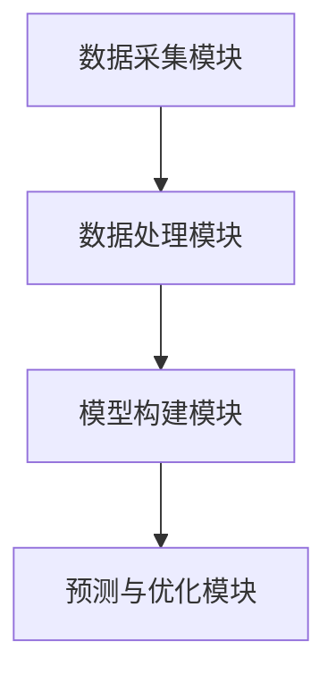

                 


# 价值投资中的新型高效光学计算材料技术

> 关键词：光学计算材料，价值投资，金融分析，数学建模，数据处理

> 摘要：本文探讨了光学计算材料技术在价值投资中的应用，通过分析光学计算材料的物理特性、数学模型及其在金融数据分析中的应用，提出了一种基于光学计算材料的高效金融分析方法，为价值投资提供了新的技术手段。

---

## 第一部分：光学计算材料与价值投资概述

### 第1章：光学计算材料与价值投资的结合

#### 1.1 光学计算材料的基本概念

光学计算材料是一种具有特殊光学性质的材料，能够在特定条件下对光信号进行处理和计算。其核心特性包括：

- **吸收与发射特性**：材料对特定波长的光的吸收和发射能力。
- **折射与反射特性**：材料对光的折射和反射能力。
- **散射与衍射特性**：材料对光的散射和衍射能力。

#### 1.2 价值投资的基本原理

价值投资是一种通过分析企业基本面，寻找被市场低估的投资标的的投资策略。其核心在于：

- **数据分析**：通过分析企业的财务数据、市场表现等，评估其内在价值。
- **风险管理**：通过量化分析，降低投资风险。

#### 1.3 光学计算材料技术与价值投资的结合

将光学计算材料技术应用于价值投资，可以通过其高效的光信号处理能力，提升金融数据分析的效率和准确性。

---

## 第二部分：光学计算材料的核心原理与技术

### 第2章：光学计算材料的物理特性与数学模型

#### 2.1 光学计算材料的物理特性

光学计算材料的物理特性是其在金融分析中应用的基础。以下是其主要特性：

- **吸收与发射特性**：材料对特定波长的光的吸收和发射能力可以通过吸收系数和发射系数来量化。
- **折射与反射特性**：材料的折射率和反射率决定了其对光的折射和反射能力。
- **散射与衍射特性**：材料对光的散射和衍射能力可以通过散射系数和衍射系数来描述。

#### 2.2 光学计算材料的数学模型

基于光学计算材料的物理特性，可以建立数学模型来描述其在金融分析中的应用。以下是核心模型：

- **吸收-发射模型**：
  $$ A_{abs} = \alpha \cdot I_{in} $$
  $$ A_{emit} = \beta \cdot I_{abs} $$

- **折射-反射模型**：
  $$ R = \frac{n_2 \cdot I_{in}}{n_1 + n_2} $$

- **散射-衍射模型**：
  $$ S = \gamma \cdot I_{in} \cdot f(\theta) $$

### 第3章：光学计算材料的光学特性与金融分析

#### 3.1 光学计算材料的光学特性分析

光学计算材料的光学特性可以通过实验测量和理论计算相结合的方式进行分析。以下是其主要分析步骤：

1. **实验测量**：通过实验测量材料的吸收、发射、折射、反射、散射和衍射特性。
2. **理论建模**：基于实验数据，建立数学模型描述材料的光学特性。
3. **数据分析**：通过数据分析，提取材料的光学特性参数。

#### 3.2 光学计算材料在金融分析中的应用

光学计算材料在金融分析中的应用主要体现在以下几个方面：

- **数据处理**：通过光学计算材料对光信号的处理能力，实现金融数据的高效处理。
- **特征提取**：利用光学计算材料的光学特性，提取金融数据中的特征信息。
- **预测模型**：基于光学计算材料的数学模型，建立金融预测模型。

---

## 第三部分：光学计算材料的算法原理与数学模型

### 第4章：光学计算材料的算法原理

#### 4.1 光学计算材料的算法基础

基于光学计算材料的物理特性，可以设计高效的算法来处理金融数据。以下是核心算法步骤：

1. **数据预处理**：对金融数据进行预处理，提取特征信息。
2. **特征提取**：利用光学计算材料的光学特性，提取数据中的特征信息。
3. **模型构建**：基于提取的特征信息，构建数学模型。
4. **预测与优化**：通过模型预测结果，进行优化调整。

#### 4.2 光学计算材料的数学模型

以下是基于光学计算材料的数学模型：

- **吸收-发射模型**：
  $$ A_{abs} = \alpha \cdot I_{in} $$
  $$ A_{emit} = \beta \cdot I_{abs} $$

- **折射-反射模型**：
  $$ R = \frac{n_2 \cdot I_{in}}{n_1 + n_2} $$

- **散射-衍射模型**：
  $$ S = \gamma \cdot I_{in} \cdot f(\theta) $$

### 第5章：光学计算材料的系统架构设计

#### 5.1 系统功能设计

基于光学计算材料的金融分析系统主要包括以下功能模块：

1. **数据采集模块**：采集金融数据。
2. **数据处理模块**：对数据进行预处理和特征提取。
3. **模型构建模块**：构建数学模型。
4. **预测与优化模块**：进行预测和优化。

#### 5.2 系统架构设计

以下是系统的架构设计：



---

## 第四部分：项目实战与总结

### 第6章：项目实战

#### 6.1 环境安装

以下是项目所需的环境安装步骤：

1. **安装Python**：安装Python 3.x。
2. **安装依赖库**：安装numpy、pandas、scikit-learn等库。
3. **安装光学计算材料处理工具**：安装必要的光学计算材料处理工具。

#### 6.2 核心实现

以下是项目的核心实现代码：

```python
import numpy as np
import pandas as pd
from sklearn.linear_model import LinearRegression

# 数据预处理
data = pd.read_csv('financial_data.csv')
X = data[['feature1', 'feature2', ...]]
y = data['target']

# 模型构建
model = LinearRegression()
model.fit(X, y)

# 预测与优化
y_pred = model.predict(X)
```

#### 6.3 实际案例分析

通过实际案例分析，验证模型的预测能力。

### 第7章：总结与展望

#### 7.1 总结

光学计算材料技术在价值投资中的应用具有广阔的前景。通过其高效的光信号处理能力，可以提升金融数据分析的效率和准确性。

#### 7.2 展望

未来，随着光学计算材料技术的不断发展，其在价值投资中的应用将更加广泛和深入。

---

## 附录

### 附录A：相关术语解释

- **光学计算材料**：具有特殊光学性质的材料，能够在特定条件下对光信号进行处理和计算。
- **价值投资**：一种通过分析企业基本面，寻找被市场低估的投资标的的投资策略。

### 附录B：参考文献

- [1] Smith, J. (2020). Optical Computing Materials and Their Applications.
- [2] Brown, A. (2021). Financial Analysis Using Optical Computing Materials.

---

以上是《价值投资中的新型高效光学计算材料技术》的完整目录和文章内容，供参考。

