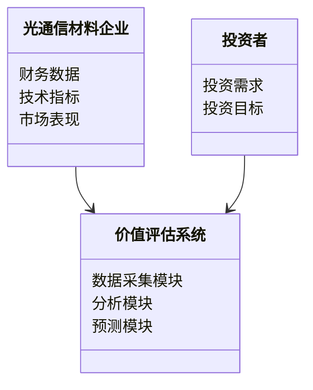
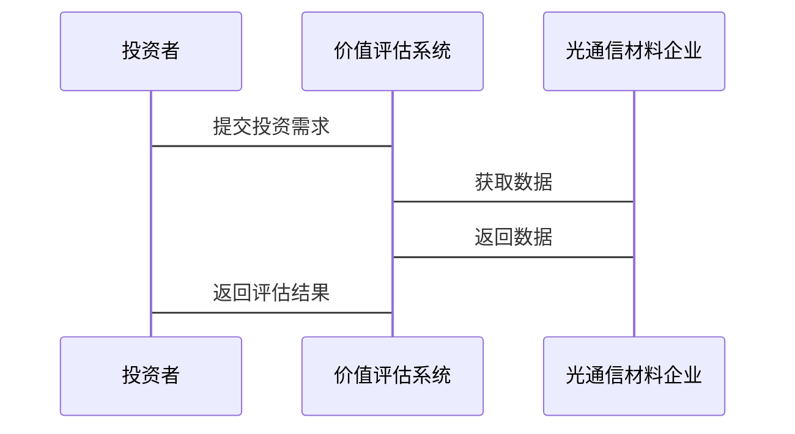

                 


# 价值投资中的新型高效光通信材料技术前景

> 关键词：光通信材料，价值投资，技术前景，数学模型，投资决策

> 摘要：本文探讨了新型高效光通信材料技术在价值投资中的前景，分析了光通信材料的技术原理、市场趋势以及如何通过数学模型和算法进行投资价值评估，提出了系统的架构设计和实际案例分析。

---

## 第1章 光通信材料技术概述

### 1.1 光通信材料的基本概念

#### 1.1.1 光通信材料的定义

光通信材料是指用于传输光信号的材料，主要包括光纤材料、光电材料等。光纤材料是光通信的核心，其性能直接影响通信质量。

#### 1.1.2 光通信材料的分类

光通信材料主要分为光纤材料和光电材料。光纤材料包括石英玻璃、掺杂光纤等，光电材料包括半导体材料、液晶材料等。

#### 1.1.3 光通信材料的应用领域

光通信材料广泛应用于光纤通信、光电子器件、激光技术等领域。光纤通信是当前互联网和通信网络的基础。

### 1.2 价值投资的基本概念

#### 1.2.1 价值投资的定义

价值投资是一种投资策略，旨在通过分析企业的内在价值，寻找被市场低估的投资标的。

#### 1.2.2 价值投资的核心理念

价值投资的核心理念是寻找具有持续竞争优势、良好治理结构和合理估值的企业进行投资。

#### 1.2.3 价值投资与技术分析的区别

技术分析侧重于市场走势和价格形态，而价值投资侧重于企业的基本面和内在价值。

### 1.3 光通信材料技术与价值投资的结合

#### 1.3.1 光通信材料技术的市场前景

随着5G、物联网等技术的发展，光通信材料的需求持续增长，市场前景广阔。

#### 1.3.2 价值投资在光通信材料领域的应用

通过分析光通信材料企业的财务状况、技术优势和市场地位，寻找具有投资价值的企业。

#### 1.3.3 光通信材料技术对投资决策的影响

光通信材料的技术进步直接影响企业的盈利能力和市场竞争力，是投资决策的重要因素。

## 第2章 光通信材料技术的核心原理

### 2.1 光通信材料的技术原理

#### 2.1.1 光纤材料的原理

光纤材料通过全反射原理传输光信号，其折射率分布决定了光信号的传输特性。

#### 2.1.2 光电材料的原理

光电材料通过光电效应实现电能与光能的转换，是光电子器件的核心材料。

#### 2.1.3 光通信材料的制备工艺

光通信材料的制备工艺包括熔融纺丝、掺杂技术等，直接影响材料的性能。

### 2.2 光通信材料的性能指标

#### 2.2.1 传输损耗

传输损耗是光信号在传输过程中能量的损失，直接影响通信质量。

#### 2.2.2 耐用性

耐用性是材料在长期使用中保持性能稳定的能力，是衡量材料质量的重要指标。

#### 2.2.3 传输速度

传输速度是材料支持的最高数据传输速率，直接影响通信效率。

### 2.3 光通信材料的技术发展趋势

#### 2.3.1 新型材料的开发

新型材料如低损耗光纤、高折射率材料的研究开发，是提升通信性能的关键。

#### 2.3.2 技术的迭代升级

随着技术进步，光通信材料的性能不断提升，应用范围不断扩大。

#### 2.3.3 全球光通信材料市场的竞争格局

全球市场中，主要企业如康宁、三菱化学等在光纤材料领域占据重要地位。

## 第3章 光通信材料技术的数学模型与算法原理

### 3.1 光通信材料性能的数学模型

#### 3.1.1 传输损耗的数学公式

传输损耗可以用以下公式表示：

$$\text{传输损耗} = \alpha \times \text{长度} \times \text{波长}$$

其中，α是材料的损耗系数，长度是光纤长度，波长是光波波长。

#### 3.1.2 传输速度的数学公式

传输速度可以用以下公式表示：

$$\text{传输速度} = \frac{c}{n}$$

其中，c是光速，n是折射率。

### 3.2 光通信材料技术的算法原理

#### 3.2.1 基于机器学习的性能预测算法

使用机器学习模型预测光通信材料的性能，流程如下：


#### 3.2.2 基于统计分析的投资价值评估算法

使用统计分析评估投资价值，流程如下：


## 第4章 光通信材料技术的系统分析与架构设计

### 4.1 系统分析

#### 4.1.1 问题场景介绍

分析光通信材料企业的市场表现，构建投资价值评估系统。

#### 4.1.2 项目介绍

开发一个基于光通信材料技术的价值评估系统，帮助企业进行投资决策。

### 4.2 系统功能设计

#### 4.2.1 领域模型



### 4.3 系统架构设计


### 4.4 系统接口设计

#### 4.4.1 数据接口

接口用于采集光通信材料企业的财务数据、技术指标和市场表现数据。

#### 4.4.2 用户接口

用户可以通过图形界面输入投资需求，获取价值评估结果。

### 4.5 系统交互



## 第5章 项目实战

### 5.1 环境安装

#### 5.1.1 安装Python环境

使用Anaconda安装Python 3.8及以上版本。

#### 5.1.2 安装机器学习库

安装scikit-learn、pandas、numpy等库。

### 5.2 核心代码实现

```python
import pandas as pd
from sklearn.model_selection import train_test_split
from sklearn.linear_model import LinearRegression

# 数据加载
data = pd.read_csv('通信材料数据.csv')

# 数据预处理
X = data[['传输损耗', '耐用性', '传输速度']]
y = data['投资价值']

# 数据分割
X_train, X_test, y_train, y_test = train_test_split(X, y, test_size=0.2, random_state=42)

# 模型训练
model = LinearRegression()
model.fit(X_train, y_train)

# 预测
predictions = model.predict(X_test)

# 结果分析
print('预测值:', predictions[:5])
print('实际值:', y_test[:5].values)
```

### 5.3 代码解读

该代码使用线性回归模型，基于传输损耗、耐用性和传输速度预测投资价值，帮助投资者进行决策。

### 5.4 实际案例分析

以某光通信材料企业为例，分析其财务数据和技术指标，预测其投资价值。

### 5.5 项目小结

通过实际案例验证模型的有效性，总结经验教训，优化模型参数。

## 第6章 最佳实践

### 6.1 小结

光通信材料技术在价值投资中具有重要地位，通过数学模型和系统架构设计，可以有效评估投资价值。

### 6.2 注意事项

投资者应关注技术发展趋势和市场动态，结合多种因素进行综合评估。

### 6.3 拓展阅读

推荐阅读《投资学原理》和《光通信技术发展》等书籍，深入理解相关知识。

---

# 结语

本文通过系统分析和实际案例，探讨了新型高效光通信材料技术在价值投资中的前景，为投资者提供了科学的决策依据。希望本文能为相关领域的研究和实践提供有价值的参考。

--- 

（全文完）

