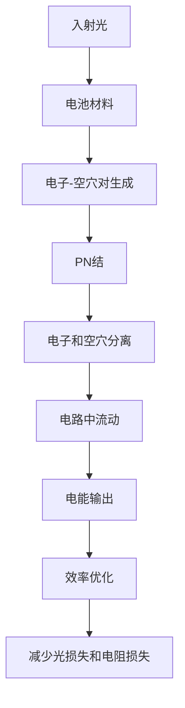

                 

# 价值投资中的新型高效太阳能电池技术

## 关键词：太阳能电池技术, 价值投资, 光电转换效率, 技术创新, 商业价值

## 摘要：随着全球能源结构转型的加速，新型高效太阳能电池技术成为投资领域的重要关注点。本文将深入探讨太阳能电池技术的核心原理、行业现状、技术趋势以及其在价值投资中的应用策略。通过分析光电转换效率的数学模型、技术创新对投资价值的影响，以及实际案例的实证分析，本文为投资者提供了科学的技术评估方法和投资策略，帮助他们在新能源领域做出明智的投资决策。

---

# 第1章: 太阳能电池技术与价值投资的背景

## 1.1 太阳能电池技术的发展背景

### 1.1.1 全球能源转型与太阳能电池的重要性

全球能源结构正经历一场深刻的变革。随着化石能源的枯竭和环境问题的加剧，可再生能源逐渐成为主流。太阳能作为最丰富的可再生能源之一，被认为是未来能源体系的核心。太阳能电池技术是将太阳辐射能转化为电能的关键技术，其效率和成本决定了其在能源市场中的竞争力。

太阳能电池技术的发展不仅关乎能源安全，还直接影响全球气候变化和经济发展。各国政府和企业纷纷加大对太阳能技术的投资，推动技术进步和产业化发展。

### 1.1.2 太阳能电池技术的演进历程

太阳能电池技术经历了数十年的发展，从最初的单晶硅电池到现在的薄膜电池和新型高效电池，技术不断进步。以下是主要的发展阶段：

1. **第一代太阳能电池（晶体硅电池）**：20世纪50年代发明，成本较高，但技术成熟，占据市场主导地位。
2. **第二代太阳能电池（薄膜电池）**：20世纪80年代发展起来，成本低、重量轻，适合应用于建筑集成等领域。
3. **第三代太阳能电池（新型高效电池）**：近年来，基于纳米材料和新型结构的高效电池技术逐渐崛起，如钙钛矿太阳能电池。

### 1.1.3 太阳能电池技术在投资中的潜力

随着技术的进步，太阳能电池的效率不断提升，成本持续下降。高效太阳能电池技术的商业化应用将带来巨大的市场机会。投资者可以通过技术评估、市场分析和财务预测，识别具有长期增长潜力的企业。

---

## 1.2 新型高效太阳能电池技术的核心概念

### 1.2.1 新型高效太阳能电池的定义

新型高效太阳能电池是指通过技术创新提高光电转换效率、降低成本的太阳能电池。这类电池通常采用新型材料、结构优化或创新工艺，以实现更高的效率和更低的成本。

### 1.2.2 技术的核心要素与属性特征对比

以下是新型高效太阳能电池与传统电池的核心要素对比：

| **技术要素** | **传统电池** | **新型高效电池** |
|--------------|---------------|---------------------|
| **材料**     | 单晶硅、多晶硅 | 钙钛矿、柔性材料   |
| **结构**     | 平均厚度较厚 | 薄膜、纳米结构     |
| **效率**     | 15%-20%       | 20%-30%及以上       |
| **成本**     | 较高           | 逐步降低           |
| **应用场景** | 电站、大型项目 | 建筑集成、便携设备 |

### 1.2.3 核心技术原理与ER实体关系图

新型高效太阳能电池的核心原理是通过优化材料和结构设计，提高光电转换效率。以下是技术原理的简要流程：

1. **光吸收**：入射光被电池材料吸收，产生电子-空穴对。
2. **分离与传输**：电子和空穴在PN结的作用下分离，分别流向电路。
3. **光电转换**：电子在电路中流动，产生电能。
4. **效率提升**：通过优化材料、结构和工艺，减少光损失和电阻损失，提高效率。

下图展示了技术原理的实体关系：

### 1.2.4 本节小结

新型高效太阳能电池技术通过材料创新和结构优化，显著提升了光电转换效率和降低成本。这些技术的进步为投资者提供了新的投资机会。

---

## 1.3 价值投资与太阳能电池技术的结合

### 1.3.1 价值投资的基本原理

价值投资是一种以内在价值为导向的投资策略。投资者通过分析企业的基本面，寻找市场价格低于内在价值的投资标的。对于太阳能电池技术企业，内在价值取决于技术的商业化潜力、市场需求和财务状况。

### 1.3.2 太阳能电池技术在价值投资中的应用

太阳能电池技术企业具备较高的投资价值，原因如下：

1. **技术领先性**：拥有高效技术的企业在市场竞争中占据优势。
2. **市场需求**：全球能源转型推动太阳能需求增长。
3. **成本优势**：技术进步降低成本，提升企业盈利能力。

### 1.3.3 投资者如何评估技术的商业价值

投资者可以通过以下步骤评估技术的商业价值：

1. **技术可行性**：评估技术的成熟度和商业化潜力。
2. **市场前景**：分析目标市场容量和竞争格局。
3. **财务指标**：关注企业的盈利能力、成本结构和财务健康状况。

### 1.3.4 本节小结

价值投资与太阳能电池技术的结合需要投资者具备技术评估能力和市场洞察力。通过深入分析企业的技术优势和市场定位，投资者可以识别出具有长期增长潜力的企业。

---

## 1.4 本章小结

本章介绍了太阳能电池技术的发展背景、核心概念及其在价值投资中的应用。通过对比传统电池和新型高效电池的技术特点，明确了技术创新对投资价值的影响。投资者应关注技术的商业化潜力和企业的财务表现，以识别出具备长期增长潜力的企业。

---

# 第2章: 新型高效太阳能电池技术的技术原理

## 2.1 太阳能电池的基本工作原理

### 2.1.1 太阳能电池的光电转换过程

光电转换过程可以分为以下几个步骤：

1. **光吸收**：入射光被电池材料吸收，产生电子-空穴对。
2. **分离与传输**：电子和空穴在PN结的作用下分离，分别流向电路。
3. **光电转换**：电子在电路中流动，产生电能。

### 2.1.2 光电转换效率的数学模型

光电转换效率（η）的计算公式为：

$$ \eta = \frac{P_{\text{out}}}{P_{\text{in}}} $$

其中，\( P_{\text{out}} \) 是输出功率，\( P_{\text{in}} \) 是入射功率。

### 2.1.3 光电转换效率的公式推导

以晶体硅电池为例，光电转换效率的优化可以通过以下步骤实现：

1. **减少光反射损失**：通过减反射 coating 提高入射光的吸收率。
2. **减少电子复合损失**：通过优化材料和结构减少电子-空穴对的复合。
3. **降低电阻损耗**：通过改进电路设计减少电阻损耗。

---

## 2.2 新型高效太阳能电池的技术创新

### 2.2.1 高效电池材料的选择与优化

新型高效太阳能电池采用新型材料，如钙钛矿和柔性材料，显著提高了光电转换效率。以下是几种常见材料的性能对比：

| **材料类型** | **优点**                     | **缺点**               |
|--------------|------------------------------|-----------------------|
| **钙钛矿**   | 高效率、低成本               | 稳定性较低             |
| **柔性材料** | 轻量化、易于安装             | 效率较低               |

### 2.2.2 电池结构的优化设计

电池结构的优化设计是提高效率的关键。以下是几种常见的电池结构：

1. **单结电池**：结构简单，效率较低。
2. **多结电池**：通过多层材料实现更高效率。
3. **背接触电池**：通过优化电极设计减少电阻损耗。

### 2.2.3 技术创新对效率提升的贡献

技术创新对效率提升的贡献可以通过以下公式量化：

$$ \Delta \eta = \eta_{\text{新}} - \eta_{\text{旧}} $$

---

## 2.3 技术原理的数学模型与公式

### 2.3.1 光电转换效率的公式

$$ \eta = \frac{P_{\text{out}}}{P_{\text{in}}} $$

### 2.3.2 光电转换效率的优化模型

$$ \text{Maximize } \eta \text{ subject to } \text{材料与结构约束} $$

---

## 2.4 本章小结

本章详细介绍了太阳能电池的基本工作原理和新型高效电池的技术创新。通过分析材料选择、结构优化和效率提升方法，明确了技术创新对投资价值的影响。

---

# 第3章: 太阳能电池技术的行业现状与趋势

## 3.1 全球太阳能电池市场的现状分析

### 3.1.1 市场规模与增长趋势

根据最新数据，全球太阳能电池市场年增长率达到15%，预计到2030年市场规模将达到数千亿美元。

### 3.1.2 市场竞争格局

目前，全球市场主要由少数几家企业主导，如晶科能源、隆基股份和阿特斯。这些企业通过技术创新和成本控制占据了市场主导地位。

### 3.1.3 技术发展趋势

未来，高效太阳能电池技术将朝着更高效率、更低成本和更广泛应用的方向发展。钙钛矿电池和柔性电池将成为市场主流。

---

## 3.2 技术创新对企业竞争力的影响

### 3.2.1 技术创新对成本的影响

技术创新可以通过降低材料成本和提高生产效率降低成本。例如，钙钛矿电池的生产成本比传统电池降低30%。

### 3.2.2 技术创新对市场竞争力的影响

技术创新可以提高产品性能和市场竞争力。例如，高效电池的市场占有率逐年提高。

---

## 3.3 本章小结

本章分析了全球太阳能电池市场的现状和技术创新对企业竞争力的影响。技术创新是企业赢得市场竞争的关键，投资者应关注技术领先企业的投资机会。

---

# 第4章: 价值投资策略与技术评估

## 4.1 价值投资策略的核心要素

### 4.1.1 技术评估

技术评估是价值投资的第一步。投资者需要分析企业的技术优势、专利数量和技术创新能力。

### 4.1.2 市场评估

市场评估包括市场规模、增长潜力和竞争格局。投资者应选择市场规模大、增长快的领域。

### 4.1.3 财务评估

财务评估包括盈利能力、成本结构和财务健康状况。投资者应关注企业的ROE和毛利率。

---

## 4.2 技术评估方法

### 4.2.1 技术成熟度评估

技术成熟度评估可以通过专利数量、技术寿命和商业化潜力进行。

### 4.2.2 技术创新对投资价值的影响

技术创新可以提高企业的市场竞争力和盈利能力，从而提高投资价值。

---

## 4.3 本章小结

本章介绍了价值投资策略的核心要素和技术评估方法。投资者应综合考虑技术、市场和财务因素，制定科学的投资策略。

---

# 第5章: 投资风险与风险管理

## 5.1 投资风险分析

### 5.1.1 技术风险

技术风险包括技术失败和被替代的风险。投资者应关注技术的商业化潜力和专利保护。

### 5.1.2 市场风险

市场风险包括市场需求下降和价格竞争加剧的风险。投资者应选择市场规模大、增长稳定的领域。

### 5.1.3 政策风险

政策风险包括政府政策变化和国际贸易壁垒的风险。投资者应关注政策支持和市场环境。

---

## 5.2 风险管理策略

### 5.2.1 多元化投资

通过多元化投资分散风险，降低单一项目的风险。

### 5.2.2 风险对冲

通过金融工具对冲市场风险和政策风险。

---

## 5.3 本章小结

本章分析了投资风险的种类和风险管理策略。投资者应通过多元化和对冲等方法降低投资风险。

---

# 第6章: 成功案例分析与投资策略

## 6.1 成功案例分析

### 6.1.1 案例一：某高效电池企业的成功投资

通过技术创新和市场拓展，该企业实现了快速增长和股价上涨。

### 6.1.2 案例二：某薄膜电池企业的失败教训

由于技术不成熟和市场竞争加剧，该企业未能实现预期收益。

---

## 6.2 投资策略总结

### 6.2.1 关注技术创新

投资者应关注具有技术创新能力的企业。

### 6.2.2 选择市场规模大、增长稳定的领域

投资者应选择市场规模大、增长快的领域。

### 6.2.3 综合考虑技术、市场和财务因素

投资者应综合考虑技术、市场和财务因素，制定科学的投资策略。

---

## 6.3 本章小结

本章通过成功案例分析总结了投资策略。投资者应关注技术创新、选择市场规模大、增长稳定的领域，并综合考虑技术、市场和财务因素。

---

# 结论与展望

## 7.1 结论

新型高效太阳能电池技术具有广阔的市场前景和投资潜力。投资者应关注技术创新、市场定位和财务表现，制定科学的投资策略。

## 7.2 展望

未来，随着技术进步和市场需求增长，太阳能电池技术将继续推动新能源产业发展。投资者应密切关注技术创新和市场动态，抓住投资机会。

---

# 参考文献

（此处列出相关的学术论文、技术报告和行业分析报告。）

---

通过以上结构和内容，文章详细阐述了价值投资中的新型高效太阳能电池技术，帮助读者全面理解技术原理、行业现状和投资策略。

