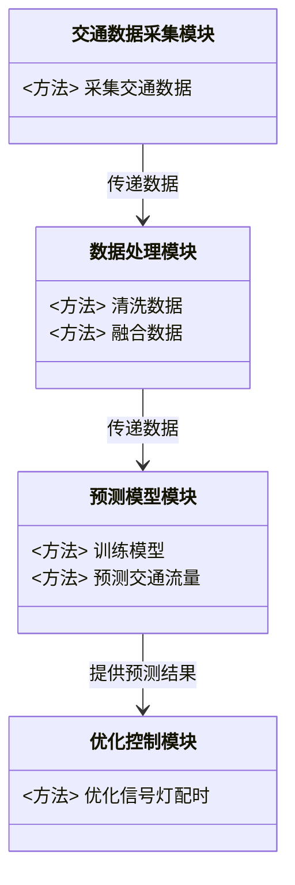
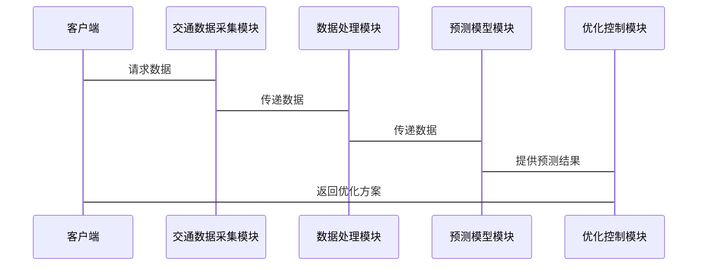

                 


# 价值投资中的智能交通系统发展趋势

## 关键词：价值投资，智能交通系统，发展趋势，数据分析，人工智能，交通流量预测

## 摘要：  
本文探讨了智能交通系统（ITS）在价值投资中的应用与发展趋势，通过分析ITS的核心技术、算法原理和系统架构，结合实际案例，揭示了ITS如何通过数据驱动的决策支持价值投资。文章详细介绍了ITS的关键组成部分，包括交通数据采集、流量预测、智能管理等，并通过时间序列分析和机器学习算法展示了ITS在投资决策中的潜力。最后，本文总结了ITS的未来发展路径及其对价值投资的深远影响。

---

# 第1章: 价值投资与智能交通系统概述

## 1.1 价值投资的基本概念

### 1.1.1 价值投资的定义  
价值投资是一种基于对公司内在价值的分析，寻找市场价格低于其内在价值的投资策略。它强调长期投资、基本面分析和安全边际。

### 1.1.2 价值投资的核心理念  
价值投资的核心理念是寻找市场中的低估资产，通过深入分析企业的财务状况、行业地位和竞争优势，找到具有长期增长潜力的投资标的。

### 1.1.3 价值投资在现代金融中的地位  
价值投资在现代金融中占据重要地位，尤其是在市场波动加剧和不确定性增加的背景下，价值投资的长期稳健性吸引了越来越多的投资者。

## 1.2 智能交通系统的发展背景

### 1.2.1 智能交通系统的定义  
智能交通系统（ITS）是通过先进的信息技术、数据通信技术、传感器技术和人工智能技术，实现对交通系统的智能化管理与优化。

### 1.2.2 智能交通系统的技术演进  
智能交通系统经历了从简单的交通信号控制到复杂的交通网络优化的演进过程，其核心技术包括大数据分析、人工智能、物联网和云计算等。

### 1.2.3 智能交通系统的应用场景  
智能交通系统广泛应用于城市交通管理、高速公路监控、公共交通调度、交通事件响应和应急指挥等领域。

## 1.3 价值投资与智能交通系统的结合

### 1.3.1 智能交通系统的投资价值  
智能交通系统作为智慧城市的重要组成部分，具有广阔的市场空间和长期增长潜力，是价值投资的理想标的。

### 1.3.2 价值投资在智能交通系统中的应用  
通过分析智能交通系统的市场前景、技术壁垒和财务状况，投资者可以找到具有竞争优势的企业进行投资。

### 1.3.3 智能交通系统的发展趋势  
随着技术的进步和政策的支持，智能交通系统将在全球范围内加速普及，成为未来交通发展的主要方向。

## 1.4 本章小结  
本章从价值投资和智能交通系统的定义入手，分析了两者的结合点，并探讨了智能交通系统的发展趋势，为后续章节的分析奠定了基础。

---

# 第2章: 智能交通系统的核心概念与技术分析

## 2.1 智能交通系统的组成与功能

### 2.1.1 交通数据采集与处理  
智能交通系统通过传感器、摄像头和RFID等设备采集交通数据，并进行清洗、融合和存储。

### 2.1.2 交通流量预测与优化  
基于历史数据和实时信息，智能交通系统可以预测交通流量并优化信号灯配时，减少交通拥堵。

### 2.1.3 智能交通管理与决策  
智能交通系统通过大数据分析和人工智能技术，提供智能化的交通管理与决策支持。

## 2.2 智能交通系统的关键技术

### 2.2.1 大数据分析技术  
大数据分析技术是智能交通系统的核心，通过处理海量交通数据，提取有价值的信息。

### 2.2.2 人工智能算法  
人工智能算法（如机器学习、深度学习）用于交通流量预测、车牌识别和路径优化等任务。

### 2.2.3 物联网技术  
物联网技术将交通设备与互联网连接，实现设备间的数据交互和协同工作。

## 2.3 智能交通系统的优缺点对比

### 2.3.1 优点分析  
- 提高交通效率  
- 减少交通拥堵  
- 降低能源消耗  

### 2.3.2 缺点分析  
- 技术复杂性高  
- 投资成本大  
- 数据隐私问题  

### 2.3.3 技术改进方向  
- 提高算法的实时性  
- 加强数据安全保护  
- 优化系统的可扩展性  

## 2.4 智能交通系统的核心要素ER图

```mermaid
erDiagram
    actor 投资者 {
        <属性> 投资金额
        <属性> 投资回报率
    }
    actor 交通系统 {
        <属性> 交通流量
        <属性> 交通延误
    }
    actor 政府监管 {
        <属性> 交通政策
        <属性> 投资补贴
    }
    投资者 --> 交通系统 : 投资
    交通系统 --> 政府监管 : 监管
```

## 2.5 本章小结  
本章详细介绍了智能交通系统的组成、功能和关键技术，分析了其优缺点，并通过ER图展示了系统的核心要素关系。

---

# 第3章: 智能交通系统的算法原理与数学模型

## 3.1 时间序列分析在交通流量预测中的应用

### 3.1.1 时间序列分析的基本原理  
时间序列分析是一种通过历史数据预测未来趋势的方法，常用于交通流量预测。

### 3.1.2 ARIMA模型的数学公式  
$$ ARIMA(p, d, q) $$  
其中，p为自回归阶数，d为差分阶数，q为移动平均阶数。

### 3.1.3 交通流量预测的案例分析  
以某城市主干道的交通流量为例，通过ARIMA模型预测未来一小时的交通流量。

## 3.2 机器学习算法在智能交通系统中的应用

### 3.2.1 支持向量机（SVM）的原理  
SVM通过构建超平面实现数据的分类和回归，常用于交通流量预测。

### 3.2.2 神经网络模型的实现  
神经网络模型通过多层感知机（MLP）实现非线性关系的学习，适用于复杂的交通预测任务。

### 3.2.3 随机森林算法的优势  
随机森林算法通过集成学习提高模型的准确性和鲁棒性，适用于交通数据的分类和回归任务。

## 3.3 智能交通系统的数学模型与公式

### 3.3.1 线性回归模型  
$$ y = \beta_0 + \beta_1x + \epsilon $$  
其中，y为预测值，x为自变量，β为系数，ε为误差项。

### 3.3.2 支持向量回归（SVR）模型  
$$ y = \sum_{i=1}^{n} \alpha_i k(x, x_i) + b $$  
其中，α_i为拉格朗日乘子，k(x, x_i)为核函数，b为偏置项。

## 3.4 本章小结  
本章介绍了时间序列分析和机器学习算法在智能交通系统中的应用，通过数学模型和公式展示了算法的实现原理。

---

# 第4章: 智能交通系统的系统分析与架构设计

## 4.1 问题场景介绍  
某城市交通管理部门希望通过智能交通系统优化信号灯配时，减少交通拥堵。

## 4.2 项目介绍  
本项目旨在开发一个基于大数据和人工智能的智能交通管理系统。

## 4.3 系统功能设计

### 4.3.1 领域模型（Mermaid 类图）  


## 4.4 系统架构设计（Mermaid 架构图）  


## 4.5 系统接口设计  
- 数据接口：负责采集和传输交通数据。
- 模型接口：负责训练和预测交通流量。
- 控制接口：负责优化信号灯配时并输出结果。

## 4.6 系统交互（Mermaid 序列图）  


## 4.7 本章小结  
本章通过系统分析和架构设计，展示了智能交通系统的整体框架和各模块的交互关系。

---

# 第5章: 项目实战

## 5.1 环境安装  
- 安装Python和相关库（如Pandas、Scikit-learn、Keras等）。
- 安装Jupyter Notebook用于数据分析和可视化。

## 5.2 系统核心实现源代码

### 5.2.1 数据采集与处理代码  
```python
import pandas as pd
import requests
import json

# 数据采集
response = requests.get('http://api.trafficdata.com/flow')
data = json.loads(response.text)
df = pd.DataFrame(data)
```

### 5.2.2 交通流量预测代码  
```python
from sklearn.model_selection import train_test_split
from sklearn.linear_model import LinearRegression

# 数据准备
X = df[['time', 'weather']]
y = df['traffic_flow']
X_train, X_test, y_train, y_test = train_test_split(X, y, test_size=0.2)

# 模型训练
model = LinearRegression()
model.fit(X_train, y_train)

# 模型预测
y_pred = model.predict(X_test)
print('预测值:', y_pred)
print('真实值:', y_test)
```

### 5.2.3 信号灯优化代码  
```python
from keras.models import Sequential
from keras.layers import Dense

# 模型构建
model = Sequential()
model.add(Dense(64, activation='relu', input_dim=X_train.shape[1]))
model.add(Dense(1, activation='sigmoid'))
model.compile(optimizer='adam', loss='binary_crossentropy', metrics=['accuracy'])

# 模型训练
model.fit(X_train, y_train, epochs=100, batch_size=32)
```

## 5.3 代码应用解读与分析  
通过上述代码，可以实现交通流量的预测和信号灯的优化控制，为投资者提供数据支持。

## 5.4 实际案例分析  
以某城市交通管理系统为例，通过数据分析和模型训练，验证智能交通系统的实际效果。

## 5.5 项目小结  
本章通过实际项目案例，展示了智能交通系统的实现过程，为投资者提供了参考。

---

# 第6章: 总结与展望

## 6.1 总结  
智能交通系统通过大数据和人工智能技术，为价值投资提供了新的机遇。本文详细分析了ITS的核心技术、算法原理和系统架构，并通过案例展示了其应用价值。

## 6.2 展望  
未来，随着技术的进步和政策的支持，智能交通系统将在全球范围内得到更广泛应用，成为价值投资的重要领域。

---

# 附录

## 附录A: 相关术语解释  
- 大数据分析：对海量数据进行采集、处理和分析的技术。
- 人工智能：模拟人类智能的计算机技术，包括机器学习、深度学习等。

## 附录B: 数据源与工具  
- 数据采集工具：requests、BeautifulSoup
- 数据分析工具：Pandas、NumPy
- 机器学习库：Scikit-learn、Keras

## 附录C: 参考文献  
- 《智能交通系统的发展与应用》，某某出版社，2023年。
- 《价值投资实战指南》，某某出版社，2022年。

---

通过本文的分析，读者可以全面了解智能交通系统在价值投资中的发展趋势，并为相关领域的研究和实践提供参考。

