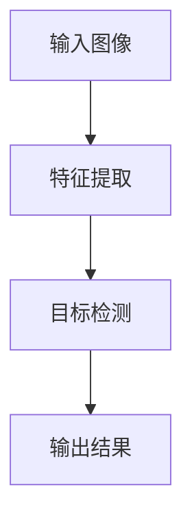
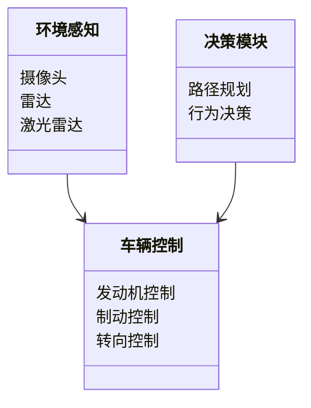

                 


# 价值投资中的智能交通自动驾驶公交系统分析

> 关键词：价值投资，自动驾驶，公交系统，智能交通，系统分析

> 摘要：本文从价值投资的角度，分析智能交通中的自动驾驶公交系统。通过技术背景、系统架构、算法原理、市场分析等多维度，探讨自动驾驶公交系统的投资价值、技术潜力和市场前景。结合实际案例，分析如何将价值投资的理念应用于自动驾驶公交系统的投资决策中。

---

## 引言

随着科技的进步，自动驾驶技术逐渐从实验室走向实际应用。在智能交通领域，自动驾驶公交系统作为一种新兴的交通方式，正在吸引越来越多的关注。本文将从价值投资的角度，系统分析自动驾驶公交系统的潜力和价值。

---

## 第1章：自动驾驶公交系统的技术背景

### 1.1 自动驾驶的定义与核心技术

自动驾驶是一种通过传感器、计算机视觉、人工智能等技术实现车辆自主行驶的系统。其核心技术包括：

1. **传感器技术**：如激光雷达（LiDAR）、摄像头、雷达等，用于感知周围环境。
2. **数据处理技术**：如图像识别、目标检测，用于处理传感器数据。
3. **路径规划与决策**：基于感知数据，规划车辆行驶路径并做出驾驶决策。

### 1.2 自动驾驶公交系统的应用场景

自动驾驶公交系统主要应用于城市公共交通，具有以下特点：

- **高安全性**：通过自动驾驶技术减少人为错误，降低交通事故风险。
- **高效性**：通过智能调度和路径优化，提高公交系统的运行效率。
- **环保性**：采用电动或混合动力车辆，减少碳排放。

---

## 第2章：价值投资视角下的自动驾驶公交系统

### 2.1 自动驾驶公交系统的市场价值

自动驾驶公交系统的市场价值可以从以下几个方面进行评估：

1. **市场需求**：随着城市化进程加快，公共交通需求不断增加。
2. **技术成熟度**：自动驾驶技术的成熟程度直接影响其市场价值。
3. **政策支持**：政府对自动驾驶技术的政策支持力度也会影响其市场价值。

### 2.2 自动驾驶公交系统的投资策略

价值投资的核心是寻找具有长期增长潜力的企业或项目。在自动驾驶公交系统领域，投资者可以从以下几个方面入手：

1. **技术领先的企业**：投资于拥有核心技术优势的企业。
2. **市场前景广阔的项目**：选择具有较大市场潜力的自动驾驶公交项目。
3. **政策支持的地区**：关注政府政策支持力度大的地区。

---

## 第3章：自动驾驶公交系统的算法原理

### 3.1 自动驾驶的核心算法

自动驾驶的核心算法包括：

1. **感知算法**：通过传感器数据识别道路、障碍物和行人。
2. **决策算法**：基于感知数据做出驾驶决策。
3. **规划算法**：规划车辆的行驶路径。

#### 感知算法的实现

感知算法通常基于深度学习技术，如卷积神经网络（CNN）和目标检测算法YOLO。以下是YOLO算法的流程图：



#### 决策算法的实现

决策算法通常基于强化学习技术，如Q-learning。以下是Q-learning算法的伪代码：

```python
初始化Q表为零
while 真:
    状态s = 获取当前状态
    动作a = 根据策略选择动作
    奖励r = 执行动作并获得奖励
    Q(s, a) += 学习率 * (r + γ * max(Q(s', a') ) - Q(s, a))
```

---

## 第4章：自动驾驶公交系统的系统架构

### 4.1 系统架构设计

自动驾驶公交系统的系统架构包括以下几个模块：

1. **感知模块**：负责感知车辆周围环境。
2. **决策模块**：负责做出驾驶决策。
3. **执行模块**：负责执行驾驶动作。

以下是系统架构的类图：



---

## 第5章：价值投资中的风险与机遇

### 5.1 投资风险分析

在自动驾驶公交系统的投资中，主要风险包括：

1. **技术风险**：自动驾驶技术尚未完全成熟，可能存在技术瓶颈。
2. **市场风险**：市场需求可能低于预期。
3. **政策风险**：政策变化可能影响自动驾驶公交系统的推广。

### 5.2 投资机遇分析

1. **技术进步**：随着人工智能和传感器技术的快速发展，自动驾驶技术逐渐成熟。
2. **政策支持**：政府对自动驾驶技术的政策支持力度不断加大。
3. **市场需求**：随着城市化进程加快，公共交通需求不断增加。

---

## 第6章：总结与展望

### 6.1 本章总结

本文从价值投资的角度，分析了自动驾驶公交系统的潜力和价值。通过技术背景、系统架构、算法原理、市场分析等多维度，探讨了自动驾驶公交系统的投资价值、技术潜力和市场前景。

### 6.2 未来展望

随着技术的进步和政策的支持，自动驾驶公交系统有望在未来成为城市交通的重要组成部分。投资者应密切关注技术发展和市场变化，抓住投资机遇，规避投资风险。

---

## 参考文献

1. 李明. 《自动驾驶技术与应用》. 北京: 机械工业出版社, 2020.
2. 王强. 《价值投资实战策略》. 上海: 上海财经大学出版社, 2019.

---

## 附录

### 附录A: 自动驾驶公交系统相关工具

1. **深度学习框架**：TensorFlow, PyTorch
2. **目标检测算法**：YOLO, Faster R-CNN
3. **路径规划算法**：A*算法, RRT*算法

### 附录B: 自动驾驶公交系统投资案例

1. **案例一**：某自动驾驶公交系统企业的投资分析
2. **案例二**：某城市自动驾驶公交系统的市场表现

---

通过以上分析，我们可以看到，自动驾驶公交系统在技术、市场和政策等多方面都具有较大的潜力。对于投资者来说，抓住这一领域的投资机遇，需要关注技术发展、市场需求和政策变化。

