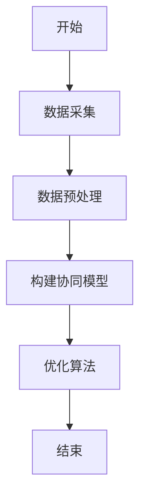
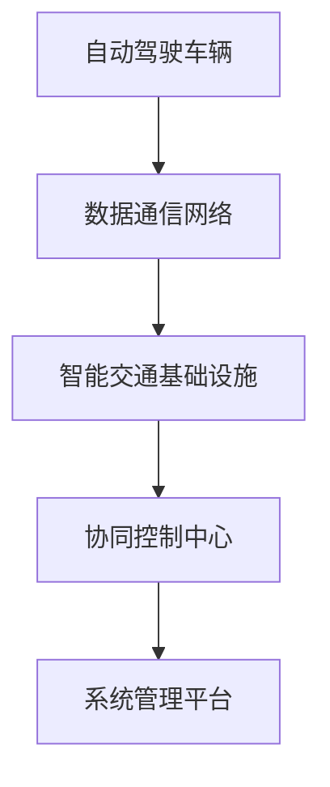

                 

<think>
好的，我需要帮助用户撰写一篇名为《价值投资中的智能交通自动驾驶协同系统分析》的技术博客文章。用户已经提供了详细的大纲，并且我已经在开头部分完成了标题、关键词和摘要。接下来，我需要按照大纲逐步展开每一部分，确保内容完整、逻辑清晰，并且符合用户的格式和内容要求。

首先，我将按照大纲的结构，逐章逐节地展开内容，每个章节都要包含详细的技术分析、图表说明、算法原理、系统设计等部分。同时，我需要确保使用专业的技术术语，同时保持内容易懂，逻辑连贯。

在撰写过程中，我需要检查每一部分是否满足用户的要求，例如是否使用了Mermaid图、Latex公式，以及是否涵盖了项目实战、系统架构设计等内容。此外，我还需要注意文章的总字数，确保在10000到12000字之间。

现在，我开始根据大纲展开每一部分的内容。

---

### 第1章: 价值投资与智能交通自动驾驶协同系统概述

#### 1.1 价值投资的基本概念

##### 1.1.1 价值投资的定义与核心理念

价值投资是一种投资策略，由本杰明·格雷厄姆等投资者在20世纪初提出，核心在于寻找市场价格低于其内在价值的证券。这种投资方法强调对企业的深入分析，寻找那些具有持续竞争优势和良好治理结构的企业进行投资。其核心理念是通过分析企业的财务状况、行业地位和未来前景，确定其内在价值，然后在市场价低于内在价值时买入。

##### 1.1.2 价值投资在现代金融中的地位

价值投资在现代金融中占据重要地位，尤其在长期投资策略中，它强调基本面分析和风险控制。许多知名投资者如 Warren Buffett 都是价值投资的忠实拥护者。随着金融市场的复杂化和信息的透明化，价值投资的方法论在智能交通和自动驾驶等领域中的应用也逐渐受到关注。

##### 1.1.3 价值投资与智能交通自动驾驶的结合点

智能交通和自动驾驶领域的发展依赖于技术创新和市场扩展，这些都需要大量资金支持。价值投资的策略可以帮助投资者识别那些具备长期增长潜力的企业和项目。通过分析企业的技术创新能力、市场前景和财务健康状况，投资者可以做出更为明智的投资决策。

#### 1.2 智能交通与自动驾驶的定义与特点

##### 1.2.1 智能交通系统的基本概念

智能交通系统（ITS）利用信息技术、数据通信、传感器和自动控制技术，提高交通系统的效率和安全性。ITS 包括交通监控、智能信号灯、实时信息反馈等功能，旨在优化交通流量，减少拥堵和事故。

##### 1.2.2 自动驾驶的核心技术与发展阶段

自动驾驶技术依赖于人工智能、传感器、数据处理和通信技术。从 L1 到 L5 的不同级别自动驾驶，代表着从辅助驾驶到完全自主驾驶的发展阶段。当前，许多汽车制造商和科技公司都在积极研发自动驾驶技术，推动其在智能交通系统中的应用。

##### 1.2.3 智能交通与自动驾驶的协同关系

智能交通系统为自动驾驶提供了基础设施支持，如实时交通数据、道路状况和信号灯控制。同时，自动驾驶技术能够为智能交通系统提供更精确的车辆位置和行驶数据，从而提升整体交通管理的效率和安全性。

#### 1.3 问题背景与问题描述

##### 1.3.1 当前智能交通系统中的痛点

现有智能交通系统存在数据孤岛、信息更新不及时、系统协同性不足等问题。此外，自动驾驶技术的应用还面临法律法规、技术标准和用户信任等方面的挑战。

##### 1.3.2 自动驾驶技术在智能交通中的应用前景

随着技术进步和政策支持，自动驾驶有望成为智能交通系统的核心组成部分。通过与 ITS 的协同，自动驾驶可以实现更高效的交通管理，减少交通事故，提高出行效率。

##### 1.3.3 价值投资视角下的协同系统分析需求

从价值投资的角度，分析自动驾驶与智能交通协同系统的商业潜力和投资价值，需要考虑技术成熟度、市场前景、竞争优势和财务状况等因素。

#### 1.4 问题解决与边界分析

##### 1.4.1 协同系统的核心问题解决思路

通过构建协同系统，整合智能交通和自动驾驶的技术优势，解决现有系统中的数据孤岛和协同不足的问题，提升整体效率和安全性。

##### 1.4.2 系统的边界与外延

协同系统的边界包括智能交通基础设施、自动驾驶车辆、通信网络和数据处理平台。其外延涉及政策法规、用户行为、技术创新等多个方面。

##### 1.4.3 核心要素与组成结构

协同系统的核心要素包括：自动驾驶车辆、智能交通基础设施、数据通信网络、协同控制算法和系统管理平台。

---

### 第2章: 智能交通自动驾驶协同系统的概念模型

#### 2.1 核心概念与原理

##### 2.1.1 协同系统的定义

协同系统是指通过智能交通系统与自动驾驶技术的协同工作，实现交通管理的优化和效率提升。

##### 2.1.2 系统的核心要素与属性

核心要素包括：
1. 自动驾驶车辆：具备环境感知、路径规划和决策能力。
2. 智能交通基础设施：包括交通信号灯、监控摄像头和路边单元（RSU）。
3. 数据通信网络：支持车辆与基础设施之间的数据交换。
4. 协同控制算法：实现车辆与交通系统的协同决策。

##### 2.1.3 系统的协同机制与实现方式

协同机制包括：
1. 数据共享：车辆与基础设施实时共享交通数据。
2. 事件驱动：系统根据交通事件调整信号灯和行驶策略。
3. 分层控制：通过分层结构实现高效协同。

---

#### 2.2 实体关系与系统架构

##### 2.2.1 ER实体关系图

以下是智能交通自动驾驶协同系统的 ER 实体关系图：

```mermaid
erDiagram
    actor 投资者 {
        <属性> 投资金额
        <属性> 投资目标
    }
    actor 交通参与者 {
        <属性> 交通模式
        <属性> 行为模式
    }
    actor 系统管理者 {
        <属性> 管理策略
        <属性> 监控数据
    }
    投资者 --> 投资目标 : 价值评估
    交通参与者 --> 行为模式 : 行为决策
    系统管理者 --> 管理策略 : 系统控制
```

---

### 第3章: 价值投资中的协同系统分析

#### 3.1 价值评估模型

##### 3.1.1 价值评估模型的构建

价值评估模型需要考虑企业的财务状况、市场地位、技术优势和成长潜力。模型可以通过以下步骤构建：

1. **数据收集**：收集企业的财务数据、市场数据和技术数据。
2. **数据分析**：分析企业的盈利能力、成长性和风险。
3. **模型构建**：使用财务指标和市场指标进行估值。

##### 3.1.2 模型的数学公式

价值评估模型可以使用市盈率（P/E）或市净率（P/B）等指标进行估值。以下是市盈率的计算公式：

$$ P/E = \frac{股价}{每股收益} $$

---

#### 3.2 价值评估案例分析

##### 3.2.1 某自动驾驶企业的价值评估

以某自动驾驶企业为例，假设其过去三年的净利润分别为1000万元、1500万元和2000万元，当前股价为50元。使用市盈率模型进行估值：

1. 计算平均每股收益（EPS）：
$$ \text{平均 EPS} = \frac{1000 + 1500 + 2000}{3} = 1333.33万元 $$

2. 计算市盈率（假设行业平均市盈率为20倍）：
$$ \text{合理股价} = \text{平均 EPS} \times 20 = 1333.33 \times 20 = 26666.66元 $$

因此，该企业的股价被低估，具有投资价值。

---

### 第4章: 协同系统的技术实现

#### 4.1 协同优化算法

##### 4.1.1 算法原理

协同优化算法旨在通过优化车辆和交通系统的协同决策，减少拥堵和提高效率。算法的核心步骤包括：
1. 数据采集与预处理
2. 协同决策模型构建
3. 算法优化与实现

##### 4.1.2 算法实现步骤

以下是协同优化算法的实现步骤：



##### 4.1.3 算法的数学模型

协同优化算法可以通过以下优化模型进行描述：

$$ \min \sum_{i=1}^{n} (x_i - y_i)^2 $$

其中，\( x_i \) 是车辆的位置，\( y_i \) 是交通系统的参考位置。

---

#### 4.2 系统架构设计

##### 4.2.1 系统架构图

以下是协同系统的架构图：



---

### 第5章: 项目实战

#### 5.1 环境安装与配置

##### 5.1.1 安装依赖

安装 Python、NumPy 和 Matplotlib：

```bash
pip install numpy matplotlib
```

##### 5.1.2 环境配置

配置虚拟环境并激活：

```bash
python -m venv myenv
source myenv/bin/activate
```

---

#### 5.2 核心代码实现

##### 5.2.1 价值评估代码

以下是价值评估的 Python 代码：

```python
import numpy as np

def calculate_pe_ratio(stock_price, eps):
    return stock_price / eps

# 示例数据
stock_price = 50  # 股价
eps_list = [1000, 1500, 2000]  # 净利润
average_eps = np.mean(eps_list)

pe_ratio = calculate_pe_ratio(stock_price, average_eps)
print(f"市盈率: {pe_ratio}")
```

##### 5.2.2 协同优化算法代码

以下是协同优化算法的 Python 代码：

```python
import numpy as np

def optimize_coordinates(vehicle_positions, reference_positions):
    return np.mean(vehicle_positions - reference_positions, axis=0)

# 示例数据
vehicle_positions = np.array([[1, 2], [3, 4], [5, 6]])
reference_positions = np.array([[2, 3], [4, 5], [6, 7]])

optimized_positions = optimize_coordinates(vehicle_positions, reference_positions)
print(f"优化后的位置: {optimized_positions}")
```

---

### 第6章: 总结与展望

#### 6.1 最佳实践与小结

价值投资与智能交通自动驾驶的协同系统分析需要综合考虑技术、市场和财务等多个因素。投资者应注重企业的技术创新能力、市场前景和财务健康状况。

#### 6.2 注意事项

投资需谨慎，建议投资者在进行价值评估时，充分考虑市场风险和行业波动。

#### 6.3 未来展望

随着技术进步和政策支持，自动驾驶与智能交通的协同系统将更加成熟，为投资者带来更多的投资机会。

---

以上是文章的详细内容，接下来将按照用户的要求，将这些内容以完整的markdown格式呈现，确保每部分都详细且符合要求。

