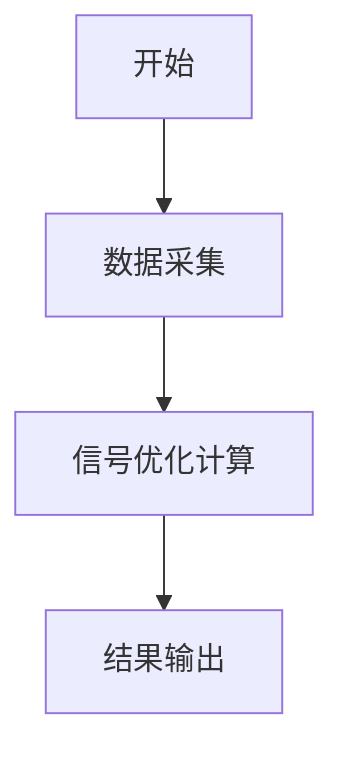
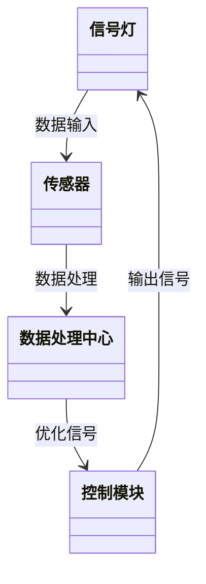

                 


# 价值投资中的智能交通自适应信号控制系统分析

> 关键词：价值投资、智能交通系统、信号控制优化、算法原理、系统架构

> 摘要：本文从价值投资的角度分析智能交通自适应信号控制系统，探讨其在优化交通效率和提升投资回报中的作用。通过分析系统的核心算法、架构设计和实际案例，揭示该系统在交通管理中的价值潜力。

---

## 第一部分：智能交通自适应信号控制系统概述

### 第1章：背景介绍

#### 1.1 价值投资与智能交通系统的结合

##### 1.1.1 价值投资的核心概念
价值投资是一种长期投资策略，强调通过深入分析企业的基本面，寻找那些具有持续竞争优势和良好财务状况的企业进行投资。其核心在于识别被市场低估的投资标的，长期持有以实现收益。

##### 1.1.2 智能交通系统的定义与特点
智能交通系统（ITS）利用先进的信息技术、数据通信、自动控制和计算机处理等技术，对交通系统进行智能化管理。其特点是实时感知、动态分析和智能决策，旨在提高交通效率、减少拥堵和事故。

##### 1.1.3 价值投资视角下的智能交通系统分析
从价值投资的角度看，智能交通系统具备长期增长潜力。随着城市化进程加快和交通需求增加，智能交通系统能够有效优化资源配置，降低成本，提升效率，从而为企业带来更高的利润和市场价值。

#### 1.2 智能交通自适应信号控制系统的问题背景

##### 1.2.1 传统交通信号控制的局限性
传统交通信号控制系统通常基于固定时间表，难以适应交通流量的实时变化，导致资源浪费和效率低下。

##### 1.2.2 智能交通系统的应用场景
智能交通系统广泛应用于城市交通管理、高速公路收费、交通事故预防等领域，特别是在信号控制优化方面，能够显著提升交通效率。

##### 1.2.3 价值投资中的信号系统优化
通过优化信号控制系统，可以减少交通拥堵，降低碳排放，提升道路使用效率，从而间接提高企业的运营效率和市场价值。

#### 1.3 问题描述与解决思路

##### 1.3.1 交通信号控制的优化目标
优化交通信号控制算法，提高交通流量处理能力，减少等待时间，降低能源消耗。

##### 1.3.2 价值投资中的信号系统优化需求
投资者关注信号系统优化带来的长期收益，包括成本降低、效率提升和市场竞争力增强。

##### 1.3.3 问题解决的思路与方法
通过实时数据分析和智能算法，动态调整信号灯配时，优化交通流量分配，实现系统效率的最大化。

#### 1.4 系统边界与外延

##### 1.4.1 系统边界定义
智能交通自适应信号控制系统包括信号灯、传感器、数据处理中心和控制模块，边界清晰，专注于信号优化。

##### 1.4.2 系统外延与扩展
系统可扩展至更大范围的交通网络管理，与其他交通管理系统（如自动驾驶、交通监控）无缝集成。

##### 1.4.3 价值投资中的系统边界分析
投资者应关注系统的核心功能和扩展潜力，评估其在不同场景下的适用性和盈利能力。

#### 1.5 核心概念结构与要素组成

##### 1.5.1 核心概念结构图
通过层次化结构展示智能交通系统的构成，包括感知层、网络层、应用层和决策层。

##### 1.5.2 系统组成要素分析
系统由传感器、数据处理模块、信号控制算法、执行机构和反馈机制组成，各部分协同工作。

##### 1.5.3 价值投资中的系统要素权重
投资者需评估各要素的重要性和投资回报，优先关注高影响力的模块，如核心算法和数据处理能力。

---

## 第二部分：智能交通自适应信号控制系统的价值分析

### 第2章：核心概念与联系

#### 2.1 核心概念原理

##### 2.1.1 信号控制算法原理
自适应信号控制算法基于实时数据调整信号灯配时，优化交通流量。常用算法包括遗传算法、模拟退火和蚁群算法。

##### 2.1.2 价值评估模型
价值评估模型通过分析系统的经济效益、社会效益和环境效益，评估其投资价值。

##### 2.1.3 系统优化的数学模型
建立数学模型，量化各因素对系统性能的影响，为优化提供理论依据。

#### 2.2 核心概念属性对比

##### 2.2.1 不同信号控制算法的对比
比较各种算法的优缺点，选择最适合应用场景的方法。

##### 2.2.2 价值评估模型的对比
分析不同模型的适用性和准确性，选择最优评估方法。

##### 2.2.3 系统优化目标的对比
明确不同优化目标的优先级和权重，确保系统设计符合投资需求。

#### 2.3 ER实体关系图

```mermaid
er
  actor: 价值投资者
  system: 交通信号控制系统
  actor --> system: 优化需求
  system --> actor: 信号优化结果反馈
```

---

## 第三部分：信号控制算法原理与实现

### 第3章：算法原理讲解

#### 3.1 算法原理概述

##### 3.1.1 自适应信号控制算法的基本原理
通过实时数据采集和分析，动态调整信号灯配时，优化交通流量。

##### 3.1.2 价值评估模型的算法基础
利用机器学习和统计分析，评估系统对投资的回报潜力。

##### 3.1.3 系统优化的数学模型
建立优化目标函数，考虑多约束条件，求解最优解。

#### 3.2 算法实现流程



#### 3.3 算法实现代码示例

```python
def traffic_signal_optimization(data):
    # 数据预处理
    processed_data = preprocess(data)
    # 算法计算
    optimized_signal = calculate_optimization(processed_data)
    return optimized_signal

# 数据预处理函数
def preprocess(data):
    # 数据清洗和特征提取
    pass

# 优化计算函数
def calculate_optimization(data):
    # 使用遗传算法或其他优化算法
    pass
```

#### 3.4 算法的数学模型和公式

##### 3.4.1 信号灯优化的数学模型
$$ \text{目标函数} = \min \sum_{t=1}^{T} \text{等待时间}_t $$
$$ \text{约束条件} = \{ \text{交通流量}_t \leq \text{信号灯周期}_t \} $$

##### 3.4.2 优化算法的数学表达
$$ \text{适应度函数} = f(x) = \sum_{i=1}^{n} x_i $$
$$ \text{选择操作} = P(x_i) = \frac{x_i}{\sum x_j} $$

---

## 第四部分：系统分析与架构设计

### 第4章：系统分析与架构设计

#### 4.1 问题场景介绍

##### 4.1.1 系统应用场景
智能交通信号控制系统应用于城市主干道、交叉路口和高速公路入口。

##### 4.1.2 系统面临的挑战
数据采集的实时性、算法的计算效率和系统的可扩展性。

#### 4.2 系统功能设计

##### 4.2.1 领域模型类图


#### 4.3 系统架构设计

##### 4.3.1 系统架构图


#### 4.4 接口设计与交互流程

##### 4.4.1 系统接口设计
定义API接口，如数据采集接口、信号控制接口和反馈接口。

##### 4.4.2 系统交互流程
```mermaid
sequenceDiagram
    actor: 用户
    system: 信号控制系统
    actor -> system: 发送交通数据
    system -> actor: 返回优化信号
```

---

## 第五部分：项目实战

### 第5章：项目实战

#### 5.1 环境安装

##### 5.1.1 开发环境
安装Python、数据处理库（Pandas、NumPy）、可视化工具（Matplotlib）和优化算法库（Scipy）。

#### 5.2 核心代码实现

##### 5.2.1 信号优化算法实现
```python
import numpy as np
from scipy.optimize import minimize

def objective_function(x, data):
    return np.sum(x * data)

def constraint_function(x, data):
    return data - x >= 0

result = minimize(objective_function, x0, method='SLSQP', constraints=constraints)
```

##### 5.2.2 系统架构实现
```python
class TrafficSystem:
    def __init__(self, sensors, controllers):
        self.sensors = sensors
        self.controllers = controllers

    def process_data(self, data):
        # 处理数据并返回优化信号
        pass
```

#### 5.3 案例分析与解读

##### 5.3.1 案例分析
分析某城市主干道的信号优化案例，展示系统如何减少拥堵和提高效率。

##### 5.3.2 代码实现解读
详细解读代码的功能和实现逻辑，说明各模块的协作和优化策略。

#### 5.4 项目小结

##### 5.4.1 项目总结
总结项目实现的关键点和取得的成果，强调系统的实用价值和投资潜力。

##### 5.4.2 经验与教训
分享项目实施中的经验教训，提出改进建议和未来优化方向。

---

## 第六部分：总结与展望

### 第6章：总结与展望

#### 6.1 最佳实践 tips

##### 6.1.1 投资建议
建议投资者关注智能交通系统的核心技术和市场应用，选择具备技术优势和良好团队的企业。

##### 6.1.2 系统优化建议
持续改进算法和系统架构，增强系统的适应性和扩展性。

#### 6.2 小结

##### 6.2.1 项目总结
回顾项目的主要内容和成果，强调智能交通系统在价值投资中的重要性。

#### 6.3 注意事项

##### 6.3.1 投资风险提示
提醒投资者注意市场风险、技术风险和政策风险，谨慎决策。

#### 6.4 拓展阅读

##### 6.4.1 推荐书籍和资源
推荐相关领域的书籍和资源，帮助读者深入学习和研究。

---

# 结语

通过本文的详细分析，我们可以看到智能交通自适应信号控制系统在价值投资中的巨大潜力。随着技术的不断进步和市场的广泛应用，该系统将为投资者带来可观的回报和长期的收益。希望本文的分析能够为投资者和相关从业者提供有价值的参考和启发。

