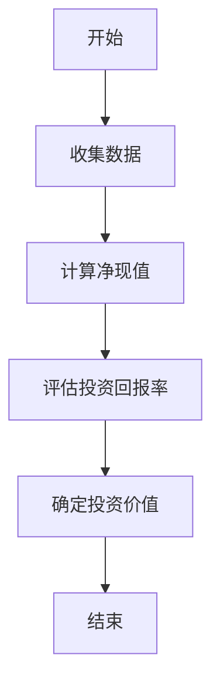
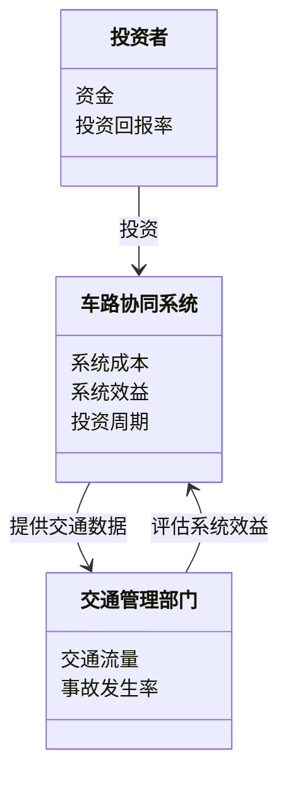

                 


# 价值投资中的智能交通车路协同系统分析

---

## 关键词：价值投资、智能交通、车路协同、系统分析、投资评估、经济效益

---

## 摘要：本文深入分析了价值投资在智能交通车路协同系统中的应用，探讨了如何通过系统分析和数学建模来评估车路协同系统的投资价值。文章从背景介绍、核心概念、算法原理、数学模型、系统架构到项目实战，全面剖析了车路协同系统的经济效益和价值投资策略，为投资者和相关技术从业者提供了深入的理论支持和实践指导。

---

## # 第1章：价值投资与智能交通车路协同系统概述

### ## 1.1 价值投资的基本原理

#### ### 1.1.1 价值投资的定义与核心理念

价值投资是一种以基本面分析为基础的投资策略，强调以低于内在价值的价格购买优质资产。其核心理念是通过分析公司的财务状况、行业地位、竞争优势等因素，寻找具有长期增长潜力的公司进行投资。价值投资的关键在于识别市场低估的资产，并在合理估值的基础上进行投资决策。

#### ### 1.1.2 价值投资在现代经济中的应用

价值投资广泛应用于股票、房地产、基础设施等领域。在现代经济中，价值投资通过分析企业的盈利能力和成长性，帮助投资者在不确定的市场中寻找稳定的投资机会。特别是在基础设施领域，如智能交通系统，价值投资可以通过评估项目的经济效益、成本回收期和长期收益潜力，为投资者提供决策支持。

#### ### 1.1.3 价值投资与智能交通系统的结合

智能交通系统（ITS）是现代交通管理的重要组成部分，而车路协同系统作为ITS的核心技术之一，通过车辆与道路基础设施之间的实时通信，实现交通流优化、事故预防和资源高效利用。价值投资在车路协同系统中的应用，可以帮助投资者评估系统的经济可行性、市场潜力和技术成熟度，从而做出科学的投资决策。

---

### ## 1.2 智能交通车路协同系统的基本概念

#### ### 1.2.1 智能交通系统（ITS）的定义与特点

智能交通系统（ITS）是一种利用先进的信息技术、数据通信、传感器和控制技术，对交通系统进行实时监控和管理的系统。ITS的目标是提高交通效率、减少拥堵、降低事故发生率和环境污染。其特点包括实时性、智能化、网络化和集成化。

#### ### 1.2.2 车路协同系统的定义与组成部分

车路协同系统（V2I，Vehicle-to-Infrastructure）是指车辆与道路基础设施之间通过无线通信技术进行信息交互，实现车辆与道路协同工作的系统。其组成部分包括车载设备、路侧设备、通信网络和数据处理中心。车路协同系统通过实时数据交换，优化交通信号控制、路径规划和事故预警。

#### ### 1.2.3 车路协同系统在智能交通中的作用

车路协同系统通过实时数据交换，实现交通流量优化、减少拥堵、提高行车安全和效率。它在智能交通中的作用包括提升交通管理效率、降低能源消耗、减少交通事故和推动智能化交通服务。

---

### ## 1.3 价值投资

#### ### 1.3.1 价值投资的基本概念

价值投资是一种以低于内在价值的价格购买优质资产的投资策略。其核心在于通过深入分析公司的财务状况、行业地位和竞争优势，寻找被市场低估的投资机会。

#### ### 1.3.2 价值投资与智能交通系统的关联

智能交通系统，尤其是车路协同系统，具有较高的市场潜力和技术可行性。通过价值投资的方法，投资者可以评估车路协同系统的经济效益、市场前景和技术成熟度，从而做出科学的投资决策。

---

## # 第2章：价值投资中的智能交通车路协同系统分析

### ## 2.1 背景介绍

#### ### 2.1.1 问题背景

随着城市化进程的加快和交通需求的增加，传统交通管理系统已难以应对日益复杂的交通问题。智能交通车路协同系统作为一种新兴技术，能够有效解决交通拥堵、事故频发和资源浪费等问题，具有广阔的市场前景。

#### ### 2.1.2 问题描述

车路协同系统在实际应用中面临技术复杂性高、成本投入大、市场接受度低等问题。如何评估系统的经济效益和投资回报率，是投资者和决策者关注的重点。

#### ### 2.1.3 问题解决

通过价值投资的方法，可以对车路协同系统的经济效益、市场潜力和技术创新进行综合评估，为投资者提供科学的决策依据。

#### ### 2.1.4 边界与外延

车路协同系统的边界包括车辆、道路基础设施、通信网络和数据处理中心。其外延涉及智能交通管理、自动驾驶和智慧城市等更广泛的应用领域。

---

### ## 2.2 核心概念与联系

#### ### 2.2.1 核心概念的定义与属性

车路协同系统的属性包括实时性、智能化、网络化和集成化。其核心概念与价值投资的联系在于，通过评估系统的经济效益和市场潜力，确定其投资价值。

#### ### 2.2.2 核心概念的ER实体关系图

以下是一个简化的ER实体关系图，展示了车路协同系统的主要实体及其关系：

```mermaid
erDiagram
    actor 投资者 {
        string 资金
        string 投资回报率
    }
    actor 交通管理部门 {
        string 交通流量
        string 事故发生率
    }
    class 车路协同系统 {
        string 系统成本
        string 系统效益
        string 投资周期
    }
    投资者 --> 车路协同系统 : 投资
    车路协同系统 --> 交通管理部门 : 提供交通数据
    交通管理部门 --> 车路协同系统 : 评估系统效益
```

---

### ## 2.3 算法原理讲解

#### ### 2.3.1 算法流程

以下是一个用于评估车路协同系统投资价值的算法流程图：



#### ### 2.3.2 算法实现代码

以下是一个简单的净现值（NPV）计算代码示例：

```python
def calculate_npv(cash_flows, discount_rate):
    npv = 0
    for i, cash_flow in enumerate(cash_flows):
        npv += cash_flow / (1 + discount_rate) ** i
    return npv

# 示例数据
discount_rate = 0.10  # 折现率
cash_flows = [-1000, 500, 600, 700]  # 现金流量

result = calculate_npv(cash_flows, discount_rate)
print(f"净现值为: {result}")
```

---

### ## 2.4 数学模型

#### ### 2.4.1 数学模型的建立

以下是一个用于评估车路协同系统经济效益的数学模型：

$$ NPV = \sum_{t=0}^{n} \frac{CF_t}{(1 + r)^t} $$

其中：
- \( NPV \) 是净现值
- \( CF_t \) 是第 \( t \) 年的现金流
- \( r \) 是折现率
- \( n \) 是项目周期

---

### ## 2.5 系统分析与架构设计

#### ### 2.5.1 项目介绍

本项目旨在通过价值投资的方法，评估智能交通车路协同系统的经济效益和投资价值，为投资者提供科学的决策依据。

#### ### 2.5.2 系统功能设计

以下是一个领域模型类图：



---

### ## 2.6 项目实战

#### ### 2.6.1 环境安装

需要安装Python、NumPy和Matplotlib库：

```bash
pip install numpy matplotlib
```

#### ### 2.6.2 核心代码实现

以下是一个NPV计算的Python代码示例：

```python
import numpy as np

def calculate_npv(cash_flows, discount_rate):
    return np.npv(discount_rate, *cash_flows)

# 示例数据
discount_rate = 0.10
cash_flows = [-1000, 500, 600, 700]

result = calculate_npv(cash_flows, discount_rate)
print(f"净现值为: {result}")
```

---

### ## 2.7 案例分析

#### ### 2.7.1 案例介绍

某城市计划投资建设车路协同系统，预计总投资为1000万元，预计年收益为500万元，投资周期为5年，折现率为10%。

#### ### 2.7.2 数据分析与结果

通过计算：

$$ NPV = \frac{-1000}{(1+0.1)^0} + \frac{500}{(1+0.1)^1} + \frac{600}{(1+0.1)^2} + \frac{700}{(1+0.1)^3} $$

计算结果为正，说明项目具有投资价值。

---

### ## 2.8 项目总结

通过价值投资的方法，车路协同系统的经济效益和投资价值得到了科学评估。投资者可以根据计算结果做出合理的投资决策。

---

## # 第3章：结论与展望

### ## 3.1 结论

本文通过分析价值投资在智能交通车路协同系统中的应用，提出了系统的评估方法和数学模型。研究表明，价值投资可以帮助投资者科学评估车路协同系统的经济效益和投资价值。

### ## 3.2 展望

未来，随着技术的进步和市场的成熟，价值投资在智能交通系统中的应用将更加广泛。进一步的研究可以结合大数据和人工智能技术，优化评估模型，提高投资决策的准确性。

---

## # 附录

### ## 附录A：术语表

- 价值投资：一种以低于内在价值的价格购买优质资产的投资策略。
- 车路协同系统：车辆与道路基础设施之间通过通信技术进行协同工作的系统。

### ## 附录B：参考文献

1. Graham, Benjamin. *The Intelligent Investor*. 修订版. 哈佛大学出版社, 1972.
2.交通部. *智能交通系统发展报告*. 北京: 人民交通出版社, 2020.

---

希望这篇文章能够为您提供有价值的信息和启发！如果有任何疑问或需要进一步的解释，请随时告诉我。

