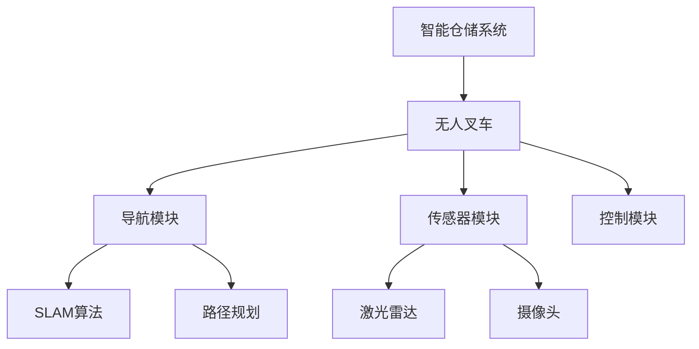

                 


# 价值投资中的智能仓储无人叉车系统分析

## 关键词：
智能仓储、无人叉车、价值投资、商业价值、系统分析、投资策略、技术应用

## 摘要：
本文从价值投资的角度，深入分析智能仓储无人叉车系统的商业价值和投资机会。首先介绍智能仓储和无人叉车的基本概念和发展背景，接着分析无人叉车系统的技术原理和商业价值，结合价值投资的核心理念，探讨如何通过技术分析和基本面分析来评估企业的投资价值。最后，结合实际案例，提出投资建议和未来发展趋势。

---

## 第一部分：智能仓储与无人叉车系统概述

### 第1章：智能仓储的发展背景

#### 1.1 智能仓储的定义与特点
智能仓储是一种利用自动化技术、物联网、人工智能等技术实现仓储管理的现代化仓储模式。其特点是高效、精确、自动化和智能化。
- **高效性**：通过自动化设备和智能算法，大幅提高仓储操作效率。
- **精确性**：利用传感器和数据采集技术，实现库存管理的高精度。
- **自动化**：通过无人设备实现货物的自动搬运和存储。
- **智能化**：通过AI技术实现预测性维护和智能决策。

#### 1.2 无人叉车系统的概念与优势
无人叉车（Unmanned Forklift）是一种能够在无需人工操作的情况下，自动完成货物搬运和存储任务的设备。
- **优势**：
  1. **提高效率**：无人叉车能够24/7工作，减少人工操作的时间损耗。
  2. **降低成本**：通过自动化减少人工成本，同时减少人为错误。
  3. **安全性**：避免人工操作中的安全隐患。

#### 1.3 智能仓储与无人叉车系统的应用场景
智能仓储与无人叉车系统的结合广泛应用于制造业、物流行业、电子商务等领域。例如，在电商仓储中，无人叉车可以高效完成订单拣选和货物搬运。

---

## 第二部分：价值投资的核心理念

### 第2章：价值投资的基本原理

#### 2.1 价值投资的定义与特点
价值投资是一种以基本面分析为基础的投资策略，强调以低于内在价值的价格买入优质资产。
- **核心理念**：寻找市场低估的优质企业，长期持有，分享企业成长的成果。
- **关键因素**：
  1. **企业的竞争优势**：企业是否具有独特的竞争优势。
  2. **企业的财务状况**：企业的财务健康状况和盈利能力。
  3. **管理层质量**：管理层的诚信和能力。

#### 2.2 价值投资的基本方法
- **基本面分析**：分析企业的财务报表、行业地位、竞争优势等。
- **相对估值法**：通过与同类企业的比较，寻找估值洼地。
- **内在价值计算**：通过DCF模型等方法估算企业的内在价值。

#### 2.3 价值投资中的关键因素
- **企业的竞争优势**：是否具备难以模仿的核心竞争力。
- **企业的财务状况**：ROE、ROA等指标是否健康。
- **企业的管理层质量**：管理层是否具备战略眼光和执行力。

---

## 第三部分：智能仓储无人叉车系统的商业价值分析

### 第3章：无人叉车系统的商业价值

#### 3.1 无人叉车系统的市场需求分析
随着物流行业和制造业的快速发展，对自动化仓储设备的需求不断增加。无人叉车系统能够显著提高仓储效率，降低运营成本，成为企业竞争的关键因素。

#### 3.2 无人叉车系统的技术优势
- **高效性**：无人叉车能够快速完成货物搬运，减少时间成本。
- **精确性**：通过传感器和导航技术实现精准定位和操作。
- **安全性**：减少人为操作中的安全隐患。

#### 3.3 无人叉车系统的投资回报
通过无人叉车系统的引入，企业可以实现：
- **成本降低**：减少人工成本，提高运营效率。
- **效率提升**：快速响应客户需求，提高客户满意度。
- **竞争力增强**：通过技术优势在市场中获得更大的份额。

---

## 第四部分：智能仓储无人叉车系统的技术分析

### 第4章：无人叉车系统的技术原理

#### 4.1 导航算法
无人叉车的核心技术之一是导航算法。常用的导航算法包括：
- **SLAM（同时定位与地图构建）**：通过激光雷达或摄像头实现自主导航。
- **路径规划**：通过计算最短路径或最优路径完成货物搬运。

#### 4.2 传感器融合
无人叉车通过多种传感器（如激光雷达、摄像头、超声波传感器）实现环境感知和定位。
- **数据融合**：将多种传感器的数据进行融合，提高系统的感知能力。

#### 4.3 自动化控制系统
无人叉车通过自动化控制系统实现货物的精准搬运和存储。控制系统包括：
- **运动控制**：通过电机控制叉车的运动。
- **任务调度**：通过调度算法实现多任务的高效处理。

---

## 第五部分：智能仓储无人叉车系统的系统分析

### 第5章：系统架构设计

#### 5.1 系统功能设计
- **货物搬运**：无人叉车根据任务指令完成货物的搬运。
- **库存管理**：通过传感器和数据采集技术实现库存的实时监控。
- **任务调度**：通过调度算法实现多任务的高效处理。

#### 5.2 系统架构图


#### 5.3 接口设计与交互
- **接口设计**：无人叉车与仓储系统通过API接口实现数据交互。
- **交互流程**：
  1. 系统下发任务指令。
  2. 无人叉车接收指令并进行路径规划。
  3. 执行任务并反馈结果。

---

## 第六部分：智能仓储无人叉车系统的项目实战

### 第6章：项目实战

#### 6.1 环境安装
- **硬件环境**：需要安装无人叉车、激光雷达、摄像头等设备。
- **软件环境**：需要安装Python、ROS（机器人操作系统）等开发环境。

#### 6.2 核心代码实现
以下是无人叉车导航算法的核心代码示例：
```python
import math

def calculate_distance(x1, y1, x2, y2):
    return math.sqrt((x1 - x2)**2 + (y1 - y2)**2)

def path_planning(start, end, obstacles):
    # 计算最优路径
    path = []
    current = start
    while current != end:
        next_point = find_next_point(current, end, obstacles)
        path.append(next_point)
        current = next_point
    return path

def find_next_point(current, end, obstacles):
    # 简单的路径规划算法
    next_point = end
    for point in obstacles:
        if calculate_distance(current, point) < calculate_distance(current, next_point):
            next_point = point
    return next_point
```

#### 6.3 案例分析
通过实际案例分析无人叉车系统在某企业的应用，展示其在成本降低、效率提升方面的具体效果。

---

## 第七部分：总结与展望

### 第7章：总结与展望

#### 7.1 投资总结
- **投资机会**：智能仓储无人叉车系统具有广阔的市场前景。
- **投资策略**：重点关注具有技术优势和竞争优势的企业。

#### 7.2 未来展望
随着人工智能和物联网技术的不断发展，无人叉车系统将更加智能化和高效化，为企业创造更大的价值。

---

## 参考文献
1. 《价值投资入门》
2. 《智能仓储系统设计与实现》
3. 《无人叉车技术与应用》

