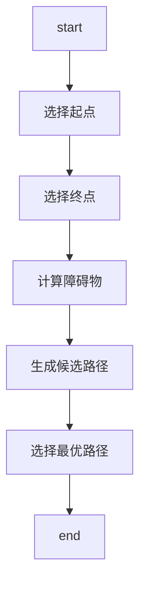
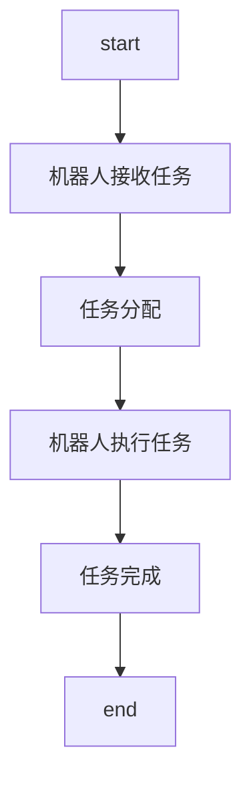
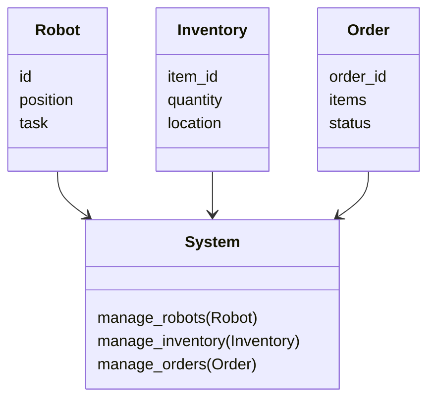
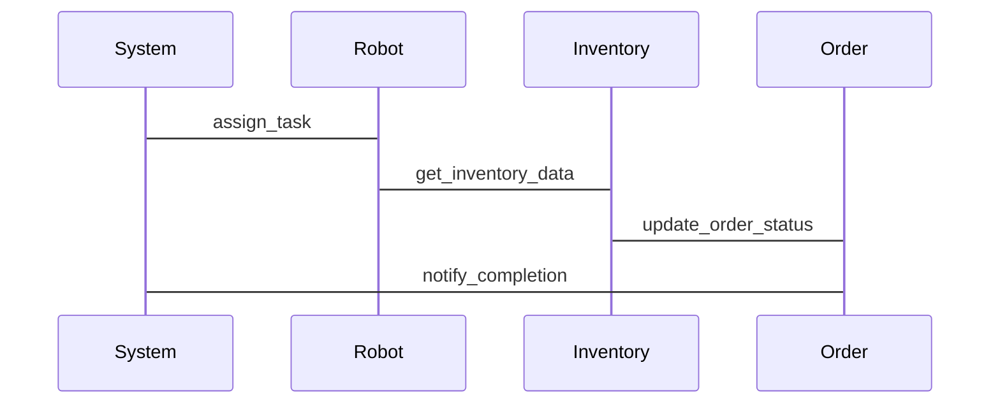

                 


# 价值投资中的智能仓储机器人协作系统分析

> 关键词：智能仓储机器人、协作系统、价值投资、库存优化、算法原理

> 摘要：智能仓储机器人协作系统通过优化库存管理、提高仓储效率，为价值投资提供了新的视角和方法。本文从背景、核心概念、算法原理、系统架构、项目实战等多个维度，深入分析智能仓储机器人协作系统在价值投资中的应用，探讨其对库存优化和企业价值的影响。

---

## 第一部分: 价值投资中的智能仓储机器人协作系统概述

### 第1章: 背景介绍

#### 1.1 智能仓储机器人协作系统的背景

##### 1.1.1 智能仓储机器人的发展背景
随着电子商务的快速发展，仓储管理的效率和准确性成为企业竞争力的关键因素。智能仓储机器人通过自动化、智能化的方式，能够显著提升库存管理的效率，降低人力成本。

##### 1.1.2 价值投资与仓储效率的关系
在价值投资中，库存周转率和存储成本是影响企业估值的重要因素。高效的仓储管理能够降低库存成本，提高资金周转率，从而提升企业的整体价值。

##### 1.1.3 智能仓储机器人协作系统的概念与特点
智能仓储机器人协作系统是指通过机器人之间的协作，实现仓储管理的自动化、智能化和高效化。其特点包括实时性、协作性、智能化和可扩展性。

#### 1.2 问题背景与描述

##### 1.2.1 传统仓储管理的痛点
传统仓储管理存在效率低、误差大、成本高等问题。人工操作容易出错，且效率有限，难以满足现代供应链的高要求。

##### 1.2.2 价值投资中的库存管理挑战
库存积压或短缺会影响企业的运营效率和资金流动性，从而影响企业的市场价值。如何优化库存管理成为价值投资者关注的重点。

##### 1.2.3 智能仓储机器人协作系统的解决方案
通过引入智能仓储机器人，实现库存管理的自动化和智能化，提高仓储效率，降低运营成本，从而提升企业的整体价值。

##### 1.2.4 系统的边界与外延
智能仓储机器人协作系统的边界包括仓储环境、机器人设备、库存数据和管理系统。其外延涉及物流、供应链和企业价值评估等多个领域。

##### 1.2.5 核心要素与概念结构
系统的核心要素包括机器人设备、库存数据、协作算法和管理系统。概念结构通过层次化的方式展示了系统各部分之间的关系。

### 第2章: 核心概念与联系

#### 2.1 智能仓储机器人协作系统的核心原理

##### 2.1.1 机器人协作的基本原理
机器人协作是指多个机器人通过协同工作，完成仓储管理中的各项任务，如搬运、存储和拣选等。协作的关键在于机器人之间的通信和任务分配。

##### 2.1.2 价值投资中的库存优化模型
库存优化模型通过数学方法，分析库存的最优存储位置和数量，以降低存储成本和提高周转率。模型考虑的因素包括需求预测、存储空间和成本等。

##### 2.1.3 系统的实时数据处理机制
系统通过实时数据采集和处理，动态优化库存布局，确保库存管理的高效性和准确性。

#### 2.2 核心概念的属性特征对比

##### 2.2.1 机器人协作系统的属性特征
- 自动化：减少人工干预，提高效率。
- 智能化：通过传感器和算法实现自主决策。
- 协作性：多个机器人协同工作，提高整体效率。

##### 2.2.2 价值投资中的库存优化特征
- 最优存储位置：基于需求预测和成本分析确定。
- 最小化存储成本：通过优化库存布局降低存储费用。
- 提高周转率：通过动态调整库存位置和数量。

##### 2.2.3 系统性能对比分析
通过对比传统仓储管理和智能仓储机器人协作系统的性能，可以发现协作系统在效率、准确性和成本控制方面具有显著优势。

#### 2.3 ER实体关系图

##### 2.3.1 实体关系图的构建
- 实体包括机器人、库存、订单和管理系统。
- 关系包括机器人处理订单、订单影响库存位置、库存数据由管理系统记录等。

##### 2.3.2 机器人、库存、订单之间的关系
- 机器人负责订单的拣选和搬运，库存记录订单的存储位置和数量，管理系统协调机器人和库存的操作。

##### 2.3.3 数据流与实体关系的动态分析
通过数据流图展示机器人协作系统中的信息流动，分析库存数据如何影响机器人任务分配，以及订单变化如何触发库存调整。

### 第3章: 算法原理讲解

#### 3.1 机器人协作算法的原理

##### 3.1.1 路径规划算法
路径规划算法用于机器人在仓储环境中找到最优路径，减少碰撞和提高效率。常用算法包括A*算法和遗传算法。

##### 3.1.2 多机器人协作算法
多机器人协作算法通过任务分配和协调，确保多个机器人能够高效协作完成任务。常用算法包括基于角色的分配和基于优先级的调度。

##### 3.1.3 优化算法的数学模型
路径规划和任务分配的优化可以通过数学模型实现。例如，路径规划可以使用图论中的最短路径算法，任务分配可以使用线性规划模型。

#### 3.2 算法流程图

##### 3.2.1 路径规划的mermaid流程图


##### 3.2.2 多机器人协作的mermaid流程图


#### 3.3 算法实现代码

##### 3.3.1 路径规划算法实现
```python
import heapq

def a_star(start, end, grid):
    open_set = set([start])
    came_from = {}
    g_score = {start:0}
    f_score = {start:0}
    
    while open_set:
        current = heapq.heappop(open_set, key=lambda x: f_score[x])
        if current == end:
            break
        for neighbor in grid.get_neighbors(current):
            tentative_g_score = g_score[current] + grid.distance(current, neighbor)
            if neighbor not in g_score or tentative_g_score < g_score[neighbor]:
                came_from[neighbor] = current
                g_score[neighbor] = tentative_g_score
                f_score[neighbor] = g_score[neighbor] + grid.heuristic(end, neighbor)
                heapq.heappush(open_set, neighbor)
    return came_from, g_score
```

##### 3.3.2 多机器人协作算法实现
```python
class Robot:
    def __init__(self, id, position):
        self.id = id
        self.position = position
        self.task = None

def assign_tasks(robots, tasks):
    for task in tasks:
        assign_robot = find_available_robot(robots)
        assign_robot.task = task
```

#### 3.4 数学模型与公式

##### 3.4.1 路径规划的数学模型
路径规划的最短路径问题可以用图论中的边权最短路径模型表示：
$$ \text{最小化} \sum_{i} (d_i \times c_i) $$
其中，\(d_i\) 是路径段的长度，\(c_i\) 是该段的权重。

##### 3.4.2 任务分配的优化模型
任务分配的优化可以通过线性规划模型实现：
$$ \text{最大化} \sum_{j} w_j x_j $$
其中，\(w_j\) 是任务 \(j\) 的权重，\(x_j\) 是分配给机器人的变量（0或1）。

---

## 第二部分: 系统分析与架构设计

### 第4章: 系统分析与架构设计

#### 4.1 问题场景介绍
在价值投资中，企业需要优化库存管理以提升效率和降低存储成本。智能仓储机器人协作系统能够实时优化库存布局，动态调整存储位置，从而提高库存周转率。

#### 4.2 系统功能设计

##### 4.2.1 领域模型类图


##### 4.2.2 系统架构设计
系统采用分层架构，包括机器人层、数据层、业务逻辑层和用户界面层。

##### 4.2.3 系统接口设计
系统接口包括机器人控制接口、库存数据接口和订单处理接口。

##### 4.2.4 系统交互序列图


---

## 第三部分: 项目实战

### 第5章: 项目实战

#### 5.1 环境安装

##### 5.1.1 安装机器人框架
使用ROS（Robot Operating System）框架，安装机器人驱动和相关库。

##### 5.1.2 安装系统依赖
安装Python、机器学习库（如TensorFlow、Scikit-learn）和可视化工具（如Matplotlib）。

#### 5.2 系统核心实现

##### 5.2.1 机器人协作算法实现
实现路径规划和任务分配算法，确保机器人能够高效协作完成任务。

##### 5.2.2 库存优化模型实现
基于历史销售数据，建立库存优化模型，动态调整库存位置和数量。

#### 5.3 案例分析

##### 5.3.1 案例背景
某电商企业引入智能仓储机器人协作系统，优化库存管理，提升订单处理效率。

##### 5.3.2 数据分析
通过数据分析，验证系统对库存周转率和存储成本的影响。

##### 5.3.3 系统效果
系统实施后，订单处理时间缩短，库存周转率提高，存储成本降低，企业价值显著提升。

#### 5.4 项目小结
通过项目实战，验证了智能仓储机器人协作系统在价值投资中的有效性，为企业优化库存管理提供了新的思路。

---

## 第四部分: 总结与展望

### 第6章: 总结与展望

#### 6.1 优缺点分析
智能仓储机器人协作系统具有高效、准确的优点，但存在初期投入高、技术复杂性较高的缺点。

#### 6.2 应用前景
随着人工智能和机器人技术的不断发展，智能仓储机器人协作系统将在价值投资中发挥越来越重要的作用，成为企业优化库存管理的核心工具。

#### 6.3 注意事项
企业在引入智能仓储机器人协作系统时，需考虑数据安全、系统维护和人员培训等问题。

#### 6.4 拓展阅读
推荐相关书籍和论文，深入学习智能仓储机器人协作系统的理论和实践。

---

通过本文的详细分析，我们可以看到智能仓储机器人协作系统在价值投资中的巨大潜力。未来，随着技术的进步，系统将更加智能化和高效化，为企业创造更大的价值。

