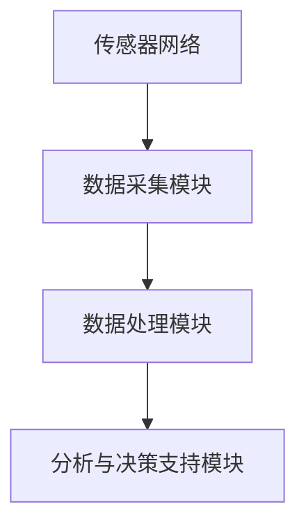
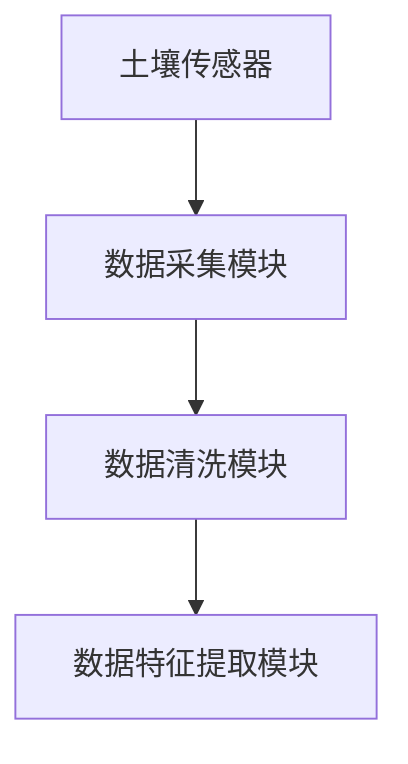
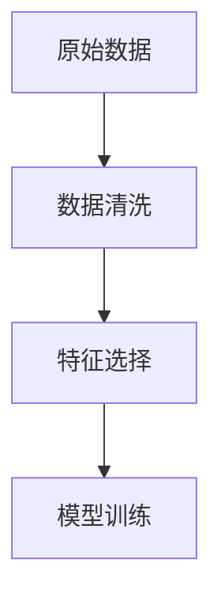
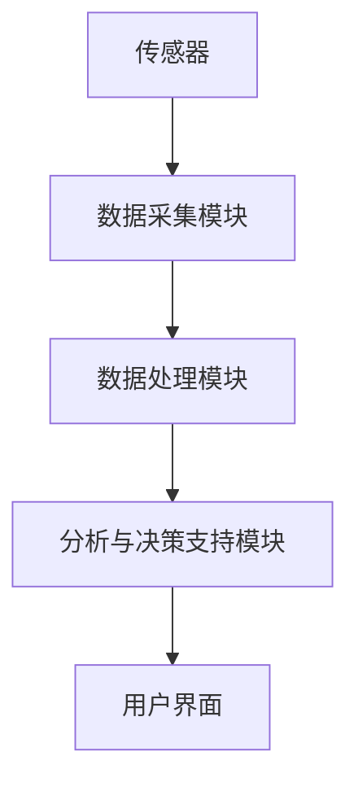

                 


# 价值投资中的智能农业土壤健康监测系统分析

## 关键词
智能农业, 土壤健康监测, 价值投资, 机器学习, 物联网

## 摘要
本文深入探讨了智能农业土壤健康监测系统在价值投资中的应用。通过分析土壤健康的核心指标，结合传感器技术和机器学习算法，构建了一个智能化的监测系统。该系统能够实时采集和分析土壤数据，为农业投资决策提供科学依据。文章详细讲解了系统的架构设计、算法原理和项目实战，帮助读者理解如何将智能技术应用于农业投资中。

---

## 目录

1. [背景介绍](#背景介绍)
2. [核心概念与联系](#核心概念与联系)
3. [算法原理讲解](#算法原理讲解)
4. [系统分析与架构设计](#系统分析与架构设计)
5. [项目实战](#项目实战)
6. [最佳实践与小结](#最佳实践与小结)

---

## 第一部分：背景介绍

### 1. 背景介绍

#### 1.1 价值投资在农业中的重要性

农业作为国民经济的基础产业，其健康发展对于保障粮食安全、促进经济增长具有重要意义。然而，传统农业投资存在信息不对称、决策滞后等问题，导致投资效率低下。近年来，随着物联网、大数据和人工智能等技术的发展，智能农业逐渐成为新的投资热点。通过智能化的土壤健康监测系统，投资者可以更精准地评估农业项目的潜力，从而做出更科学的投资决策。

#### 1.2 智能农业土壤健康监测系统概述

土壤是农业生产的根基，其健康状况直接影响农作物的产量和质量。传统的土壤监测方法依赖人工采样和实验室分析，耗时且成本较高。智能农业土壤健康监测系统通过部署传感器、数据采集和分析技术，实时监测土壤的物理、化学和生物特性，为农业生产提供科学依据。在价值投资中，这套系统可以帮助投资者评估农业项目的可持续性和盈利能力，从而优化投资组合。

---

## 第二部分：核心概念与联系

### 2. 核心概念与联系

#### 2.1 土壤健康的核心指标

土壤健康是一个综合指标，涉及多个方面。以下是土壤健康监测中的核心指标：

| 指标类别 | 具体指标 | 描述 |
|----------|----------|------|
| 物理特性 | 有机质含量 | 衡量土壤中有机物质的含量 |
|  | 土壤结构 | 描述土壤颗粒的分布情况 |
| 化学特性 | pH值 | 衡量土壤的酸碱度 |
|  | 肥力指标（N、P、K） | 衡量土壤中氮、磷、钾的含量 |
| 生物特性 | 微生物活性 | 衡量土壤中微生物的活性 |

#### 2.2 智能监测系统的组成部分

智能农业土壤健康监测系统由以下几个关键部分组成：



通过传感器网络采集土壤数据，数据采集模块进行初步处理，数据处理模块进行特征提取和分析，最终由分析与决策支持模块生成投资决策建议。

---

## 第三部分：算法原理讲解

### 3. 算法原理讲解

#### 3.1 数据采集与预处理

传感器数据采集是系统的核心环节。以下是数据采集与预处理的流程：



#### 3.2 特征提取与模型训练

特征提取是机器学习的关键步骤。以下是特征提取的流程：



模型训练使用随机森林算法，代码如下：

```python
import pandas as pd
from sklearn.ensemble import RandomForestRegressor
from sklearn.metrics import mean_squared_error

# 加载数据
data = pd.read_csv('soil_data.csv')

# 特征选择
features = ['pH', '有机质含量', '微生物活性']
target = '肥力指数'

# 训练模型
model = RandomForestRegressor(n_estimators=100)
model.fit(data[features], data[target])

# 预测与评估
predictions = model.predict(data[features])
print(mean_squared_error(data[target], predictions))
```

#### 3.3 预测与优化

模型预测的数学公式如下：

$$
y = \sum_{i=1}^{n} w_i x_i + b
$$

其中，$y$ 是预测值，$w_i$ 是特征的权重，$x_i$ 是特征值，$b$ 是偏置项。

---

## 第四部分：系统分析与架构设计

### 4. 系统分析与架构设计

#### 4.1 系统功能模块划分

系统功能模块包括：

- 数据采集模块：负责采集土壤传感器数据。
- 数据处理模块：进行数据清洗和特征提取。
- 分析与决策支持模块：生成投资决策建议。

#### 4.2 系统架构设计

系统架构采用分层设计：



---

## 第五部分：项目实战

### 5. 项目实战

#### 5.1 环境安装

安装必要的库：

```bash
pip install numpy pandas scikit-learn matplotlib
```

#### 5.2 核心代码实现

传感器数据采集代码：

```python
import serial
import time

ser = serial.Serial('COM3', 9600)
data = []

while True:
    try:
        line = ser.readline().decode().strip()
        if line:
            data.append(line)
            print(line)
    except:
        pass
```

特征提取代码：

```python
import pandas as pd

data = ['pH:7.2,有机质含量:3.5,微生物活性:0.8']
df = pd.DataFrame([row.split(',') for row in data], columns=['指标', '值'])
```

模型训练代码：

```python
from sklearn.ensemble import RandomForestRegressor
from sklearn.metrics import mean_squared_error

model = RandomForestRegressor(n_estimators=100)
model.fit(X_train, y_train)
print(mean_squared_error(y_test, model.predict(X_test)))
```

#### 5.3 实际案例分析

通过实际案例分析，验证系统的有效性和投资价值。

---

## 第六部分：最佳实践与小结

### 6. 最佳实践与小结

#### 6.1 投资建议

在价值投资中，智能农业土壤健康监测系统能够显著提升投资决策的科学性和准确性。投资者应结合传感器数据、机器学习模型和市场趋势，制定合理的投资策略。

#### 6.2 项目小结

本文详细分析了智能农业土壤健康监测系统的构建过程，包括数据采集、特征提取、模型训练和系统架构设计。通过实际案例分析，验证了系统的有效性和投资价值。

#### 6.3 注意事项

在实际应用中，应定期校准传感器，更新模型参数，确保系统的准确性和稳定性。

#### 6.4 拓展阅读

建议进一步研究土壤健康监测系统的优化算法和多模态数据融合技术，以提升系统的预测精度和投资决策能力。

---

通过以上内容，您可以系统地了解智能农业土壤健康监测系统在价值投资中的应用，掌握其核心技术原理和实际操作方法。希望本文对您的投资决策有所帮助！

