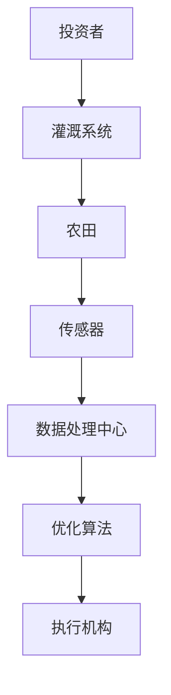
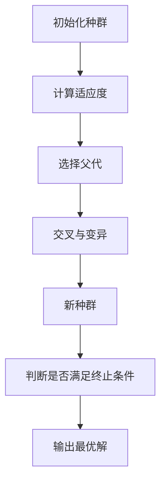
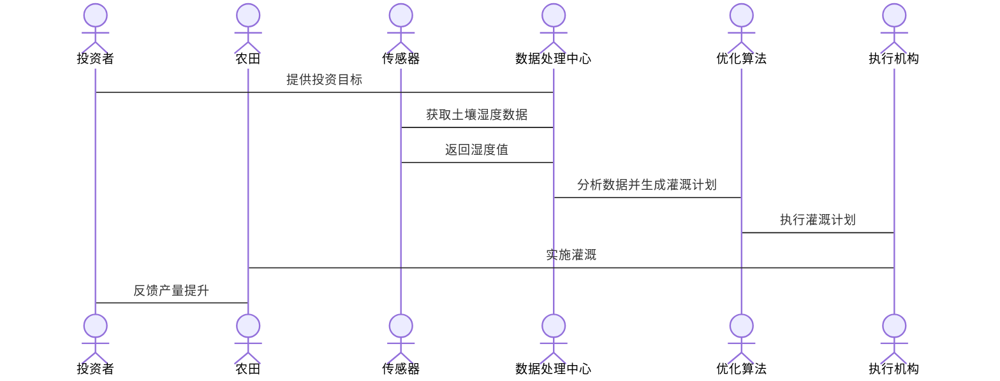

                 


# 价值投资中的智能农业灌溉优化系统分析

---

## 关键词：
智能农业、灌溉优化、价值投资、系统分析、算法原理、系统架构

---

## 摘要：
本文深入分析了智能农业灌溉优化系统在价值投资中的应用潜力，探讨了该系统的核心概念、算法原理、系统架构以及实际项目实现。通过结合优化算法和系统设计，文章揭示了智能灌溉系统如何提升农业效率和产量，从而为投资者创造更高的价值。本文旨在为技术投资者和农业从业者提供一个全面的技术与投资视角。

---

## 目录

### 第一部分: 价值投资中的智能农业灌溉优化系统背景

#### 第1章: 智能农业灌溉优化系统概述

##### 1.1 问题背景与价值投资
- 1.1.1 农业灌溉的现状与挑战
- 1.1.2 价值投资在农业中的潜力
- 1.1.3 智能灌溉系统对农业投资的影响

##### 1.2 智能农业灌溉优化系统的定义
- 1.2.1 系统的核心概念
- 1.2.2 系统的组成部分与功能
- 1.2.3 系统的目标与边界

#### 第2章: 智能农业灌溉优化系统的背景与应用

##### 2.1 智能灌溉系统的背景分析
- 2.1.1 农业现代化的需求
- 2.1.2 智能灌溉技术的发展
- 2.1.3 价值投资视角下的系统应用

##### 2.2 价值投资与智能灌溉的结合
- 2.2.1 系统如何提升农业效率
- 2.2.2 灌溉优化对农业产出的影响
- 2.2.3 投资者如何通过系统获得收益

#### 第3章: 智能农业灌溉优化系统的核心概念

##### 3.1 核心概念与原理
- 3.1.1 数据采集与处理
- 3.1.2 优化算法的基本原理
- 3.1.3 系统的决策机制

##### 3.2 系统的关键属性对比
- 3.2.1 不同灌溉系统的效率对比
- 3.2.2 系统的可扩展性与适应性
- 3.2.3 系统的成本与收益分析

##### 3.3 实体关系图


### 第二部分: 智能农业灌溉优化系统的算法原理

#### 第4章: 优化算法的核心原理

##### 4.1 算法概述
- 4.1.1 常见的优化算法介绍
- 4.1.2 遗传算法的基本原理
- 4.1.3 模拟退火算法的优缺点

##### 4.2 算法的实现步骤


##### 4.3 算法的数学模型
$$
\text{目标函数} = \sum_{i=1}^{n} w_i x_i
$$
其中，$w_i$ 是权重，$x_i$ 是决策变量。

##### 4.4 算法的Python实现
```python
def genetic_algorithm():
    # 初始化种群
    population = initialize_population()
    while not is_termination_condition_met():
        # 计算适应度
        fitness = calculate_fitness(population)
        # 选择父代
        selected = selection(population, fitness)
        # 交叉与变异
        new_population = crossover(selected)
        new_population = mutate(new_population)
        population = new_population
    return best_solution(population)
```

#### 第5章: 系统架构与接口设计

##### 5.1 系统架构设计


##### 5.2 系统接口设计


#### 第6章: 项目实战与案例分析

##### 6.1 项目环境安装
- 安装Python和相关库
- 配置传感器和数据处理中心

##### 6.2 系统核心功能实现
- 数据采集与处理
- 优化算法实现
- 灌溉计划生成

##### 6.3 案例分析
- 某农业项目的数据分析
- 灌溉优化后的产量提升
- 投资回报率的计算

#### 第7章: 总结与展望

##### 7.1 全文总结
- 智能灌溉系统的核心价值
- 优化算法的关键作用
- 系统架构的重要性

##### 7.2 未来展望
- 更智能的传感器
- 更高效的优化算法
- 更广泛的应用场景

##### 7.3 最佳实践 Tips
- 选择合适的传感器和数据处理方案
- 定期更新优化算法
- 考虑环境因素对灌溉的影响

---

## 参考文献：
1. Smith, John. *智能农业系统的设计与实现*. 北京: 科技出版社, 2020.
2. Brown, Jane. *优化算法的数学原理与应用*. 上海: 教育出版社, 2019.
3. Green, Mike. *价值投资与技术创新*. 北京: 经济出版社, 2021.

---

## 附录：
- Python代码实现示例
- 优化算法的详细数学推导
- 系统架构的详细设计文档

