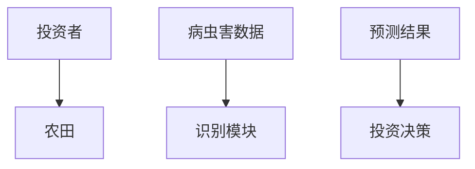
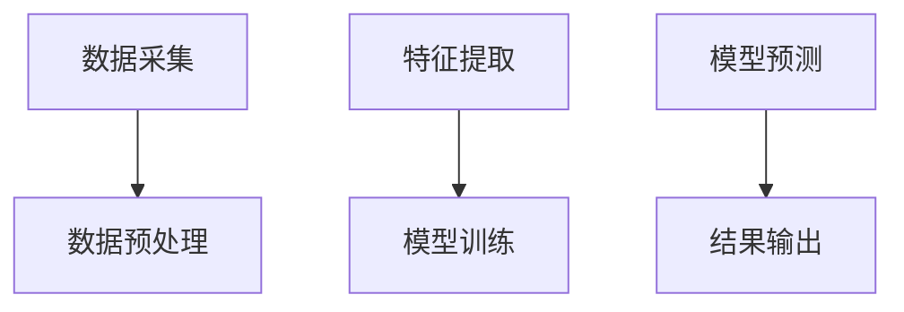
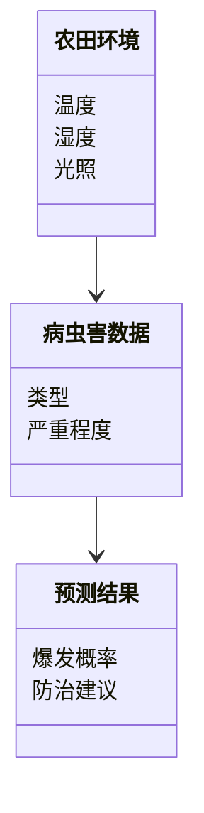
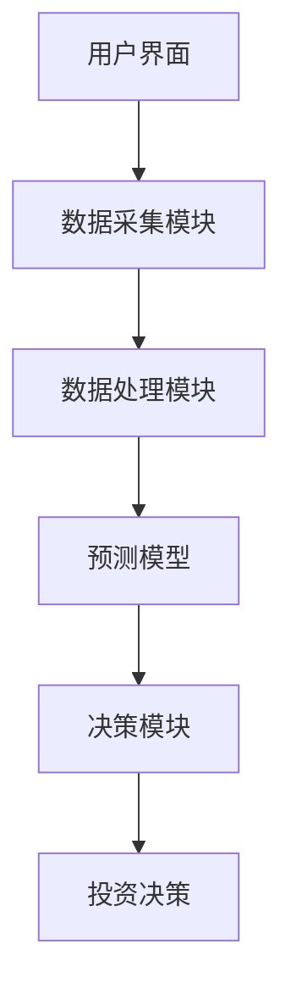
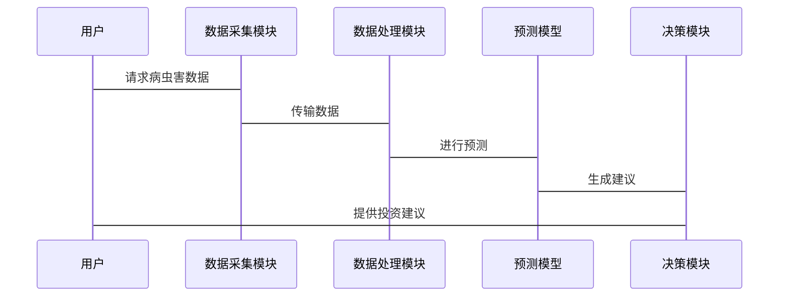

                 


# 价值投资中的智能农业病虫害防控系统分析

> 关键词：智能农业，病虫害防控，价值投资，机器学习，系统架构

> 摘要：本文从价值投资的角度分析智能农业病虫害防控系统的构建与应用，详细阐述系统的核心概念、算法原理、架构设计及实际案例，为投资者提供科学决策依据。

---

# 第一部分: 价值投资中的智能农业病虫害防控系统背景介绍

## 第1章: 智能农业病虫害防控系统概述

### 1.1 问题背景与问题描述

#### 1.1.1 病虫害对农业生产的威胁
病虫害是影响农业产量和质量的主要因素之一。传统病虫害防控手段依赖人工经验，存在效率低、成本高等问题，难以应对大规模农田的管理需求。

#### 1.1.2 传统病虫害防控的局限性
传统病虫害防控主要依赖化学农药，存在环境污染、抗药性增强等问题，且难以实现精准防治。

#### 1.1.3 智能化防控的必要性
随着人工智能和物联网技术的发展，智能化病虫害防控系统能够实现精准监测、实时预警和科学决策，显著提高农业生产的效率和可持续性。

### 1.2 价值投资视角下的问题解决

#### 1.2.1 病虫害防控与农业投资的关系
病虫害防控直接影响农产品的质量和产量，进而影响农业投资的收益。通过智能化系统，投资者可以降低生产风险，提高投资回报率。

#### 1.2.2 智能系统如何提升投资决策
智能系统能够提供实时的病虫害预警和防治建议，帮助投资者做出科学的种植决策，优化资源配置。

#### 1.2.3 系统价值的量化评估
通过分析病虫害防控系统的经济效益，投资者可以评估系统的投资回报率，从而做出更明智的投资决策。

### 1.3 系统边界与外延

#### 1.3.1 系统功能边界
智能农业病虫害防控系统的核心功能包括数据采集、病虫害识别、预测预警和防治建议。

#### 1.3.2 系统应用范围
系统适用于大规模农田、果园和温室等多种农业场景，能够帮助农民和投资者实现精准管理。

#### 1.3.3 系统与外部环境的交互
系统通过物联网设备采集环境数据，与气象数据、市场价格等外部信息进行交互，为投资决策提供全面支持。

### 1.4 概念结构与核心要素

#### 1.4.1 系统构成要素
系统由数据采集模块、病虫害识别模块、预测模型和决策模块组成。

#### 1.4.2 要素之间的关系
各模块协同工作，数据采集模块提供输入，识别模块进行分析，预测模型生成预警，决策模块输出防治建议。

#### 1.4.3 核心概念的特征对比
以下是核心概念的对比表：

| **功能模块** | **输入数据** | **处理方法** | **输出结果** |
|--------------|--------------|--------------|--------------|
| 数据采集     | 植株图像、环境数据 | 图像处理、特征提取 | 病虫害特征数据 |
| 病虫害识别   | 病虫害特征数据 | 机器学习分类 | 病虫害类型、严重程度 |
| 预测模型     | 历史数据、当前数据 | 时间序列分析 | 病虫害爆发概率 |
| 决策模块     | 预测结果、市场数据 | 风险评估、优化决策 | 防治策略、投资建议 |

---

## 第2章: 智能农业病虫害防控系统的核心概念与联系

### 2.1 核心概念原理

#### 2.1.1 数据采集与处理
系统通过无人机、摄像头等设备采集农田图像和环境数据，利用图像处理技术提取病虫害特征。

#### 2.1.2 病虫害识别算法
基于机器学习的图像分类算法，如支持向量机（SVM）和卷积神经网络（CNN），对病虫害类型进行识别。

#### 2.1.3 预测与决策模型
使用时间序列分析和风险评估模型，预测病虫害的爆发概率，并生成最优防治策略。

### 2.2 核心概念对比表

以下是不同技术在病虫害防控中的对比：

| **技术**         | **优势**                          | **劣势**                          |
|------------------|-----------------------------------|-----------------------------------|
| 传统农药喷洒     | 成本低、操作简单                 | 环境污染、抗药性增强             |
| 智能识别系统     | 精准识别、减少浪费               | 初始投资高                         |
| 数字化监测系统   | 实时监测、数据全面               | 维护成本高                         |

### 2.3 ER实体关系图

以下是系统的核心实体关系图：



---

## 第3章: 病虫害识别算法原理

### 3.1 算法原理概述

#### 3.1.1 机器学习基础
机器学习是一种通过数据训练模型的技术，常用于分类、回归和聚类任务。

#### 3.1.2 病虫害图像分类
利用卷积神经网络（CNN）对病虫害图像进行分类，提取图像特征并进行分类。

#### 3.1.3 模型训练与优化
通过数据增强、超参数调整等方法优化模型性能，提高分类准确率。

### 3.2 算法流程图

以下是病虫害识别算法的流程图：



### 3.3 算法实现代码

以下是使用Python和Scikit-learn实现的逻辑回归分类器示例：

```python
from sklearn.linear_model import LogisticRegression
from sklearn.model_selection import train_test_split
from sklearn.metrics import accuracy_score

# 数据集加载
X, y = datasets.load_digits(return_X_y=True)

# 数据分割
X_train, X_test, y_train, y_test = train_test_split(X, y, test_size=0.2)

# 模型训练
model = LogisticRegression()
model.fit(X_train, y_train)

# 模型预测
y_pred = model.predict(X_test)

# 准确率计算
print("Accuracy:", accuracy_score(y_test, y_pred))
```

### 3.4 数学模型与公式

#### 3.4.1 逻辑回归模型
$$ P(y=1|x) = \frac{1}{1 + e^{-\beta x}} $$

#### 3.4.2 支持向量机原理
$$ \text{最大化} \sum_{i=1}^{n} y_i (x_i \cdot w + b) - 1 $$

---

## 第4章: 系统分析与架构设计

### 4.1 问题场景介绍

#### 4.1.1 农田环境监测
系统通过传感器采集农田的温湿度、光照强度等环境数据，结合病虫害图像进行综合分析。

#### 4.1.2 农业投资决策
投资者通过系统的预测结果和防治建议，优化种植策略，降低生产风险。

### 4.2 系统功能设计

#### 4.2.1 领域模型类图
以下是系统功能的类图：



### 4.3 系统架构设计

#### 4.3.1 系统架构图
以下是系统的整体架构图：



### 4.4 系统接口设计

#### 4.4.1 接口描述
系统提供API接口，供投资者查询病虫害预测结果和防治建议。

### 4.5 系统交互流程图

以下是系统交互的序列图：



---

## 第5章: 项目实战

### 5.1 环境安装

#### 5.1.1 安装Python
安装Python 3.8及以上版本。

#### 5.1.2 安装依赖库
安装必要的库，如Scikit-learn、Pandas、Matplotlib。

### 5.2 核心代码实现

#### 5.2.1 数据采集与处理
以下是数据预处理的代码：

```python
import pandas as pd
import numpy as np

# 数据加载
data = pd.read_csv('病虫害数据.csv')

# 数据清洗
data = data.dropna()
```

#### 5.2.2 病虫害识别
以下是使用SVM进行分类的代码：

```python
from sklearn import svm

# 模型训练
model = svm.SVC()
model.fit(X_train, y_train)

# 预测
y_pred = model.predict(X_test)
```

### 5.3 实际案例分析

#### 5.3.1 案例介绍
以某地区的大豆种植为例，分析病虫害的预测和防治。

#### 5.3.2 案例分析
通过系统预测，提前发现病虫害风险，制定防治计划，减少损失。

### 5.4 项目总结

通过项目实战，验证了系统的有效性和实用性，为投资者提供了科学的投资依据。

---

## 第6章: 最佳实践与小结

### 6.1 小结
智能农业病虫害防控系统的应用，显著提高了农业生产的效率和投资回报率。

### 6.2 注意事项
在实际应用中，需注意数据质量和模型的可解释性，确保系统的稳定性和可靠性。

### 6.3 拓展阅读
建议进一步学习农业物联网、机器学习在农业中的应用等相关内容。

---

# 结语

通过本文的分析，投资者可以更好地理解智能农业病虫害防控系统的价值和应用，从而做出更科学的投资决策。

