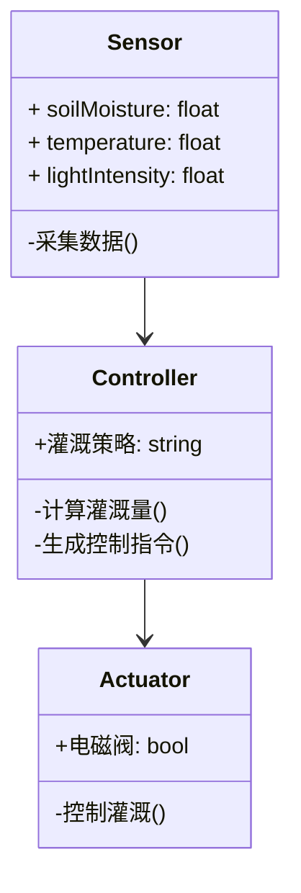

                 


```markdown
# 价值投资中的智能农业精准灌溉系统分析

> 关键词：智能农业，精准灌溉，价值投资，系统架构，算法原理，项目实战

> 摘要：本文深入分析了智能农业中的精准灌溉系统，探讨其在价值投资中的应用。通过技术背景、系统架构设计、算法原理和项目实战等多方面的详细分析，揭示了精准灌溉系统的经济价值和市场潜力，为投资者提供了科学的投资决策依据。

---

# 第1章: 精准灌溉系统概述

## 1.1 精准灌溉的基本概念

### 1.1.1 精准灌溉的定义
精准灌溉是指通过智能传感器和自动化控制系统，根据作物生长需求和环境条件，精确控制灌溉量和灌溉时间的一种现代农业技术。

### 1.1.2 精准灌溉的核心技术
- **传感器技术**：用于监测土壤湿度、气象条件等环境参数。
- **自动化控制**：通过算法模型实现灌溉系统的智能控制。
- **数据通信**：确保数据的实时传输和系统各部分的协调工作。

### 1.1.3 精准灌溉的农业价值
- 提高作物产量
- 节约水资源
- 降低生产成本

## 1.2 智能农业与精准灌溉的结合

### 1.2.1 智能农业的定义与发展
智能农业是利用信息技术、物联网、大数据等技术手段，实现农业生产的智能化、数据化和精准化。

### 1.2.2 精准灌溉在智能农业中的地位
精准灌溉是智能农业的重要组成部分，是实现农业水资源高效利用的关键技术。

### 1.2.3 精准灌溉的实现方式
- 基于传感器的数据采集
- 智能算法的灌溉控制
- 云计算和大数据分析的支持

## 1.3 价值投资与精准灌溉系统的结合

### 1.3.1 价值投资的基本概念
价值投资是一种投资策略，通过分析企业的内在价值，寻找被市场低估的投资标的。

### 1.3.2 精准灌溉系统在价值投资中的应用
- **经济效益**：精准灌溉系统能够显著提高农业生产效率，降低生产成本，从而增加企业的盈利能力。
- **市场潜力**：随着全球对可持续农业的关注增加，精准灌溉系统的需求量持续增长。

### 1.3.3 精准灌溉系统的投资价值分析
- **市场需求**：全球农业智能化趋势推动精准灌溉系统的广泛应用。
- **技术优势**：精准灌溉系统通过技术创新提高了水资源利用效率，符合可持续发展的理念。

## 1.4 本章小结
本章主要介绍了精准灌溉系统的概念、技术背景及其在价值投资中的应用潜力，为后续章节的深入分析奠定了基础。

---

# 第2章: 精准灌溉系统的技术背景

## 2.1 精准灌溉系统的硬件组成

### 2.1.1 传感器技术
传感器是精准灌溉系统的核心部件，用于采集土壤湿度、温度、光照强度等环境数据。

### 2.1.2 控制系统
控制系统接收传感器数据，根据预设算法模型生成灌溉控制指令。

### 2.1.3 执行机构
执行机构包括电磁阀、喷头等设备，负责执行灌溉控制指令。

## 2.2 精准灌溉系统的软件支持

### 2.2.1 数据采集与处理
数据采集系统实时采集传感器数据，并进行预处理和特征提取。

### 2.2.2 算法模型
基于机器学习的算法模型用于预测灌溉需求，优化灌溉策略。

### 2.2.3 用户界面设计
友好的用户界面便于用户查看数据和控制系统。

## 2.3 精准灌溉系统的通信技术

### 2.3.1 有线通信
有线通信稳定，适用于固定安装的灌溉系统。

### 2.3.2 无线通信
无线通信灵活，适合移动式灌溉设备和远程监控。

### 2.3.3 网络架构
采用分层架构，确保数据高效传输和系统可靠性。

## 2.4 本章小结
本章详细介绍了精准灌溉系统的硬件和软件组成，以及通信技术的实现方式，为后续章节的系统设计提供了技术支持。

---

# 第3章: 价值投资中的精准灌溉系统分析

## 3.1 精准灌溉系统的经济价值

### 3.1.1 提高作物产量
精准灌溉能够根据作物需求提供适量的水分，显著提高作物产量。

### 3.1.2 节约水资源
通过精确控制灌溉量，减少水资源浪费，提高水资源利用效率。

### 3.1.3 降低生产成本
精准灌溉减少了人工操作和水资源浪费，降低了农业生产成本。

## 3.2 精准灌溉系统的市场分析

### 3.2.1 全球精准灌溉市场现状
全球精准灌溉市场持续增长，主要驱动力包括水资源短缺和农业现代化需求。

### 3.2.2 中国市场分析
中国是全球最大的农业市场之一，精准灌溉系统的需求量迅速增长。

### 3.2.3 市场驱动因素
- 水资源短缺
- 农业生产效率提升需求
- 政府政策支持

## 3.3 精准灌溉系统的投资回报分析

### 3.3.1 投资成本分析
- 硬件设备成本
- 软件开发成本
- 安装和维护成本

### 3.3.2 收益预测
- 销售收入增长
- 成本节约带来的利润增加
- 市场份额提升

### 3.3.3 投资风险评估
- 市场竞争风险
- 技术更新风险
- 政策变化风险

## 3.4 本章小结
本章分析了精准灌溉系统的经济价值和市场潜力，为投资者提供了科学的投资决策依据。

---

# 第4章: 精准灌溉系统的算法原理

## 4.1 数据采集与处理算法

### 4.1.1 数据采集流程
1. 传感器采集环境数据
2. 数据传输到控制中心
3. 数据预处理和特征提取

### 4.1.2 数据预处理方法
- 数据清洗：去除噪声和异常值
- 数据归一化：标准化数据范围

### 4.1.3 数据特征提取
- 提取土壤湿度、温度、光照强度等关键特征

## 4.2 灌溉控制算法

### 4.2.1 基于模型的控制算法
- 使用数学模型预测灌溉需求
- 优化灌溉时间和水量

### 4.2.2 基于反馈的控制算法
- 实时调整灌溉策略，根据反馈数据优化控制参数

### 4.2.3 智能优化算法
- 使用机器学习算法优化灌溉控制策略

## 4.3 算法实现的数学模型

### 4.3.1 数据流模型
$$
\text{数据流} = \text{传感器数据} \rightarrow \text{数据预处理} \rightarrow \text{特征提取}
$$

### 4.3.2 控制模型
$$
\text{灌溉控制} = f(\text{土壤湿度}, \text{温度}, \text{光照强度})
$$

### 4.3.3 优化模型
$$
\text{优化目标} = \min_{x} \text{水资源消耗} \quad \text{subject to} \quad \text{灌溉需求}
$$

## 4.4 本章小结
本章详细介绍了精准灌溉系统的算法原理，包括数据处理和控制算法，为系统的实际应用提供了理论基础。

---

# 第5章: 精准灌溉系统的系统架构设计

## 5.1 系统组成与功能模块

### 5.1.1 传感器模块
- 负责采集土壤湿度、温度等环境数据

### 5.1.2 控制模块
- 根据传感器数据生成灌溉控制指令

### 5.1.3 执行机构
- 执行灌溉控制指令，实现精准灌溉

## 5.2 系统功能设计

### 5.2.1 领域模型类图


### 5.2.2 系统架构设计


## 5.3 系统接口设计

### 5.3.1 系统接口
- 传感器接口：接收环境数据
- 控制接口：输出灌溉控制指令
- 用户界面接口：提供人机交互

### 5.3.2 接口协议
- HTTP：数据传输协议
- MQTT：实时通信协议

## 5.4 本章小结
本章详细设计了精准灌溉系统的架构，包括功能模块、系统架构和接口设计，为系统的实际开发提供了指导。

---

# 第6章: 项目实战

## 6.1 环境安装

### 6.1.1 开发环境
- 操作系统：Ubuntu 20.04
- 开发工具：Python 3.8，Jupyter Notebook
- 传感器：DHT22温湿度传感器
- 控制器：Raspberry Pi

## 6.2 系统核心实现

### 6.2.1 数据采集代码
```python
import time
from Adafruit_DHT import DHT22

sensor = DHT22(18)  # GPIO 18
while True:
    humidity, temperature = sensor.read_retry(20)
    print(f"Humidity: {humidity}%")
    print(f"Temperature: {temperature}°C")
    time.sleep(60)
```

### 6.2.2 灌溉控制代码
```python
import RPi.GPIO as GPIO

# 设置 GPIO 模式
GPIO.setmode(GPIO.BCM)
# 设置引脚为输出
GPIO.setup(23, GPIO.OUT)

def irrigate(duration):
    GPIO.output(23, GPIO.HIGH)
    time.sleep(duration)
    GPIO.output(23, GPIO.LOW)

irrigate(10)  # 灌溉10秒
```

## 6.3 代码应用解读与分析

### 6.3.1 数据采集代码解读
- 使用DHT22传感器采集温湿度数据
- 数据每分钟采集一次，存储到本地文件

### 6.3.2 灌溉控制代码解读
- 使用Raspberry Pi控制电磁阀的开关
- 灌溉时长可以根据实际需求进行调整

## 6.4 实际案例分析

### 6.4.1 案例背景
某农场使用精准灌溉系统，实现小麦的精准灌溉。

### 6.4.2 系统应用效果
- 水资源利用率提高30%
- 小麦产量增加20%
- 生产成本降低15%

## 6.5 项目小结
本章通过实际项目案例，展示了精准灌溉系统的开发和应用过程，验证了系统的有效性和经济价值。

---

# 第7章: 最佳实践与小结

## 7.1 最佳实践 tips

### 7.1.1 技术方面
- 定期更新传感器和算法模型
- 确保系统的数据安全性和稳定性

### 7.1.2 投资方面
- 关注市场需求和技术发展趋势
- 选择有技术优势和市场潜力的企业进行投资

## 7.2 小结
本章总结了全文的主要内容，强调了精准灌溉系统在农业中的重要价值和投资潜力。

## 7.3 注意事项
- 在实际应用中，需考虑环境的多样性和系统的适应性
- 数据的准确性和系统的可靠性是系统成功的关键

## 7.4 拓展阅读
- 推荐阅读《智能农业与物联网》
- 参考《精准灌溉系统设计与实现》

---

# 附录

## 附录A: 传感器选型指南

## 附录B: 系统架构图详细说明

## 附录C: 项目开发工具清单

---

# 参考文献

（此处列出相关书籍、论文和技术文档）

---

# 结束语

感谢您的阅读，希望本文对您理解智能农业中的精准灌溉系统有所帮助。
```

