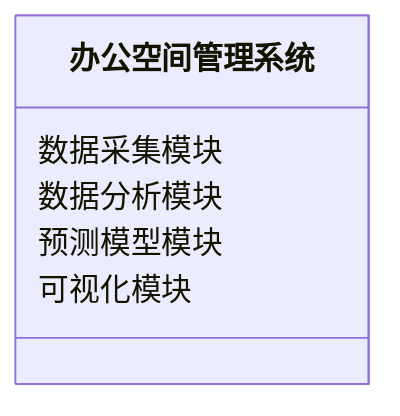
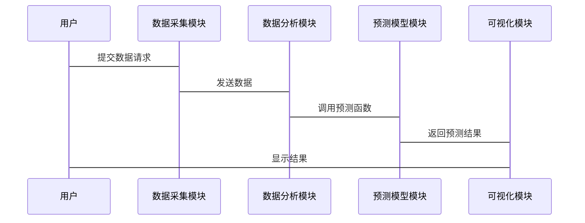

                 


# 价值投资中的智能办公空间技术趋势

> 关键词：价值投资，智能办公空间，技术趋势，机器学习，系统架构，项目实战

> 摘要：本文探讨了价值投资与智能办公空间技术趋势的结合，分析了智能办公空间的技术发展及其对企业价值的影响。通过算法原理、系统架构设计和项目实战，展示了如何利用技术手段提升办公空间的价值评估和投资决策。

---

## 第一部分：价值投资与智能办公空间的背景介绍

### 第1章：价值投资的基本概念

#### 1.1 价值投资的定义与核心理念
价值投资是一种以企业的内在价值为基础的投资策略，强调长期持有优质资产，寻找市场价格低于内在价值的投资机会。核心理念包括安全边际、企业的财务健康状况和管理层质量等。这种投资策略在长期表现出色，尤其在市场波动中表现稳定。

#### 1.2 智能办公空间的定义与发展趋势
智能办公空间是利用物联网、人工智能和大数据等技术构建的智能化办公环境。发展趋势包括智能化、个性化、绿色化和远程办公支持。智能办公空间通过自动化管理、能源优化和提升员工效率，显著影响企业的运营成本和员工生产力。

#### 1.3 价值投资与智能办公空间的结合
价值投资与智能办公空间的结合体现在通过技术手段评估办公空间的价值，寻找具备长期增值潜力的智能办公项目。这种结合不仅改变了传统的办公模式，也为投资者提供了新的价值增长点。

---

## 第二部分：价值投资与智能办公空间的核心概念与联系

### 第2章：价值投资与智能办公空间的核心概念分析

#### 2.1 价值投资的核心概念
- **内在价值**：企业未来现金流的现值，是投资决策的基础。
- **安全边际**：市场价格低于内在价值的幅度，确保投资的安全性。

#### 2.2 智能办公空间的核心技术
- **物联网技术**：实现办公设备和环境的智能监控和管理。
- **人工智能**：用于数据分析、预测和优化办公空间使用效率。
- **大数据分析**：通过海量数据帮助企业做出更明智的决策。

#### 2.3 价值投资与智能办公空间的联系
- **技术驱动价值提升**：智能办公空间通过技术创新降低成本，提高效率，从而提升企业的内在价值。
- **数据驱动投资决策**：利用智能办公系统收集的数据，投资者可以更准确地评估办公空间的价值和潜力。

---

## 第三部分：价值投资中的智能办公空间技术趋势分析

### 第3章：智能办公空间技术的算法原理

#### 3.1 智能办公空间数据的收集与分析
数据收集包括办公设备使用情况、能源消耗、员工工作效率等。数据分析使用回归分析和聚类分析，识别趋势和潜在问题。

#### 3.2 基于机器学习的价值预测
使用机器学习算法预测办公空间的价值变化。例如，使用线性回归模型：

$$
V = a \times F + b \times T + c
$$

其中，V为办公空间价值，F为功能设施评分，T为技术先进性评分，c为常数项。

### 第4章：系统分析与架构设计方案

#### 4.1 系统功能设计
系统功能包括数据采集、分析、预测和可视化。领域模型如下：



#### 4.2 系统架构设计
采用分层架构：


#### 4.3 系统交互设计
系统交互流程：



---

## 第四部分：项目实战

### 第5章：价值投资中的智能办公空间技术实战

#### 5.1 环境安装
安装Python、机器学习库（如scikit-learn）和数据可视化工具（如Matplotlib）。

#### 5.2 核心实现代码
以下是价值预测模型的Python代码：

```python
import pandas as pd
from sklearn.linear_model import LinearRegression

# 数据加载
data = pd.read_csv('office_space.csv')

# 特征与目标分离
X = data[['floor', 'view', 'equipment']]
y = data['value']

# 模型训练
model = LinearRegression()
model.fit(X, y)

# 预测
new_office = [[3, 1, 5]]
prediction = model.predict(new_office)
print("预测价值：", prediction[0])
```

#### 5.3 实际案例分析
通过分析某智能办公空间的案例，验证模型的有效性，评估其在价值投资中的应用效果。

---

## 第五部分：总结与展望

### 第6章：价值投资与智能办公空间的未来趋势

#### 6.1 最佳实践 tips
- 结合技术趋势评估办公空间价值。
- 采用机器学习模型优化投资决策。

#### 6.2 小结
价值投资与智能办公空间的结合为投资者提供了新的视角和工具，通过技术手段提升投资决策的准确性和效率。

#### 6.3 注意事项
- 数据质量影响模型准确性。
- 持续关注技术发展和市场变化。

#### 6.4 拓展阅读
建议深入学习机器学习在金融领域的应用，以及智能建筑的技术发展。

---

通过以上结构和内容的详细阐述，本文为读者提供了从理论到实践的全面指导，帮助理解价值投资与智能办公空间技术趋势的结合，并为未来的投资决策提供参考。

