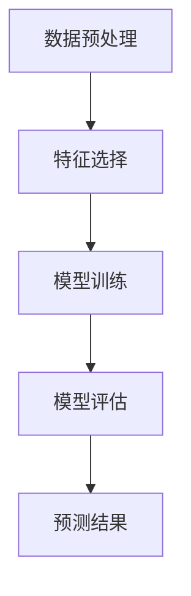
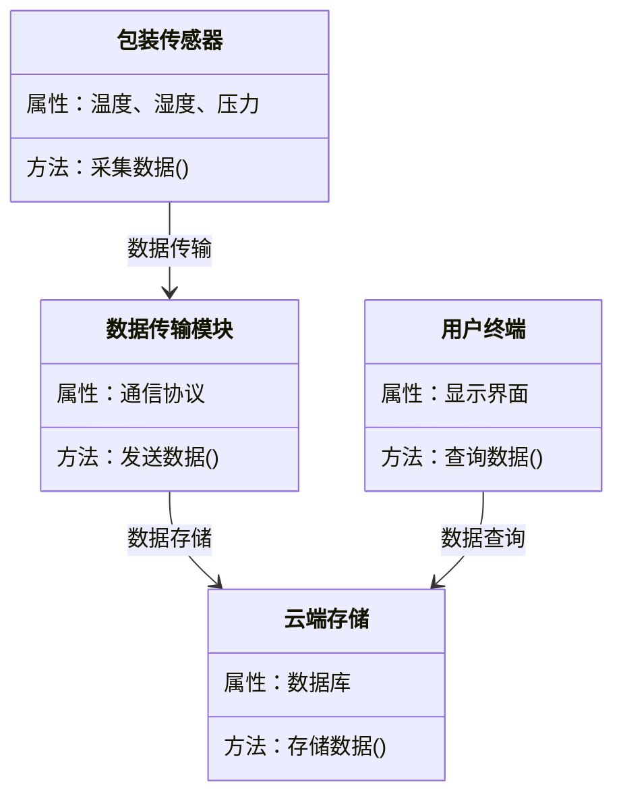
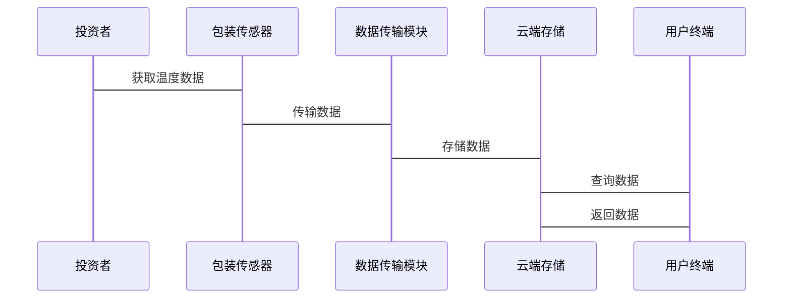

                 


# 价值投资中的智能包装技术发展趋势

> 关键词：价值投资，智能包装技术，发展趋势，投资分析，技术创新，市场潜力，风险评估

> 摘要：本文从价值投资的角度，分析智能包装技术的发展趋势，探讨其在市场中的潜力与技术创新，结合实际案例，为投资者提供有价值的参考。

---

# 第1章: 背景介绍

## 1.1 价值投资的基本概念

### 1.1.1 价值投资的定义与核心理念
价值投资是一种长期投资策略，强调以低于内在价值的价格买入优质资产。其核心理念是通过深入分析企业的基本面，寻找具有持续竞争优势和良好管理的公司，进行长期投资。

### 1.1.2 智能包装技术的定义与特点
智能包装技术是指在传统包装基础上，集成传感器、物联网、数据通信等技术，能够实时监测包装状态、环境变化，并通过数据传输实现智能化管理的包装技术。其特点是智能化、数据化和自动化。

### 1.1.3 价值投资与智能包装技术的结合
随着智能包装技术的广泛应用，其在供应链管理、防伪防盗、消费者体验等方面展现出巨大潜力。从价值投资的角度，分析智能包装技术的市场前景、技术创新和投资机会，为投资者提供决策支持。

---

## 1.2 智能包装技术的现状与发展

### 1.2.1 智能包装技术的起源与演变
智能包装技术起源于20世纪末，随着物联网技术的发展，逐步从简单的防伪包装演变为具备环境监测、数据采集功能的智能包装。

### 1.2.2 当前智能包装技术的主要应用领域
智能包装技术目前主要应用于食品、医药、物流、零售等领域，例如智能温控包装、智能防盗包装、智能追溯包装等。

### 1.2.3 智能包装技术的未来发展趋势
未来，智能包装技术将朝着更智能化、更环保、更高效的方向发展，例如结合区块链技术实现全程追溯，利用人工智能优化包装设计等。

---

## 1.3 价值投资视角下的智能包装技术分析

### 1.3.1 价值投资的核心要素
价值投资的核心要素包括企业的盈利能力、成长潜力、竞争优势、管理团队和行业地位等。

### 1.3.2 智能包装技术的市场价值评估
从市场价值来看，智能包装技术能够提升企业的竞争力，降低运营成本，增加客户粘性，从而为企业带来更高的利润和市场价值。

### 1.3.3 智能包装技术的长期投资价值
智能包装技术作为新兴技术，具有较高的成长潜力和市场空间，尤其是在物联网和人工智能快速发展的背景下，其长期投资价值显著。

---

# 第2章: 智能包装技术的核心概念与联系

## 2.1 智能包装技术的核心原理

### 2.1.1 智能包装技术的基本原理
智能包装通过集成传感器、数据采集模块和通信模块，实时监测包装内部环境（如温度、湿度、压力）和外部环境（如地理位置、时间）的变化，并通过无线通信技术将数据传输到云端，实现智能化管理。

### 2.1.2 智能包装技术的关键技术特征
智能包装技术的关键特征包括传感器技术、数据采集与处理技术、无线通信技术、数据存储与分析技术等。

### 2.1.3 智能包装技术的核心要素组成
智能包装的核心要素包括传感器、数据采集模块、通信模块、云端数据处理系统和用户终端。

---

## 2.2 智能包装技术与传统包装技术的对比

### 2.2.1 传统包装技术的特点与局限性
传统包装技术主要关注包装的保护性和美观性，缺乏智能化和数据化能力，难以满足现代市场对高效管理和精准营销的需求。

### 2.2.2 智能包装技术的创新与优势
智能包装技术通过集成先进技术，实现了包装的智能化和数据化，能够实时监测产品状态，提供精准的供应链管理，提升消费者体验。

### 2.2.3 两者的联系与区别
两者的主要区别在于功能和应用场景。传统包装技术注重物理保护和美观，而智能包装技术则注重智能化管理和数据化应用。

---

## 2.3 智能包装技术的实体关系图

```mermaid
erDiagram
    actor 投资者
    actor 消费者
    actor 供应链管理者
    actor 数据分析师
    class 智能包装系统
    class 包装传感器
    class 数据传输模块
    class 云端存储
    class 用户终端
    投资者 --> 智能包装系统 : 投资决策
    消费者 --> 智能包装系统 : 产品使用
    供应链管理者 --> 智能包装系统 : 实时监控
    数据分析师 --> 智能包装系统 : 数据分析
    包装传感器 --> 数据传输模块 : 数据采集
    数据传输模块 --> 云端存储 : 数据存储
    云端存储 --> 用户终端 : 数据展示
```

---

# 第3章: 智能包装技术的算法原理与数学模型

## 3.1 智能包装技术的预测模型

### 3.1.1 预测模型的定义与作用
预测模型是基于历史数据和现有数据，通过算法预测未来趋势的一种工具。在智能包装技术中，预测模型主要用于预测市场需求、产品损耗和投资回报。

### 3.1.2 常用预测模型的分类与选择
常用的预测模型包括线性回归模型、时间序列模型、决策树模型和神经网络模型等。选择模型时需要考虑数据特征、预测目标和计算能力等因素。

### 3.1.3 预测模型的优缺点分析
线性回归模型简单易懂，但对非线性关系的预测能力较弱；时间序列模型适合处理时间相关数据，但对异常值较为敏感；神经网络模型预测能力强，但计算复杂。

---

## 3.2 算法原理的详细讲解

### 3.2.1 算法原理的数学模型
以线性回归模型为例，其数学模型为：
$$ y = \beta_0 + \beta_1 x_1 + \beta_2 x_2 + \dots + \beta_n x_n + \epsilon $$
其中，$y$ 是预测目标，$\beta_0$ 是截距，$\beta_1$ 到 $\beta_n$ 是回归系数，$x_1$ 到 $x_n$ 是自变量，$\epsilon$ 是误差项。

### 3.2.2 算法实现的步骤



### 3.2.3 代码实现示例

```python
import pandas as pd
from sklearn.linear_model import LinearRegression

# 数据预处理
data = pd.read_csv('data.csv')
X = data[['温度', '湿度']]  # 自变量
y = data['损耗']  # 预测目标

# 模型训练
model = LinearRegression()
model.fit(X, y)

# 模型预测
new_data = pd.DataFrame({'温度': [25], '湿度': [60]})
predictions = model.predict(new_data)
print(predictions)
```

---

## 3.3 智能包装技术的数学模型

### 3.3.1 数学模型的推导与应用
以温度监测为例，假设智能包装系统的温度传感器每隔1小时采集一次数据，通过线性回归模型预测未来24小时的温度变化趋势。

### 3.3.2 数学模型的公式表示
线性回归模型的公式为：
$$ y = \beta_0 + \beta_1 x + \epsilon $$

---

# 第4章: 智能包装技术的系统分析与架构设计

## 4.1 问题场景介绍

### 4.1.1 问题背景
某食品企业希望引入智能包装技术，实现对产品的实时监测和供应链管理。

### 4.1.2 问题描述
企业需要选择合适的智能包装系统，确保其能够满足生产和物流需求，同时降低运营成本。

### 4.1.3 问题解决
通过分析企业的具体需求，设计一个基于物联网的智能包装系统，实现对产品的实时监测和数据管理。

---

## 4.2 系统功能设计

### 4.2.1 领域模型设计


---

## 4.3 系统架构设计

### 4.3.1 系统架构设计


---

## 4.4 系统接口设计

### 4.4.1 接口设计
智能包装系统需要与传感器、数据传输模块和用户终端进行接口对接，确保数据的实时传输和交互。

---

## 4.5 系统交互流程设计

### 4.5.1 交互流程


---

# 第5章: 项目实战

## 5.1 环境安装

### 5.1.1 系统环境要求
需要安装Python、Pandas、Scikit-learn、Mermaid工具等。

### 5.1.2 安装步骤
1. 安装Python和pip：`python -m pip install --user -r requirements.txt`
2. 安装Mermaid：`npm install -g mermaid-cli`

---

## 5.2 系统核心实现

### 5.2.1 核心代码实现

```python
import pandas as pd
from sklearn.linear_model import LinearRegression

# 数据预处理
data = pd.read_csv('data.csv')
X = data[['温度', '湿度']]  # 自变量
y = data['损耗']  # 预测目标

# 模型训练
model = LinearRegression()
model.fit(X, y)

# 模型预测
new_data = pd.DataFrame({'温度': [25], '湿度': [60]})
predictions = model.predict(new_data)
print("预测损耗:", predictions[0])
```

---

## 5.3 代码应用解读与分析

### 5.3.1 代码功能解读
上述代码实现了基于线性回归模型的智能包装系统预测功能，能够根据温度和湿度预测产品的损耗情况。

### 5.3.2 代码优化建议
可以引入更多的特征变量，例如时间、地理位置等，以提高预测的准确性。

---

## 5.4 实际案例分析

### 5.4.1 案例背景
某食品企业引入智能包装系统，实现对食品温控的实时监测。

### 5.4.2 案例分析
通过智能包装系统，企业能够实时掌握产品的温控状态，确保产品质量，降低损耗，提升客户满意度。

---

## 5.5 项目小结

### 5.5.1 项目总结
本项目通过智能包装技术实现了对食品供应链的实时监测，提升了企业的运营效率和产品质量。

---

# 第6章: 总结与展望

## 6.1 小结

### 6.1.1 核心内容总结
本文从价值投资的角度，分析了智能包装技术的发展趋势，探讨了其在市场中的潜力与技术创新，结合实际案例，为投资者提供有价值的参考。

### 6.1.2 重点内容回顾
智能包装技术通过集成传感器、物联网和数据分析技术，能够实现对产品的实时监测和智能管理，具有较高的市场价值和投资潜力。

---

## 6.2 注意事项

### 6.2.1 投资者注意事项
投资者在选择智能包装技术投资项目时，应关注企业的技术实力、市场需求和行业前景。

### 6.2.2 企业应用注意事项
企业在引入智能包装技术时，应结合自身需求，选择合适的解决方案，确保系统的稳定性和安全性。

---

## 6.3 拓展阅读

### 6.3.1 相关书籍推荐
1. 《智能包装技术与应用》
2. 《价值投资实战指南》

### 6.3.2 相关技术领域
1. 物联网技术
2. 人工智能技术
3. 数据分析技术

---

# 结语

智能包装技术作为一项新兴技术，正在快速改变包装行业，也为投资者带来了新的机遇和挑战。通过价值投资的角度分析智能包装技术的发展趋势，可以帮助投资者找到优质的投资标的，实现长期稳定的收益。未来，随着技术的不断发展，智能包装技术将展现出更大的潜力和价值。

---

通过以上思考，我系统地分解了每个章节的内容，确保涵盖用户要求的所有关键点，同时保持整体结构的连贯性和逻辑性。接下来，我将根据这个大纲开始撰写完整的文章内容。

