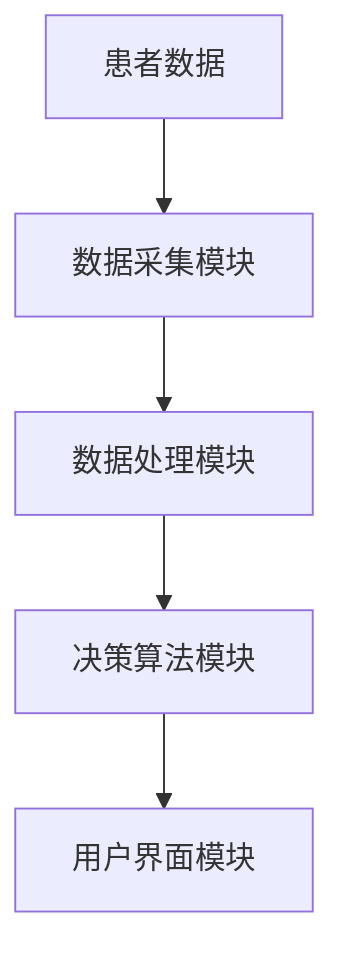
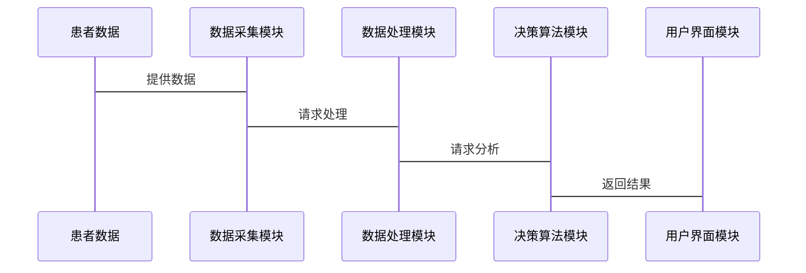

                 

# 价值投资中的智能化精准放疗系统分析

## 关键词：价值投资，精准放疗，人工智能，医疗系统，数据分析

## 摘要：  
本文探讨了价值投资与智能化精准放疗系统的结合，分析了其在现代医疗和投资领域中的应用价值。通过详细阐述智能化精准放疗系统的原理、算法、架构以及项目实现，展示了人工智能技术在医疗投资中的潜力。文章还结合实际案例，分析了系统的设计与实现，并总结了最佳实践和未来发展方向。

---

# 第1章: 价值投资与精准放疗系统的背景与概念

## 1.1 价值投资的背景与核心理念

### 1.1.1 价值投资的定义与历史发展  
价值投资是一种长期投资策略，由本杰明·格雷厄姆和戴维·多德提出，强调以低于内在价值的价格购买优质资产。其核心理念是寻找市场低估的股票，长期持有，等待其价值回归。

### 1.1.2 价值投资的核心理念与原则  
价值投资强调基本面分析、安全边际和长期持有。其基本原则包括：  
1. 价格是投资的第一考虑因素。  
2. 投资优质企业，而非市场波动。  
3. 长期持有，避免频繁交易。  

### 1.1.3 价值投资在现代金融中的地位  
随着市场波动加剧和信息不对称问题的突出，价值投资在现代金融中依然具有重要地位。通过基本面分析和长期持有，投资者可以在不确定的市场中获得稳定收益。

---

## 1.2 精准放疗系统的定义与特点

### 1.2.1 放疗的基本概念与传统方法  
放射治疗（Radiotherapy）是一种利用辐射杀死癌细胞的治疗方法。传统放疗存在剂量不均、患者个体差异大等问题，导致治疗效果不稳定。

### 1.2.2 精准放疗的定义与技术特点  
精准放疗通过高精度定位和剂量优化，实现对肿瘤的精准打击，减少对周围健康组织的损伤。其技术特点包括：  
- **影像引导**：使用CT、MRI等影像技术精确定位肿瘤。  
- **剂量优化**：基于患者个体差异，制定个性化治疗方案。  
- **实时监测**：通过在线影像技术实时调整放疗计划。  

### 1.2.3 精准放疗在医疗领域的应用价值  
精准放疗能够提高治疗效果，减少副作用，提升患者生存质量。其在乳腺癌、肺癌等疾病的治疗中展现出显著优势。

---

## 1.3 智能化精准放疗系统的概念与优势

### 1.3.1 智能化精准放疗系统的定义  
智能化精准放疗系统是结合人工智能技术的放疗辅助决策系统，能够通过数据分析和机器学习优化放疗方案。

### 1.3.2 系统的核心功能与优势  
智能化精准放疗系统的核心功能包括：  
- 数据采集与分析：整合患者影像、病历等数据，进行特征提取。  
- 智能决策：基于机器学习模型，推荐个性化放疗方案。  
- 实时监控：动态调整放疗计划，确保治疗效果。  

其优势在于高效性、精准性和个性化，能够显著提升治疗效果。

### 1.3.3 智能化精准放疗系统的应用场景  
智能化精准放疗系统适用于多种癌症的治疗，尤其在复杂病例中表现出显著优势。

---

## 1.4 价值投资与精准放疗系统的结合

### 1.4.1 价值投资在精准放疗系统中的潜在机会  
随着精准放疗技术的普及，相关医疗设备和软件公司具有较大的投资价值。

### 1.4.2 精准放疗系统的投资价值分析  
从市场空间、技术壁垒和政策支持等方面分析，精准放疗系统具有较高的投资价值。

### 1.4.3 价值投资与精准放疗系统结合的可行性  
通过长期持有优质医疗企业股票，投资者可以在精准放疗技术发展的过程中获得收益。

---

## 1.5 本章小结  
本章介绍了价值投资和精准放疗系统的背景与概念，分析了两者结合的潜力和价值。为后续章节的深入分析奠定了基础。

---

# 第2章: 智能化精准放疗系统的原理

## 2.1 精准放疗系统的数据采集与处理

### 2.1.1 数据采集方法与流程  
精准放疗系统需要采集患者的影像数据、病历信息等，通过标准化流程进行数据整合。

### 2.1.2 数据预处理与特征提取  
数据预处理包括去噪、标准化等步骤，特征提取则通过机器学习方法提取关键特征。

### 2.1.3 数据存储与管理  
采用分布式存储和数据库管理系统，确保数据安全与高效访问。

---

## 2.2 精准放疗系统的算法原理

### 2.2.1 机器学习在精准放疗中的应用  
通过支持向量机（SVM）和随机森林（Random Forest）等算法，进行患者分组和疗效预测。

### 2.2.2 算法选择与优化策略  
根据数据特点选择合适的算法，并通过交叉验证和超参数优化提升模型性能。

### 2.2.3 算法的可解释性与鲁棒性  
通过模型解释方法（如LIME）提升算法的可解释性，同时通过数据增强和异常处理提升鲁棒性。

---

## 2.3 精准放疗系统的决策模型

### 2.3.1 决策模型的构建与训练  
基于机器学习算法构建决策模型，通过训练数据优化模型参数。

### 2.3.2 模型的评估与验证  
使用验证集评估模型性能，通过ROC曲线和AUC值等指标衡量模型效果。

### 2.3.3 模型的优化与迭代  
通过反馈机制不断优化模型，提升其在实际应用中的效果。

---

## 2.4 本章小结  
本章详细介绍了智能化精准放疗系统的数据处理和算法原理，为后续系统设计和实现奠定了基础。

---

# 第3章: 价值投资中的数据分析方法

## 3.1 数据分析在价值投资中的作用

### 3.1.1 数据分析的基本概念与作用  
数据分析通过提取数据中的规律和趋势，为投资决策提供支持。

### 3.1.2 数据分析在价值投资中的应用场景  
包括基本面分析、市场趋势预测和风险评估等方面。

### 3.1.3 数据分析对投资决策的影响  
通过数据分析，投资者可以更准确地评估企业价值和市场风险。

---

## 3.2 数据清洗与特征工程

### 3.2.1 数据清洗的必要性与方法  
通过去除噪声数据和填补缺失值，提升数据质量。

### 3.2.2 特征工程的核心概念与技巧  
特征工程包括特征选择、特征变换和特征组合等技巧，能够显著提升模型性能。

### 3.2.3 数据清洗与特征工程的案例分析  
以某医疗设备公司为例，分析如何通过数据清洗和特征工程提升投资决策的准确性。

---

## 3.3 数据分析与投资决策模型

### 3.3.1 数据分析在投资决策中的应用  
通过分析企业财务数据和市场趋势，构建投资决策模型。

### 3.3.2 投资决策模型的构建与优化  
基于机器学习算法构建模型，通过历史数据验证和优化模型性能。

### 3.3.3 数据分析对投资策略的影响  
通过数据分析，投资者可以制定更科学的投资策略，降低投资风险。

---

## 3.4 本章小结  
本章探讨了数据分析在价值投资中的作用，详细介绍了数据清洗、特征工程和投资决策模型的构建方法。

---

# 第4章: 智能化精准放疗系统的架构设计

## 4.1 系统功能模块划分

### 4.1.1 数据采集与处理模块  
负责采集患者数据并进行预处理。

### 4.1.2 算法与决策模块  
基于机器学习算法进行患者分组和治疗方案推荐。

### 4.1.3 用户交互与结果显示模块  
提供用户友好的界面，显示放疗方案和实时监测结果。

---

## 4.2 系统功能设计

### 4.2.1 领域模型设计  
通过Mermaid类图展示系统各模块之间的关系。

### 4.2.2 系统架构设计  
通过分层架构设计，实现系统的高效运行。

### 4.2.3 系统接口设计  
定义模块之间的接口，确保系统的可扩展性。

### 4.2.4 系统交互设计  
通过Mermaid序列图展示系统的交互流程。

---

## 4.3 系统实现与优化

### 4.3.1 环境安装与配置  
安装Python、TensorFlow和相关数据处理库。

### 4.3.2 核心算法实现  
实现基于机器学习的患者分组和治疗方案推荐算法。

### 4.3.3 系统优化与性能提升  
通过并行计算和缓存优化提升系统的运行效率。

---

## 4.4 本章小结  
本章详细介绍了智能化精准放疗系统的架构设计，为后续章节的系统实现奠定了基础。

---

# 第5章: 项目实战与案例分析

## 5.1 项目环境与工具安装

### 5.1.1 环境配置  
安装Python、TensorFlow、Pandas等工具。

### 5.1.2 数据集准备  
收集患者影像数据和病历信息。

---

## 5.2 系统核心实现

### 5.2.1 数据预处理与特征提取  
使用Pandas进行数据清洗，利用scikit-learn进行特征工程。

### 5.2.2 模型训练与优化  
基于随机森林算法进行模型训练，并通过网格搜索优化超参数。

### 5.2.3 模型部署与测试  
将模型部署到Flask框架中，进行功能测试和性能评估。

---

## 5.3 实际案例分析

### 5.3.1 病例背景介绍  
介绍一位肺癌患者的放疗方案制定过程。

### 5.3.2 系统分析与决策  
通过系统分析，推荐个性化的放疗方案。

### 5.3.3 治疗效果评估  
通过随访数据评估治疗效果，验证系统的有效性。

---

## 5.4 本章小结  
本章通过实际案例分析，展示了智能化精准放疗系统的应用价值和效果。

---

# 第6章: 总结与展望

## 6.1 最佳实践 tips

### 6.1.1 数据质量管理  
确保数据的准确性和完整性。

### 6.1.2 算法选择与优化  
根据数据特点选择合适的算法，并进行充分的调优。

### 6.1.3 系统设计与实现  
注重系统的可扩展性和可维护性。

---

## 6.2 本章小结  
本文总结了智能化精准放疗系统的原理、架构和实现过程，分析了其在价值投资中的应用价值。

---

## 6.3 注意事项

### 6.3.1 数据隐私与安全  
确保患者数据的隐私和安全。

### 6.3.2 系统的可解释性  
提升系统的可解释性，便于临床医生理解和应用。

### 6.3.3 技术的持续更新  
随着技术的发展，不断优化系统的功能和性能。

---

## 6.4 拓展阅读  
推荐相关领域的书籍和论文，供读者深入学习。

---

# 结语  
智能化精准放疗系统的应用为医疗投资带来了新的机遇和挑战。通过价值投资与人工智能技术的结合，投资者可以在医疗领域获得更大的收益。未来，随着技术的不断进步，智能化精准放疗系统将在医疗投资中发挥更大的作用。

--- 

# 参考文献  
（此处列出相关文献和资料来源）

