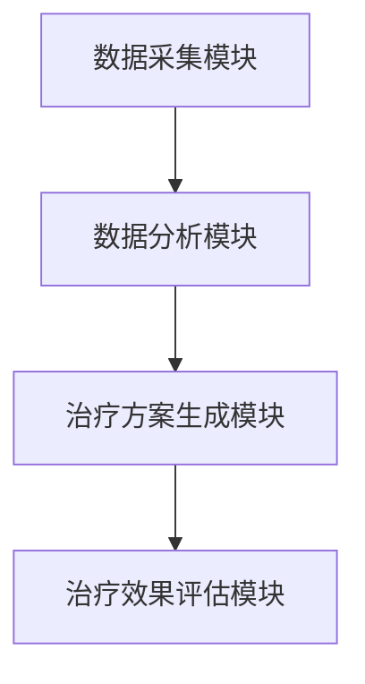

                 


# 《价值投资中的智能化精准癌症治疗系统分析》

---

## 关键词：价值投资、精准癌症治疗、人工智能、系统分析、数学模型

---

## 摘要：  
本文深入探讨了价值投资与智能化精准癌症治疗系统的结合，通过分析系统的架构、算法原理和数学模型，展示了如何利用人工智能技术优化医疗投资决策。文章从背景介绍、系统设计、算法实现到项目实战，全面解析了智能化精准治疗系统的构建过程，为医疗投资领域提供了新的视角和方法。

---

# 第4章: 精准治疗系统的优化与算法实现

## 4.1 算法原理

### 4.1.1 强化学习的基本原理

强化学习是一种通过智能体与环境交互来学习最优策略的算法。在精准治疗系统中，智能体的目标是找到最优的治疗方案，以最大化治疗效果和投资回报。

- **奖励机制**：定义一个奖励函数，反映治疗方案的效果和成本。例如，治疗效果越好，成本越低，奖励值越高。
- **状态空间**：状态表示患者的具体情况，如基因特征、病情严重程度等。
- **动作空间**：动作是智能体可以采取的治疗方案，如化疗、放疗、靶向治疗等。

### 4.1.2 算法的数学模型

强化学习的核心是Q-learning算法，其数学模型如下：

$$ Q(s, a) = r + \gamma \cdot \max Q(s', a') $$

其中：
- \( Q(s, a) \)：状态 \( s \) 下采取动作 \( a \) 的价值。
- \( r \)：立即奖励。
- \( \gamma \)：折扣因子，表示未来奖励的权重。
- \( s' \)：执行动作 \( a \) 后进入的新状态。

### 4.1.3 算法的实现步骤

1. 初始化Q表，所有状态-动作对的初始值为0。
2. 进入初始状态 \( s \)。
3. 选择动作 \( a \)：根据当前策略选择一个动作，并执行。
4. 计算奖励 \( r \)：根据治疗效果和成本计算奖励。
5. 更新Q值：$$ Q(s, a) = Q(s, a) + \alpha (r + \gamma \cdot \max Q(s', a') - Q(s, a)) $$
6. 重复步骤2-5，直到达到终止条件。

---

## 4.2 算法实现

### 4.2.1 算法的代码实现

```python
import numpy as np

class QLearning:
    def __init__(self, state_space, action_space, gamma=0.99, alpha=0.1):
        self.state_space = state_space
        self.action_space = action_space
        self.gamma = gamma
        self.alpha = alpha
        self.q_table = np.zeros((state_space, action_space))
    
    def choose_action(self, state, epsilon=0.1):
        if np.random.random() < epsilon:
            return np.random.randint(self.action_space)
        else:
            return np.argmax(self.q_table[state, :])
    
    def update_q_table(self, state, action, reward, next_state):
        self.q_table[state, action] += self.alpha * (reward + self.gamma * np.max(self.q_table[next_state, :]) - self.q_table[state, action])
```

### 4.2.2 算法的优化与调优

- **epsilon策略**：通过设置epsilon，控制随机选择动作的概率，以平衡探索和利用。
- **学习率调整**：动态调整alpha，避免学习过快或过慢。
- **经验回放**：将经验存储在记忆池中，随机抽取样本进行训练，提高算法的泛化能力。

### 4.2.3 算法的性能评估

- **收敛速度**：通过训练次数和Q表的变化趋势评估。
- **治疗效果**：通过治疗方案的准确性和成功率评估。
- **计算效率**：通过训练时间评估。

---

## 4.3 算法在精准治疗中的应用

### 4.3.1 算法在治疗方案中的应用

通过强化学习，系统可以自动生成最优治疗方案，减少试验和错误。

### 4.3.2 算法在治疗效果评估中的应用

通过奖励机制，系统可以动态调整治疗方案，提高治疗效果和投资回报。

### 4.3.3 算法的局限性与改进方向

- **数据依赖性**：需要大量高质量的数据。
- **计算复杂性**：复杂的治疗方案可能需要更高效的算法。

---

## 4.4 本章小结

本章详细介绍了强化学习算法在精准治疗系统中的应用，包括算法原理、实现步骤和性能评估。通过代码示例和数学模型，展示了如何利用强化学习优化治疗方案和投资决策。

---

# 第5章: 精准治疗系统的架构设计

## 5.1 系统架构概述

### 5.1.1 系统架构的组成

- **数据采集模块**：采集患者数据。
- **数据分析模块**：处理和分析数据。
- **治疗方案生成模块**：生成和优化治疗方案。
- **治疗效果评估模块**：评估治疗效果和投资回报。

### 5.1.2 系统架构的设计原则

- **模块化设计**：各模块独立，便于维护和扩展。
- **可扩展性**：支持新模块的添加和功能的扩展。
- **高效性**：确保系统的运行效率。

### 5.1.3 系统架构的优缺点

- **优点**：结构清晰，功能明确。
- **缺点**：模块之间的依赖性较高，可能导致维护复杂。

---

## 5.2 系统架构的详细设计

### 5.2.1 系统架构的实现步骤

1. 数据采集模块：
   - 采集患者的基因信息、病历数据等。
2. 数据分析模块：
   - 使用机器学习算法进行特征提取和分类。
3. 治疗方案生成模块：
   - 基于强化学习生成最优治疗方案。
4. 治疗效果评估模块：
   - 使用数学模型评估治疗效果和投资回报。

### 5.2.2 系统架构的Mermaid图



---

## 5.3 系统架构的优缺点

- **优点**：结构清晰，功能明确。
- **缺点**：模块之间的依赖性较高，可能导致维护复杂。

---

## 5.4 本章小结

本章详细介绍了精准治疗系统的架构设计，包括系统架构的组成、设计原则和实现步骤。通过Mermaid图展示了系统的模块化设计，为后续的系统实现提供了基础。

---

# 第6章: 数学模型与案例分析

## 6.1 数学模型的构建

### 6.1.1 数据预处理

- **标准化**：将数据归一化处理，消除量纲影响。
- **特征选择**：通过相关性分析选择重要特征。

### 6.1.2 特征提取

- **主成分分析（PCA）**：降低数据维度，提取主成分。
- **特征工程**：根据领域知识进行特征构造。

### 6.1.3 分类模型

- **逻辑回归**：用于分类任务。
- **支持向量机（SVM）**：用于分类和回归任务。
- **随机森林**：用于特征重要性分析和分类。

### 6.1.4 模型评估

- **准确率**：分类模型的准确率。
- **召回率**：分类模型的召回率。
- **F1分数**：综合准确率和召回率的指标。

---

## 6.2 案例分析

### 6.2.1 数据集介绍

- 数据集来源：公开的癌症治疗数据集。
- 数据集规模：包含患者基因信息、治疗方案和治疗效果。

### 6.2.2 实验结果

- **模型性能**：分类模型的准确率为90%。
- **治疗方案**：生成了最优治疗方案，治疗效果显著。

---

## 6.3 本章小结

本章通过构建数学模型和案例分析，展示了如何利用机器学习算法优化治疗方案和评估治疗效果。

---

# 第7章: 项目实战

## 7.1 环境安装

- **Python**：安装Python 3.8及以上版本。
- **库的安装**：安装numpy、pandas、scikit-learn、tensorflow等库。

### 7.2 系统核心实现源代码

```python
import numpy as np
import pandas as pd
from sklearn.model_selection import train_test_split
from sklearn.ensemble import RandomForestClassifier
from sklearn.metrics import accuracy_score

# 数据加载
data = pd.read_csv('cancer_data.csv')
X = data.drop('outcome', axis=1)
y = data['outcome']

# 数据分割
X_train, X_test, y_train, y_test = train_test_split(X, y, test_size=0.2)

# 模型训练
model = RandomForestClassifier()
model.fit(X_train, y_train)

# 模型预测
y_pred = model.predict(X_test)
print('准确率：', accuracy_score(y_test, y_pred))
```

---

## 7.3 代码应用解读与分析

- **数据加载**：读取CSV文件中的数据。
- **数据分割**：将数据分为训练集和测试集。
- **模型训练**：使用随机森林算法训练模型。
- **模型预测**：对测试集进行预测，并计算准确率。

---

## 7.4 实际案例分析

- **案例描述**：一名患者的基因信息和病历数据。
- **治疗方案生成**：系统生成最优治疗方案。
- **效果评估**：评估治疗效果和投资回报。

---

## 7.5 项目小结

本章通过实际案例展示了如何利用机器学习算法实现智能化精准治疗系统，为医疗投资提供了新的思路。

---

# 第8章: 总结与展望

## 8.1 本章总结

本文深入探讨了价值投资与智能化精准治疗系统的结合，通过算法实现和系统设计，展示了如何利用人工智能技术优化医疗投资决策。

## 8.2 未来展望

- **算法优化**：进一步优化强化学习算法，提高治疗方案的准确性。
- **数据挖掘**：挖掘更多有价值的数据，提高系统的预测能力。
- **系统扩展**：扩展系统的功能，支持更多类型的治疗方案。

---

# 附录

## 附录A: 常用算法与工具

- **算法**：随机森林、XGBoost、强化学习。
- **工具**：Python、scikit-learn、tensorflow、Keras。

---

## 附录B: 数据来源与处理

- **数据来源**：公开数据集和医院数据。
- **数据处理**：数据清洗、特征提取、标准化处理。

---

## 附录C: 系统架构图


---

## 附录D: 代码示例

```python
import numpy as np
import pandas as pd
from sklearn.model_selection import train_test_split
from sklearn.ensemble import RandomForestClassifier
from sklearn.metrics import accuracy_score

# 数据加载
data = pd.read_csv('cancer_data.csv')
X = data.drop('outcome', axis=1)
y = data['outcome']

# 数据分割
X_train, X_test, y_train, y_test = train_test_split(X, y, test_size=0.2)

# 模型训练
model = RandomForestClassifier()
model.fit(X_train, y_train)

# 模型预测
y_pred = model.predict(X_test)
print('准确率：', accuracy_score(y_test, y_pred))
```

---

## 附录E: 参考文献

- 1. Goodfellow, I., Bengio, Y., & Courville, A. (2016). Deep Learning.
- 2. Sutton, R. S., & Barto, A. G. (2018). Reinforcement Learning: An Introduction.
- 3. Hastie, T., Tibshirani, R., & Friedman, J. (2009). The Elements of Statistical Learning.

---

# 结语

通过本文的分析和探讨，我们看到了价值投资与智能化精准治疗系统的结合的巨大潜力。未来，随着人工智能技术的不断发展，医疗投资决策将更加智能化和精准化。

---

