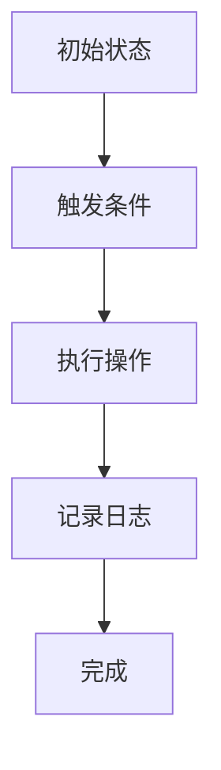
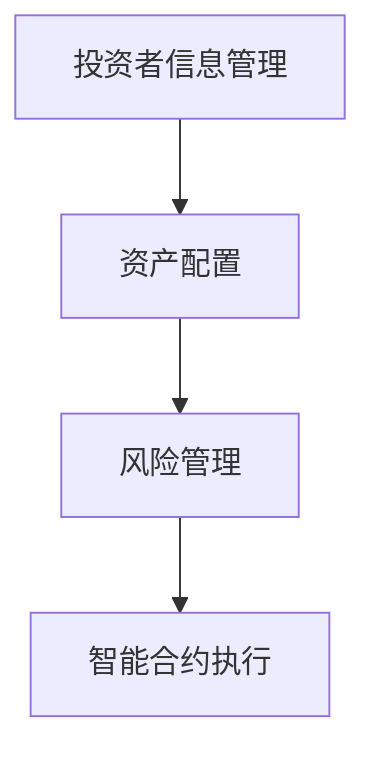

                 


# 价值投资中的智能合约应用前景

## 关键词：智能合约、价值投资、区块链、金融创新、风险管理、分布式 ledger

## 摘要：  
智能合约作为区块链技术的核心组件，正在逐步改变金融行业的运作方式。本文将深入探讨智能合约在价值投资中的应用前景，分析其在金融交易、风险管理、资产托管等领域的潜在价值。通过结合实际案例，本文将展示如何利用智能合约实现透明、高效和安全的投资流程，为投资者和金融机构提供新的解决方案。

---

# 第一部分: 智能合约与价值投资的背景介绍

## 第1章: 智能合约的定义与价值投资的背景

### 1.1 智能合约的定义

#### 1.1.1 智能合约的基本概念  
智能合约是一种基于区块链技术的自动执行合同，能够在满足特定条件时自动执行交易或操作。它通过代码实现合同的履行，无需中介干预，具有去中心化、透明和不可篡改的特点。

#### 1.1.2 智能合约的核心属性  
- **自动执行性**：一旦触发条件，智能合约自动执行预设操作。  
- **去中心化**：运行在区块链上，避免单点故障和中心化机构的干预。  
- **透明性**：所有交易记录在区块链上，可公开查询。  
- **不可篡改性**：数据一旦写入区块链，无法被修改或删除。

#### 1.1.3 智能合约与传统合约的区别  
| 属性 | 智能合约 | 传统合约 |  
|------|----------|----------|  
| 执行方式 | 自动化 | 需人工执行 |  
| 信任依赖 | 基于区块链的透明性和安全性 | 基于信任和法律约束 |  
| 成本 | 低 | 高（需律师、公证等） |  

---

### 1.2 价值投资的背景与现状

#### 1.2.1 价值投资的基本概念  
价值投资是一种投资策略，通过分析企业的基本面（如财务状况、行业地位、盈利能力等），寻找被市场低估的股票进行投资。其核心在于长期持有优质资产，而非短期波动。

#### 1.2.2 传统价值投资的局限性  
- **信息不对称**：投资者难以全面掌握企业的经营状况。  
- **交易成本高**：包括佣金、税费等，增加了投资成本。  
- **执行风险**：依赖中介机构执行交易，存在道德风险和操作失误的可能性。  

#### 1.2.3 智能合约在价值投资中的潜在优势  
- **降低交易成本**：通过智能合约自动执行交易，减少中介费用。  
- **提高透明度**：所有交易记录在区块链上，投资者可以实时追踪资产状态。  
- **增强安全性**：智能合约的自动执行性和不可篡改性降低了人为操作风险。  

---

## 第2章: 智能合约与价值投资的结合

### 2.1 智能合约在金融领域的应用

#### 2.1.1 智能合约在金融交易中的作用  
智能合约可以用于自动执行股票、债券等金融资产的买卖交易，确保交易按照预设条件自动完成，减少人为干预和延迟。

#### 2.1.2 智能合约在风险管理中的应用  
通过智能合约，投资者可以设定风险预警机制，当市场波动超过预设阈值时，自动触发止损或止盈操作。

#### 2.1.3 智能合约在资产托管中的价值  
智能合约可以用于资产托管，确保托管资产的安全性和流动性。例如，当托管资产达到一定价值时，自动释放部分资产用于流动性管理。

### 2.2 价值投资中的智能合约应用场景

#### 2.2.1 股权投资中的智能合约应用  
智能合约可以用于股权投资的自动分配和转让。例如，当企业达到特定的财务指标时，自动分配收益给投资者。

#### 2.2.2 债券投资中的智能合约应用  
智能合约可以用于债券的自动发行和到期兑付。例如，当债券到期时，智能合约自动将本金和利息支付给债券持有人。

#### 2.2.3 资产配置中的智能合约优化  
智能合约可以根据市场变化自动调整资产配置比例，优化投资组合的风险收益比。

---

## 第3章: 智能合约的核心概念与联系

### 3.1 智能合约的核心原理

#### 3.1.1 智能合约的工作流程  
1. **触发条件**：智能合约根据预设的条件（如时间、价格、事件等）启动执行。  
2. **执行操作**：智能合约根据预设的逻辑自动完成交易、转账或其他操作。  
3. **记录日志**：所有操作记录在区块链上，确保可追溯性和透明性。  

#### 3.1.2 智能合约的执行机制  
智能合约的执行基于区块链的共识机制（如PoW、PoS等），确保所有参与者对合约的执行结果达成一致。

#### 3.1.3 智能合约的不可篡改性  
智能合约一旦部署到区块链上，就不能被修改或删除，确保了合约的可信性和安全性。

### 3.2 智能合约与价值投资的关联

#### 3.2.1 智能合约如何保障投资收益  
智能合约可以通过预设的条件和逻辑，确保投资收益的自动分配和最大化。

#### 3.2.2 智能合约如何降低投资风险  
智能合约可以通过预设的风险控制机制（如止损、止盈），自动规避市场波动带来的风险。

#### 3.2.3 智能合约如何提高投资效率  
智能合约可以自动化处理投资流程，减少人工干预和时间成本，提高投资效率。

---

## 第4章: 智能合约的算法原理与数学模型

### 4.1 智能合约的算法原理

#### 4.1.1 智能合约的状态机模型  
状态机模型描述了智能合约在不同状态之间的转移过程。例如，当价格达到预设阈值时，智能合约从“待执行”状态转移到“执行中”状态。

#### 4.1.2 智能合约的条件判断逻辑  
智能合约根据预设的条件（如价格、时间等）执行不同的操作。例如，当价格高于某个值时，执行买入操作。

#### 4.1.3 智能合约的执行流程图  
以下是智能合约的执行流程图：



---

### 4.2 智能合约的数学模型与公式

#### 4.2.1 智能合约的状态转移方程  
状态转移方程描述了智能合约在不同状态之间的转移关系。例如：

$$ S_{t+1} = f(S_t, C_t) $$

其中，$S_t$ 表示第 $t$ 个状态，$C_t$ 表示第 $t$ 个条件，$f$ 是状态转移函数。

#### 4.2.2 智能合约的条件判断公式  
条件判断公式用于确定智能合约是否执行某个操作。例如：

$$ \text{如果 } P > P_{\text{threshold}}, \text{执行买入操作} $$

其中，$P$ 是当前价格，$P_{\text{threshold}}$ 是预设的阈值。

#### 4.2.3 智能合约的执行时间计算  
智能合约的执行时间取决于区块链的共识机制和网络状况。例如，在PoW机制下，交易确认时间通常为10分钟，而在PoS机制下，确认时间可以缩短到几秒钟。

---

## 第5章: 价值投资中的智能合约系统架构

### 5.1 价值投资系统的功能设计

#### 5.1.1 投资者信息管理模块  
用于管理投资者的身份信息、投资权限和投资额度。

#### 5.1.2 资产配置模块  
根据市场变化和投资者风险偏好，自动调整资产配置比例。

#### 5.1.3 风险管理模块  
设定风险预警机制，自动触发止损或止盈操作。

### 5.2 系统架构设计

#### 5.2.1 系统功能设计  
以下是系统的功能模块图：



---

## 第6章: 项目实战

### 6.1 环境安装

#### 6.1.1 安装区块链环境  
选择一个适合的区块链平台（如Ethereum、Hyperledger等），并安装相应的开发环境。

#### 6.1.2 安装智能合约开发工具  
安装Solidity（以太坊智能合约开发语言）和 Remix（智能合约开发环境）。

### 6.2 系统核心实现源代码

#### 6.2.1 智能合约代码实现  
以下是智能合约的Solidity代码示例：

```solidity
// SPDX-License-Identifier: MIT
pragma solidity ^0.8.0;

contract InvestmentContract {
    address payable public investor;
    uint256 public investmentAmount;
    uint256 public investmentDuration;

    constructor(address payable _investor, uint256 _investmentAmount, uint256 _investmentDuration) {
        investor = _investor;
        investmentAmount = _investmentAmount;
        investmentDuration = _investmentDuration;
    }

    function withdraw() public {
        require(block.timestamp >= investmentDuration, "Investment not yet matured");
        investor.transfer(investmentAmount);
    }
}
```

#### 6.2.2 智能合约功能解读  
上述代码实现了一个简单的投资合约，投资者在投资期限届满后可以自动提取投资金额。

### 6.3 实际案例分析

#### 6.3.1 案例背景  
假设某投资者投资100万元，投资期限为1年。智能合约将在1年后自动将投资金额返还给投资者。

#### 6.3.2 智能合约执行流程  
1. 投资者部署智能合约，设置投资金额和期限。  
2. 投资期限届满时，智能合约自动触发提现操作，将资金转入投资者账户。

---

## 第7章: 最佳实践

### 7.1 小结

- 智能合约在价值投资中的应用前景广阔，能够显著提高投资效率和安全性。  
- 通过智能合约，投资者可以实现自动化的投资流程，降低交易成本和风险。

### 7.2 注意事项

- 智能合约的编写和部署需要专业的技术知识，避免代码错误导致的损失。  
- 投资者应选择可靠的区块链平台和开发团队，确保智能合约的安全性和稳定性。

### 7.3 拓展阅读

- 推荐阅读《区块链技术及应用》和《智能合约开发实战》，深入了解智能合约的原理和应用。  
- 关注行业动态，了解智能合约在金融领域的最新进展。

---

# 结语

智能合约作为区块链技术的核心应用，正在逐步改变金融行业的运作方式。通过本文的分析，我们可以看到智能合约在价值投资中的巨大潜力，它不仅能够提高投资效率，还能降低投资风险。未来，随着区块链技术的不断发展，智能合约将在金融领域发挥更重要的作用。

