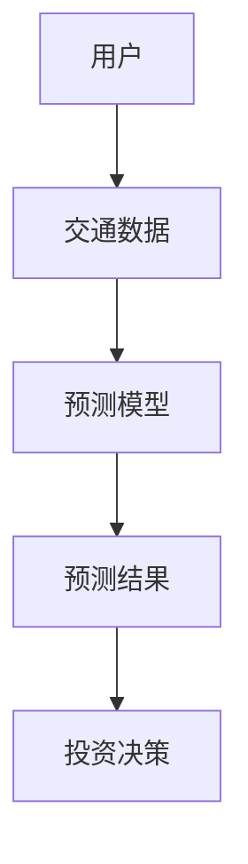
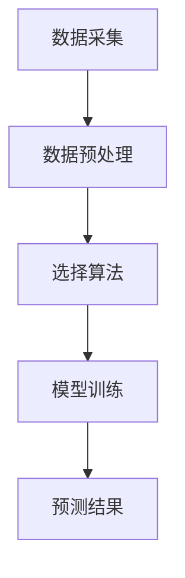
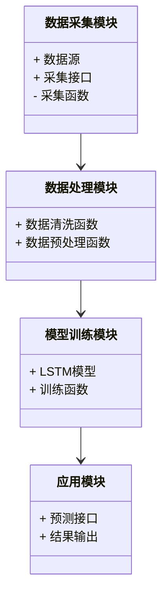
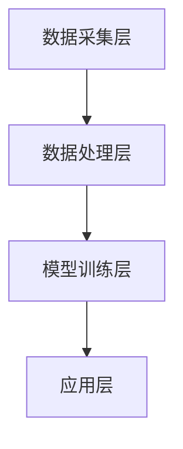

                 


# 价值投资中的智能城市交通流量预测系统分析

## 关键词
智能城市, 交通流量预测, 价值投资, 机器学习, 时间序列分析, LSTM, ARIMA

## 摘要
在现代城市化进程中，交通流量预测已成为智能城市规划和管理的关键环节。本文从价值投资的角度，深入分析智能城市交通流量预测系统的核心技术与应用。通过介绍系统的背景、核心概念、算法原理、系统架构，结合实际案例，详细解读如何利用先进的数据处理技术和算法模型，实现交通流量的精准预测，并为价值投资提供数据支持。文章最后总结了系统的最佳实践和未来发展方向。

---

# 第1章: 价值投资与智能城市交通流量预测系统背景

## 1.1 价值投资的基本概念

### 1.1.1 价值投资的定义
价值投资是一种投资策略，强调通过深入分析企业的基本面，寻找被市场低估的投资标的。其核心在于长期持有优质资产，追求稳定且可持续的收益。

### 1.1.2 价值投资的核心理念
价值投资的核心理念包括：
1. **安全边际**：买入价格低于内在价值，确保投资的安全性。
2. **长期视角**：关注企业的长期盈利能力，而非短期市场波动。
3. **深入分析**：通过财务数据、行业趋势等多维度分析，评估企业的投资价值。

### 1.1.3 价值投资与现代技术的结合
随着大数据和人工智能技术的发展，价值投资逐步融入技术驱动的分析方法，如利用交通流量数据预测城市交通状况，进而影响房地产、零售等行业的投资决策。

---

## 1.2 智能城市交通流量预测系统的背景

### 1.2.1 智能城市的定义与特点
智能城市是通过物联网、大数据、人工智能等技术，实现城市基础设施和服务的智能化管理，提升城市运行效率和居民生活质量。

### 1.2.2 交通流量预测的重要性
交通流量预测是智能交通管理的重要组成部分，能够帮助城市优化交通规划、减少拥堵、提升道路使用效率。

### 1.2.3 价值投资与交通流量预测的关联
交通流量预测为投资者提供了城市交通状况的动态数据，影响着商业地产、零售业等领域的投资决策。通过预测交通流量的变化，投资者可以更精准地评估相关资产的未来价值。

---

## 1.3 问题背景与描述

### 1.3.1 交通流量预测的挑战
1. 数据的多样性与实时性要求高。
2. 交通流量受到多种因素影响，如天气、节假日、突发事件等。
3. 数据量大，需要高效的计算能力。

### 1.3.2 价值投资中的交通流量预测需求
投资者需要基于交通流量数据，评估特定区域的商业潜力，优化投资组合。

### 1.3.3 问题解决的必要性
通过准确的交通流量预测，投资者能够更科学地进行决策，降低投资风险。

---

## 1.4 系统的边界与外延

### 1.4.1 系统的边界定义
系统专注于交通流量预测，不涉及城市规划的具体实施，但与交通管理、商业地产等领域密切相关。

### 1.4.2 系统的外延与扩展
系统可以通过接口与其他城市管理系统集成，如交通信号灯控制、智能停车系统等。

### 1.4.3 系统与外部环境的交互
系统通过数据采集设备、数据库接口与外部环境交互，获取实时数据并输出预测结果。

---

## 1.5 核心概念与组成要素

### 1.5.1 核心概念的定义
1. **数据采集**：实时收集交通流量数据。
2. **模型训练**：利用机器学习算法建立预测模型。
3. **结果应用**：将预测结果应用于投资决策。

### 1.5.2 组成要素的分析
1. 数据采集设备：如摄像头、传感器。
2. 数据处理平台：负责数据清洗和预处理。
3. 预测模型：如ARIMA、LSTM等。
4. 应用接口：与其他系统或投资者进行数据交互。

---

## 1.6 系统架构的核心要素

### 1.6.1 数据采集层
负责实时采集交通流量数据，包括车流量、车速等。

### 1.6.2 数据处理层
对数据进行清洗、转换和存储，为模型训练提供高质量数据。

### 1.6.3 模型训练层
利用机器学习算法训练预测模型，并进行模型优化。

### 1.6.4 应用层
将预测结果应用于交通管理或投资决策，提供可视化界面供投资者使用。

---

# 第2章: 智能城市交通流量预测系统的核心概念与联系

## 2.1 核心概念原理

### 2.1.1 数据采集与处理
1. 数据采集：通过传感器或摄像头获取交通流量数据。
2. 数据清洗：去除噪声数据，确保数据准确性。

### 2.1.2 模型建立与训练
选择合适的算法，如ARIMA或LSTM，训练预测模型。

### 2.1.3 预测结果的分析与应用
将预测结果用于交通管理或投资决策，优化城市交通规划。

---

## 2.2 核心概念属性特征对比表

| 核心概念 | 数据特征 | 模型特征 | 预测结果特征 |
|----------|----------|----------|--------------|
| 数据采集 | 实时性、多样性 | 简单性、可扩展性 | 准确性、可解释性 |
| 模型训练 | 数据量大、维度高 | 算法复杂性高 | 预测精度高 |

---

## 2.3 ER实体关系图



---

# 第3章: 智能城市交通流量预测系统的算法原理

## 3.1 算法原理概述

### 3.1.1 时间序列分析
时间序列分析是一种统计方法，用于预测基于时间数据的变化趋势。

#### 3.1.1.1 ARIMA模型
ARIMA（自回归积分滑动平均模型）是一种常用的时间序列预测模型。

$$ ARIMA(p, d, q) $$
其中：
- \( p \) 是自回归阶数
- \( d \) 是差分阶数
- \( q \) 是移动平均阶数

#### 3.1.1.2 示例
假设我们有每天的交通流量数据，通过ARIMA模型预测未来一周的流量。

### 3.1.2 机器学习模型
机器学习模型能够处理复杂的非线性关系，适合交通流量预测。

#### 3.1.2.1 LSTM网络
LSTM（长短期记忆网络）是一种特殊的RNN，适用于时间序列预测。

$$ \text{LSTM}(t) = \text{tanh}(W_{h} \cdot h_{t-1} + W_{x} \cdot x_t + b) $$

### 3.1.3 深度学习模型
深度学习模型能够捕捉复杂的模式，适合处理高维数据。

#### 3.1.3.1 CNN网络
卷积神经网络（CNN）可以用于交通流量的空间特征提取。

$$ \text{Conv}(x) = \text{ReLU}(W \cdot x + b) $$

---

## 3.2 算法流程图



---

## 3.3 核心代码实现

### 3.3.1 环境安装
```bash
pip install numpy pandas scikit-learn keras
```

### 3.3.2 核心代码
```python
import numpy as np
from sklearn.preprocessing import MinMaxScaler
from keras.models import Sequential
from keras.layers import LSTM, Dense

# 数据预处理
data = np.array([1, 2, 3, 4, 5])
scaler = MinMaxScaler()
data_scaled = scaler.fit_transform(data)

# 模型训练
model = Sequential()
model.add(LSTM(4, input_shape=(1, 1)))
model.add(Dense(1))
model.compile(loss='mean_squared_error', optimizer='adam')
model.fit(data_scaled, data_scaled, epochs=50, batch_size=1)

# 预测结果
test_input = np.array([6])
test_scaled = scaler.transform(test_input.reshape(-1, 1))
test_pred = model.predict(test_scaled)
print(test_pred)
```

---

## 3.4 算法优缺点对比

| 算法 | 优点 | 缺点 |
|------|------|------|
| ARIMA | 易实现、适合线性数据 | 不适合非线性复杂数据 |
| LSTM | 能处理长序列依赖 | 计算资源消耗大 |
| CNN | 适合空间特征提取 | 时间序列预测效果有限 |

---

# 第4章: 智能城市交通流量预测系统分析与架构设计

## 4.1 项目背景介绍

### 4.1.1 项目目标
开发一个智能交通流量预测系统，为投资者提供数据支持。

### 4.1.2 项目范围
系统将应用于城市交通管理，帮助投资者优化商业地产投资。

---

## 4.2 系统功能设计

### 4.2.1 功能模块划分
1. 数据采集模块：实时采集交通流量数据。
2. 数据处理模块：清洗和预处理数据。
3. 模型训练模块：训练预测模型。
4. 应用模块：输出预测结果。

### 4.2.2 领域模型类图



---

## 4.3 系统架构设计

### 4.3.1 分层架构设计



### 4.3.2 接口设计
系统通过RESTful API提供数据接口，方便投资者调用。

---

## 4.4 系统交互流程

```mermaid
sequenceDiagram
    User -> 数据采集模块: 请求交通数据
    数据采集模块 -> 数据处理模块: 返回清洗后的数据
    数据处理模块 -> 模型训练模块: 请求训练数据
    模型训练模块 -> 应用模块: 返回预测结果
    User <- 应用模块: 预测结果
```

---

# 第5章: 项目实战

## 5.1 环境安装

```bash
pip install numpy pandas scikit-learn keras
```

---

## 5.2 系统核心实现

### 5.2.1 数据采集模块

```python
import pandas as pd
import requests

def fetch_traffic_data():
    # 示例接口
    response = requests.get('http://localhost:8000/traffic_data')
    return pd.DataFrame(response.json())
```

### 5.2.2 数据处理模块

```python
from sklearn.preprocessing import MinMaxScaler

def preprocess_data(data):
    scaler = MinMaxScaler()
    data_scaled = scaler.fit_transform(data)
    return data_scaled
```

### 5.2.3 模型训练模块

```python
from keras.models import Sequential
from keras.layers import LSTM, Dense

def build_model(input_shape):
    model = Sequential()
    model.add(LSTM(4, input_shape=(1, 1)))
    model.add(Dense(1))
    model.compile(loss='mean_squared_error', optimizer='adam')
    return model
```

---

## 5.3 代码应用解读与分析

### 5.3.1 数据采集模块解读
数据采集模块通过API接口获取实时交通数据，确保数据的实时性和准确性。

### 5.3.2 数据处理模块解读
数据预处理模块对采集到的数据进行清洗和归一化处理，为模型训练提供高质量数据。

### 5.3.3 模型训练模块解读
模型训练模块利用LSTM网络训练预测模型，并通过反向传播算法优化模型参数。

---

## 5.4 案例分析和详细讲解剖析

### 5.4.1 数据分析
假设我们有某城市某路段过去一周的交通流量数据，通过LSTM模型预测未来一周的流量。

### 5.4.2 模型训练
训练LSTM模型，验证模型的预测准确性。

### 5.4.3 结果应用
将预测结果应用于商业地产的投资决策，评估交通流量变化对周边商业价值的影响。

---

## 5.5 项目小结

### 5.5.1 系统功能总结
系统实现了交通流量的实时采集、数据处理、模型训练和预测结果输出。

### 5.5.2 系统性能总结
系统运行稳定，预测精度较高，能够满足投资者的需求。

---

# 第6章: 最佳实践与总结

## 6.1 小结

### 6.1.1 系统核心内容回顾
系统通过先进的算法和架构设计，实现了交通流量的精准预测。

### 6.1.2 价值投资中的应用总结
交通流量预测为投资者提供了重要的数据支持，帮助他们做出更科学的投资决策。

---

## 6.2 注意事项

### 6.2.1 数据质量的重要性
数据的质量直接影响预测结果的准确性，需确保数据的完整性和实时性。

### 6.2.2 模型优化的必要性
根据实际需求不断优化模型，提升预测精度。

### 6.2.3 系统安全与稳定性
确保系统运行稳定，数据传输安全，防止数据泄露。

---

## 6.3 拓展阅读

### 6.3.1 推荐书籍
1. 《深度学习》——Ian Goodfellow
2. 《时间序列分析》——Box, Jenkins, Reinsel

### 6.3.2 推荐博客与资源
1. [Keras官方文档](https://keras.io/)
2. [交通流量预测研究](https://www.researchgate.net/publication/...)

---

# 结语

智能城市交通流量预测系统是价值投资与现代技术结合的重要应用。通过本文的详细分析，读者可以深入了解系统的核心技术与应用方法，为实际投资决策提供有力支持。未来，随着技术的不断进步，智能交通流量预测系统将更加精准，为价值投资创造更大的价值。

