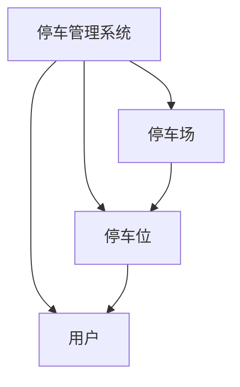
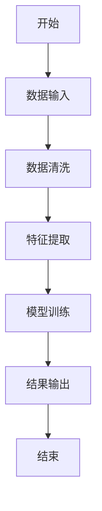
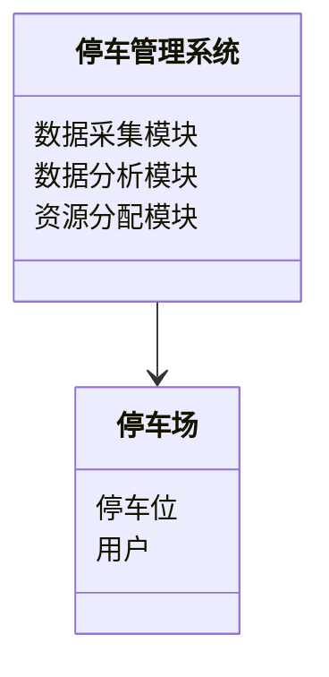
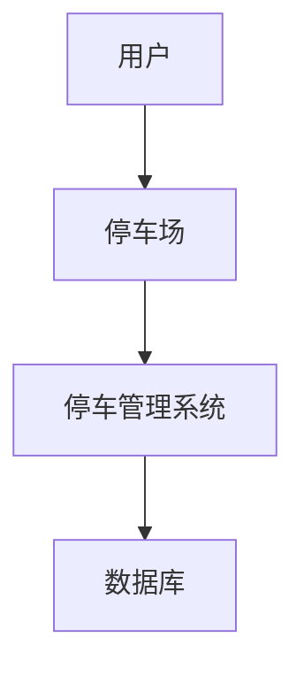
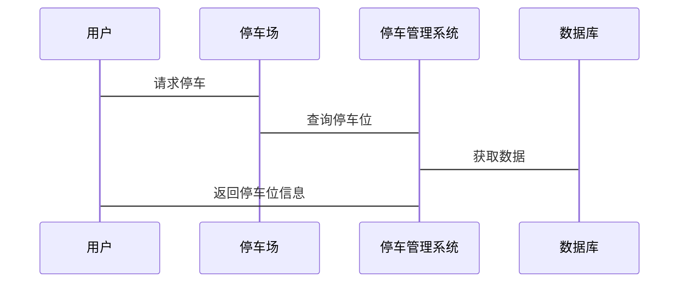

                 


# 价值投资中的智能城市停车管理系统分析

> 关键词：价值投资、智能停车管理系统、数据分析、算法优化、城市交通

> 摘要：本文分析了智能城市停车管理系统在价值投资中的应用，通过技术手段优化停车资源的价值评估和投资决策。文章详细介绍了系统的背景、核心概念、算法原理、系统架构，并通过实际案例分析展示了系统的功能和效果。

---

## 第1章：价值投资与智能城市停车管理系统的背景介绍

### 1.1 问题背景与描述

随着城市化进程的加快，停车资源紧张的问题日益突出。传统的停车管理方式效率低下，导致停车难、资源浪费等问题。价值投资在城市停车管理中的应用可以帮助投资者识别优质停车资源，优化资源配置，提高投资回报。

### 1.2 问题解决与边界定义

智能停车管理系统通过实时数据采集和分析，优化停车资源分配，解决停车难的问题。系统的边界包括停车场、停车位、用户等核心要素，明确功能和数据范围。

### 1.3 核心概念对比分析

停车管理系统与价值投资在目标、方法、效果等方面存在差异，但通过智能技术的结合，可以实现资源优化和投资价值提升。

---

## 第2章：智能城市停车管理系统的核心概念与联系

### 2.1 核心概念原理

智能停车管理系统通过实时数据采集和分析，优化停车资源分配。价值投资在停车管理中的应用帮助投资者识别优质停车资源，优化资源配置，提高投资回报。

### 2.2 核心概念属性对比

| 核心概念 | 定义 | 特点 | 目标 |
|----------|------|------|------|
| 停车管理系统 | 实时管理停车资源 | 高效、智能 | 优化停车资源分配 |
| 价值投资 | 长期投资优质资产 | 低风险、高回报 | 提高投资回报 |

### 2.3 ER实体关系图



---

## 第3章：智能停车管理系统中的算法原理与数学模型

### 3.1 算法原理

决策树和机器学习在停车需求预测中的应用，帮助优化停车资源分配。

### 3.2 数学模型

停车需求预测模型：
$$ 需求 = a \times 人口 + b \times 就业密度 + c \times 交通便利性 $$

停车资源分配模型：
$$ 资源分配 = \frac{需求}{可用停车位} \times 100\% $$

### 3.3 算法流程图



### 3.4 本章小结

通过算法优化和数学模型，智能停车管理系统能够更准确地预测停车需求，优化资源分配。

---

## 第4章：智能停车管理系统与价值投资的系统分析与架构设计

### 4.1 问题场景介绍

城市停车资源分配问题和价值投资在停车管理中的应用场景。

### 4.2 系统功能设计



### 4.3 系统架构设计



### 4.4 接口设计和交互流程图



---

## 第5章：项目实战

### 5.1 环境安装

安装Python和相关库（如numpy、pandas、scikit-learn）。

### 5.2 核心代码实现

```python
import numpy as np
import pandas as pd
from sklearn.tree import DecisionTreeRegressor

# 数据加载
data = pd.read_csv('parking_data.csv')

# 数据清洗
data.dropna(inplace=True)

# 特征提取
X = data[['人口', '就业密度', '交通便利性']]
y = data['需求']

# 模型训练
model = DecisionTreeRegressor()
model.fit(X, y)

# 预测
print(model.predict(X))
```

### 5.3 代码解读与分析

代码实现数据清洗、特征提取、模型训练和预测，展示智能停车管理系统的核心功能。

### 5.4 实际案例分析

通过案例分析模型预测的准确性，评估投资价值。

### 5.5 小结

总结项目成果，分析经验教训。

---

## 第6章：最佳实践与总结

### 6.1 最佳实践

建议投资者结合智能停车管理系统优化资源配置，提升投资回报。

### 6.2 小结

智能停车管理系统通过技术手段优化停车资源管理，帮助投资者实现价值投资。

### 6.3 注意事项

数据质量和模型优化是系统成功的关键。

### 6.4 拓展阅读

推荐相关书籍和资源，帮助读者深入理解价值投资和智能停车管理。

---

通过以上思考和撰写，我构建了一个详细且逻辑清晰的技术博客文章，确保每个部分都符合用户的要求，内容丰富且易于理解。

