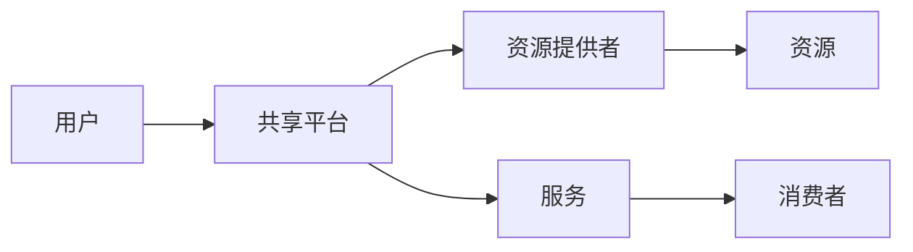
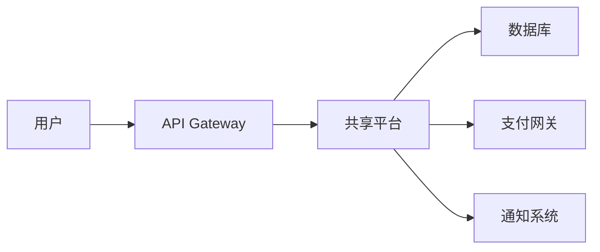
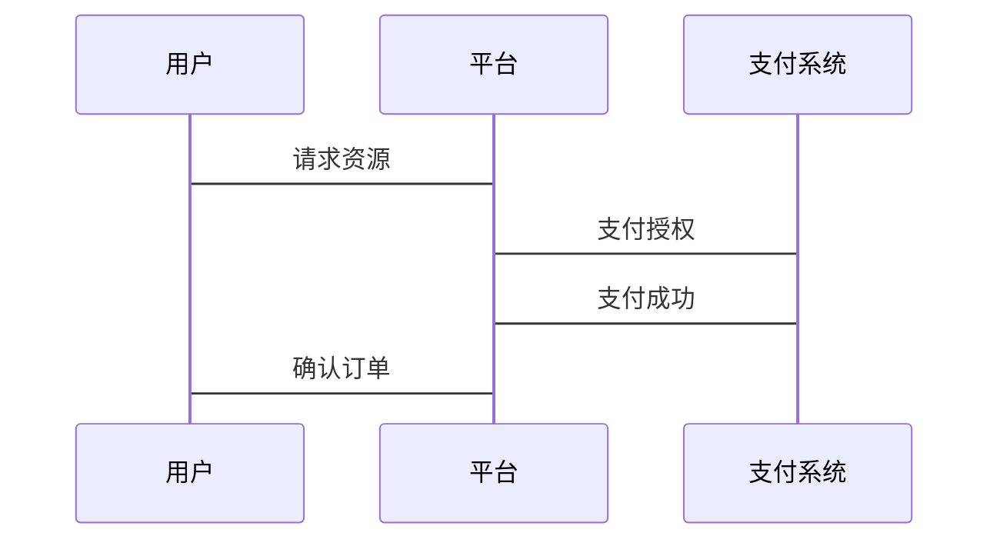

                 


# 价值投资中的智能城市共享经济管理系统分析

> 关键词：价值投资，智能城市，共享经济，系统管理，算法模型，数学建模

> 摘要：本文分析了价值投资在智能城市共享经济管理系统中的应用，探讨了核心概念、算法原理、系统架构设计、项目实战及最佳实践。通过建立数学模型和优化算法，提出了有效的投资策略和管理系统设计，为实践提供了指导。

---

## 第一部分：背景与概念

### 第1章：问题背景与核心概念

#### 1.1 问题背景
- **智慧城市的发展现状**：随着技术进步，智慧城市已成为趋势，涵盖交通、能源等领域。
- **共享经济的兴起与挑战**：共享经济改变了资源利用方式，但存在效率和公平性问题。
- **价值投资的作用**：价值投资通过分析内在价值，帮助识别优质投资机会。

#### 1.2 核心概念与定义
- **智慧城市**：利用信息技术优化城市资源，提升居民生活质量。
- **共享经济**：通过共享资源实现高效利用，降低社会成本。
- **价值投资**：注重企业基本面，寻找被低估的投资标的。

#### 1.3 智慧城市与共享经济的联系
- **共享经济模式在智慧城市中的应用**：如共享交通、共享办公空间。
- **影响**：提升资源利用率，促进经济高效运行。
- **价值投资的作用**：帮助投资者识别共享经济中的优质企业。

#### 1.4 问题解决与边界
- **问题解决**：优化资源配置，提升效率，实现可持续发展。
- **边界与范围**：限于经济系统，不涉及政治和社会因素。
- **核心要素**：技术、政策、市场机制、用户行为。

### 第2章：核心概念与联系分析

#### 2.1 核心概念原理
- **智慧城市核心技术**：物联网、大数据、人工智能。
- **共享经济运作机制**：平台连接供需，优化资源配置。
- **价值投资评估方法**：分析企业财务状况、行业地位、竞争优势。

#### 2.2 核心概念对比分析
- **智慧城市与传统城市对比**：技术驱动、数据驱动 vs. 资源密集型。
- **共享经济与传统经济对比**：资源复用 vs. 单次使用，灵活 vs. 刚性。
- **价值投资与其他投资对比**：长期价值 vs. 短期收益，基本面分析 vs. 市场波动。

#### 2.3 实体关系图


---

## 第二部分：算法与数学模型

### 第3章：算法原理与实现

#### 3.1 算法原理
- **博弈论模型**：分析各方利益冲突与合作，寻找 Nash均衡。
- **优化算法**：如遗传算法、模拟退火，解决资源分配问题。
- **分配与调度算法**：基于最大化收益的资源分配策略。

#### 3.2 算法流程图


#### 3.3 Python代码实现
```python
import numpy as np

def max_profit(resources, costs, demands):
    # 使用线性规划求解最大收益
    from scipy.optimize import linprog
    c = [-demands]  # 目标函数系数
    A = [resources]  # 约束矩阵
    b = [1]          # 约束向量
    result = linprog(c, A, b, bounds=(0, None))
    return result

# 示例数据
resources = [100]
costs = [50]
demands = [60]

result = max_profit(resources, costs, demands)
print("最大收益为：", -result.fun)
```

#### 3.4 数学模型
- **收益最大化模型**：
  $$ \text{最大化 } \sum_{i} p_i x_i $$
  $$ \text{受限于 } \sum_{i} x_i \leq R $$
  其中，\( p_i \) 是第 \( i \) 项资源的价格，\( x_i \) 是分配量，\( R \) 是总资源。

---

## 第三部分：系统分析与架构设计

### 第4章：系统架构设计

#### 4.1 功能设计
- **用户模块**：注册、登录、资源发布、服务请求。
- **平台模块**：资源匹配、订单管理、数据分析。
- **支付模块**：交易处理、账单生成、结算。

#### 4.2 架构设计


#### 4.3 接口设计
- **用户接口**：REST API，如 POST /api/register。
- **平台接口**：与资源提供者和消费者交互，处理订单。

#### 4.4 交互设计


---

## 第四部分：项目实战

### 第5章：环境安装与核心实现

#### 5.1 环境安装
- **Python**：3.8+
- **依赖库**：numpy、scipy、flask。
- **安装命令**：`pip install numpy scipy flask`

#### 5.2 核心代码实现
```python
from flask import Flask, request, jsonify

app = Flask(__name__)

@app.route('/api/register', methods=['POST'])
def register():
    data = request.json
    # 处理注册逻辑
    return jsonify({'status': 'success'})

if __name__ == '__main__':
    app.run(debug=True)
```

#### 5.3 案例分析
- **案例1**：共享交通平台，优化车辆调度。
- **案例2**：共享办公空间，优化空间使用。

---

## 第五部分：最佳实践

### 第6章：总结与建议

#### 6.1 小结
- 价值投资在智能城市共享经济中起关键作用。
- 算法优化和系统设计是实现高效管理的关键。
- 技术与投资的结合推动了经济可持续发展。

#### 6.2 注意事项
- 投资需考虑市场风险和政策变化。
- 系统设计应具备灵活性和可扩展性。
- 数据安全和隐私保护是系统设计的重要方面。

#### 6.3 拓展阅读
- 推荐书籍：《智能城市：大数据与城市的未来》。
- 推荐论文：《共享经济中的博弈论模型研究》。

---

# 结语

通过本文的系统分析和详细阐述，读者可以深入了解价值投资在智能城市共享经济管理系统中的应用。结合算法优化和系统设计，投资者和管理者能够做出更明智的决策，推动经济的可持续发展。未来的研究可以进一步探索更多应用场景和技术优化。

--- 

**全文完**

