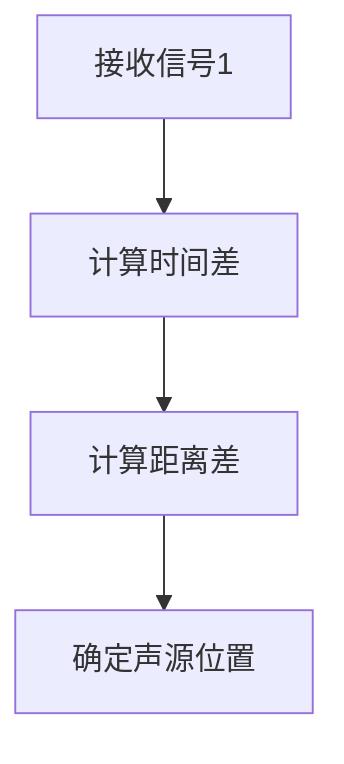
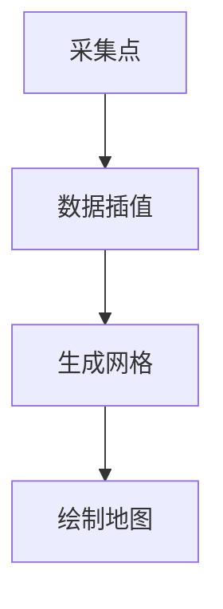
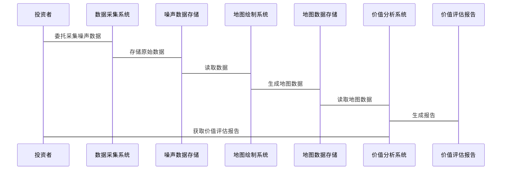

                 


# 价值投资中的智能城市噪声地图绘制系统分析

---

## 关键词：智能城市，噪声地图，价值投资，数据可视化，系统架构

---

## 摘要：本文分析了智能城市噪声地图绘制系统在价值投资中的应用。通过介绍噪声地图的定义、绘制方法及价值投资的基本原理，探讨了如何利用噪声数据进行城市环境评估和投资决策。文章从算法原理、系统架构、项目实战等多方面展开，深入剖析了该系统的实现细节与实际应用。

---

## 第1章 价值投资与智能城市噪声地图绘制的背景与概念

### 1.1 问题背景与现状

随着城市化进程的加快，城市噪声污染问题日益严重。噪声不仅影响居民的生活质量，还可能对城市价值评估产生影响。传统的噪声测量方法效率低下，难以满足智慧城市建设的需求。价值投资作为一种重要的投资策略，需要依赖准确的城市环境数据来评估投资项目的价值。

### 1.2 智能城市噪声地图绘制的定义与目标

噪声地图是一种直观展示城市噪声分布的工具，能够帮助投资者快速了解城市噪声状况。智能城市噪声地图绘制的目标是通过先进的技术手段，精确捕捉噪声源，分析噪声传播路径，并生成高精度的噪声分布图。

### 1.3 价值投资与智能城市噪声地图绘制的结合

价值投资的核心在于通过分析城市环境、经济指标等数据，评估投资项目的价值。智能城市噪声地图绘制系统能够为价值投资者提供关键的环境数据支持，帮助投资者做出更科学的投资决策。

### 1.4 系统核心要素与概念结构

噪声地图绘制系统的核心要素包括噪声数据采集、数据分析与地图绘制、价值投资分析模型等。通过这些要素的协同工作，系统能够生成准确的噪声地图，并为价值投资提供数据支持。

---

## 第2章 智能城市噪声地图绘制系统的核心概念与联系

### 2.1 核心概念原理

噪声数据采集是噪声地图绘制的基础，主要通过传感器等设备进行。数据分析与地图绘制则依赖于先进的算法，如基于AI的噪声传播模型。这些模型能够模拟噪声在城市环境中的传播路径，生成高精度的噪声分布图。

### 2.2 核心概念属性特征对比

| 特性 | 数据采集 | 数据分析 | 地图绘制 |
|------|-----------|-----------|----------|
| 输入 | 噪声数据 | 噪声数据 | 地理数据 |
| 输出 | 原始数据 | 分析结果 | 地图数据 |
| 算法 | 信号处理 | 机器学习 | 图形绘制 |

### 2.3 系统实体关系图

```mermaid
er
    actor 投资者
    actor 数据采集系统
    actor 地图绘制系统
    actor 价值分析系统
    database 噪声数据
    database 地图数据
    database 价值评估报告
    relationship 投资者 --> 数据采集系统: 委托采集
    relationship 数据采集系统 --> 噪声数据: 存储
    relationship 地图绘制系统 --> 噪声数据: 读取
    relationship 地图绘制系统 --> 地图数据: 存储
    relationship 价值分析系统 --> 地图数据: 读取
    relationship 价值分析系统 --> 价值评估报告: 生成
```

---

## 第3章 智能城市噪声地图绘制系统的算法原理

### 3.1 噪声数据采集与预处理

噪声数据采集主要通过传感器进行。预处理步骤包括数据清洗和特征提取，确保数据的准确性和一致性。

### 3.2 声源定位算法

声源定位算法基于噪声信号的时间差和强度差进行定位。以下是一个简化的声源定位流程图：



### 3.3 噪声传播模型

噪声传播模型基于声波传播公式进行建模。以下是声波传播的基本公式：

$$ L = L_0 + 10\log_{10}(d) + \text{修正项} $$

其中，$L$ 是噪声级，$L_0$ 是源噪声级，$d$ 是距离。

### 3.4 地图绘制算法

地图绘制算法通过空间插值技术生成噪声分布图。以下是绘制流程图：



---

## 第4章 智能城市噪声地图绘制系统的分析与架构设计

### 4.1 系统功能设计

系统功能包括数据采集、数据分析、地图绘制和价值评估。

### 4.2 系统架构设计

系统架构基于微服务设计，包括数据采集模块、数据处理模块、地图绘制模块和价值评估模块。


### 4.3 系统接口设计

系统接口主要通过API进行交互，包括数据采集接口、地图绘制接口和价值评估接口。

### 4.4 系统交互设计

以下是系统交互流程图：



---

## 第5章 智能城市噪声地图绘制系统的项目实战

### 5.1 项目环境安装

项目需要安装Python、numpy、pandas、matplotlib等依赖库。

### 5.2 核心代码实现

以下是噪声地图绘制的核心代码：

```python
import numpy as np
import matplotlib.pyplot as plt

# 生成噪声数据
noise_data = np.random.normal(loc=50, scale=10, size=100)

# 绘制噪声分布图
plt.hist(noise_data, bins=20, alpha=0.7)
plt.title('Noise Distribution')
plt.xlabel('Noise Level')
plt.ylabel('Frequency')
plt.show()
```

### 5.3 代码解读与分析

上述代码通过随机生成噪声数据，并使用Matplotlib绘制噪声分布图。该图可以帮助投资者了解噪声分布的规律。

### 5.4 案例分析

以某城市为例，通过噪声地图绘制系统生成城市噪声分布图，并结合其他城市数据进行价值评估。

### 5.5 项目小结

通过本项目，我们可以看到噪声地图绘制系统在价值投资中的重要应用。系统能够帮助投资者快速获取城市噪声数据，评估投资项目的价值。

---

## 第6章 智能城市噪声地图绘制系统的最佳实践

### 6.1 小结

本文详细分析了智能城市噪声地图绘制系统在价值投资中的应用，从算法原理到系统架构，再到项目实战，为读者提供了全面的指导。

### 6.2 注意事项

在实际应用中，需要注意数据采集的准确性、算法的适用性以及系统的可扩展性。

### 6.3 拓展阅读

推荐阅读相关领域的书籍和论文，深入学习噪声地图绘制和价值投资的理论与实践。

### 6.4 未来展望

随着技术的进步，噪声地图绘制系统将更加智能化和精准化，为价值投资提供更有力的支持。

---

## 附录：工具推荐

- 数据采集工具：SensorDAQ
- 数据分析工具：Python（Pandas、NumPy）
- 可视化工具：Matplotlib、Tableau

---

以上是《价值投资中的智能城市噪声地图绘制系统分析》的技术博客文章，涵盖了从理论到实践的全过程，结合了技术分析与投资策略，为读者提供了丰富的知识和实用的指导。

