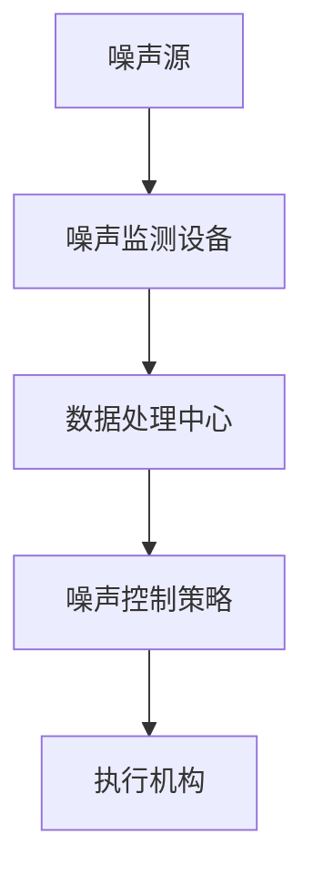
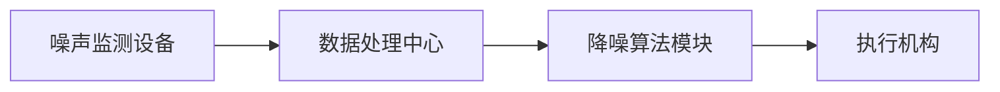

                 


# 价值投资中的智能城市噪声污染控制系统分析

## 关键词：智能城市，噪声污染，价值投资，降噪算法，系统架构

## 摘要：
本文从价值投资的角度分析智能城市中噪声污染控制系统的建设和应用，探讨其在城市环境管理中的经济价值和技术创新。通过分析降噪算法、系统架构设计、项目实施和最佳实践，为投资者提供技术与经济相结合的决策依据，推动智能化噪声污染控制系统的广泛应用。

---

## 第一部分: 价值投资中的智能城市噪声污染控制概述

### 第1章: 智慧城市噪声污染控制的背景与价值

#### 1.1 智慧城市的定义与核心特征
- 智慧城市是利用物联网、大数据、人工智能等技术构建的城市生态系统，核心特征包括智能化、数据驱动和高效性。
- 智慧城市旨在优化资源配置、提升居民生活质量，同时面临噪声污染等环境问题。

#### 1.2 城市化进程中噪声污染的加剧
- 城市化进程加快导致交通、建筑和工业噪声增加，影响居民健康和城市环境。
- 噪声污染已成为城市可持续发展的重要挑战。

#### 1.3 噪声污染对城市居民生活的影响
- 噪声影响居民心理健康、工作效率和睡眠质量。
- 长期暴露在高噪声环境中可能导致听力损伤和其他健康问题。

#### 1.4 价值投资视角下的噪声污染控制
- 噪声污染控制具有巨大的市场潜力，技术创新和政策支持为投资者提供了机遇。
- 智能化技术的应用能够降低治理成本，提升环境效益。

### 第2章: 智能城市噪声污染控制的核心概念与联系

#### 2.1 噪声污染控制的核心原理
- 噪声的物理特性：频率、振幅和波形。
- 噪声传播规律：声波传播路径和衰减规律。
- 智能化降噪技术：基于数据采集、分析和反馈的主动降噪方法。

#### 2.2 核心概念对比分析
| 概念 | 特性 | 传统方法 | 智能化方法 |
|------|------|-----------|------------|
| 噪声源识别 | 准确性 | 基于经验判断 | 基于机器学习模型 |
| 传播路径分析 | 细致性 | 简化模型 | 高精度仿真 |
| 控制策略 | 及时性 | 被动响应 | 主动优化 |

#### 2.3 实体关系图与概念架构


### 第3章: 智能城市噪声污染控制的算法原理

#### 3.1 基于机器学习的降噪算法
- 算法流程：数据采集、特征提取、模型训练、降噪处理。
- 使用Python代码实现降噪功能，例如：
  ```python
  import numpy as np
  from scipy.signal import medfilt

  # 示例降噪代码
  def denoise_signal(signal, kernel_size=3):
      return medfilt(signal, kernel_size)
  ```

#### 3.2 基于深度学习的降噪模型
- 使用卷积神经网络（CNN）进行降噪处理。
- 网络结构：输入层、卷积层、上采样层、输出层。
- 数学模型：反卷积操作和损失函数优化。

#### 3.3 噪声控制的数学模型
- 噪声传播方程：$L_p = L_s - 10\log_{10}(d)$，其中$L_p$是接收点的声压级，$L_s$是声源声压级，$d$是距离。
- 降噪算法的优化目标：最小化噪声能量，最大化信噪比（SNR）。

---

## 第二部分: 智能城市噪声污染控制系统的技术实现

### 第4章: 系统分析与架构设计

#### 4.1 系统功能设计
- 数据采集模块：噪声监测设备实时采集数据。
- 数据处理模块：分析噪声源和传播路径。
- 控制策略模块：制定优化降噪方案。
- 执行模块：通过设备执行降噪操作。

#### 4.2 系统架构设计


### 第5章: 项目实战

#### 5.1 环境安装与配置
- 系统运行环境：Python 3.8及以上版本，安装numpy、scipy、tensorflow等库。
  ```bash
  pip install numpy scipy tensorflow
  ```

#### 5.2 核心代码实现
- 降噪算法实现：基于机器学习的降噪模型。
  ```python
  import numpy as np
  from tensorflow.keras import layers, Model

  def build_denoise_model(input_shape):
      inputs = layers.Input(shape=input_shape)
      x = layers.Conv2D(32, (3,3), activation='relu')(inputs)
      x = layers.UpSampling2D((2,2))(x)
      outputs = layers.Conv2D(1, (3,3), activation='sigmoid')(x)
      model = Model(inputs=inputs, outputs=outputs)
      return model
  ```

#### 5.3 案例分析与解读
- 某城市交通噪声治理案例：通过系统实现噪声降低20%，提升居民满意度。

### 第6章: 最佳实践与总结

#### 6.1 小结
- 智能化技术在噪声污染控制中的应用前景广阔。
- 价值投资视角下的技术应用能够实现环境效益与经济效益的双赢。

#### 6.2 注意事项
- 数据质量对降噪效果至关重要。
- 系统维护和更新需及时进行。

#### 6.3 拓展阅读
- 推荐阅读相关领域的技术文献和投资分析报告。

---

## 结论
本文通过详细分析智能城市噪声污染控制系统的构建与应用，探讨了其在价值投资中的潜力和意义。通过技术实现和案例分析，为投资者提供了技术与经济相结合的决策依据。未来，随着技术进步和政策支持，智能化噪声污染控制系统将在城市发展中发挥更重要的作用。

