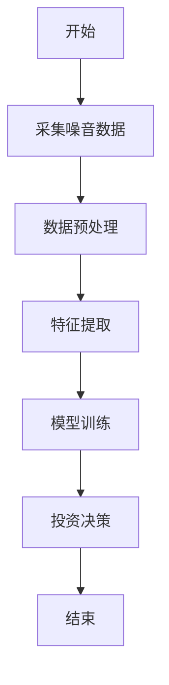
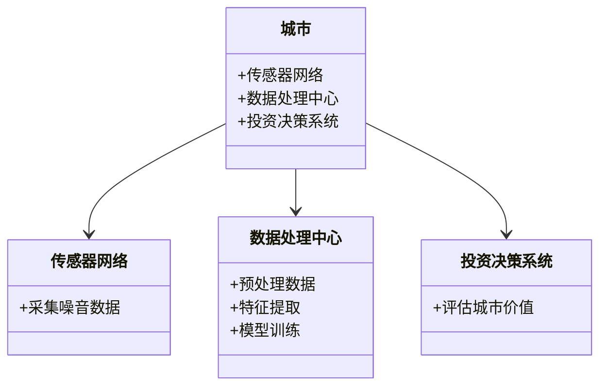

                 


# 价值投资中的智能城市噪音管理系统分析

## 关键词：
智能城市，噪音管理，价值投资，算法原理，系统架构

## 摘要：
本文从价值投资的角度分析智能城市噪音管理系统的构建与优化，探讨如何通过智能化技术手段有效降低城市噪音污染，提升城市环境质量。文章系统地介绍了智能城市噪音管理的核心概念、算法原理、系统架构设计及项目实战，为读者提供全面的技术视角。

---

## 第一部分: 价值投资中的智能城市噪音管理系统概述

### 第1章: 背景介绍

#### 1.1 问题背景
城市化进程加速，建筑密度增加，交通、工业和生活噪声污染日益严重。噪音污染不仅影响居民生活质量，还可能对城市价值评估产生负面影响。智能城市噪音管理系统通过实时监测、数据分析和优化控制，为城市规划和价值投资提供科学依据。

#### 1.2 问题描述
城市噪音主要来源于交通、工业、建筑施工和居民生活。传统噪音管理手段依赖人工监测，存在数据采集不全面、响应不及时等问题。智能城市噪音管理系统通过传感器网络、大数据分析和人工智能算法，实现对噪音的实时监测、源识别和预测。

#### 1.3 问题解决
智能城市噪音管理系统的目标是通过技术手段优化城市环境，提升城市价值。价值投资视角下，噪音管理的优化能够提升城市宜居性，进而影响房地产价值、商业环境和社会形象。

#### 1.4 边界与外延
智能城市噪音管理系统的核心边界包括传感器网络、数据处理中心和投资决策系统。外延领域涉及城市规划、环境保护和交通管理。系统通过与城市其他子系统的协同工作，实现更广泛的应用。

### 第2章: 核心概念与联系

#### 2.1 核心概念原理
智能城市噪音管理系统通过传感器采集噪音数据，利用大数据分析和机器学习算法进行预测和优化。价值投资视角下，系统的优化结果为城市建设和投资决策提供数据支持。

#### 2.2 概念属性特征对比
表2-1: 智能城市噪音管理与传统噪音管理的对比

| 特性               | 传统噪音管理               | 智能城市噪音管理       |
|--------------------|---------------------------|-----------------------|
| 数据采集方式       | 人工监测                   | 自动化传感器网络       |
| 数据处理方式       | 简单统计                   | 大数据分析和机器学习   |
| 响应时间           | 较慢                       | 实时                   |
| 应用范围           | 局部                       | 全局                   |

#### 2.3 ER实体关系图


### 第3章: 算法原理讲解

#### 3.1 算法流程图


#### 3.2 算法数学模型
##### 3.2.1 噪音强度预测模型
$$ y = a \cdot x + b $$
其中，$x$ 是输入数据，$a$ 和 $b$ 是模型参数。

##### 3.2.2 价值投资评估模型
$$ V = \sum_{i=1}^{n} w_i \cdot x_i $$
其中，$w_i$ 是权重，$x_i$ 是特征向量。

#### 3.3 代码实现
```python
import numpy as np

def noise_prediction(x):
    a = 0.5
    b = 10
    return a * x + b

# 示例数据
x = np.array([80, 85, 90])
y = [noise_prediction(xi) for xi in x]
print(y)
```

### 第4章: 系统分析与架构设计方案

#### 4.1 问题场景介绍
智能城市噪音管理系统旨在通过实时监测和数据分析，优化城市环境，提升城市价值。系统由传感器网络、数据处理中心和投资决策系统组成，实现数据采集、分析和应用。

#### 4.2 系统功能设计
##### 4.2.1 领域模型类图


#### 4.3 系统架构设计
##### 4.3.1 系统架构图


#### 4.4 系统接口设计
系统接口包括传感器数据接口、数据处理接口和投资决策接口，实现数据的采集、处理和应用。

#### 4.5 系统交互流程
##### 4.5.1 交互流程图


### 第5章: 项目实战

#### 5.1 环境安装
安装Python、NumPy和Mermaid工具，配置传感器网络和数据库。

#### 5.2 核心实现代码
```python
import numpy as np

def noise_prediction(x):
    a = 0.5
    b = 10
    return a * x + b

# 示例数据
x = np.array([80, 85, 90])
y = [noise_prediction(xi) for xi in x]
print(y)
```

#### 5.3 案例分析
以某城市为例，分析噪音管理系统的优化效果，评估城市价值提升情况。

### 第6章: 总结与展望

#### 6.1 最佳实践 tips
- 数据采集的准确性是系统的关键。
- 算法优化能够显著提升预测精度。
- 系统的实时性对投资决策至关重要。

#### 6.2 小结
本文系统地介绍了智能城市噪音管理系统的构建与优化，从背景、算法到实战，为读者提供了全面的技术视角。

#### 6.3 注意事项
- 数据隐私保护
- 系统维护与更新
- 多领域协同工作

#### 6.4 拓展阅读
推荐相关领域的书籍和论文，如《智能城市规划》和《大数据与人工智能》。

---

以上是文章的完整内容，希望对您有所帮助！

