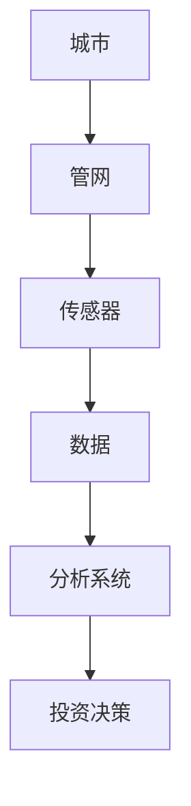
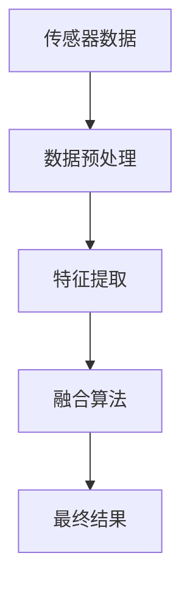
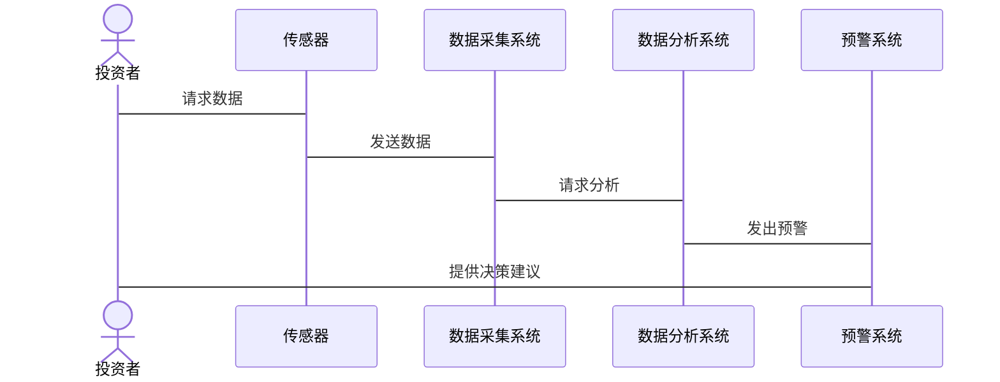

                 


# 价值投资中的智能城市地下管网监测系统分析

> 关键词：价值投资、智能城市、地下管网、监测系统、数据融合

> 摘要：本文从价值投资的角度，详细分析了智能城市地下管网监测系统的核心技术与应用场景。通过分析系统的核心概念、算法原理、数学模型、系统架构以及实际案例，展示了如何通过智能化手段提升城市地下管网的监测效率与投资决策的准确性。文章最后总结了系统在实际应用中的最佳实践与注意事项。

---

## 第一部分: 智慧城市地下管网监测系统概述

### 第1章: 价值投资与智能城市地下管网监测系统背景

#### 1.1 问题背景与描述

##### 1.1.1 城市地下管网的重要性
城市地下管网是城市的“血管”，包括供水、供电、供气、通信等设施，是城市运行的重要基础设施。然而，地下管网的维护成本高、难度大，且容易受到腐蚀、老化等因素的影响，导致泄漏、断裂等问题，进而引发巨大的经济损失和安全隐患。

##### 1.1.2 当前地下管网监测的痛点
- **数据采集难度大**：地下管网分布复杂，传感器布置困难。
- **数据孤岛**：不同部门、不同系统的数据难以整合。
- **缺乏实时性**：传统的监测手段无法实现快速响应。
- **投资决策依据不足**：缺乏系统性的数据支持，难以进行精准的价值评估。

##### 1.1.3 价值投资在地下管网监测中的作用
通过智能化的监测系统，可以实时采集、分析和预测地下管网的状态，为投资者提供精准的数据支持，从而优化投资决策，降低风险。

#### 1.2 问题解决与边界

##### 1.2.1 智能监测系统如何解决痛点
智能监测系统通过传感器、物联网、大数据分析等技术，实现对地下管网的实时监测、智能预警和精准维护。

##### 1.2.2 系统的边界与外延
- **边界**：系统仅关注地下管网的监测，不涉及管网的设计和施工。
- **外延**：系统可与城市管理系统、投资评估系统无缝对接。

##### 1.2.3 核心要素与组成结构
- **传感器**：负责采集数据。
- **数据传输**：实现数据的实时传输。
- **数据分析**：对数据进行处理和分析。
- **预警系统**：根据分析结果发出预警。

### 第2章: 核心概念与联系

#### 2.1 核心概念原理

##### 2.1.1 智能监测系统的组成
- **传感器网络**：包括压力传感器、温度传感器等。
- **数据采集系统**：负责数据的采集和传输。
- **数据分析系统**：对数据进行处理和分析。
- **预警系统**：根据分析结果发出预警。

##### 2.1.2 价值投资的评估模型
- **数据驱动**：基于实时数据进行评估。
- **风险控制**：通过预警系统降低投资风险。
- **收益预测**：通过数据分析预测投资收益。

#### 2.2 核心概念对比分析

##### 2.2.1 传感器与数据采集对比
| 特性 | 传感器 | 数据采集 |
|------|--------|----------|
| 功能 | 采集数据 | 传输数据 |
| 优势 | 精度高 | 实时性好 |

#### 2.2.2 数据分析与投资决策对比
| 特性 | 数据分析 | 投资决策 |
|------|----------|----------|
| 输入 | 数据 | 分析结果 |
| 输出 | 模型 | 投资建议 |

#### 2.2.3 系统稳定性与投资风险对比
- 系统稳定性高：投资风险低。
- 系统稳定性低：投资风险高。

#### 2.3 ER实体关系图



---

## 第二部分: 算法原理与数学模型

### 第3章: 数据融合算法原理

#### 3.1 数据融合算法

##### 3.1.1 数据融合流程


##### 3.1.2 融合算法实现
$$ y = w_1 x_1 + w_2 x_2 + \dots + w_n x_n $$

#### 3.2 数学模型与公式

##### 3.2.1 数据融合公式
$$ y = w_1 x_1 + w_2 x_2 + \dots + w_n x_n $$

##### 3.2.2 融合权重计算
$$ w_i = \frac{1}{\sum_{j=1}^{n} (x_i - x_j)^2} $$

---

## 第三部分: 系统分析与架构设计

### 第4章: 系统分析与架构设计方案

#### 4.1 问题场景介绍

##### 4.1.1 系统功能设计
- **数据采集**：实时采集管网数据。
- **数据处理**：对数据进行清洗和预处理。
- **数据分析**：基于数学模型进行分析。
- **预警系统**：根据分析结果发出预警。

#### 4.2 系统架构设计

##### 4.2.1 系统架构图


#### 4.3 接口设计与交互

##### 4.3.1 接口设计
- **传感器接口**：负责与传感器通信。
- **数据接口**：负责与外部系统交互。

##### 4.3.2 交互图


---

## 第四部分: 项目实战

### 第5章: 项目实战

#### 5.1 环境安装

##### 5.1.1 系统环境
- 操作系统：Linux
- 数据库：MySQL
- 开发工具：Python、Jupyter Notebook

#### 5.2 系统核心实现源代码

##### 5.2.1 数据融合代码
```python
import numpy as np

def data_fusion(sensor_data, weights):
    return np.dot(sensor_data, weights)

# 示例数据
sensor_data = np.array([1, 2, 3])
weights = np.array([0.3, 0.5, 0.2])

result = data_fusion(sensor_data, weights)
print(result)
```

##### 5.2.2 预警系统代码
```python
def generate_alarm(data, threshold):
    if data > threshold:
        return "Alarm"
    else:
        return "No Alarm"

# 示例数据
data_point = 100
threshold = 95

alarm = generate_alarm(data_point, threshold)
print(alarm)
```

#### 5.3 代码应用解读与分析

##### 5.3.1 数据融合代码解读
- **输入**：传感器数据和权重。
- **输出**：融合后的数据。

##### 5.3.2 预警系统代码解读
- **输入**：数据点和阈值。
- **输出**：预警状态。

#### 5.4 实际案例分析

##### 5.4.1 案例背景
某城市地下管网出现泄漏问题，需要通过智能监测系统进行实时监测和预警。

##### 5.4.2 案例分析
- **数据采集**：传感器采集泄漏数据。
- **数据融合**：融合多源数据，提高准确性。
- **预警系统**：根据融合数据发出预警。

#### 5.5 项目小结

##### 5.5.1 项目总结
通过智能监测系统，实现了对地下管网的实时监测和预警，为投资决策提供了有力支持。

##### 5.5.2 项目经验
- 数据融合算法的权重设计对系统性能影响较大。
- 系统的实时性和稳定性是投资决策的关键。

---

## 第五部分: 最佳实践与注意事项

### 第6章: 最佳实践

#### 6.1 系统优化建议

##### 6.1.1 数据采集优化
- 使用更高精度的传感器。
- 增加传感器的布设密度。

##### 6.1.2 数据分析优化
- 引入机器学习算法，提高预测精度。
- 建立实时数据分析平台。

#### 6.2 系统维护建议

##### 6.2.1 定期检查传感器
- 定期清洁和维护传感器。
- 及时更换损坏的传感器。

##### 6.2.2 更新系统软件
- 定期更新系统软件。
- 及时修复系统漏洞。

### 第7章: 小结与展望

#### 7.1 小结

##### 7.1.1 核心内容回顾
- 智能监测系统的组成与功能。
- 数据融合算法的实现与优化。
- 系统架构设计与实际应用。

#### 7.1.2 投资价值总结
- 提高投资决策的准确性。
- 降低投资风险。

#### 7.2 展望

##### 7.2.1 研究方向
- 引入人工智能技术，提高系统智能化水平。
- 开发更高效的传感器和数据传输技术。

##### 7.2.2 应用前景
- 智能监测系统在智慧城市中的应用前景广阔。
- 数据驱动的投资决策将成为未来趋势。

### 第8章: 注意事项

#### 8.1 系统设计注意事项

##### 8.1.1 数据安全
- 确保数据传输和存储的安全性。
- 防止数据泄露和篡改。

##### 8.1.2 系统稳定性
- 确保系统的高可用性。
- 建立完善的容灾备份机制。

#### 8.2 投资注意事项

##### 8.2.1 风险评估
- 充分评估项目的投资风险。
- 制定合理的风险应对策略。

##### 8.2.2 技术评估
- 评估技术的可行性和成熟度。
- 确保技术的先进性和实用性。

### 第9章: 拓展阅读

#### 9.1 推荐书籍
- 《智能城市》
- 《数据驱动的投资决策》

#### 9.2 推荐论文
- 《基于数据融合的智能监测系统研究》
- 《价值投资中的数据驱动方法》

#### 9.3 推荐工具
- **数据处理工具**：Python、R
- **数据分析工具**：Pandas、Matplotlib
- **系统设计工具**：Mermaid、PlantUML

---

通过以上分析，我们可以看到，智能城市地下管网监测系统在价值投资中的应用具有巨大的潜力。通过系统的实时监测和数据分析，投资者可以做出更精准的投资决策，降低投资风险，提高投资收益。

