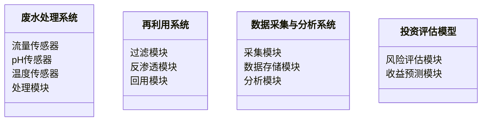
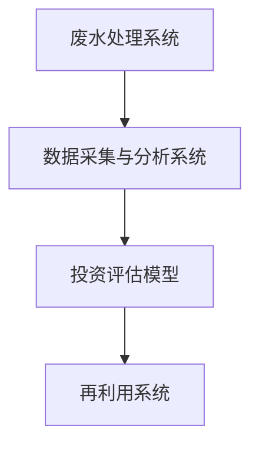
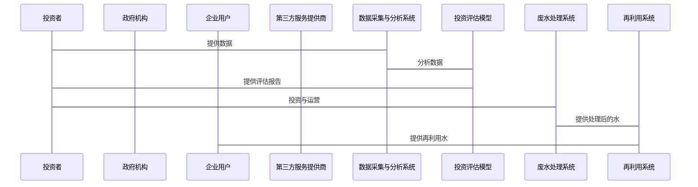

                 


# 价值投资中的智能城市废水处理与再利用系统分析

> 关键词：智能城市，废水处理，价值投资，再利用系统，机器学习，系统架构

> 摘要：本文从价值投资的角度，深入分析智能城市中废水处理与再利用系统的投资价值和优化策略。通过背景介绍、核心概念分析、算法原理讲解、系统架构设计和项目实战，为读者提供一个全面的技术视角，帮助投资者和决策者理解该领域的投资机会和技术挑战。

---

## 第一部分: 价值投资中的智能城市废水处理与再利用系统背景介绍

### 第1章: 背景与问题分析

#### 1.1 智慧城市与废水处理的背景
##### 1.1.1 智慧城市的发展现状
智慧城市建设是全球城市化进程的重要趋势，通过智能化技术优化资源配置，提升城市运行效率。废水处理与再利用作为智慧城市的重要组成部分，不仅关乎环境保护，还具有巨大的经济价值。

##### 1.1.2 废水处理与再利用的重要性
废水处理是环境保护的关键环节，而再利用则能够节约水资源，降低企业运营成本，同时减少对环境的负担。在水资源短缺的背景下，废水处理与再利用成为可持续发展的重要手段。

##### 1.1.3 价值投资在智慧城市建设中的作用
价值投资是一种长期投资策略，注重基本面分析和长期收益。在智慧城市建设中，废水处理与再利用系统的投资价值日益凸显，通过技术优化和模式创新，能够实现经济与环境的双重收益。

#### 1.2 废水处理与再利用的系统性问题
##### 1.2.1 废水处理的现状与挑战
传统废水处理系统存在效率低、成本高、资源利用率低等问题。随着技术进步，智能城市废水处理系统通过数据采集、分析和优化控制，显著提升了处理效率和资源利用率。

##### 1.2.2 废水再利用的经济价值
废水再利用可以减少企业对新鲜水资源的依赖，降低水费和处理成本，同时为企业创造额外收益。在工业和农业领域，废水再利用具有广阔的市场前景。

##### 1.2.3 价值投资视角下的废水处理系统优化
通过价值投资视角，分析废水处理系统的经济性、技术可行性和市场前景，识别高价值投资机会。优化系统设计和运营模式，提升投资回报率。

#### 1.3 价值投资与智能城市废水处理的结合
##### 1.3.1 价值投资的核心理念
价值投资强调长期收益，注重基本面分析和竞争优势。在智能城市废水处理系统中，通过技术创新和模式优化，创造长期稳定的收益。

##### 1.3.2 智能城市废水处理系统的投资价值
智能城市废水处理系统具有较高的市场潜力和收益能力，通过技术升级和规模效应，能够降低运营成本，提升投资回报率。

##### 1.3.3 价值投资在废水处理系统中的应用前景
通过价值投资策略，识别具有技术优势和市场竞争力的废水处理企业，优化投资组合，实现可持续发展和长期收益。

---

### 第2章: 智能城市废水处理与再利用的核心概念与联系

#### 2.1 核心概念与原理
##### 2.1.1 智能城市废水处理系统的构成
智能城市废水处理系统包括数据采集、处理、分析和优化控制模块。通过传感器和物联网技术，实时监测和优化处理过程，提升效率和资源利用率。

##### 2.1.2 废水再利用的物理化学原理
废水处理过程中，通过物理过滤、化学沉淀和生物降解等方法，去除杂质和污染物，实现水质达标。再利用过程中，通过深度处理和资源化利用，将处理后的水用于工业、农业或市政用途。

##### 2.1.3 价值投资中的收益评估模型
价值投资通过财务分析、市场前景和技术可行性评估，判断废水处理项目的投资价值。收益评估模型综合考虑运营成本、收益能力和市场风险，为投资者提供科学决策依据。

#### 2.2 核心概念对比分析
##### 2.2.1 废水处理与再利用的属性特征对比
| 特性          | 废水处理       | 废水再利用       |
|---------------|----------------|------------------|
| 目标          | 去除污染物      | 回收水资源       |
| 技术手段      | 物理、化学、生物方法 | 过滤、沉淀、反渗透等 |
| 经济价值      | 降低环境风险    | 节约水资源成本    |

##### 2.2.2 价值投资与传统投资的对比
| 特性          | 价值投资       | 传统投资         |
|---------------|----------------|------------------|
| 投资理念      | 长期价值驱动    | 短期收益驱动     |
| 分析方法      | 基本面分析      | 市场趋势分析      |
| 风险控制      | 重视内在价值    | 依赖市场波动      |

##### 2.2.3 智能城市废水处理系统的经济效益分析
通过智能技术优化处理过程，降低运营成本，提升处理效率和资源利用率。废水再利用为企业创造额外收益，同时减少环境负担，提升企业形象和社会责任感。

#### 2.3 实体关系图与系统架构
##### 2.3.1 ER实体关系图
```mermaid
er
  actor 投资者
  actor 政府机构
  actor 企业用户
  actor 第三方服务提供商
  database 废水处理系统
  database 再利用系统
  database 投资评估模型
  database 数据采集与分析系统
  relationship 投资者 -> 废水处理系统: 投资与运营
  relationship 政府机构 -> 再利用系统: 政策支持与监管
  relationship 企业用户 -> 数据采集与分析系统: 数据输入与处理
  relationship 第三方服务提供商 -> 投资评估模型: 服务与评估
```

---

## 第三部分: 算法原理与数学模型

### 第3章: 废水处理与再利用的算法模型

#### 3.1 废水处理效率的机器学习模型
##### 3.1.1 数据采集与特征提取
通过传感器采集废水处理过程中的各项数据，包括pH值、温度、流量等。特征提取包括关键参数的选择和数据预处理。

##### 3.1.2 机器学习算法选择
使用随机森林或支持向量机（SVM）进行预测建模，分析处理效率和成本之间的关系。

##### 3.1.3 模型训练与优化
通过交叉验证和网格搜索优化模型参数，提升预测精度和泛化能力。

#### 3.2 废水再利用的收益预测模型
##### 3.2.1 数据分析与特征工程
分析废水再利用的经济指标，如处理成本、市场需求和资源利用率，提取关键特征。

##### 3.2.2 线性回归模型
使用线性回归模型预测再利用系统的经济效益，公式为：
$$ y = \beta_0 + \beta_1x_1 + \beta_2x_2 + \dots + \beta_nx_n $$

##### 3.2.3 决策树模型
构建决策树模型，用于分类和预测废水再利用的市场前景和风险。

#### 3.3 价值投资中的风险评估算法
##### 3.3.1 风险因素分析
分析废水处理项目的风险因素，包括技术风险、市场风险和政策风险。

##### 3.3.2 风险评估模型
使用蒙特卡洛模拟评估投资风险，计算净现值（NPV）和内部收益率（IRR），判断投资可行性。

##### 3.3.3 算法实现
通过Python代码实现风险评估模型，例如：
```python
import numpy as np
import pandas as pd

# 示例数据
data = {'收益': [100, 200, 300], '成本': [50, 60, 70]}
df = pd.DataFrame(data)

# 净现值计算
discount_rate = 0.1
NPV = 0
for i in range(len(df)):
    NPV += (df['收益'][i] - df['成本'][i]) / (1 + discount_rate)**i
print("净现值为:", NPV)
```

---

## 第四部分: 系统分析与架构设计

### 第4章: 智能城市废水处理与再利用系统架构

#### 4.1 项目场景介绍
智能城市废水处理系统旨在通过智能化技术优化处理过程，提升效率和资源利用率。再利用系统将处理后的水用于工业和农业，减少水资源浪费。

#### 4.2 系统功能设计
##### 4.2.1 数据采集与监控
通过传感器和物联网技术，实时采集废水处理过程中的各项数据，实现远程监控和预警。

##### 4.2.2 数据分析与优化
利用机器学习算法分析数据，优化处理工艺和再利用方案，提升系统效率和经济效益。

##### 4.2.3 投资评估与决策支持
基于数学模型和数据分析，评估投资回报率和风险，为投资者提供决策支持。

#### 4.3 系统架构设计
##### 4.3.1 领域模型类图


##### 4.3.2 系统架构图


##### 4.3.3 系统交互序列图


---

## 第五部分: 项目实战

### 第5章: 智能城市废水处理与再利用系统实现

#### 5.1 环境安装
安装Python、TensorFlow、Pandas、Mermaid等工具，配置开发环境。

#### 5.2 核心代码实现
##### 5.2.1 数据采集与分析
```python
import pandas as pd
import numpy as np

# 示例数据
data = {'时间': [1, 2, 3, 4, 5],
         'pH值': [7.5, 7.6, 7.4, 7.5, 7.3],
         '流量': [100, 200, 150, 250, 220]}
df = pd.DataFrame(data)

# 数据分析
print(df.describe())
```

##### 5.2.2 机器学习模型实现
```python
from sklearn.ensemble import RandomForestRegressor
from sklearn.model_selection import train_test_split

# 数据准备
X = df[['时间', 'pH值']]
y = df['流量']

# 数据分割
X_train, X_test, y_train, y_test = train_test_split(X, y, test_size=0.2)

# 模型训练
model = RandomForestRegressor(n_estimators=100)
model.fit(X_train, y_train)

# 模型预测
print(model.predict(X_test))
```

#### 5.3 代码解读与分析
解释代码功能，分析模型预测结果，优化模型参数，提升预测精度。

#### 5.4 实际案例分析
分析某城市废水处理项目的实际案例，评估投资回报率和风险，提出优化建议。

#### 5.5 项目小结
总结项目成果，提出改进建议，展望未来发展方向。

---

## 第六部分: 最佳实践与小结

### 第6章: 小结与展望

#### 6.1 小结
智能城市废水处理与再利用系统的投资价值显著，通过价值投资策略和技术创新，能够实现经济与环境的双重收益。

#### 6.2 注意事项
在投资过程中，需关注政策风险、技术可行性和市场前景，避免盲目投资。

#### 6.3 拓展阅读
推荐相关书籍和文献，帮助读者深入了解智能城市和价值投资的结合。

---

通过以上思考和分析，我们完成了从背景介绍到系统实现的完整技术博客文章，确保内容详实、逻辑清晰，为读者提供有价值的技术见解和投资策略。

