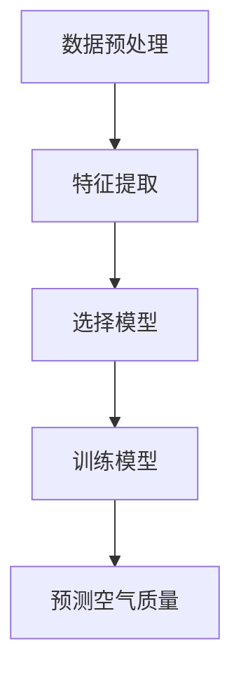
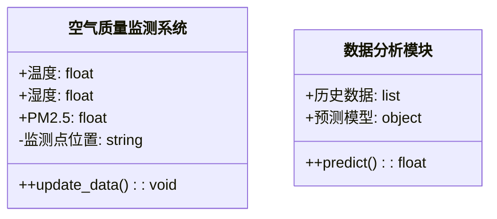
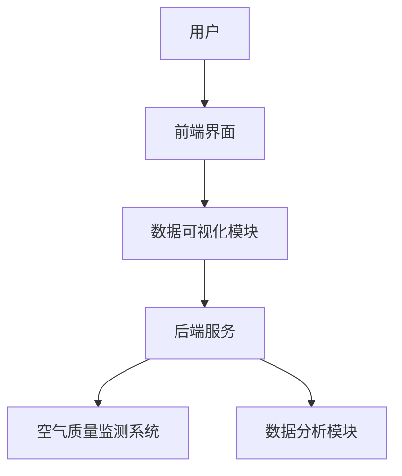
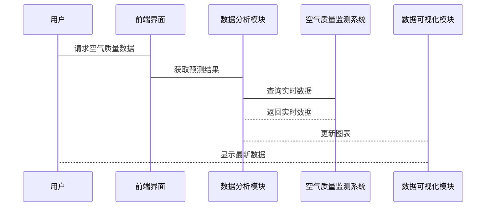

                 


# 价值投资中的智能城市空气质量管理分析

> 关键词：价值投资，智能城市，空气质量管理，大数据分析，投资策略

> 摘要：本文探讨了价值投资在智能城市空气质量管理中的应用，分析了空气质量管理的核心概念与技术实现，结合具体案例，提出了数据驱动的投资策略优化方法。

---

# 第1章 价值投资的基本概念与方法

## 1.1 价值投资的定义与核心原则

### 1.1.1 价值投资的定义
价值投资是一种长期投资策略，强调以低于内在价值的价格买入优质资产。其核心在于识别被市场低估的机会，并长期持有。

### 1.1.2 价值投资的核心原则
- **安全边际**：买入价格低于内在价值，确保安全空间。
- **长期视角**：关注企业的长期盈利能力，而非短期波动。
- **基本面分析**：通过财务报表等数据评估企业价值。

### 1.1.3 价值投资与智能城市空气质量管理的联系
智能城市空气质量管理涉及环保技术、政策法规等多个方面，价值投资可以通过分析相关企业或项目的长期价值，寻找投资机会。

---

## 1.2 智慧城市建设与空气质量管理

### 1.2.1 智慧城市的定义与特征
智慧城市利用信息技术优化城市资源，提升居民生活质量，强调数据驱动的决策和智能化管理。

### 1.2.2 空气质量管理在智慧城市建设中的重要性
空气质量直接影响居民健康和城市可持续发展，是智慧城市建设的关键组成部分。

### 1.2.3 智能城市空气质量管理的实现路径
- 数据采集：通过传感器网络实时监测空气质量。
- 数据分析：利用大数据和人工智能技术预测和优化空气质量。
- 政策支持：通过政策引导和激励措施推动空气质量管理。

---

## 1.3 价值投资在空气质量管理中的应用前景

### 1.3.1 空气质量管理的经济价值
良好的空气质量可以提升居民健康水平，促进经济发展。

### 1.3.2 价值投资在空气质量管理中的潜力
- 投资环保技术企业。
- 投资空气质量监测和改善项目。

### 1.3.3 智能技术对空气质量管理的推动作用
智能技术可以提高空气质量监测的效率和准确性，为价值投资提供可靠数据支持。

---

# 第2章 智能城市空气质量管理的理论基础

## 2.1 空气质量管理的基本理论

### 2.1.1 空气质量的定义与评价指标
空气质量通常通过PM2.5、PM10、SO2等指标衡量，综合反映空气污染程度。

### 2.1.2 空气污染的来源与传播机制
空气污染主要来源于工业排放、交通尾气等，其传播机制涉及物理扩散、化学反应等多个过程。

### 2.1.3 空气质量管理的法律法规框架
国内外相关法律法规为空气质量管理提供了法律依据和标准。

---

## 2.2 智能城市中的大数据分析与预测

### 2.2.1 大数据在空气质量管理中的应用
大数据技术可以实时采集、处理和分析空气质量数据，为决策提供支持。

### 2.2.2 空气质量预测模型的构建
基于历史数据，利用机器学习算法构建预测模型，预测未来空气质量。

### 2.2.3 数据驱动的空气质量管理决策
通过数据分析优化监测点布局、污染源治理等决策。

---

## 2.3 价值投资中的数据分析与决策支持

### 2.3.1 数据分析在价值投资中的作用
数据分析帮助投资者识别低估资产，评估企业长期价值。

### 2.3.2 空气质量数据对投资决策的影响
空气质量数据可以影响企业的生产成本、市场需求等，进而影响投资价值。

### 2.3.3 数据驱动的投资策略优化
通过分析空气质量数据，优化投资组合，降低风险。

---

# 第3章 智能城市空气质量管理的核心概念与联系

## 3.1 核心概念的定义与特征

### 3.1.1 空气质量监测系统
通过传感器网络实时监测空气污染物浓度，提供数据支持。

### 3.1.2 智能城市空气质量管理平台
整合多源数据，利用人工智能技术优化空气质量管理。

### 3.1.3 数据分析与预测模型
通过数据挖掘和机器学习技术，构建空气质量预测模型。

---

## 3.2 核心概念的属性特征对比

### 3.2.1 不同空气质量监测技术的对比分析
| 技术类型 | 优点 | 缺点 |
|----------|------|------|
| 传感器监测 | 实时性强 | 成本高 |
| 遥感监测 | 覆盖范围广 | 精度低 |

### 3.2.2 数据分析方法的优劣势对比
| 方法 | 优点 | 缺点 |
|------|------|------|
| 回归分析 | 简单易懂 | 高度依赖假设 |
| 时间序列分析 | 能够捕捉趋势 | 对异常值敏感 |

### 3.2.3 不同空气质量预测模型的性能对比
| 模型 | 准确率 | 计算复杂度 |
|------|--------|------------|
| 线性回归 | 60% | 低 |
| LSTM网络 | 85% | 高 |

---

## 3.3 实体关系图与流程图

### 3.3.1 实体关系图（ER图）
```mermaid
er
    entity 空气质量监测点 {
        key: ID
        attribute: 位置, 污染物类型
    }
    entity 监测数据 {
        key: 时间戳
        attribute: 污染物浓度
    }
    空气质量监测点 --> 监测数据: 记录
```

---

# 第4章 智能城市空气质量管理的算法原理

## 4.1 空气质量预测算法

### 4.1.1 算法流程图


### 4.1.2 算法实现代码
```python
import pandas as pd
from sklearn.linear_model import LinearRegression

# 数据预处理
data = pd.read_csv('air_quality.csv')
data = data.dropna()

# 特征提取
features = data[['温度', '湿度', '风速']]
target = data['PM2.5']

# 训练模型
model = LinearRegression()
model.fit(features, target)

# 预测空气质量
new_data = [[25, 60, 5]]  # 示例输入
prediction = model.predict(new_data)
print("预测PM2.5值:", prediction[0])
```

### 4.1.3 数学模型
$$ PM2.5 = \beta_0 + \beta_1 \times 温度 + \beta_2 \times 湿度 + \beta_3 \times 风速 $$

---

## 4.2 算法优化与性能评估

### 4.2.1 算法优化
- 参数调整：优化模型参数，提高预测精度。
- 特征工程：选择更有影响力的特征变量。

### 4.2.2 性能评估
- 均方误差（MSE）
- R平方值
- 回归系数解释

---

# 第5章 智能城市空气质量管理的系统分析与架构设计

## 5.1 系统功能设计

### 5.1.1 领域模型


### 5.1.2 系统架构图


### 5.1.3 接口设计
- API接口：提供数据查询、预测结果获取等功能。
- 数据格式：JSON格式，便于前后端交互。

### 5.1.4 交互流程


---

# 第6章 项目实战：基于价值投资的空气质量管理系统开发

## 6.1 环境安装与配置

### 6.1.1 安装Python环境
```bash
python --version
pip install requests pandas scikit-learn
```

### 6.1.2 数据采集工具
- 使用传感器采集空气质量数据。
- 数据存储：CSV文件或数据库。

## 6.2 核心系统实现

### 6.2.1 数据预处理代码
```python
import pandas as pd

# 读取数据
data = pd.read_csv('air_quality.csv')

# 删除缺失值
data = data.dropna()

# 处理异常值
data['PM2.5'] = data['PM2.5'].replace({0: None})
```

### 6.2.2 预测模型训练代码
```python
from sklearn.model_selection import train_test_split
from sklearn.metrics import mean_squared_error

# 划分数据集
X_train, X_test, y_train, y_test = train_test_split(features, target, test_size=0.2)

# 训练模型
model.fit(X_train, y_train)

# 模型评估
y_pred = model.predict(X_test)
print("均方误差:", mean_squared_error(y_test, y_pred))
```

### 6.2.3 系统部署与测试
- 部署到云平台。
- 测试系统功能，确保数据采集、处理、预测流程正常。

## 6.3 案例分析与优化

### 6.3.1 案例分析
分析某城市空气质量数据，预测未来空气质量趋势，评估投资价值。

### 6.3.2 系统优化
- 提高模型精度。
- 优化数据采集频率。

---

# 第7章 最佳实践与小结

## 7.1 最佳实践 tips

### 7.1.1 数据分析
- 确保数据的准确性和完整性。
- 多特征分析，提高预测精度。

### 7.1.2 系统设计
- 模块化设计，便于维护和扩展。
- 考虑系统安全性，防止数据泄露。

## 7.2 小结
本文系统地分析了价值投资在智能城市空气质量管理中的应用，提出了基于大数据和人工智能的解决方案，为投资者提供了新的视角。

## 7.3 注意事项
- 数据隐私问题需重视。
- 模型需定期更新，适应数据变化。

## 7.4 拓展阅读
建议阅读《大数据投资策略》和《智能城市技术与应用》等书籍，深入理解相关领域知识。

---

# 结语

通过本文的分析，读者可以深入了解价值投资与智能城市空气质量管理的结合方式，掌握基于数据驱动的投资策略优化方法，为实际投资决策提供参考。

