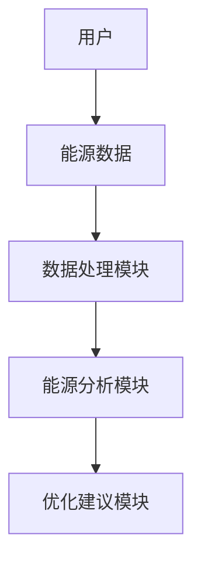
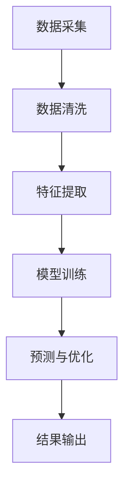
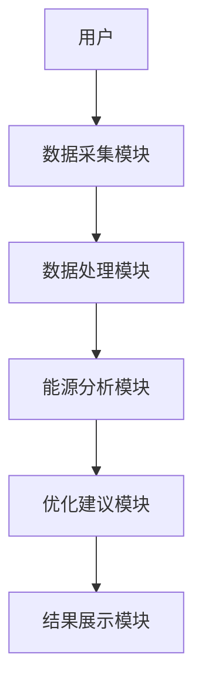

                 

# 《价值投资中的智能城市能源管理系统分析》

---

## 关键词：
价值投资，智能城市，能源管理系统，数据分析，人工智能，能源优化

---

## 摘要：
本文深入探讨了智能城市能源管理系统在价值投资中的应用，分析了该系统的核心概念、技术原理、系统架构以及实际应用案例。通过结合价值投资的基本原理和智能城市能源管理系统的功能特点，本文揭示了如何利用人工智能、大数据和物联网等技术手段，优化能源管理，提升投资收益。文章还详细介绍了系统的数据采集、分析、优化建议模块，以及系统的ER实体关系图、算法流程图和系统架构图，为读者提供了一个全面的技术视角。

---

# 目录大纲

## 第一部分: 智慧城市能源管理系统概述

### 第1章: 价值投资与智能城市能源管理的背景

#### 1.1 价值投资的基本概念
- 1.1.1 价值投资的定义与核心理念
- 1.1.2 价值投资在现代金融中的地位
- 1.1.3 价值投资与智能城市能源管理的结合

#### 1.2 智能城市能源管理系统的定义与背景
- 1.2.1 智慧城市能源管理系统的概念
- 1.2.2 智能城市能源管理系统的演进历程
- 1.2.3 智能城市能源管理系统的应用场景

#### 1.3 智能城市能源管理系统的技术驱动
- 1.3.1 人工智能在能源管理中的应用
- 1.3.2 大数据技术在能源管理中的作用
- 1.3.3 物联网技术在能源管理中的整合

#### 1.4 价值投资与智能城市能源管理的融合
- 1.4.1 价值投资视角下的能源管理系统分析
- 1.4.2 智能城市能源管理系统对价值投资的促进作用
- 1.4.3 价值投资与智能能源管理的未来趋势

#### 1.5 本章小结

### 第2章: 智能城市能源管理系统的核心概念

#### 2.1 智能城市能源管理系统的组成要素
- 2.1.1 数据采集与处理模块
- 2.1.2 能源消耗分析模块
- 2.1.3 能源优化建议模块

#### 2.2 智能城市能源管理系统的属性特征对比
- 2.2.1 系统的实时性与准确性对比
- 2.2.2 系统的可扩展性与稳定性对比
- 2.2.3 系统的经济性与环保性对比

#### 2.3 智能城市能源管理系统ER实体关系图

---

## 第二部分: 智能城市能源管理系统的技术分析

### 第3章: 价值投资分析的核心算法原理

#### 3.1 价值投资分析的基本原理
- 3.1.1 能源管理系统中的数据采集与处理
- 3.1.2 数据分析与预测模型的建立
- 3.1.3 优化建议的生成与实施

#### 3.2 人工智能算法在能源管理中的应用
- 3.2.1 线性回归模型的建立与应用
- 3.2.2 时间序列分析模型的实现
- 3.2.3 支持向量机（SVM）在能源预测中的应用

#### 3.3 算法流程图

#### 3.4 优化建议的数学模型
- 3.4.1 基于线性回归的能源消耗预测模型
- 3.4.2 基于时间序列的能源价格预测模型
- 3.4.3 基于支持向量机的能源需求预测模型

#### 3.5 代码实现与解读
- 3.5.1 数据处理与清洗的Python代码示例
- 3.5.2 线性回归模型的实现与应用
- 3.5.3 时间序列分析模型的实现与应用

---

### 第4章: 智能城市能源管理系统的架构设计

#### 4.1 系统架构概述
- 4.1.1 系统的整体架构图
- 4.1.2 系统的功能模块划分
- 4.1.3 系统的硬件与软件架构

#### 4.2 系统功能设计
- 4.2.1 数据采集与处理模块的设计
- 4.2.2 能源分析模块的设计
- 4.2.3 优化建议模块的设计

#### 4.3 系统接口设计
- 4.3.1 系统内部接口的设计
- 4.3.2 系统外部接口的设计
- 4.3.3 接口的交互流程图

#### 4.4 系统交互流程图

---

## 第三部分: 项目实战与案例分析

### 第5章: 智能城市能源管理系统项目实战

#### 5.1 项目背景与目标
- 5.1.1 项目背景介绍
- 5.1.2 项目目标设定
- 5.1.3 项目范围界定

#### 5.2 项目环境搭建
- 5.2.1 开发工具的安装与配置
- 5.2.2 数据源的获取与处理
- 5.2.3 系统架构的搭建与测试

#### 5.3 核心代码实现
- 5.3.1 数据采集模块的实现
- 5.3.2 数据分析模块的实现
- 5.3.3 优化建议模块的实现

#### 5.4 代码实现与解读
- 5.4.1 数据采集与处理的Python代码示例
- 5.4.2 数据分析与预测的Python代码示例
- 5.4.3 优化建议的生成与展示

#### 5.5 项目案例分析
- 5.5.1 案例背景介绍
- 5.5.2 数据分析与预测过程
- 5.5.3 优化建议的实施与效果评估

#### 5.6 项目总结与经验分享
- 5.6.1 项目实施过程中的关键点
- 5.6.2 项目成功与失败的经验总结
- 5.6.3 项目优化的建议与方向

---

## 第四部分: 最佳实践与未来展望

### 第6章: 智能城市能源管理系统的最佳实践

#### 6.1 系统设计与优化的注意事项
- 6.1.1 数据采集与处理的关键点
- 6.1.2 系统架构设计的注意事项
- 6.1.3 优化建议模块的实现要点

#### 6.2 项目实施中的常见问题与解决方案
- 6.2.1 数据质量问题的解决方案
- 6.2.2 系统性能优化的建议
- 6.2.3 项目管理中的常见问题与解决方案

#### 6.3 未来发展趋势与研究方向
- 6.3.1 人工智能在能源管理中的未来应用
- 6.3.2 大数据技术在能源管理中的深入发展
- 6.3.3 物联网技术的进一步融合与创新

---

## 第五部分: 结论与展望

### 第7章: 结论与展望

#### 7.1 本文总结
- 7.1.1 价值投资与智能城市能源管理的结合
- 7.1.2 智能城市能源管理系统的核心技术与实现
- 7.1.3 项目实战与案例分析的总结

#### 7.2 未来展望
- 7.2.1 人工智能在能源管理中的进一步应用
- 7.2.2 大数据技术与物联网技术的深度融合
- 7.2.3 智能城市能源管理系统的未来发展与创新方向

---

## 参考文献
（此处列出相关的参考文献，包括书籍、期刊论文、技术报告等。）

---

## 致谢
（感谢在撰写过程中给予帮助和支持的单位和个人。）

---

通过以上目录大纲，我们可以清晰地看到文章的结构和内容安排，每一部分都详细地涵盖了智能城市能源管理系统在价值投资中的应用分析，从理论到实践，从系统设计到项目实现，再到未来展望，内容全面且逻辑清晰。

