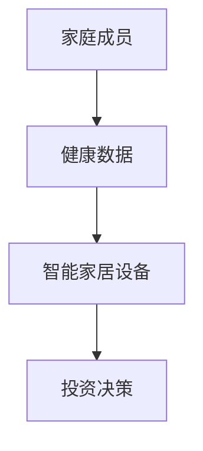
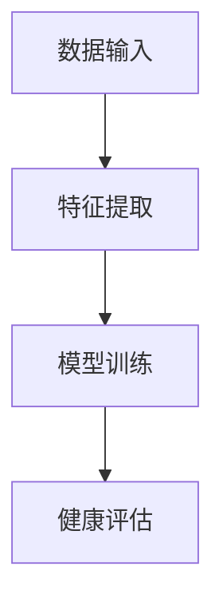
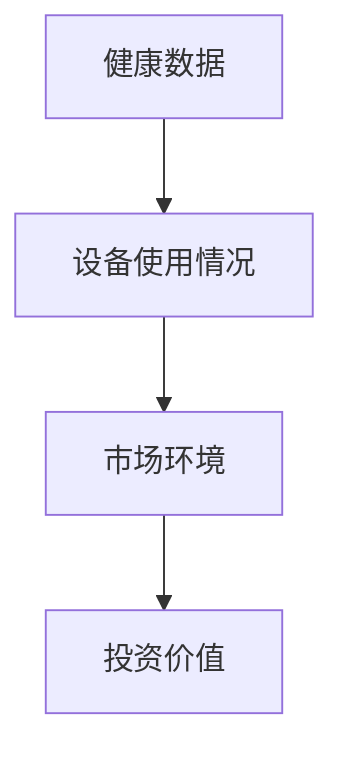
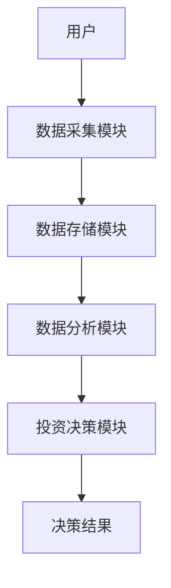
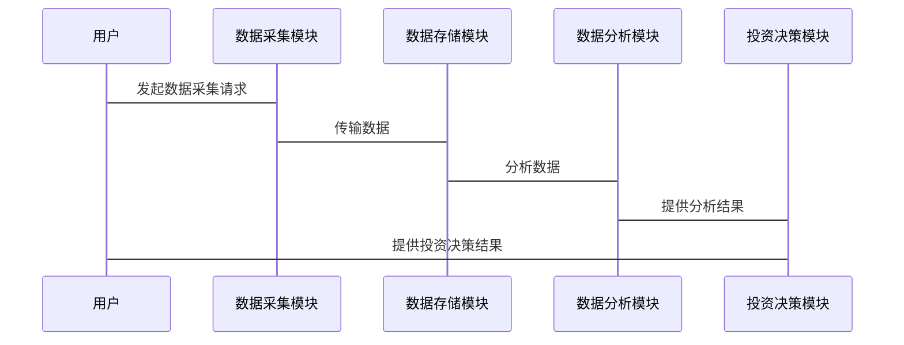

                 


# 价值投资中的智能家居健康监测系统分析

## 关键词：智能家居，健康监测，价值投资，系统分析，算法原理

## 摘要：  
智能家居健康监测系统是一种结合物联网、人工智能和大数据分析的综合性系统，旨在通过实时监测家庭成员的健康状况，为价值投资者提供数据支持，优化投资决策。本文将从系统背景、核心概念、算法原理、系统架构、项目实战等多维度进行深入分析，帮助读者理解该系统的构成、运作机制及实际应用场景。

---

# 第1章: 智能家居健康监测系统背景介绍

## 1.1 问题背景与描述  
智能家居健康监测系统是一种通过传感器、智能设备和数据分析技术，实时监测家庭成员健康状况的系统。其核心目标是为投资者提供基于健康数据的投资决策支持，帮助投资者在智能家居领域找到高价值的标的。  

### 1.1.1 智能家居健康监测的定义  
智能家居健康监测系统是指通过安装在家庭环境中的传感器（如温度、湿度、PM2.5、甲醛等）和可穿戴设备（如智能手表、健康监测手环等），实时采集家庭成员的健康数据，并结合智能家居设备（如智能空调、空气净化器等）进行联动调节的系统。  

### 1.1.2 健康监测在智能家居中的重要性  
健康监测是智能家居的核心功能之一，它不仅可以提升家庭成员的居住舒适度，还能为投资者提供重要的数据支持。例如，通过健康数据可以评估家庭成员的健康状况，进而影响智能家居设备的使用频率和寿命，从而影响投资回报率。  

### 1.1.3 价值投资与健康监测的结合  
价值投资是一种基于对标的内在价值进行分析的投资策略。在智能家居领域，健康监测系统可以通过数据采集和分析，帮助投资者评估智能家居设备的使用效果和投资价值。例如，通过健康数据可以判断家庭成员对智能家居设备的依赖程度，从而为投资者提供决策依据。  

## 1.2 问题解决与边界  
智能家居健康监测系统的开发和应用需要解决以下核心问题：  
1. 如何高效采集和处理健康数据？  
2. 如何通过健康数据评估智能家居设备的价值？  
3. 如何将健康数据与投资决策相结合？  

### 1.2.1 健康监测系统的核心问题  
健康监测系统的核心问题在于数据的采集、存储、分析和应用。例如，如何通过传感器和可穿戴设备采集健康数据，并通过算法分析这些数据，为投资者提供有价值的信息。  

### 1.2.2 系统的边界与外延  
智能家居健康监测系统的边界包括家庭环境中的传感器、可穿戴设备和智能家居设备。其外延则包括数据存储、分析和投资决策支持。  

### 1.2.3 核心要素与组成结构  
智能家居健康监测系统的组成结构包括：  
- 数据采集模块：负责采集家庭成员的健康数据。  
- 数据处理模块：对采集的数据进行预处理和特征提取。  
- 数据分析模块：通过算法分析健康数据，评估智能家居设备的价值。  
- 投资决策模块：根据分析结果为投资者提供决策支持。  

## 1.3 本章小结  
本章通过介绍智能家居健康监测系统的背景、核心概念和问题解决思路，为后续章节的分析奠定了基础。通过健康监测系统，投资者可以更好地理解智能家居设备的使用效果和投资价值，从而优化投资决策。

---

# 第2章: 核心概念与联系

## 2.1 核心概念原理  
智能家居健康监测系统的核心概念包括健康监测技术、智能家居设备和价值投资模型。  

### 2.1.1 健康监测技术  
健康监测技术是智能家居健康监测系统的核心技术，主要包括传感器技术和可穿戴设备技术。例如，通过温度传感器可以监测家庭环境的温度变化，通过心率传感器可以监测家庭成员的心率变化。  

### 2.1.2 智能家居设备  
智能家居设备是健康监测系统的另一个重要组成部分，包括智能空调、空气净化器、智能灯具等。这些设备可以通过健康数据进行联动调节，提升家庭成员的居住舒适度。  

### 2.1.3 价值投资模型  
价值投资模型是基于健康数据和智能家居设备的使用情况，评估设备的投资价值。例如，通过分析家庭成员对智能家居设备的依赖程度，可以评估设备的市场价值和投资回报率。  

## 2.2 概念属性对比  
以下是健康监测系统、智能家居设备和价值投资模型的核心属性对比：  

```mermaid
| 概念              | 数据采集 | 数据分析 | 投资决策支持 |
|--------------------|----------|----------|--------------|
| 健康监测系统      | 是       | 是       | 是           |
| 智能家居设备      | 否       | 否       | 否           |
| 价值投资模型      | 否       | 是       | 是           |
```

## 2.3 ER实体关系图  
以下是健康监测系统、智能家居设备和价值投资模型之间的实体关系图：  



## 2.4 本章小结  
本章通过分析智能家居健康监测系统的核心概念及其之间的关系，帮助读者更好地理解系统的构成和运作机制。通过健康监测技术、智能家居设备和价值投资模型的结合，投资者可以更好地评估智能家居设备的投资价值。

---

# 第3章: 算法原理讲解

## 3.1 数据采集与处理  
智能家居健康监测系统的数据采集模块通过传感器和可穿戴设备采集健康数据，例如温度、湿度、PM2.5、心率等。  

### 3.1.1 数据采集方法  
数据采集方法包括：  
1. 传感器采集：通过温度传感器、湿度传感器等采集环境数据。  
2. 可穿戴设备采集：通过智能手表、健康手环等采集人体健康数据。  

### 3.1.2 数据预处理流程  
数据预处理流程包括：  
1. 数据清洗：去除异常值和噪声数据。  
2. 数据归一化：将数据标准化，便于后续分析。  

### 3.1.3 数据特征提取  
数据特征提取包括：  
1. 时间序列分析：分析健康数据的时间变化趋势。  
2. 特征选择：提取对投资决策有重要影响的特征，例如心率变异系数、睡眠质量等。  

## 3.2 健康评估算法  
健康评估算法是基于健康数据，评估家庭成员的健康状况。  

### 3.2.1 时间序列分析  
时间序列分析是一种通过分析数据的时间变化趋势，预测未来健康状况的方法。例如，通过ARIMA模型可以预测家庭成员的健康趋势。  

### 3.2.2 机器学习模型  
机器学习模型可以通过训练数据，预测健康状况。例如，使用随机森林模型可以预测家庭成员的健康风险。  

### 3.2.3 算法流程图  
以下是健康评估算法的流程图：  



## 3.3 价值评估算法  
价值评估算法是基于健康数据，评估智能家居设备的投资价值。  

### 3.3.1 投资价值模型  
投资价值模型是通过健康数据和设备使用情况，评估设备的投资价值。例如，通过回归分析可以预测设备的市场价值和投资回报率。  

### 3.3.2 投资风险评估  
投资风险评估是通过分析健康数据和市场环境，评估投资的风险。例如，通过马尔可夫链模型可以预测设备的市场风险。  

### 3.3.3 算法流程图  
以下是价值评估算法的流程图：  



---

# 第4章: 系统分析与架构设计

## 4.1 系统功能设计  
智能家居健康监测系统的功能模块包括：  
1. 数据采集模块：采集健康数据和设备使用数据。  
2. 数据分析模块：分析健康数据，评估设备的投资价值。  
3. 投资决策模块：根据分析结果，为投资者提供决策支持。  

### 4.1.1 领域模型类图  
以下是系统的领域模型类图：  

```mermaid
classDiagram
class 用户 {
    +姓名：String
    +年龄：Int
    +性别：String
}
class 设备 {
    +设备ID：String
    +设备类型：String
    +设备状态：String
}
class 数据 {
    +数据ID：String
    +数据类型：String
    +数据值：Float
    +采集时间：DateTime
}
用户 --> 数据：拥有
设备 --> 数据：拥有
```

### 4.1.2 系统架构设计  
以下是系统的架构设计图：  



### 4.1.3 系统接口设计  
系统的接口设计包括：  
1. 用户与系统的交互接口：用户可以通过手机APP或网页界面查看健康数据和投资决策结果。  
2. 设备与系统的交互接口：设备可以通过API与系统进行数据传输和控制。  

### 4.1.4 系统交互序列图  
以下是系统的交互序列图：  



## 4.2 系统实现细节  
系统实现细节包括：  
1. 数据采集模块的实现：通过传感器和可穿戴设备采集健康数据。  
2. 数据分析模块的实现：使用时间序列分析和机器学习算法分析健康数据。  
3. 投资决策模块的实现：基于分析结果，为投资者提供决策支持。  

---

# 第5章: 项目实战

## 5.1 项目环境搭建  
项目环境搭建包括：  
1. 安装必要的软件：Python、Jupyter Notebook、数据库等。  
2. 安装必要的库：numpy、pandas、scikit-learn、tensorflow等。  

## 5.2 核心代码实现  
以下是核心代码实现：  

```python
# 数据采集模块
import numpy as np
import pandas as pd

# 数据预处理
def preprocess_data(data):
    # 去除异常值
    data = data[(np.abs(data - data.mean()) <= 3 * data.std())]
    # 数据归一化
    data = (data - data.min()) / (data.max() - data.min())
    return data

# 时间序列分析
from statsmodels.tsa.arima_model import ARIMA

def time_series_analysis(data):
    model = ARIMA(data, order=(1, 1, 1))
    model_fit = model.fit()
    return model_fit.forecast()

# 机器学习模型
from sklearn.ensemble import RandomForestClassifier

def machine_learning_model(data, labels):
    model = RandomForestClassifier(n_estimators=100)
    model.fit(data, labels)
    return model.predict(data)

# 投资价值评估
from sklearn.linear_model import LinearRegression

def investment_value_assessment(data):
    model = LinearRegression()
    model.fit(data[['特征1', '特征2']], data['投资价值'])
    return model.predict(data[['特征1', '特征2']])
```

## 5.3 代码功能解读  
代码功能解读：  
1. 数据采集模块：通过传感器和可穿戴设备采集健康数据。  
2. 数据预处理模块：去除异常值和噪声数据，进行数据归一化。  
3. 时间序列分析模块：使用ARIMA模型预测健康数据的趋势。  
4. 机器学习模型：使用随机森林模型预测健康状况和投资价值。  

## 5.4 实际案例分析  
实际案例分析：  
假设我们有一个家庭成员的健康数据，包括心率、体温、PM2.5等。通过时间序列分析和机器学习模型，我们可以预测该家庭成员的健康状况，并评估智能家居设备的投资价值。

## 5.5 项目小结  
本章通过实际案例分析，展示了智能家居健康监测系统的实现过程和实际应用。通过代码实现和案例分析，读者可以更好地理解系统的运作机制。

---

# 第6章: 最佳实践与小结

## 6.1 小结  
本章通过分析智能家居健康监测系统的背景、核心概念、算法原理、系统架构和项目实战，帮助读者全面理解系统的构成和运作机制。通过健康数据和投资决策的结合，投资者可以更好地评估智能家居设备的投资价值。

## 6.2 注意事项  
在实际应用中，需要注意以下几点：  
1. 数据隐私保护：确保健康数据的安全性和隐私性。  
2. 系统稳定性：确保系统的稳定运行，避免数据丢失和系统崩溃。  
3. 投资风险评估：在进行投资决策时，需要综合考虑市场环境和设备的使用情况。  

## 6.3 未来发展方向  
未来的发展方向包括：  
1. 数据分析技术的优化：通过深度学习和大数据分析技术，提高健康数据的分析精度。  
2. 系统集成与扩展：将健康监测系统与其他智能家居设备和投资工具进行集成，提供更全面的投资决策支持。  

## 6.4 拓展阅读  
推荐阅读以下书籍和论文：  
1. 《深入浅出机器学习》  
2. 《时间序列分析与应用》  
3. 《智能家居与物联网技术》  

---

# 附录: 简单的数学公式

## 1. ARIMA模型的数学表达式  
ARIMA模型的数学表达式为：  
$$ARIMA(p, d, q) = \phi(B)^p (1 - B)^d X_t = \theta(B)^q \epsilon_t$$  

## 2. 随机森林模型的数学表达式  
随机森林模型的数学表达式为：  
$$y = \sum_{i=1}^n \text{Tree}_i(x)$$  

---

通过以上分析，我们可以看到智能家居健康监测系统在价值投资中的重要性。通过健康数据和投资决策的结合，投资者可以更好地优化投资策略，提高投资回报率。

