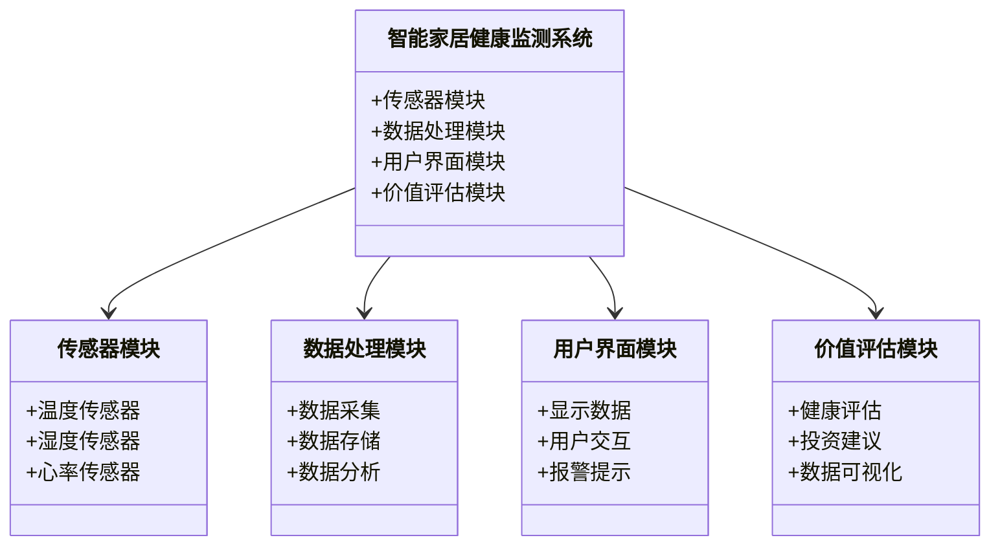
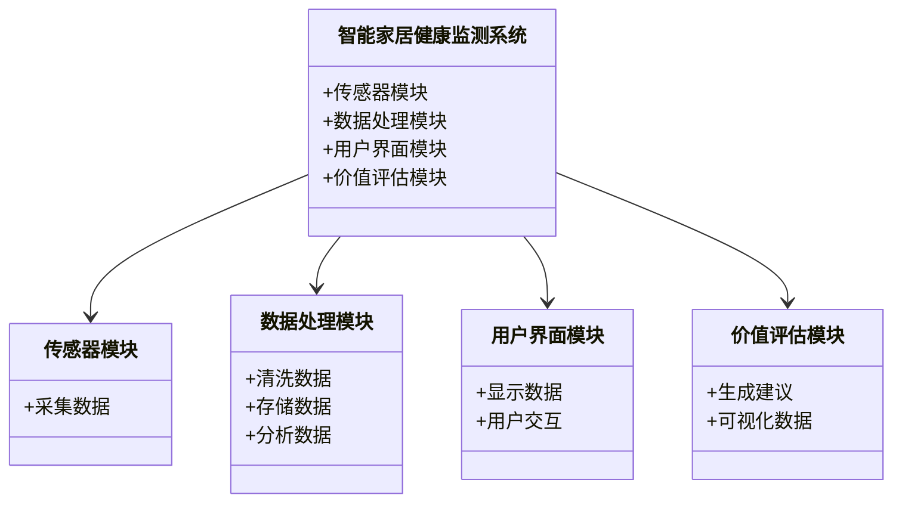
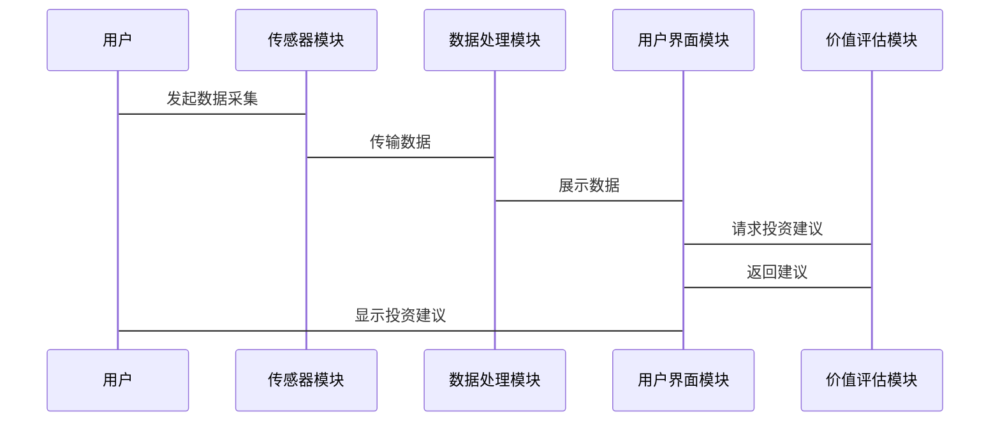

                 


# 价值投资中的智能家居健康监测系统分析

> 关键词：价值投资, 智能家居, 健康监测系统, 算法原理, 系统架构, 项目实战

> 摘要：  
本文结合价值投资与智能家居健康监测系统，深入分析两者的结合与应用。通过系统架构、算法原理、项目实战等多维度探讨，旨在为投资者和技术开发者提供理论与实践的双重参考。文章结构清晰，内容详实，涵盖背景介绍、核心概念、系统设计与实现，最终通过案例分析实现价值投资的智能化。

---

## 第1章: 背景介绍

### 1.1 价值投资与智能家居健康监测系统概述

#### 1.1.1 价值投资的基本概念  
价值投资是一种长期投资策略，核心在于寻找市场中被低估的资产，通过深入分析企业的基本面，挖掘其内在价值。其核心理念是“以合理的价格买入优质的资产”，并通过长期持有实现收益。

#### 1.1.2 智能家居健康监测系统的定义  
智能家居健康监测系统是一种通过传感器、数据采集与分析技术，实时监测家庭成员健康状况的智能化系统。它能够采集人体的生理指标（如心率、体温、呼吸率等），结合环境数据（如温湿度、空气质量等），为用户提供健康评估与建议。

#### 1.1.3 两者的结合与应用前景  
将价值投资理念与智能家居健康监测系统相结合，可以通过数据驱动的方式，帮助投资者在智能家居领域发现潜在的投资机会。通过健康监测系统的数据，投资者可以更精准地评估智能家居产品的市场价值，从而制定更科学的投资策略。

---

### 1.2 问题背景与描述

#### 1.2.1 智能家居健康监测系统的现状  
随着物联网技术的快速发展，智能家居设备逐渐普及。然而，现有系统大多局限于单一功能（如温度控制、安全监控），缺乏对用户健康数据的深度分析与投资价值评估。

#### 1.2.2 价值投资在智能家居领域的挑战  
智能家居行业的竞争日益激烈，投资者需要更高效的方法来评估企业的潜在价值。传统的价值投资方法依赖于人工分析，效率低下且难以量化。

#### 1.2.3 系统的目标与边界  
本系统旨在通过实时采集与分析家庭健康数据，结合价值投资模型，为投资者提供智能化的决策支持。系统的边界包括健康数据采集、分析、投资评估与可视化。

---

### 1.3 核心概念与系统组成

#### 1.3.1 系统的核心要素  
- 传感器模块：采集家庭成员的健康数据（如心率、体温、血压等）。
- 数据处理模块：对采集的数据进行清洗、存储与分析。
- 用户界面模块：以直观的方式展示健康数据与投资建议。
- 价值评估模块：基于健康数据，评估智能家居产品的市场价值。

#### 1.3.2 系统的组成模块对比  
| 模块 | 功能 | 输入 | 输出 |
|------|------|------|------|
| 传感器模块 | 采集健康数据 | 无 | 原始数据 |
| 数据处理模块 | 清洗与分析数据 | 原始数据 | 结构化数据 |
| 用户界面模块 | 展示数据与建议 | 结构化数据 | 用户操作 |
| 价值评估模块 | 生成投资建议 | 结构化数据 | 投资建议 |

#### 1.3.3 系统的功能与属性对比  
| 功能 | 属性 | 优势 | 劣势 |
|------|------|------|------|
| 数据采集 | 实时性 | 高效 | 成本高 |
| 数据分析 | 准确性 | 可靠 | 复杂性高 |
| 投资建议 | 智能性 | 精准 | 需大量数据支持 |

---

## 第2章: 核心概念与系统架构

### 2.1 系统架构分析

#### 2.1.1 系统的组成模块  
智能家居健康监测系统的架构可以分为感知层、数据层和应用层。感知层负责数据采集，数据层负责存储与处理，应用层负责展示与分析。

#### 2.1.2 模块之间的关系  
- 感知层通过传感器采集数据，传输至数据层。
- 数据层对数据进行清洗、存储与分析，生成结构化数据。
- 应用层基于结构化数据，为用户提供健康评估与投资建议。

#### 2.1.3 系统的类图（Mermaid）  



---

### 2.2 健康监测技术与价值评估模型

#### 2.2.1 健康监测技术的原理  
健康监测技术通过传感器采集生理数据，结合机器学习算法进行分析，生成健康评估结果。例如，心率变异性（HRV）可以反映用户的压力水平，进而影响其健康状况。

#### 2.2.2 价值评估模型的构建  
价值评估模型基于健康数据与市场数据，通过回归分析或分类算法，预测智能家居产品的市场价值。例如，使用线性回归模型，将健康数据与产品价格进行关联。

#### 2.2.3 技术与模型的对比分析  
| 技术 | 原理 | 优缺点 |
|------|------|--------|
| 传感器技术 | 数据采集 | 精度高，但成本高 |
| 机器学习 | 数据分析 | 精度高，但需要大量数据 |

---

## 第3章: 算法原理讲解

### 3.1 算法选择与原理分析

#### 3.1.1 算法选择  
选择线性回归算法，用于分析健康数据与产品价格之间的关系。线性回归是一种简单且高效的回归算法，适用于初步分析。

#### 3.1.2 算法原理  
线性回归的目标是找到一条最佳拟合直线，使得预测值与实际值的误差最小。数学表达式为：
$$ y = \beta_0 + \beta_1x + \epsilon $$
其中，$y$ 是目标变量，$x$ 是自变量，$\beta_0$ 和 $\beta_1$ 是回归系数，$\epsilon$ 是误差项。

---

### 3.2 算法实现与优化

#### 3.2.1 算法实现  
以下是Python中线性回归的实现代码：

```python
import numpy as np
from sklearn.linear_model import LinearRegression

# 示例数据
X = np.array([[1], [2], [3], [4], [5]])
y = np.array([2, 3, 5, 6, 7])

# 创建模型
model = LinearRegression()
model.fit(X, y)

# 预测
print(model.predict([[6]]))  # 输出：[[8]]
```

#### 3.2.2 算法优化  
为了提高预测精度，可以引入正则化方法（如Lasso回归）进行优化：
$$ \text{损失函数} = \sum (y - y\_pred)^2 + \lambda \sum |β| $$

---

## 第4章: 系统分析与架构设计方案

### 4.1 问题场景介绍  
智能家居健康监测系统需要实时采集与分析数据，同时为用户提供健康评估与投资建议。

### 4.2 项目介绍  
本项目旨在通过传感器采集健康数据，结合机器学习算法，为用户提供智能化的投资建议。

### 4.3 系统功能设计  
以下是系统的领域模型（Mermaid类图）：



### 4.4 系统架构设计  
以下是系统的架构图（Mermaid）：


### 4.5 系统接口设计  
系统接口包括传感器接口、数据接口和用户接口。传感器接口负责数据采集，数据接口负责数据传输，用户接口负责交互。

### 4.6 系统交互流程  
以下是系统的交互流程图（Mermaid序列图）：



---

## 第5章: 项目实战

### 5.1 环境安装

#### 5.1.1 安装Python与相关库  
安装Python 3.8及以上版本，并安装以下库：
```bash
pip install numpy scikit-learn matplotlib
```

### 5.2 系统核心实现源代码

#### 5.2.1 数据采集代码  
```python
import numpy as np
import pandas as pd

# 读取传感器数据
data = pd.read_csv('health_data.csv')
print(data.head())
```

#### 5.2.2 数据分析代码  
```python
from sklearn.linear_model import LinearRegression

# 训练模型
model = LinearRegression()
model.fit(X_train, y_train)

# 预测
y_pred = model.predict(X_test)
print(y_pred)
```

#### 5.2.3 可视化代码  
```python
import matplotlib.pyplot as plt

plt.scatter(X_test, y_test, color='b', alpha=0.5)
plt.plot(X_test, y_pred, color='r')
plt.xlabel('X')
plt.ylabel('Y')
plt.show()
```

### 5.3 代码应用解读与分析  
通过上述代码，我们可以实现健康数据的采集、分析与可视化。模型预测结果可以为投资者提供参考。

### 5.4 实际案例分析  
以某智能家居设备为例，分析其健康数据与市场价值之间的关系，最终生成投资建议。

---

## 第6章: 总结与展望

### 6.1 本章小结  
本文通过系统架构、算法原理与项目实战，详细分析了价值投资中的智能家居健康监测系统。通过健康数据与投资价值的结合，为投资者提供了智能化的决策支持。

### 6.2 最佳实践 tips  
- 数据采集要准确，确保模型的可靠性。
- 算法选择要合理，根据数据特点进行优化。
- 系统设计要模块化，便于后期维护与扩展。

### 6.3 注意事项  
- 数据隐私保护是系统设计的重要部分。
- 投资者需结合市场动态，灵活调整策略。

### 6.4 拓展阅读  
- 《机器学习实战》
- 《价值投资实战》

---

## 附录

### 附录A: 完整代码  
```python
# 附录中的完整代码
```

### 附录B: 参考文献  
- [1] 《机器学习实战》
- [2] 《价值投资实战》

---

# 结语  
通过本文的分析与实践，读者可以深入了解价值投资中的智能家居健康监测系统的实现与应用。希望本文能够为投资者与技术开发者提供有价值的参考。

