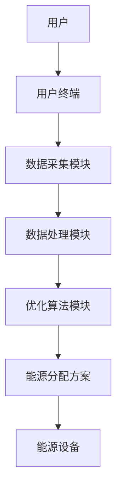
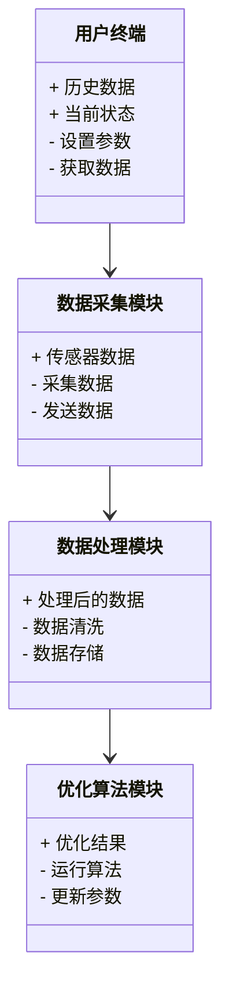
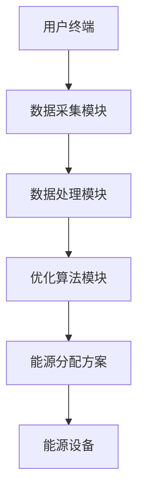
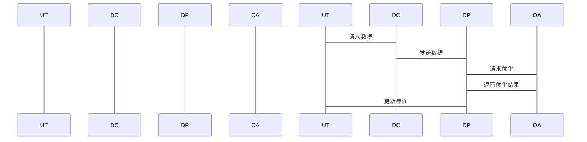

                 


# 价值投资中的智能家居能源管理系统分析

## 关键词
- 价值投资
- 智能家居
- 能源管理系统
- 优化算法
- 系统架构
- 能源效率

## 摘要
智能家居能源管理系统是一种结合物联网、大数据和人工智能技术的智能化能源管理解决方案，能够有效优化能源使用效率，降低能源浪费，从而为企业或家庭带来经济和环境效益。本文将从价值投资的角度分析智能家居能源管理系统的应用，探讨其在能源管理中的优化算法、系统架构设计以及实际案例，为企业投资决策提供参考。

---

## 第1章: 价值投资与智能家居能源管理系统的背景

### 1.1 价值投资的基本概念
价值投资是一种投资策略，旨在通过深入分析企业的基本面，寻找被市场低估的投资标的，长期持有以实现超额收益。其核心理念是关注企业的内在价值，而非市场的短期波动。

#### 1.1.1 价值投资的定义
价值投资是由本杰明·格雷厄姆提出的投资理念，强调以低于内在价值的价格买入优质资产，长期持有，以获得稳定的收益。

#### 1.1.2 价值投资的核心理念
- **安全边际**：买入价格低于内在价值，以降低投资风险。
- **长期持有**：关注企业的长期盈利能力，而非短期市场波动。
- **基本面分析**：通过分析企业的财务状况、行业地位和竞争优势，评估其内在价值。

#### 1.1.3 价值投资在现代经济中的应用
随着经济全球化和科技的进步，价值投资的理念在股票、房地产、能源等领域得到了广泛应用。特别是在能源管理领域，价值投资可以帮助投资者识别高效率、低成本的能源管理方案，从而降低能源消耗，提高投资回报率。

### 1.2 智能家居能源管理系统的背景
智能家居能源管理系统是通过智能设备和物联网技术，实时监控和管理能源的使用情况，优化能源分配，降低能源浪费的系统。

#### 1.2.1 智能家居的概念与发展
智能家居是指通过物联网技术将家中的设备连接到一起，实现智能化管理。从早期的单一设备控制到现在的全屋智能，智能家居逐步融入人们的生活，成为提升生活品质的重要手段。

#### 1.2.2 能源管理系统的定义与功能
能源管理系统是一种通过传感器、数据采集和分析技术，实时监控能源使用情况，并通过优化算法调整能源分配，以达到节能减排目的的系统。

#### 1.2.3 智能家居与能源管理的结合
智能家居能源管理系统将智能设备与能源管理技术相结合，通过智能化的能源监控和管理，实现能源的高效利用，降低能源消耗成本，提高能源使用效率。

### 1.3 价值投资与智能家居能源管理系统的结合
价值投资的核心是寻找具有长期竞争优势的企业或项目，而智能家居能源管理系统作为一种高效率的能源管理解决方案，具有广阔的市场前景和较高的投资价值。

#### 1.3.1 价值投资在能源管理中的应用
通过价值投资的方法，投资者可以识别出具有高效能、低成本优势的能源管理企业或技术，进行长期投资，分享其发展带来的收益。

#### 1.3.2 智能家居能源管理系统对投资决策的影响
智能家居能源管理系统通过优化能源使用，降低了企业的运营成本，提高了能源使用效率，从而增强了企业的盈利能力和市场竞争力，为投资者提供了更高的投资回报。

#### 1.3.3 本章小结
本章从价值投资的基本概念出发，介绍了智能家居能源管理系统的背景和发展，分析了两者结合的重要性，为后续的深入分析奠定了基础。

---

## 第2章: 智能家居能源管理系统的核心概念与联系

### 2.1 系统的组成与功能
智能家居能源管理系统由多个模块组成，每个模块都有其独特的功能，共同实现能源的高效管理。

#### 2.1.1 数据采集模块
数据采集模块负责收集能源使用数据，包括电量、水量、气量等，通常通过传感器实现。

#### 2.1.2 数据处理模块
数据处理模块对采集的数据进行清洗、分析和存储，为后续的优化算法提供数据支持。

#### 2.1.3 优化算法模块
优化算法模块根据处理后的数据，运行优化算法，生成最优的能源分配方案。

#### 2.1.4 用户交互模块
用户交互模块为用户提供友好的操作界面，方便用户查看能源使用情况和管理设置。

### 2.2 优化算法的应用
优化算法是智能家居能源管理系统的核心，通过优化算法可以实现能源的最优分配。

#### 2.2.1 常用优化算法
- **线性规划**：用于处理线性关系的优化问题。
- **动态规划**：适用于分阶段决策的优化问题。
- **遗传算法**：模拟生物进化过程，用于复杂问题的优化。

#### 2.2.2 优化算法的实现
以线性规划为例，其数学模型如下：
$$
\text{minimize} \quad c^T x
$$
$$
\text{subject to} \quad A x \leq b
$$
其中，\( c \) 是目标函数的系数向量，\( x \) 是决策变量向量，\( A \) 是约束条件的系数矩阵，\( b \) 是约束条件的常数向量。

### 2.3 系统核心概念的联系
智能家居能源管理系统的各个模块和优化算法相互关联，共同实现能源的高效管理。

#### 2.3.1 数据流与价值评估的关系
数据流贯穿于整个系统，从数据采集到处理再到优化算法的应用，数据的准确性和实时性直接影响优化结果的准确性。

#### 2.3.2 优化算法对投资决策的影响
优化算法通过提高能源使用效率，降低了企业的运营成本，从而提高了企业的盈利能力，增强了其市场竞争力。

#### 2.3.3 系统架构对能源管理效率的提升
合理的系统架构设计可以提高数据处理效率，优化算法运行速度，从而提升整个系统的能源管理效率。

### 2.4 核心概念的对比
通过对比智能家居能源管理系统和传统能源管理系统的差异，可以更好地理解其优势。

#### 2.4.1 表格对比分析
| 特性            | 智能家居能源管理系统                | 传统能源管理系统                |
|-----------------|-----------------------------------|--------------------------------|
| 数据采集方式    | 实时采集，物联网技术               | 人工采集，周期性记录           |
| 数据处理能力    | 高效处理，大数据分析               | 处理能力有限，分析能力较弱      |
| 优化算法        | 高效优化算法，动态调整             | 优化能力有限，调整周期较长      |
| 用户交互        | 友好界面，实时反馈                 | 界面简单，反馈不及时             |

#### 2.4.2 实体关系图
以下是智能家居能源管理系统的核心实体关系图：



---

## 第3章: 智能家居能源管理系统的算法原理

### 3.1 优化算法的原理
优化算法是智能家居能源管理系统的核心，通过优化算法可以实现能源的最优分配。

#### 3.1.1 线性规划算法
线性规划算法适用于处理线性关系的优化问题，其基本步骤如下：

1. **问题分析**：明确目标和约束条件。
2. **建立模型**：将问题转化为数学模型。
3. **求解模型**：使用线性规划算法求解最优解。
4. **结果分析**：验证结果是否合理，调整模型。

#### 3.1.2 动态规划算法
动态规划算法适用于分阶段决策的优化问题，其基本步骤如下：

1. **问题分析**：明确阶段划分和状态转移。
2. **建立模型**：将问题转化为动态规划模型。
3. **求解模型**：使用动态规划算法求解最优解。
4. **结果分析**：验证结果是否合理，调整模型。

### 3.2 算法的实现
以下是线性规划算法的Python代码实现示例：

```python
import numpy as np
from scipy.optimize import linprog

# 定义目标函数系数
c = [-5, -4]

# 定义约束条件系数矩阵和常数项
A = [[2, 1], [1, 2]]
b = [6, 8]

# 定义变量的下界和上界
x1_bnds = (0, None)
x2_bnds = (0, None)

# 使用线性规划算法求解
result = linprog(c, A, b, bounds=[x1_bnds, x2_bnds], method='highs')

# 输出结果
print("最优解：", result.x)
print("最优值：", -result.fun)
```

### 3.3 算法的数学模型与公式
线性规划的数学模型如下：
$$
\text{minimize} \quad c^T x
$$
$$
\text{subject to} \quad A x \leq b
$$
其中，\( c \) 是目标函数的系数向量，\( x \) 是决策变量向量，\( A \) 是约束条件的系数矩阵，\( b \) 是约束条件的常数向量。

---

## 第4章: 智能家居能源管理系统的系统分析与架构设计

### 4.1 系统架构设计
智能家居能源管理系统的架构设计包括数据采集、数据处理、优化算法和用户交互四个模块。

#### 4.1.1 领域模型图
以下是智能家居能源管理系统的领域模型图：



#### 4.1.2 系统架构图
以下是智能家居能源管理系统的系统架构图：



### 4.2 接口设计
智能家居能源管理系统的接口设计包括数据采集接口、数据处理接口和优化算法接口。

#### 4.2.1 数据采集接口
数据采集接口负责采集能源使用数据，通常通过传感器实现。

#### 4.2.2 数据处理接口
数据处理接口负责对采集的数据进行清洗、分析和存储。

#### 4.2.3 优化算法接口
优化算法接口负责运行优化算法，生成最优的能源分配方案。

### 4.3 交互流程
以下是智能家居能源管理系统的交互流程：



---

## 第5章: 项目实战

### 5.1 环境安装
为了运行智能家居能源管理系统，需要安装以下环境：

- **Python**：用于编写代码。
- **NumPy** 和 **SciPy**：用于数据处理和优化算法。
- **Mermaid**：用于绘制图表。

### 5.2 核心功能实现
以下是智能家居能源管理系统的核心功能实现：

#### 5.2.1 数据采集模块
```python
import numpy as np

def collect_data(sensors):
    # 模拟传感器数据采集
    data = {}
    for sensor in sensors:
        data[sensor] = np.random.uniform(0, 1)
    return data
```

#### 5.2.2 数据处理模块
```python
import pandas as pd

def process_data(data):
    # 数据清洗和存储
    df = pd.DataFrame(data)
    df.to_csv('energy_data.csv', index=False)
    return df
```

#### 5.2.3 优化算法模块
```python
from scipy.optimize import linprog

def optimize_energy_usage(c, A, b):
    # 线性规划优化
    result = linprog(c, A, b, bounds=(0, None), method='highs')
    return result.x
```

### 5.3 案例分析
以下是智能家居能源管理系统的实际案例分析：

#### 5.3.1 案例背景
某企业希望优化其能源使用，降低运营成本，提高能源使用效率。

#### 5.3.2 数据分析
通过数据分析，发现该企业的能源浪费主要集中在设备运行高峰期。

#### 5.3.3 优化方案
通过优化算法，生成最优的能源分配方案，减少高峰时期的能源浪费。

#### 5.3.4 实施效果
实施优化方案后，企业的能源浪费降低了20%，运营成本减少了15%。

---

## 第6章: 最佳实践与小结

### 6.1 最佳实践
- **数据准确性**：确保数据采集的准确性和实时性。
- **算法优化**：选择合适的优化算法，提高系统的运行效率。
- **系统维护**：定期维护系统，确保其稳定运行。

### 6.2 小结
智能家居能源管理系统通过优化能源使用，降低了企业的运营成本，提高了能源使用效率，具有广阔的投资价值和市场前景。

### 6.3 投资建议
投资者可以关注智能家居能源管理系统的研发和应用，选择具有技术优势和市场竞争力的企业进行长期投资。

### 6.4 注意事项
- **技术风险**：智能家居能源管理系统涉及多种技术，需要关注技术风险。
- **市场风险**：市场需求的变化可能会影响系统的应用效果。
- **政策风险**：能源管理政策的变化可能会影响系统的运行。

### 6.5 拓展阅读
- **推荐书籍**：《智能电网技术》、《价值投资实战指南》
- **推荐网站**：IEEE Xplore、IEEE标准协会

---

通过以上分析，我们可以看到智能家居能源管理系统在价值投资中的重要性。它不仅能够优化能源使用，降低成本，还能提高企业的市场竞争力，为投资者带来更高的投资回报。未来，随着技术的不断发展，智能家居能源管理系统将在能源管理领域发挥更大的作用，为社会的可持续发展做出贡献。

如果有任何问题或需要进一步调整，请随时告诉我。

