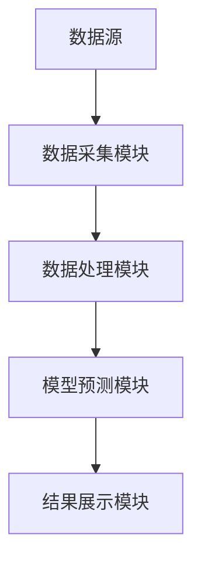

                 


# 《价值投资中的智能工厂预测性维护系统分析》

> 关键词：预测性维护，智能工厂，价值投资，机器学习，深度学习，系统架构

> 摘要：本文详细分析了智能工厂中预测性维护系统的核心概念、算法原理、系统架构及其实现。通过对时间序列分析、机器学习和深度学习算法的深入探讨，结合实际案例，揭示了预测性维护在价值投资中的潜在收益和应用前景。

---

# 第一部分: 预测性维护系统概述

## 第1章: 预测性维护的背景与重要性

### 1.1 问题背景
#### 1.1.1 工厂维护的传统模式
传统的工厂维护模式依赖于定期检查和维修，这种方式效率低下，成本高昂，且难以预测突发故障。

#### 1.1.2 预测性维护的核心概念
预测性维护（Predictive Maintenance）通过实时监测设备状态，利用数据分析和机器学习算法预测设备故障，从而实现精准维护。

#### 1.1.3 价值投资与预测性维护的结合
预测性维护能够降低维护成本、提高设备利用率，从而为企业创造更大的价值，吸引投资者关注。

### 1.2 智能工厂中的预测性维护
#### 1.2.1 智能工厂的定义与特点
智能工厂利用物联网、大数据和人工智能技术，实现生产过程的智能化和自动化。

#### 1.2.2 预测性维护在智能工厂中的应用
通过实时数据采集和分析，预测性维护能够提前发现设备故障，避免生产中断。

#### 1.2.3 预测性维护对价值投资的影响
预测性维护能够降低企业的运营成本，提高设备利用率，从而提升企业的整体价值，吸引更多投资者。

### 1.3 问题解决与边界
#### 1.3.1 问题解决
预测性维护通过数据分析和机器学习算法，解决了传统维护模式中效率低、成本高的问题。

#### 1.3.2 边界与外延
预测性维护的应用范围不仅限于智能工厂，还可以扩展到其他工业领域。

### 1.4 核心要素组成
#### 1.4.1 数据采集模块
通过传感器和物联网技术，实时采集设备运行数据。

#### 1.4.2 数据处理模块
对采集的数据进行清洗、转换和分析，提取特征。

#### 1.4.3 预测模型
基于机器学习和深度学习算法，构建预测模型，预测设备故障。

#### 1.4.4 结果展示
通过可视化工具，展示预测结果和维护建议。

---

# 第二部分: 预测性维护系统的数学模型与算法

## 第2章: 时间序列分析与预测

### 2.1 时间序列分析的原理
时间序列分析是一种通过历史数据预测未来趋势的方法。

#### 2.1.1 ARIMA模型
ARIMA（自回归积分滑动平均模型）是一种常用的时间序列预测模型。

##### ARIMA模型的公式
$$ ARIMA(p, d, q) $$
其中，p为自回归阶数，d为差分阶数，q为移动平均阶数。

#### 2.1.2 LSTM模型
长短期记忆网络（LSTM）是一种特殊的循环神经网络，能够有效处理时间序列数据。

##### LSTM模型的结构
$$
\begin{align*}
i_t &= \sigma(W_{xi}x_t + W_{hi}h_{t-1} + b_i) \\
f_t &= \sigma(W_{xf}x_t + W_{hf}h_{t-1} + b_f) \\
o_t &= \sigma(W_{xo}x_t + W_{ho}h_{t-1} + b_o) \\
g_t &= \tanh(W_{xg}x_t + W_{hg}h_{t-1} + b_g) \\
h_t &= i_t \cdot g_t + f_t \cdot h_{t-1}
\end{align*}
$$

### 2.2 故障预测的数学模型

#### 2.2.1 状态监测与特征提取
通过传感器数据，提取设备运行状态的特征。

#### 2.2.2 基于机器学习的故障分类
使用支持向量机（SVM）或随机森林（Random Forest）等机器学习算法，对设备状态进行分类。

#### 2.2.3 基于深度学习的故障预测
使用卷积神经网络（CNN）或LSTM网络，对设备故障进行预测。

### 2.3 算法实现与优化

#### 2.3.1 算法实现步骤
1. 数据预处理
2. 模型训练
3. 模型预测
4. 结果评估

#### 2.3.2 算法优化策略
- 参数调优
- 数据增强
- 模型集成

#### 2.3.3 性能评估指标
- 准确率
- 召回率
- F1分数

---

# 第三部分: 系统架构设计与实现

## 第3章: 系统架构设计

### 3.1 系统功能模块划分

#### 3.1.1 数据采集模块
负责采集设备运行数据。

#### 3.1.2 数据处理模块
对数据进行清洗、转换和分析。

#### 3.1.3 模型预测模块
基于机器学习和深度学习算法，预测设备故障。

#### 3.1.4 结果展示模块
通过可视化工具，展示预测结果和维护建议。

### 3.2 系统架构图


### 3.3 系统接口设计

#### 3.3.1 数据接口
- 数据采集接口
- 数据处理接口

#### 3.3.2 模型接口
- 模型训练接口
- 模型预测接口

#### 3.3.3 用户接口
- 数据输入接口
- 结果展示接口

### 3.4 系统交互流程图


---

## 第4章: 项目实战

### 4.1 环境安装

#### 4.1.1 安装Python
```bash
python --version
pip install --upgrade pip
```

#### 4.1.2 安装依赖库
```bash
pip install numpy pandas scikit-learn tensorflow
```

### 4.2 系统核心实现

#### 4.2.1 数据采集模块
```python
import pandas as pd
from sklearn.preprocessing import MinMaxScaler
import numpy as np

# 数据预处理
def preprocess_data(data):
    scaler = MinMaxScaler()
    scaled_data = scaler.fit_transform(data)
    return scaled_data
```

#### 4.2.2 模型预测模块
```python
from tensorflow.keras.models import Sequential
from tensorflow.keras.layers import LSTM, Dense

# LSTM模型构建
def build_model(input_shape):
    model = Sequential()
    model.add(LSTM(50, input_shape=input_shape))
    model.add(Dense(1))
    model.compile(loss='mean_squared_error', optimizer='adam')
    return model
```

### 4.3 实际案例分析

#### 4.3.1 数据分析
通过分析历史数据，发现设备运行中的异常模式。

#### 4.3.2 模型训练
使用训练数据训练LSTM模型，评估模型性能。

#### 4.3.3 预测结果展示
通过可视化工具展示预测结果，指导维护决策。

### 4.4 项目总结

#### 4.4.1 成果展示
展示预测性维护系统的实际应用效果。

#### 4.4.2 经验总结
总结项目实施中的经验和教训。

#### 4.4.3 优化建议
提出进一步优化系统的建议。

---

# 第四部分: 总结与展望

## 第5章: 总结与展望

### 5.1 总结
预测性维护系统在智能工厂中的应用，能够显著提高设备利用率，降低维护成本，为企业创造更大的价值。

### 5.2 未来展望
随着人工智能和物联网技术的不断发展，预测性维护系统将更加智能化和精准化，为价值投资带来更大的潜力。

---

# 参考文献

（此处列出相关书籍、论文和网站资源）

---

**附录**

（此处列出代码示例、数据集和其他补充材料）

---

通过以上目录和内容设计，您可以开始撰写完整的博客文章，逐步展开每个部分的内容，确保逻辑清晰、结构紧凑、语言专业且易于理解。

