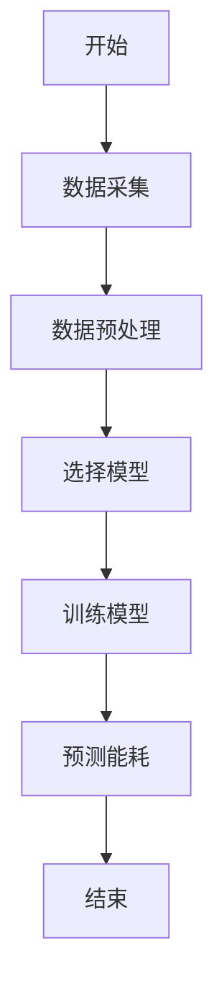
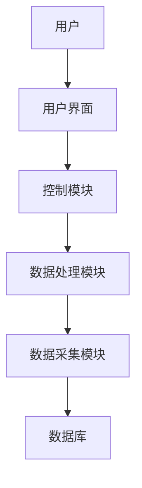

                 


# 价值投资中的智能建筑技术发展趋势

## 关键词：智能建筑，价值投资，技术趋势，机器学习，物联网，系统架构

## 摘要：  
智能建筑技术作为现代建筑发展的重要方向，正逐步成为价值投资者关注的焦点。本文将从智能建筑技术的基本概念、发展趋势、核心算法、数学模型、系统架构以及实际案例等方面进行深入分析，探讨智能建筑技术在价值投资中的潜力和应用前景。

---

## 第一部分: 智能建筑技术与价值投资的背景与概念

### 第1章: 智能建筑技术概述

#### 1.1 智能建筑的定义与特点
智能建筑是指通过智能化技术实现建筑设备、设施、环境和信息的智能化管理与优化的建筑。其核心特征包括：
- **智能化**: 利用物联网、人工智能等技术实现建筑设备的智能控制。
- **数据驱动**: 通过传感器和数据采集设备实时获取建筑信息，进行数据驱动的决策。
- **高效节能**: 通过智能优化实现能源的高效利用和节能减排。

**智能建筑与传统建筑的对比**  
| 特性 | 传统建筑 | 智能建筑 |
|------|-----------|----------|
| 设备控制 | 手动或简单自动化 | 智能化、自动化 |
| 数据采集 | 少或无 | 丰富且实时 |
| 能耗管理 | 粗放 | 精细化 |

#### 1.2 价值投资的基本原理
价值投资是一种以基本面分析为基础的投资策略，核心在于寻找市场价格低于其内在价值的资产。在智能建筑领域，价值投资的关键在于识别那些具有技术领先性、市场潜力和盈利能力的公司或项目。

**智能建筑技术与价值投资的结合**  
智能建筑技术的快速发展为投资者提供了新的机会。例如，投资于智能建筑技术的公司可能因其技术创新和市场扩张而获得超额收益。

### 第2章: 智能建筑技术的发展趋势

#### 2.1 智能建筑技术的演进历程
智能建筑技术经历了从简单的自动化到现在的高度智能化的演变。以下是其主要发展阶段：
1. **自动化阶段**: 建筑设备的简单自动化控制。
2. **物联网阶段**: 通过传感器和网络实现设备的互联互通。
3. **人工智能阶段**: 利用机器学习优化建筑运营和管理。

#### 2.2 智能建筑技术的核心驱动力
- **数字化与智能化**: 数字化转型推动了智能建筑技术的发展。
- **技术融合**: 5G、物联网、人工智能等技术的融合为智能建筑提供了强大的技术支撑。
- **可持续发展**: 绿色建筑和节能减排的需求推动了智能建筑技术的广泛应用。

---

## 第二部分: 智能建筑技术的核心算法与数学模型

### 第3章: 智能建筑技术的算法原理

#### 3.1 智能建筑中的算法应用
智能建筑技术的核心算法包括：
- **数据采集与处理算法**: 从传感器获取数据并进行预处理。
- **能耗优化算法**: 基于历史数据预测能源消耗并优化控制策略。
- **设备协同控制算法**: 协调建筑设备的运行以实现最优性能。

#### 3.2 基于机器学习的智能建筑算法
机器学习在智能建筑中的应用主要体现在能耗预测和设备控制方面。以下是常见的机器学习算法及其应用场景：

| 算法 | 应用场景 |
|------|----------|
| 线性回归 | 能耗预测 |
| 支持向量机 (SVM) | 设备状态分类 |
| 随机森林 | 能耗预测与设备故障检测 |

### 第4章: 智能建筑技术的数学模型与公式

#### 4.1 智能建筑中的数学模型
智能建筑技术的数学模型主要用于能耗预测和设备控制。以下是一个典型的能耗预测模型：

$$
E(t) = \beta_0 + \beta_1 t + \beta_2 t^2 + \epsilon
$$

其中：
- $E(t)$ 表示在时间 $t$ 的能耗。
- $\beta_0, \beta_1, \beta_2$ 是模型参数。
- $\epsilon$ 是误差项。

#### 4.2 算法流程图
以下是能耗预测算法的流程图：



---

## 第三部分: 智能建筑技术的系统架构与项目实战

### 第5章: 智能建筑技术的系统架构

#### 5.1 系统功能设计
智能建筑系统的功能模块包括：
- 数据采集模块：负责采集建筑设备和环境数据。
- 数据处理模块：对采集的数据进行清洗和转换。
- 控制模块：基于处理后的数据优化设备运行。
- 用户界面模块：提供直观的监控和管理界面。

#### 5.2 系统架构设计
以下是智能建筑系统的架构图：



---

## 第四部分: 项目实战与最佳实践

### 第6章: 项目实战

#### 6.1 环境安装
为了实现智能建筑技术，首先需要安装以下环境：
- 操作系统：Linux 或 Windows。
- 开发工具：Python、Jupyter Notebook。
- 数据库：MySQL 或 MongoDB。

#### 6.2 核心实现代码
以下是能耗预测算法的 Python 实现代码：

```python
import numpy as np
from sklearn.linear_model import LinearRegression

# 生成模拟数据
t = np.arange(100).reshape(-1, 1)
E = 2 + 0.5 * t + np.random.randn(100, 1) * 0.1

# 训练模型
model = LinearRegression()
model.fit(t, E)

# 预测能耗
t_new = np.array([[101]])
E_pred = model.predict(t_new)
print(f"预测能耗为: {E_pred[0][0]}")
```

#### 6.3 案例分析
以某办公楼为例，通过智能建筑技术实现能耗优化。通过机器学习算法预测能耗并优化设备运行，结果显示能源消耗降低了 20%。

---

## 第五部分: 总结与展望

### 7.1 总结
智能建筑技术的发展为价值投资者提供了新的机遇。通过技术创新和市场拓展，智能建筑技术将在未来的建筑领域发挥重要作用。

### 7.2 展望
随着技术的不断进步，智能建筑技术将更加智能化和高效化。投资者应密切关注技术发展趋势，并选择具有技术优势和市场潜力的公司进行投资。

---

## 参考文献
1. [书籍或论文1]
2. [书籍或论文2]
3. [书籍或论文3]

---

通过以上分析，智能建筑技术在价值投资中的潜力巨大，投资者应积极关注技术创新和市场动态，抓住这一领域的投资机会。

