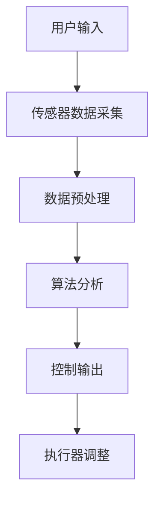
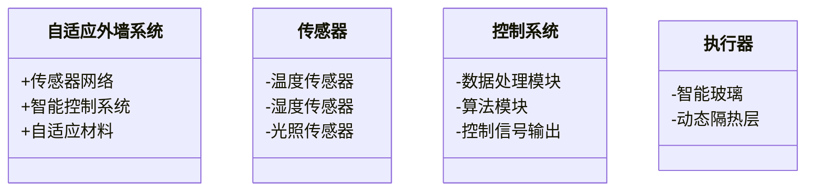

                 


# 价值投资中的智能建筑自适应外墙系统分析

> 关键词：智能建筑，自适应外墙系统，价值投资，建筑节能，系统优化

> 摘要：智能建筑自适应外墙系统是一种结合智能化技术和建筑外墙设计的创新解决方案，通过自适应算法优化外墙性能，从而提升建筑的能源效率和投资回报。本文从技术原理、价值评估、系统设计等多维度深入分析智能建筑自适应外墙系统的核心要素，探讨其在价值投资中的潜力和实际应用。

---

## 第1章: 智能建筑自适应外墙系统概述

### 1.1 自适应外墙系统的定义与核心要素

自适应外墙系统是一种能够根据环境变化（如温度、湿度、光照等）自动调整自身性能的智能建筑系统。其核心要素包括：

- **感知层**：通过传感器实时采集环境数据。
- **决策层**：基于算法分析数据并生成控制指令。
- **执行层**：通过 actuators 调整外墙的物理属性（如透明度、隔热性能等）。

**核心概念对比表**：

| 要素       | 描述                                   |
|------------|----------------------------------------|
| 感知层     | 数据采集（温度、湿度、光照等）         |
| 决策层     | 数据分析与决策算法                   |
| 执行层     | 物理调整（如变色玻璃、智能隔热层等）   |

### 1.2 系统的背景与重要性

随着全球对可持续发展的关注，建筑节能成为重要议题。智能建筑自适应外墙系统通过优化能源消耗，显著降低建筑运营成本。从价值投资的角度来看，这类系统的全生命周期成本较低，同时能够提升建筑资产的价值。

### 1.3 系统的组成与价值评估

自适应外墙系统的组成如下：

- **传感器网络**：用于采集环境数据。
- **智能控制系统**：负责数据分析与决策。
- **自适应材料**：如智能玻璃、动态隔热层等。

**价值评估指标**：

1. **能源效率提升**：通过优化外墙性能降低能源消耗。
2. **经济效益**：系统初始投资与长期节省的对比。
3. **维护成本**：系统的维护频率与成本。

---

## 第2章: 自适应外墙系统的智能化原理

### 2.1 自适应算法的核心原理

自适应算法是系统的核心，主要基于反馈控制原理。以下是一个简单的 PID（比例-积分-微分）算法示例：

$$
u(t) = K_p e(t) + K_i \int_{0}^{t} e(t) dt + K_d \frac{d e(t)}{dt}
$$

其中：
- \( u(t) \) 是控制输出
- \( e(t) \) 是误差信号
- \( K_p, K_i, K_d \) 是比例、积分、微分系数

### 2.2 系统的数学模型与实现

系统性能可以通过以下数学模型进行描述：

$$
\text{Energy Consumption} = a \times T + b \times H + c \times L
$$

其中：
- \( T \) 是温度
- \( H \) 是湿度
- \( L \) 是光照强度
- \( a, b, c \) 是系数

基于机器学习的自适应算法可以通过训练数据优化系数 \( a, b, c \)，从而提高系统的预测精度。

### 2.3 系统的实现与优化

以下是基于 Python 的自适应算法实现示例：

```python
import numpy as np

def adaptive_algorithm(error, K_p, K_i, K_d):
    integral = error.sum()
    derivative = np.gradient(error)
    output = K_p * error + K_i * integral + K_d * derivative
    return output

# 示例数据
error = np.array([1, 2, 1.5, 1.8])
K_p = 0.5
K_i = 0.3
K_d = 0.2

output = adaptive_algorithm(error, K_p, K_i, K_d)
print("Control Output:", output)
```

---

## 第3章: 自适应外墙系统的价值分析

### 3.1 经济效益分析

自适应外墙系统的经济效益体现在以下几个方面：

1. **降低能源消耗**：通过优化外墙性能，减少 HVAC 系统的能耗。
2. **提高资产价值**：智能化系统提升建筑的市场竞争力。
3. **降低维护成本**：自适应系统减少了传统外墙的维护频率。

### 3.2 全生命周期成本分析

系统全生命周期成本包括：

1. **初始投资**：传感器、控制系统、自适应材料的采购与安装。
2. **运行成本**：电力消耗、维护费用。
3. **回收期**：通过节省能源和维护成本，系统投资的回收期通常在 5-10 年。

---

## 第4章: 系统设计与实现

### 4.1 系统架构设计

以下是系统架构的 Mermaid 图：



### 4.2 系统功能设计

以下是系统功能的领域模型图：



### 4.3 项目实战

以下是自适应外墙系统的 Python 实现示例：

```python
import numpy as np
import matplotlib.pyplot as plt

# 模拟环境数据
temperature = np.array([20, 22, 24, 21, 23])
humidity = np.array([50, 60, 55, 58, 62])
light = np.array([100, 120, 110, 105, 115])

# 自适应算法实现
def adaptive_control(temp, hum, light, K):
    adjusted_temp = temp * K[0] + hum * K[1] + light * K[2]
    return adjusted_temp

K = [0.3, 0.2, 0.1]
output = adaptive_control(temperature, humidity, light, K)

# 可视化结果
plt.plot(temperature, label='Temperature')
plt.plot(output, label='Adaptive Output')
plt.xlabel('Time')
plt.ylabel('Value')
plt.legend()
plt.show()
```

---

## 第5章: 总结与展望

### 5.1 本章小结

智能建筑自适应外墙系统通过智能化技术优化建筑性能，显著提升能源效率和资产价值。从价值投资的角度来看，系统的经济效益和长期回报使其成为未来建筑的重要发展方向。

### 5.2 未来展望

未来，随着人工智能和物联网技术的进一步发展，自适应外墙系统将更加智能化和个性化。例如，结合 VR/AR 技术，用户可以通过虚拟界面实时调整外墙性能，进一步提升用户体验。

---

通过以上分析，我们可以看到智能建筑自适应外墙系统不仅在技术上具有创新性，还在经济上具有显著的价值。对于投资者来说，这类系统不仅能够降低运营成本，还能够提升建筑的市场竞争力，是未来建筑领域的重要发展方向。

