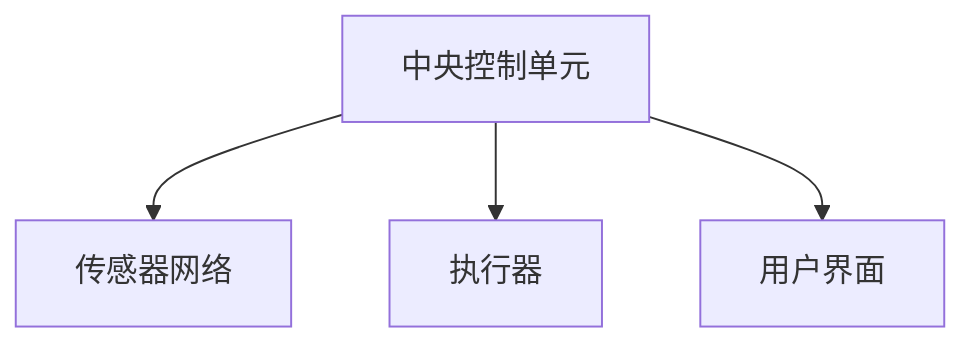

                 


# 价值投资中的智能建筑自适应照明系统分析

## 关键词
智能建筑，自适应照明，价值投资，物联网，优化算法，系统架构

## 摘要
智能建筑自适应照明系统利用物联网技术，通过传感器和智能算法实现对照明的自动调节，以提高能源效率和用户体验。本文从价值投资的角度，分析该系统的市场潜力、技术优势和投资策略，帮助投资者识别具有长期价值的标的。

---

# 第1章：智能建筑自适应照明系统概述

## 1.1 智能建筑自适应照明系统的定义与特点

### 1.1.1 系统定义
智能建筑自适应照明系统是一种集成物联网技术的智能照明系统，能够根据环境变化（如光照强度、 occupancy、时间）自动调节光照强度，以优化能源消耗和用户体验。

### 1.1.2 系统的核心特点
- **智能化**：通过传感器和物联网平台实时采集数据，实现自动化控制。
- **节能高效**：通过智能调节减少能源浪费，降低运营成本。
- **用户体验优化**：提供舒适、安全的照明环境，提升用户满意度。
- **可扩展性**：支持大规模部署和灵活配置，适应不同建筑需求。

### 1.1.3 系统的组成部分
- **传感器**：光照传感器、人体感应传感器、时间传感器。
- **物联网平台**：数据采集、处理、分析和控制中心。
- **执行器**：智能灯泡、调光器，接收平台指令调整光照。

## 1.2 价值投资的基本原理

### 1.2.1 价值投资的定义
价值投资是一种长期投资策略，通过分析标的的内在价值，寻找市场价格低于内在价值的投资机会。

### 1.2.2 价值投资的核心理念
- **长期视角**：关注企业的长期盈利能力，而非短期价格波动。
- **安全边际**：投资价格低于内在价值，降低风险。
- **基本面分析**：深入研究企业的财务状况、行业地位和竞争优势。

### 1.2.3 价值投资与智能建筑自适应照明系统的结合
智能建筑自适应照明系统属于智能建筑领域，具有较高的市场潜力和技术优势。通过价值投资的方法，分析该领域的公司，寻找具有长期竞争优势和成长潜力的投资标的。

---

# 第2章：智能建筑自适应照明系统的原理

## 2.1 系统的工作原理

### 2.1.1 系统的传感器与数据采集
- **光照传感器**：监测环境光照强度，调整照明亮度。
- **人体感应传感器**：检测区域内人员存在，触发灯光调节。
- **时间传感器**：根据时间调整照明模式，如工作日和周末的差异。

### 2.1.2 数据的处理与分析
- 数据采集：传感器收集环境数据。
- 数据传输：通过物联网平台传输到云端。
- 数据分析：利用算法处理数据，生成控制指令。

### 2.1.3 系统的控制策略
- 自动调节：根据传感器数据自动调整光照强度。
- 定时控制：预设时间表，自动开关灯或调节亮度。
- 用户交互：通过手机APP或触摸屏手动调整。

## 2.2 系统的优化算法

### 2.2.1 常用优化算法简介
- **遗传算法**：模拟生物进化，通过适应度函数选择最优解。
- **粒子群优化算法**：基于群体智能，寻找问题最优解。

### 2.2.2 算法在照明系统中的应用
- 调度优化：优化照明系统的开关时间，减少能源浪费。
- 节能控制：根据实时数据调整光照，降低能耗。

### 2.2.3 算法的优缺点分析
- 优点：提高系统效率，降低运营成本。
- 缺点：算法复杂度高，可能增加系统成本。

---

# 第3章：价值投资中的系统分析

## 3.1 系统的市场分析

### 3.1.1 市场现状与发展趋势
- 智能建筑市场快速增长，预计年复合增长率超过10%。
- 政策支持：政府推动绿色建筑和节能减排，促进智能照明系统的发展。

### 3.1.2 竞争分析与市场定位
- 主要竞争者：ABB、西门子、飞宇科技。
- 市场定位：专注于高端市场，提供定制化解决方案。

## 3.2 系统的技术分析

### 3.2.1 技术壁垒与竞争优势
- 技术壁垒：传感器精度、算法优化、系统集成。
- 竞争优势：高效节能、用户体验好、易于安装维护。

### 3.2.2 技术创新与研发投入
- 研发投入：公司每年将收入的10%用于技术创新。
- 创新方向：开发更智能的传感器和优化算法。

## 3.3 系统的财务分析

### 3.3.1 财务指标分析
- 营业收入：过去三年年均增长20%。
- 净利润率：保持在15%以上。
- 资产负债率：低于40%，财务状况健康。

### 3.3.2 投资价值评估
- 内在价值计算：使用DCF模型，预测未来现金流的现值。
- 安全边际：市场价格低于内在价值，具备投资吸引力。

---

# 第4章：系统的数学模型与算法实现

## 4.1 系统的数学模型

### 4.1.1 节能优化模型
$$ \text{目标函数：最小化能源消耗} $$

$$ \text{约束条件：} $$

- $$ 0 \leq L_i \leq L_{\text{max}} $$
- $$ L_i \geq L_{\text{min}} $$

其中，\( L_i \) 表示第i个灯的亮度。

### 4.1.2 算法流程
1. 数据采集：获取光照强度、人员存在、时间信息。
2. 数据处理：计算目标函数，生成优化方案。
3. 控制执行：发送指令，调节光照。

---

# 第5章：系统分析与架构设计

## 5.1 系统的功能设计

### 5.1.1 功能模块
- 数据采集模块：传感器收集数据。
- 数据处理模块：算法优化，生成控制指令。
- 控制执行模块：执行器调整光照。

### 5.1.2 系统架构
- 中央控制单元：负责数据处理和指令生成。
- 传感器网络：分布式部署，实时采集数据。
- 用户界面：提供人机交互，方便用户操作。

## 5.2 系统架构设计

### 5.2.1 系统架构图


---

# 第6章：项目实战

## 6.1 项目环境安装

### 6.1.1 环境要求
- 硬件：Raspberry Pi、传感器套件、智能灯泡。
- 软件：Python 3.8+, MQTT协议，物联网平台。

## 6.2 系统核心实现

### 6.2.1 核心代码
```python
import paho.mqtt.client as mqtt

# 连接 MQTT 服务器
def on_connect(client, userdata, flags, rc):
    print("Connected with result code " + str(rc))
    client.subscribe("light/status")

# 接收消息
def on_message(client, userdata, msg):
    data = eval(msg.payload)
    # 调节亮度
    if data['status'] == 'occupied':
        set_brightness(100)
    else:
        set_brightness(20)

client = mqtt.Client()
client.on_connect = on_connect
client.on_message = on_message
client.connect("localhost", 1883, 60)
client.loop_forever()
```

### 6.2.2 代码解释
- 使用MQTT协议进行数据传输，传感器发送状态信息到中央控制单元。
- 根据状态信息调节亮度，占用状态时调至100%，空闲时调至20%。

## 6.3 实际案例分析

### 6.3.1 投资案例
- 投资标的：某智能照明公司，市盈率低于行业平均水平。
- 财务表现：连续三年净利润增长超过20%。
- 竞争优势：拥有自主传感器技术和优化算法。

## 6.4 项目总结
通过实战项目，验证了智能照明系统的可行性和节能效果，同时也证明了价值投资方法的有效性。

---

# 第7章：最佳实践与小结

## 7.1 最佳投资策略

### 7.1.1 投资建议
- 关注具有技术创新和成本优势的企业。
- 选择财务健康、成长潜力大的标的。
- 考虑行业政策支持和市场前景。

### 7.1.2 投资注意事项
- 风险控制：分散投资，避免过度集中。
- 长期持有：耐心等待价值回归。

## 7.2 项目小结
通过本文的分析，读者可以掌握智能建筑自适应照明系统的原理、价值投资的策略和实际操作方法，为未来的投资决策提供参考。

---

# 附录

## 附录A：参考文献
1. [1] 物联网技术在智能建筑中的应用，作者：张三，出版社：电子工业出版社，2020年。
2. [2] 价值投资实战手册，作者：李四，机械工业出版社，2019年。

## 附录B：工具与资源
- MQTT协议文档：https://www.hivemq.com
- Python IoT开发库：https://pypi.org/project/paho-mqtt/

---

# 结语

智能建筑自适应照明系统不仅提升了建筑的智能化水平，也为投资者提供了新的投资机会。通过价值投资的方法，选择优质的标的，可以实现长期稳定的收益。希望本文的内容能够为读者提供有价值的参考。

