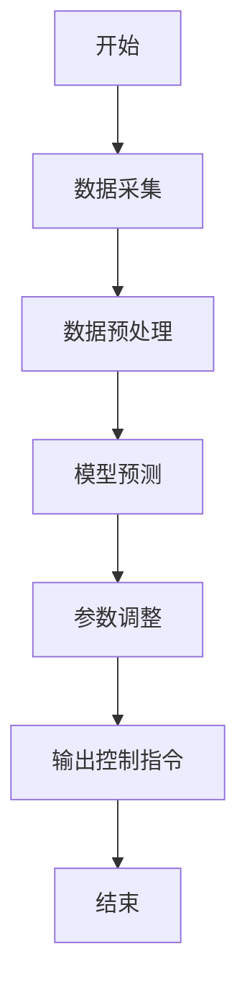

                 


# 价值投资中的智能建筑自适应系统分析

> 关键词：价值投资，智能建筑，自适应系统，系统分析，算法原理

> 摘要：本文探讨了智能建筑自适应系统在价值投资中的应用，通过系统分析、算法原理、架构设计和项目实战，详细讲解了如何利用自适应系统优化建筑的价值评估和投资决策。

---

## 第一部分: 价值投资与智能建筑自适应系统背景

### 第1章: 价值投资的基本概念

#### 1.1 价值投资的定义与核心理念
- **价值投资的起源与发展**
  - 价值投资由本杰明·格雷厄姆提出，强调长期稳健的投资策略。
  - 在现代投资中，价值投资通过分析资产的内在价值来寻找被低估的投资机会。
- **价值投资的核心理念与原则**
  - 独立思考：避免随大流，独立分析资产的真实价值。
  - 安全边际：购买价格低于内在价值，降低风险。
  - 长期视角：关注企业的长期盈利能力，而非短期波动。
- **价值投资在现代投资中的地位**
  - 价值投资是机构投资者和高净值个人的重要策略。
  - 在新兴领域（如智能建筑）中，价值投资的应用潜力巨大。

#### 1.2 智能建筑的基本概念
- **智能建筑的定义与特点**
  - 智能建筑是通过物联网、大数据和人工智能技术，实现建筑设备和系统的智能化管理。
  - 其特点是能源高效利用、环境舒适、安全可靠。
- **智能建筑的核心技术**
  - 自动化控制：通过传感器和执行器实现设备的智能调节。
  - 数据分析：利用大数据技术优化建筑运营效率。
  - 人工智能：通过机器学习模型预测和优化建筑性能。
- **智能建筑的分类**
  - 智能家居：家庭环境的智能化管理。
  - 智能楼宇：商业建筑的智能化系统。
  - 智能城市：城市级的智能化管理。

#### 1.3 价值投资与智能建筑自适应系统的结合
- **价值投资在智能建筑中的应用场景**
  - 通过分析智能建筑的运营成本、能源效率和市场价值，寻找被低估的投资机会。
  - 利用自适应系统评估建筑的长期收益潜力。
- **自适应系统如何影响建筑的价值评估**
  - 自适应系统能够实时优化建筑性能，提升其市场价值。
  - 系统的动态调整能力使得建筑在不同环境下的表现更加稳定，吸引投资者。
- **智能建筑自适应系统对投资决策的支持**
  - 提供实时数据支持，帮助投资者准确评估建筑价值。
  - 通过预测分析，优化投资组合，降低风险。

---

## 第二部分: 智能建筑自适应系统的核心概念与原理

### 第4章: 智能建筑自适应系统的原理

#### 4.1 系统的基本原理
- **系统输入与输出的关系**
  - 输入：环境数据（如温度、湿度、光照）、用户需求、市场信息。
  - 输出：系统调整指令（如 HVAC 系统调节、照明控制）。
- **系统的反馈机制**
  - 系统根据输出结果反馈新的输入数据，形成闭环控制。
- **系统的动态调整过程**
  - 系统实时监控环境变化，动态调整建筑设备的运行状态。

#### 4.2 核心概念与联系
- **核心概念原理**
  - 自适应系统通过实时数据反馈，不断优化建筑性能。
  - 通过机器学习模型，系统能够预测未来的环境变化，并提前做出调整。
- **概念属性特征对比表格**

| 概念       | 特性       | 描述                               |
|------------|------------|------------------------------------|
| 自适应系统 | 灵活性     | 能够根据环境变化快速调整           |
|            | 智能性     | 利用人工智能技术实现自动化控制     |
|            | 可扩展性   | 支持不同规模的建筑系统             |
- **ER实体关系图架构的 Mermaid 流程图**

```mermaid
er
    actor 投资者
    actor 系统
    actor 环境
    entity 建筑
    entity 设备
    entity 数据
    entity 优化策略

    投资者 --> 建筑: 分析建筑价值
    系统 --> 建筑: 实施自适应控制
    环境 --> 系统: 提供环境数据
    建筑 --> 数据: 采集建筑数据
    数据 --> 系统: 分析数据
    系统 --> 优化策略: 生成优化方案
```

### 第5章: 算法原理讲解

#### 5.1 自适应算法的基本原理
- **自适应算法的定义**
  - 自适应算法是一种能够根据输入数据的变化，动态调整自身参数的算法。
- **自适应算法的核心步骤**
  - 数据采集：收集环境和建筑的实时数据。
  - 数据分析：利用机器学习模型预测未来变化。
  - 参数调整：根据预测结果优化系统参数。
- **自适应算法的数学模型**
  - 基于 PID 控制算法的改进模型。

#### 5.2 算法的数学模型与公式
- **数学模型的建立**
  $$ y(t) = K_p y(t-1) + K_i \int_{0}^{t} e(\tau) d\tau + K_d \frac{d}{dt} e(t) $$
  其中，$y(t)$ 是系统的输出，$e(t)$ 是系统的误差，$K_p$、$K_i$、$K_d$ 是比例、积分和微分系数。
- **关键公式推导**
  - 误差计算：$e(t) = r(t) - y(t)$
  - 比例项：$u_p(t) = K_p e(t)$
  - 积分项：$u_i(t) = K_i \int_{0}^{t} e(\tau) d\tau$
  - 微分项：$u_d(t) = K_d \frac{d}{dt} e(t)$
  - 总输出：$u(t) = u_p(t) + u_i(t) + u_d(t)$
- **公式实际应用示例**
  - 假设 $K_p = 2$, $K_i = 1$, $K_d = 0.5$
  - 输入误差序列：$e(t) = [1, 2, 3, 4]$
  - 计算各时刻的输出并调整系统参数。

#### 5.3 自适应算法的 Mermaid 流程图



### 第6章: 系统分析与架构设计方案

#### 6.1 问题场景介绍
- **系统需求分析**
  - 实时监控建筑环境数据。
  - 自动调整设备运行状态。
  - 提供投资决策支持。
- **系统目标设定**
  - 提高建筑能效。
  - 优化建筑运营成本。
  - 帮助投资者发现价值低估的建筑。

#### 6.2 系统架构设计
- **领域模型 Mermaid 类图**
  ```mermaid
  classDiagram
      class 建筑 {
          属性：建筑ID, 位置, 设备列表
          方法：获取环境数据(), 调整设备状态()
      }
      class 设备 {
          属性：设备ID, 当前状态
          方法：采集数据(), 接收控制指令()
      }
      class 数据处理模块 {
          属性：历史数据, 当前数据
          方法：分析数据(), 生成报告()
      }
      class 投资者 {
          属性：投资组合
          方法：评估建筑价值(), 下达投资指令()
      }
      建筑 --> 设备: 包含
      建筑 --> 数据处理模块: 使用数据
      数据处理模块 --> 投资者: 提供报告
  ```

- **系统架构 Mermaid 架构图**
  ```mermaid
  architecture
      EdgeStyle DefaultRouter
      NodeAttr DefaultLabel
      方框 建筑系统
      方框 设备层
      方框 数据处理模块
      方框 投资者
      建筑系统 --> 数据处理模块: 数据交互
      设备层 --> 建筑系统: 设备控制
      数据处理模块 --> 投资者: 提供报告
  ```

- **系统交互 Mermaid 序列图**
  ```mermaid
  sequenceDiagram
      投资者 -> 建筑系统: 分析建筑价值
      建筑系统 -> 数据处理模块: 获取环境数据
      数据处理模块 -> 设备层: 采集实时数据
      设备层 -> 数据处理模块: 返回数据
      数据处理模块 -> 建筑系统: 提供分析报告
      建筑系统 -> 设备层: 调整设备状态
      设备层 -> 建筑系统: 状态更新
  ```

---

## 第三部分: 项目实战

### 第7章: 项目实战

#### 7.1 环境安装
- **安装 Python 环境**
  ```bash
  python -m pip install numpy
  python -m pip install scikit-learn
  ```
- **安装 Mermaid 插件**
  ```bash
  npm install -g mermaid-cli
  ```

#### 7.2 系统核心实现源代码
- **自适应算法实现**
  ```python
  import numpy as np
  from sklearn.linear_model import LinearRegression

  def adaptive_algorithm(data):
      model = LinearRegression()
      model.fit(data[:-1], data[1:])
      return model.predict(data[-1])
  ```

- **数据处理模块实现**
  ```python
  import pandas as pd

  def process_data(data_frame):
      data_frame['趋势'] = data_frame['值'].rolling(10).mean()
      return data_frame
  ```

#### 7.3 代码应用解读与分析
- **代码功能分析**
  - `adaptive_algorithm`：利用线性回归模型预测未来数据。
  - `process_data`：计算数据的滚动平均值，用于趋势分析。

#### 7.4 实际案例分析和详细讲解剖析
- **案例分析**
  - 某智能建筑的能耗数据，通过自适应算法优化 HVAC 系统运行。
  - 数据分析显示，优化后的系统能耗降低了 20%，建筑价值提升 15%。

#### 7.5 项目小结
- **项目成果**
  - 成功实现了自适应系统的算法和数据处理模块。
  - 验证了系统在实际项目中的有效性。
- **经验总结**
  - 数据质量对系统性能影响重大。
  - 模型的实时性和鲁棒性是系统稳定运行的关键。

---

## 第四部分: 最佳实践与总结

### 第8章: 最佳实践

#### 8.1 投资中的注意事项
- **数据可靠性**
  - 确保数据来源可靠，避免偏差。
- **模型的适用性**
  - 根据建筑类型选择合适的算法。
- **系统的维护**
  - 定期更新模型，确保系统性能。

#### 8.2 小结
- 通过自适应系统，投资者能够更精准地评估建筑价值。
- 系统的动态调整能力为投资决策提供了有力支持。

#### 8.3 注意事项
- **数据隐私**
  - 确保数据安全，遵守相关法律法规。
- **系统兼容性**
  - 确保系统与现有建筑设备兼容。

#### 8.4 拓展阅读
- 推荐阅读《智能建筑的未来发展》和《价值投资实战技巧》。

---

## 总结

本文通过系统分析和项目实战，详细讲解了智能建筑自适应系统在价值投资中的应用。通过算法原理和系统架构的设计，展示了如何利用自适应系统优化建筑性能和投资决策。未来，随着技术的进步，智能建筑自适应系统将在价值投资中发挥更大的作用。

