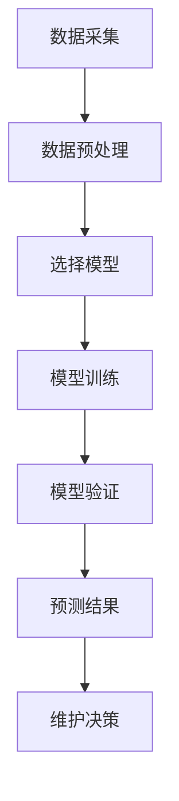
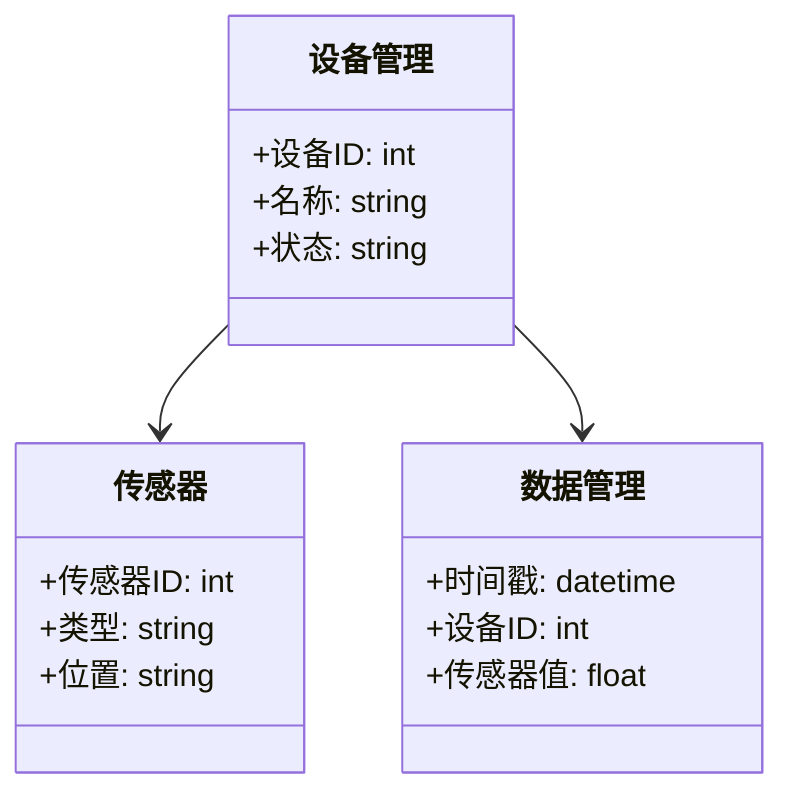
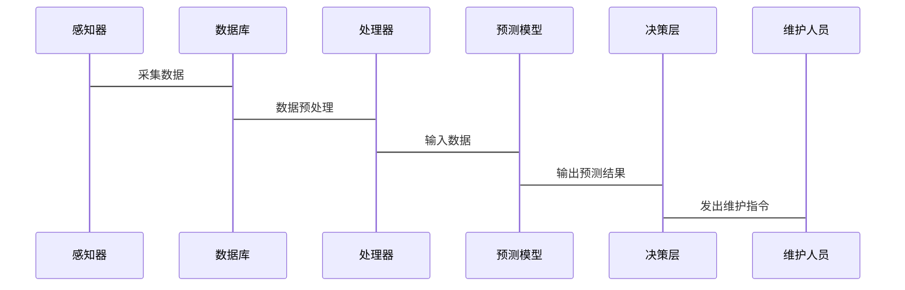

                 


# 价值投资中的智能建筑预测性维护系统分析

## 关键词：智能建筑、预测性维护、价值投资、机器学习、系统架构

## 摘要：本文探讨了智能建筑预测性维护系统在价值投资中的应用，分析了其技术原理、系统架构和实际案例，展示了如何通过预测性维护优化建筑维护成本和提升投资价值。

---

## 第1章: 智能建筑与预测性维护概述

### 1.1 智能建筑的基本概念
#### 1.1.1 智能建筑的定义与特征
智能建筑是指通过先进的技术手段，将建筑的各个子系统（如 HVAC、电力、照明、安全等）集成起来，实现智能化管理的建筑。其主要特征包括自动化控制、数据采集、智能决策等。

#### 1.1.2 预测性维护的基本概念
预测性维护是一种基于设备状态监测的维护策略，通过分析设备的运行数据，预测设备的健康状况和故障风险，从而在设备发生故障前进行维护。

#### 1.1.3 价值投资在智能建筑中的应用前景
价值投资是一种长期稳健的投资策略，通过分析资产的内在价值，选择被市场低估的资产进行投资。在智能建筑领域，预测性维护可以降低维护成本、提高设备寿命，从而提升建筑的长期投资价值。

---

## 第2章: 价值投资的核心原理

### 2.1 价值投资的基本概念
#### 2.1.1 价值投资的定义
价值投资是一种以低于资产内在价值的价格购买资产的投资策略，旨在通过长期持有优质资产获得超额收益。

#### 2.1.2 价值投资的核心原则
1. **安全边际**：以低于内在价值的价格买入资产。
2. **长期视角**：关注资产的长期表现，而非短期波动。
3. **优质资产**：选择具有强大竞争优势和良好治理的资产。

#### 2.1.3 价值投资与智能建筑的结合点
智能建筑的高效管理和运营可以提升资产的内在价值，预测性维护作为智能建筑的重要组成部分，能够显著降低维护成本，延长设备寿命，从而为价值投资提供有力支持。

---

## 第3章: 预测性维护在智能建筑中的作用

### 3.1 预测性维护的定义与特点
#### 3.1.1 预测性维护的定义
预测性维护是基于设备运行数据，利用算法预测设备的健康状况和故障风险，从而在设备发生故障前进行维护。

#### 3.1.2 预测性维护的核心优势
1. **降低维护成本**：通过预测性维护，可以避免设备突发故障，减少维修费用。
2. **提高设备寿命**：及时发现并处理潜在问题，延长设备使用寿命。
3. **提升运营效率**：减少停机时间，提高建筑运营效率。

#### 3.1.3 预测性维护在智能建筑中的应用范围
预测性维护广泛应用于智能建筑的各个子系统，如 HVAC、电力系统、电梯等。

---

## 第4章: 智能建筑预测性维护系统的核心概念

### 4.1 系统的核心要素
#### 4.1.1 数据采集与处理
数据采集是预测性维护的基础，通过传感器采集设备的运行数据，如温度、振动、电流等，并进行预处理和存储。

#### 4.1.2 预测算法与模型
预测算法是系统的核心，利用机器学习算法（如回归分析、时间序列分析、支持向量机、神经网络等）对设备状态进行预测。

#### 4.1.3 维护决策与执行
基于预测结果，系统生成维护建议，并执行维护操作，如更换部件、调整参数等。

### 4.2 核心概念之间的关系
#### 4.2.1 数据流与系统架构
数据从传感器采集到数据库，经过预处理后输入预测模型，生成预测结果并输出维护建议。

#### 4.2.2 预测模型与维护决策的关联
预测模型的输出结果直接影响维护决策，例如预测设备将在某时刻发生故障，系统会提前安排维护。

#### 4.2.3 系统架构的ER实体关系图
```mermaid
er
entity 设备 {
  key 设备ID
  attribute 名称, 类型
}
entity 传感器 {
  key 传感器ID
  attribute 类型, 位置
}
entity 数据点 {
  key 时间戳
  foreign key 设备ID, 传感器ID
  attribute 值
}
```

---

## 第5章: 预测性维护系统的数学模型与算法原理

### 5.1 预测模型的数学基础
#### 5.1.1 回归分析模型
回归分析是一种统计学习方法，用于预测连续型变量。例如，使用线性回归模型预测设备的剩余寿命。

#### 5.1.2 时间序列分析模型
时间序列分析用于预测随时间变化的变量，例如设备的振动数据。

#### 5.1.3 支持向量机模型
支持向量机是一种监督学习算法，用于分类和回归问题，适用于设备状态分类。

#### 5.1.4 神经网络模型
神经网络是一种深度学习算法，适用于复杂的非线性预测问题。

### 5.2 预测算法的流程图


### 5.3 算法实现代码示例
```python
import numpy as np
from sklearn.linear_model import LinearRegression

# 示例数据
X = np.array([[1], [2], [3], [4], [5]])
y = np.array([2, 4, 5, 4, 6])

# 模型训练
model = LinearRegression()
model.fit(X, y)

# 预测
new_X = np.array([[6]])
print(model.predict(new_X))  # 输出预测结果
```

---

## 第6章: 系统分析与架构设计方案

### 6.1 项目介绍
本项目旨在开发一个智能建筑预测性维护系统，利用机器学习算法预测设备故障，优化维护成本。

### 6.2 系统功能设计


### 6.3 系统架构设计


### 6.4 系统接口设计
系统接口包括传感器接口、数据库接口、维护决策接口等。

### 6.5 系统交互流程


---

## 第7章: 项目实战

### 7.1 环境配置
安装必要的库和工具，如Python、TensorFlow、Scikit-learn等。

### 7.2 核心代码实现
```python
import pandas as pd
from sklearn.ensemble import RandomForestClassifier

# 数据加载
data = pd.read_csv('设备数据.csv')

# 特征选择
features = data[['温度', '振动', '电流']]
label = data['状态']

# 模型训练
model = RandomForestClassifier()
model.fit(features, label)

# 预测
new_data = pd.DataFrame([[25, 10, 50]])
print(model.predict(new_data))  # 输出预测结果
```

### 7.3 案例分析
通过具体案例分析系统的实施过程和效果，展示如何通过预测性维护优化维护成本。

### 7.4 项目小结
总结项目实施的经验和教训，提出改进建议。

---

## 第8章: 案例分析与价值评估

### 8.1 案例分析
通过实际案例分析，展示系统在智能建筑中的应用效果。

### 8.2 价值评估
评估系统对价值投资的贡献，包括经济效益和社会效益。

---

## 第9章: 总结与展望

### 9.1 总结
总结全书内容，强调智能建筑预测性维护系统在价值投资中的重要性。

### 9.2 展望
展望未来发展方向，提出改进建议和技术创新的可能性。

### 9.3 最佳实践 tips
- 数据质量是预测模型的基础，确保数据的准确性和完整性。
- 定期更新模型，适应设备状态的变化。
- 结合多种算法，提高预测的准确性。

---

通过以上分析，智能建筑预测性维护系统在价值投资中的应用前景广阔，能够显著提升建筑的长期投资价值。

