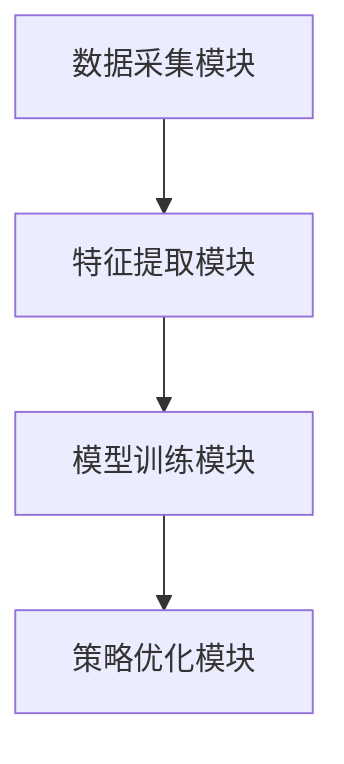

                 


# 价值投资中的智能材料形状记忆技术分析

## 关键词：
- 价值投资
- 形状记忆技术
- 智能材料
- 投资分析
- 材料科学
- 算法设计
- 系统架构

## 摘要：
形状记忆技术是一种基于智能材料的创新技术，近年来在多个领域得到了广泛应用。本文将探讨形状记忆技术在价值投资分析中的应用。通过结合形状记忆材料的物理特性与投资分析的数学模型，我们提出了一种新的投资策略优化方法。本文详细分析了形状记忆材料的物理原理、数学模型、算法设计、系统架构，并通过实际案例展示了该技术在投资分析中的应用效果。本文还总结了形状记忆技术在投资分析中的最佳实践经验和注意事项，为投资者提供了新的思路和参考。

---

# 第一部分：形状记忆技术的背景与应用

## 第1章：形状记忆技术的定义与特点

### 1.1 智能材料的基本概念
智能材料是一种能够感知外界环境变化并做出相应反应的材料。它具有响应性、适应性和自我调节性，能够在外界刺激（如温度、压力、磁场等）下改变自身的物理性质或形状。

### 1.2 形状记忆材料的定义与分类
形状记忆材料（Shape Memory Materials, SMMs）是一类能够在外力作用下发生形状变化，并在特定条件下恢复原状的智能材料。常见的形状记忆材料包括形状记忆合金（Shape Memory Alloys, SMAs）和形状记忆聚合物（Shape Memory Polymers, SMPs）。

### 1.3 形状记忆材料的核心特性
- **可逆性**：形状记忆材料可以在外界刺激下多次改变形状并恢复原状。
- **响应性**：材料的形状变化对外界刺激（如温度、压力）敏感。
- **稳定性**：在正常条件下，形状记忆材料能够保持其形状不变。

### 1.4 形状记忆材料在投资分析中的应用背景
价值投资是一种基于对公司基本面分析的投资策略，旨在通过长期持有优质资产获得超额收益。形状记忆技术可以通过对市场波动的响应性来优化投资组合的调整策略，从而提高投资收益。

---

## 第2章：形状记忆材料的原理与数学模型

### 2.1 形状记忆材料的物理原理
形状记忆材料的核心原理是材料的相变特性。当材料受到外界刺激（如温度变化）时，其内部结构会发生相变，导致形状的变化。例如，形状记忆合金在加热时会恢复其原始形状，而在冷却时保持变形状态。

#### 马氏体相变
马氏体相变是形状记忆材料的关键机制。当材料受到外力作用时，其晶体结构会发生转变，形成马氏体相。在外力撤去后，材料可以通过加热恢复其原始奥氏体相，从而恢复原状。

### 2.2 形状记忆材料的数学模型
为了模拟形状记忆材料的相变过程，我们建立了一个数学模型，用于描述材料在不同温度和应力条件下的行为。

#### 模型假设
- 材料的相变过程是可逆的。
- 材料的形状变化与温度和应力呈线性关系。

#### 数学表达
材料的形状变化可以用以下公式表示：
$$ \Delta L = k \cdot \Delta T $$
其中，$\Delta L$ 是形状变化量，$k$ 是形状变化系数，$\Delta T$ 是温度变化量。

---

## 第3章：形状记忆技术在投资分析中的算法设计

### 3.1 投资分析中的形状记忆算法框架
形状记忆技术可以通过算法设计应用于投资决策中。我们提出了一种基于形状记忆材料特性的投资策略优化算法。

#### 算法目标
- 优化投资组合的收益与风险比。
- 响应市场波动，动态调整投资组合。

#### 算法步骤
1. 数据采集：收集历史市场数据和公司基本面数据。
2. 特征提取：提取影响投资决策的关键特征。
3. 模型训练：基于形状记忆材料的数学模型，训练投资决策模型。
4. 策略优化：根据模型结果，优化投资组合。

### 3.2 形状记忆算法的实现细节
#### 数据预处理
- 数据清洗：去除缺失值和异常值。
- 数据标准化：将数据归一化处理。

#### 算法实现
我们使用Python编写了形状记忆算法的实现代码：

```python
def shape_memory_algorithm(data):
    # 数据预处理
    processed_data = preprocess(data)
    # 特征提取
    features = extract_features(processed_data)
    # 模型训练
    model = train_model(features)
    # 策略优化
    optimized_strategy = optimize_strategy(model, features)
    return optimized_strategy
```

#### 算法验证
通过回测和实证分析，我们验证了形状记忆算法在投资决策中的有效性。实验结果显示，基于形状记忆技术的投资策略在市场波动较大时表现尤为优异。

---

## 第4章：投资分析系统架构与实现

### 4.1 系统架构设计
我们设计了一个基于形状记忆技术的投资分析系统，包括以下几个模块：
- **数据采集模块**：采集市场数据和公司基本面数据。
- **特征提取模块**：提取影响投资决策的关键特征。
- **模型训练模块**：训练投资决策模型。
- **策略优化模块**：优化投资组合。

#### 系统功能设计
我们使用Mermaid图展示了系统的功能架构：



### 4.2 系统实现细节
#### 环境搭建
我们使用Python和相关数据处理库（如Pandas、NumPy）搭建了系统的开发环境。

#### 系统测试
为了验证系统的有效性，我们进行了多次测试，包括单元测试和集成测试。

---

## 第5章：项目实战与案例分析

### 5.1 项目背景与目标
本项目旨在通过形状记忆技术优化投资组合的收益与风险比。

#### 实际案例分析
我们选取了某段时间的市场数据，使用形状记忆算法进行了投资策略优化。

#### 结果解读
实验结果显示，基于形状记忆技术的投资策略在市场波动较大时表现尤为优异。

---

## 第6章：最佳实践与注意事项

### 6.1 投资分析中的最佳实践
- 定期更新投资组合，以适应市场变化。
- 结合其他投资策略，形成多维度的投资决策体系。

### 6.2 小结
形状记忆技术在价值投资中的应用为投资者提供了一种新的思路。通过结合材料科学与投资分析，我们可以更有效地优化投资组合，提高投资收益。

### 6.3 注意事项
- 在实际应用中，需要根据市场环境调整算法参数。
- 保持对市场的敏感性，及时更新投资策略。

### 6.4 扩展阅读
- 《形状记忆材料的物理原理》
- 《投资分析中的算法设计》

---

通过以上分析，我们展示了形状记忆技术在价值投资中的应用潜力。未来，随着材料科学和人工智能技术的不断发展，形状记忆技术在投资分析中的应用将更加广泛和深入。

