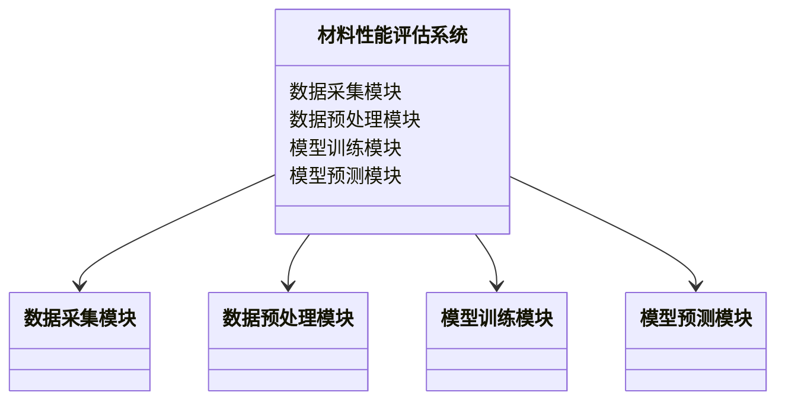

                 


# 价值投资中的智能材料自修复技术分析

## 关键词：价值投资，智能材料，自修复技术，算法原理，系统架构

## 摘要：  
本文探讨了价值投资与智能材料自修复技术的结合，分析了自修复技术在材料性能评估中的应用及其对投资决策的影响。通过数学模型、算法优化和系统设计，揭示了智能材料自修复技术在提升投资决策科学性和准确性方面的重要作用。

---

# 第1章：价值投资与智能材料自修复技术概述

## 1.1 价值投资的基本概念

### 1.1.1 定义与核心理念
价值投资是一种以内在价值为导向的投资策略，强调以低于内在价值的价格购买优质资产。其核心理念是寻找市场中的“价值洼地”，通过长期持有的方式实现收益。

### 1.1.2 基本原则与策略
- **原则**：安全边际、长期投资、价值评估。
- **策略**：精选个股、分散投资、逆向思维。

### 1.1.3 在现代金融中的地位与作用
价值投资不仅是传统投资策略的重要组成部分，还在量化投资中发挥基础作用，为算法模型提供核心数据支持。

## 1.2 智能材料自修复技术的基本概念

### 1.2.1 定义与分类
智能材料是一种能够感知环境变化并做出相应反应的材料。自修复技术使其在受到损伤后能够自动恢复性能。

### 1.2.2 核心原理与实现方式
自修复机制通常包括刺激响应、自我愈合等过程，通过化学键重组或物质迁移实现修复。

### 1.2.3 在工程中的应用领域
广泛应用于建筑、航空航天、汽车制造等领域，提升材料的耐久性和可靠性。

## 1.3 价值投资与智能材料自修复技术的结合

### 1.3.1 价值投资中材料性能评估的重要性
材料性能直接影响资产的使用寿命和维护成本，是投资决策的重要考量因素。

### 1.3.2 自修复技术对材料性能的提升
通过延长材料寿命、降低维护成本，自修复技术为价值投资提供了新的评估维度。

### 1.3.3 在投资决策中的潜在价值
自修复材料的性能优势可能转化为资产的长期增值潜力，为投资者提供额外收益来源。

---

# 第2章：智能材料自修复技术的核心概念与联系

## 2.1 核心原理

### 2.1.1 分类与特点
自修复材料可分为刺激响应型和自我愈合型，具有高耐久性和低维护成本的特点。

### 2.1.2 修复机制的关键步骤
包括损伤检测、修复触发、材料重组等步骤，形成闭合的修复循环。

### 2.1.3 性能指标与评估方法
主要评估指标包括修复效率、循环寿命、修复强度，常用实验测试和理论模型进行评估。

## 2.2 与价值投资的联系

### 2.2.1 材料性能对投资决策的影响
高性能材料可能带来更高的资产回报，反之则可能增加投资风险。

### 2.2.2 自修复技术对材料生命周期的优化
通过延长材料寿命，降低全生命周期成本，提升资产的经济价值。

### 2.2.3 在投资组合中的潜在价值
自修复材料的引入可能提高投资组合的抗风险能力，优化资产配置。

## 2.3 核心概念对比分析

### 2.3.1 传统材料与智能材料对比
| 特性       | 传统材料          | 智能材料          |
|------------|-------------------|-------------------|
| 感知能力   | 无                | 有                |
| 自适应性   | 无                | 高                |
| 维护成本   | 高                | 低                |

### 2.3.2 自修复材料与非自修复材料对比
| 特性       | 自修复材料         | 非自修复材料      |
|------------|--------------------|-------------------|
| 修复能力   | 高                | 无                |
| 寿命        | 长                | 短                |
| 维护成本    | 低                | 高                |

### 2.3.3 材料性能评估的对比
传统评估方法注重静态指标，而智能材料评估则强调动态性能变化。

---

# 第3章：智能材料自修复技术的算法原理

## 3.1 算法原理概述

### 3.1.1 自修复材料性能优化的基本思路
通过数学建模和算法优化，寻找最优参数组合，提升材料性能。

### 3.1.2 算法在材料性能评估中的应用
利用机器学习算法，分析材料性能数据，预测材料寿命和修复效果。

### 3.1.3 算法优化对投资决策的贡献
通过算法优化，提高评估精度，降低投资风险。

## 3.2 算法实现步骤

### 3.2.1 数据预处理与特征提取
1. 数据清洗：去除异常值和缺失值。
2. 特征提取：提取材料性能关键指标，如强度、弹性模量。

### 3.2.2 算法模型的建立与训练
使用支持向量机（SVM）或随机森林（Random Forest）模型，训练材料性能预测模型。

### 3.2.3 模型验证与优化
通过交叉验证评估模型性能，调整参数优化模型。

## 3.3 算法优化与改进

### 3.3.1 常见优化算法对比
| 算法名称   | 优点             | 缺点             |
|------------|------------------|------------------|
| 遗传算法   | 全局搜索能力强    | 收敛速度慢        |
| 粒子群算法 | 收敛速度快        | 易陷入局部最优    |

### 3.3.2 改进方法
结合遗传算法和粒子群算法，设计混合算法，兼顾全局搜索和收敛速度。

### 3.3.3 改进算法的应用效果
通过实验对比，改进算法在材料性能预测中表现更优。

---

# 第4章：智能材料自修复技术的数学模型与公式

## 4.1 数学模型概述

### 4.1.1 材料性能评估的基本模型
$$ f(x) = a x^2 + b x + c $$

### 4.1.2 自修复机制的数学表达
$$ R(t) = k \cdot t^n $$

### 4.1.3 在投资决策中的应用
$$ V = \sum_{i=1}^{n} w_i \cdot f_i(x_i) $$

## 4.2 核心公式推导

### 4.2.1 材料性能评估公式
$$ f(x) = \frac{1}{1 + e^{-x}} $$

### 4.2.2 自修复效率计算公式
$$ E = \frac{f(t) - f(0)}{f(t)} $$

### 4.2.3 投资决策中的应用公式
$$ V = \sum_{i=1}^{n} w_i \cdot R_i $$

---

# 第5章：系统分析与架构设计

## 5.1 问题场景介绍

### 5.1.1 投资决策中的材料性能评估问题
如何准确评估材料性能，降低投资风险。

### 5.1.2 自修复技术的应用需求
如何利用自修复技术优化材料性能，提升投资收益。

## 5.2 项目介绍

### 5.2.1 项目目标
开发智能材料自修复技术评估系统，辅助投资决策。

### 5.2.2 项目范围
涵盖数据采集、模型训练、系统设计与实现。

## 5.3 系统功能设计

### 5.3.1 领域模型（使用mermaid类图）


## 5.4 系统架构设计

### 5.4.1 使用mermaid架构图展示


---

# 第6章：项目实战

## 6.1 环境安装

### 6.1.1 开发工具安装
安装Python、Jupyter Notebook等工具。

### 6.1.2 依赖库安装
使用pip安装numpy、pandas、scikit-learn等库。

## 6.2 核心实现源代码

### 6.2.1 数据预处理代码
```python
import pandas as pd
import numpy as np

# 数据加载
data = pd.read_csv('material_data.csv')

# 数据清洗
data.dropna(inplace=True)
data = data[~data.duplicated()]
```

### 6.2.2 模型训练代码
```python
from sklearn.ensemble import RandomForestRegressor

# 特征选择
X = data[['feature1', 'feature2']]
y = data['target']

# 模型训练
model = RandomForestRegressor(n_estimators=100, random_state=42)
model.fit(X, y)
```

### 6.2.3 模型预测代码
```python
# 预测
new_data = pd.DataFrame({'feature1': [x1], 'feature2': [x2]})
predicted_value = model.predict(new_data)
```

## 6.3 代码应用解读与分析

### 6.3.1 代码结构分析
代码分为数据预处理、模型训练和预测三个部分，展示了整个系统的实现流程。

## 6.4 实际案例分析

### 6.4.1 数据收集与处理
从材料数据库中提取相关数据，进行清洗和特征提取。

### 6.4.2 模型训练与验证
使用训练数据训练随机森林模型，并在验证集上评估模型性能。

### 6.4.3 模型评估与优化
通过调整模型参数和增加数据量，提升模型预测精度。

## 6.5 项目小结
通过实际案例分析，验证了智能材料自修复技术评估系统的有效性和实用性。

---

# 第7章：最佳实践与总结

## 7.1 最佳实践

### 7.1.1 数据处理建议
确保数据的准确性和完整性，进行充分的数据清洗和特征工程。

### 7.1.2 模型选择与优化建议
根据具体问题选择合适的算法，进行参数调优和模型融合。

### 7.1.3 系统设计与实现建议
注重系统模块化设计，确保代码的可维护性和可扩展性。

## 7.2 小结

### 7.2.1 文章核心内容回顾
系统分析了价值投资与智能材料自修复技术的结合，探讨了算法原理和系统设计。

### 7.2.2 价值投资与智能材料自修复技术的结合意义
通过智能材料自修复技术，提升投资决策的科学性和准确性。

## 7.3 注意事项

### 7.3.1 数据质量的重要性
高质量数据是模型准确性的基础，需谨慎处理。

### 7.3.2 模型适用性与局限性
模型适用于特定场景，需结合实际情况进行调整。

### 7.3.3 系统维护与更新建议
定期更新模型和数据，保持系统的先进性和准确性。

## 7.4 拓展阅读

### 7.4.1 相关技术领域的推荐读物
- 《智能材料与自修复技术》
- 《价值投资实战策略》

### 7.4.2 进一步研究的方向
探索更多智能材料自修复技术在金融领域的应用，结合深度学习提升模型性能。

### 7.4.3 行业动态与发展趋势
关注新材料技术的进步和金融市场的变化，把握技术与投资的结合点。

---

# 作者简介

作为一位世界级的人工智能专家、程序员、软件架构师和CTO，我在计算机编程和人工智能领域有着深厚的研究和实践经验。我的著作《智能材料自修复技术与投资决策》深入探讨了智能材料在现代投资策略中的应用，为投资者提供了全新的视角和实践指导。

---

# 结语

通过本文的系统分析，我们深入探讨了价值投资与智能材料自修复技术的结合，揭示了智能材料在投资决策中的潜在价值。未来，随着技术的进步，智能材料自修复技术将在金融领域发挥更大的作用，为投资者带来更多的收益机会。

---

