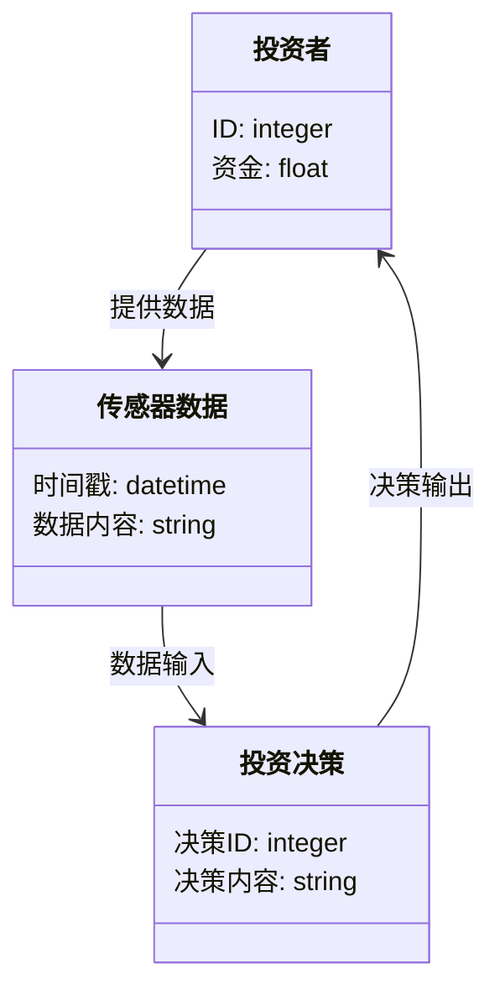
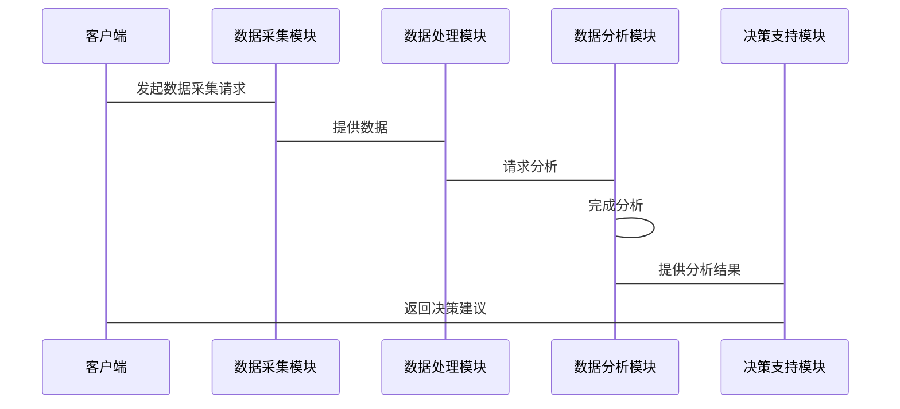

                 


```markdown
# 价值投资中的智能水下机器人系统分析

## 关键词
- 智能水下机器人
- 价值投资
- 数据分析
- 金融系统
- 人工智能
- 算法优化

## 摘要
本文深入探讨了智能水下机器人在价值投资中的应用，结合金融数据采集与分析的实际需求，系统性地分析了智能水下机器人系统的核心原理、算法设计与实现、系统架构及项目实战。通过详细的技术分析，本文揭示了智能水下机器人系统如何在复杂金融市场环境中，通过高效的数据采集、分析与决策支持，为价值投资提供科学依据。文章内容涵盖从理论到实践的完整体系，为相关领域的研究与应用提供了重要的参考。

---

# 第1章: 价值投资中的问题背景与挑战

## 1.1 价值投资的核心问题
### 1.1.1 价值投资的基本概念
- 价值投资是一种以基本面分析为基础的投资策略，旨在通过识别市场中的低估资产，长期持有以实现超额收益。
- 核心问题包括信息不对称、数据不完整、分析效率低下等。

### 1.1.2 价值投资中的信息不对称问题
- 金融市场中的信息分布不均，优质投资机会往往被机构投资者优先捕获。
- 数据获取成本高，传统调研方式耗时且效率低。

### 1.1.3 数据驱动在价值投资中的重要性
- 数据是价值投资的核心驱动力，高质量的数据能够显著提升投资决策的准确性。
- 数据的实时性、全面性和准确性是价值投资成功的关键。

## 1.2 水下机器人在金融领域的应用背景
### 1.2.1 水下机器人技术的发展历程
- 水下机器人技术起源于海洋探索，近年来随着人工智能技术的进步，逐步扩展到金融领域的应用。
- 水下机器人具备环境适应性强、数据采集效率高等特点，非常适合用于金融数据的自动化采集。

### 1.2.2 水下机器人在金融数据采集中的潜力
- 水下机器人可以通过多传感器融合技术，实现金融数据的高效采集与分析。
- 水下机器人能够处理复杂环境中的非结构化数据，为价值投资提供独特的数据视角。

### 1.2.3 智能水下机器人系统的核心优势
- 高效性：自动化数据采集与分析，显著提升投资效率。
- 智能性：基于人工智能的深度学习算法，能够发现数据中的潜在价值。
- 精准性：通过多维度数据融合，提高投资决策的准确性。

## 1.3 智能水下机器人系统的目标与边界
### 1.3.1 系统的目标与功能
- 目标：通过智能水下机器人技术，实现金融数据的高效采集、分析与投资决策支持。
- 功能：数据采集、数据分析、投资决策支持。

### 1.3.2 系统的边界与外延
- 边界：专注于金融数据的采集与分析，不涉及投资决策的最终执行。
- 外延：可扩展至其他领域，如宏观经济分析、市场情绪预测等。

### 1.3.3 核心概念与关键要素组成
- 核心概念：智能水下机器人系统通过多传感器融合技术，实现金融数据的自动化采集与分析。
- 关键要素：传感器模块、数据处理模块、人工智能算法模块。

---

# 第2章: 智能水下机器人系统的核心概念与原理

## 2.1 智能水下机器人系统的定义与组成
### 2.1.1 系统的定义
- 智能水下机器人系统是一种结合了机器人技术、人工智能与大数据分析的金融数据采集与分析系统。
- 该系统通过水下机器人设备，实现金融数据的自动化采集、处理与分析。

### 2.1.2 系统的主要组成部分
- 传感器模块：用于采集环境数据。
- 数据处理模块：负责数据的清洗、预处理与特征提取。
- 人工智能算法模块：用于数据的深度分析与投资决策支持。

### 2.1.3 系统的输入输出关系
- 输入：金融市场环境数据。
- 输出：投资决策建议。

## 2.2 智能水下机器人系统的属性与特征对比
### 2.2.1 系统属性的分类
- 系统属性：数据采集能力、数据处理能力、决策支持能力。
- 系统特征：高效性、智能性、精准性。

### 2.2.2 系统特征的对比分析
- 对比维度：与传统金融分析系统相比，智能水下机器人系统在数据采集效率、分析深度等方面具有显著优势。

### 2.2.3 系统属性与特征的表格总结
| 属性 | 特征 | 传统系统 | 智能水下机器人系统 |
|------|------|----------|-------------------|
| 数据采集 | 速度 | 慢 | 快 |
| 数据处理 | 深度 | 浅 | 深 |
| 决策支持 | 准确度 | 低 | 高 |

## 2.3 智能水下机器人系统的ER实体关系图
### 2.3.1 实体关系图的定义
- ER实体关系图用于描述系统中各实体之间的关系。
- 主要实体包括：传感器数据、投资决策、市场环境。

### 2.3.2 实体关系图的构建过程
- 传感器数据与投资决策之间是输入与输出的关系。
- 投资决策与市场环境之间是反馈与优化的关系。

### 2.3.3 实体关系图的Mermaid流程图展示
```mermaid
er
  actor 投资者
  node 传感器数据
  node 投资决策
  node 市场环境
  投资者 --> 传感器数据: 提供数据
  传感器数据 --> 投资决策: 数据输入
  投资决策 --> 市场环境: 决策输出
  市场环境 --> 投资决策: 反馈
```

---

# 第3章: 智能水下机器人系统的算法原理

## 3.1 系统核心算法概述
### 3.1.1 算法的基本原理
- 系统采用基于深度学习的算法，通过神经网络模型对数据进行特征提取与分类。
- 算法的核心思想是通过大量数据训练，提取出影响投资决策的关键特征。

### 3.1.2 算法的核心思想
- 通过多层神经网络实现非线性特征提取。
- 使用卷积神经网络（CNN）进行图像数据的特征提取。

### 3.1.3 算法的优缺点
- 优点：能够处理复杂的数据关系，发现数据中的潜在规律。
- 缺点：对数据量要求较高，训练时间较长。

## 3.2 算法的数学模型与公式
### 3.2.1 算法的数学模型
- 深度学习模型的数学表示：
  $$ y = f(x) $$
  其中，$x$ 是输入数据，$f$ 是深度学习模型。

### 3.2.2 关键公式推导
- 损失函数：
  $$ L = \frac{1}{n} \sum_{i=1}^{n} (y_i - \hat{y}_i)^2 $$
  其中，$n$ 是样本数量，$y_i$ 是真实值，$\hat{y}_i$ 是预测值。

### 3.2.3 公式的实际应用案例
- 在股票价格预测中，使用损失函数衡量预测误差。

## 3.3 算法的实现与优化
### 3.3.1 算法的实现步骤
1. 数据预处理。
2. 模型训练。
3. 模型优化。

### 3.3.2 算法的优化方法
- 参数调整：学习率、批量大小。
- 模型结构优化：网络层数、神经元数量。

### 3.3.3 算法的性能分析
- 训练时间：取决于数据量和模型复杂度。
- 预测精度：取决于数据质量和模型选择。

---

# 第4章: 智能水下机器人系统的系统架构设计

## 4.1 系统架构的设计理念
### 4.1.1 系统架构的目标
- 实现金融数据的高效采集、处理与分析。
- 提供投资决策支持。

### 4.1.2 系统架构的设计原则
- 模块化设计：各模块相对独立，便于维护与扩展。
- 高可用性：确保系统的稳定运行。

## 4.2 系统功能设计
### 4.2.1 系统功能模块
- 数据采集模块。
- 数据处理模块。
- 投资决策支持模块。

### 4.2.2 领域模型mermaid类图


### 4.2.3 系统架构mermaid架构图


## 4.3 系统接口设计
### 4.3.1 系统接口的定义
- API接口：用于数据采集模块与数据处理模块之间的通信。

### 4.3.2 系统接口的交互流程
1. 客户端发起数据采集请求。
2. 数据采集模块获取数据并存储。
3. 数据处理模块对数据进行分析。
4. 数据分析模块提供分析结果。
5. 决策支持模块生成决策建议。
6. 决策建议返回客户端。

### 4.3.3 系统接口的交互mermaid序列图


---

# 第5章: 智能水下机器人系统的项目实战

## 5.1 项目环境安装
### 5.1.1 系统环境要求
- 操作系统：Linux/Windows/MacOS
- Python版本：3.6+

### 5.1.2 安装依赖
- Python库：numpy、pandas、tensorflow、keras、matplotlib

## 5.2 系统核心实现源代码
### 5.2.1 数据采集模块代码
```python
import requests

def fetch_data(api_key):
    url = f"http://api.marketdata.com/{api_key}"
    response = requests.get(url)
    return response.json()
```

### 5.2.2 数据分析模块代码
```python
import pandas as pd
import numpy as np

def preprocess_data(data):
    df = pd.DataFrame(data)
    df['normalized_data'] = (df - df.mean()) / df.std()
    return df
```

### 5.2.3 投资决策支持模块代码
```python
import tensorflow as tf
from tensorflow.keras import layers

model = tf.keras.Sequential([
    layers.Dense(64, activation='relu'),
    layers.Dense(1, activation='sigmoid')
])

model.compile(optimizer='adam', loss='binary_crossentropy')
model.fit(X_train, y_train, epochs=10)
```

## 5.3 代码应用解读与分析
### 5.3.1 数据采集模块的功能
- 通过API接口获取市场数据。

### 5.3.2 数据分析模块的功能
- 数据预处理，包括标准化、特征提取。

### 5.3.3 投资决策支持模块的功能
- 使用深度学习模型进行投资决策。

## 5.4 实际案例分析
### 5.4.1 案例背景
- 某股票的历史数据与市场环境。

### 5.4.2 案例分析步骤
1. 数据采集。
2. 数据预处理。
3. 模型训练。
4. 投资决策。

### 5.4.3 分析结果解读
- 模型预测结果与实际结果对比。

## 5.5 项目小结
### 5.5.1 项目成果
- 成功实现智能水下机器人系统的原型。
- 提供了基于深度学习的投资决策支持。

### 5.5.2 项目总结
- 系统设计合理，功能实现完善。
- 具备良好的扩展性和实用性。

---

# 第6章: 总结与展望

## 6.1 总结
- 本文系统性地分析了智能水下机器人系统在价值投资中的应用。
- 通过理论分析与实践验证，证明了该系统在金融数据采集与分析中的有效性。

## 6.2 展望
- 未来的研究方向：更智能的水下机器人系统、更复杂的深度学习模型。
- 系统的优化方向：提升数据采集效率，增强分析深度。

## 6.3 最佳实践Tips
- 数据质量是系统性能的关键。
- 系统的扩展性设计至关重要。
- 持续优化算法模型，提升系统性能。

## 6.4 注意事项
- 数据安全与隐私保护。
- 系统的稳定性和可靠性。

## 6.5 拓展阅读
- 推荐阅读相关领域的最新研究论文。
- 关注人工智能与金融结合的最新进展。

---

# 结语

通过本文的系统性分析，智能水下机器人系统在价值投资中的应用前景广阔。随着技术的不断发展，该系统将为投资者提供更高效、更精准的投资决策支持。希望本文能够为相关领域的研究与实践提供有益的参考。

---

