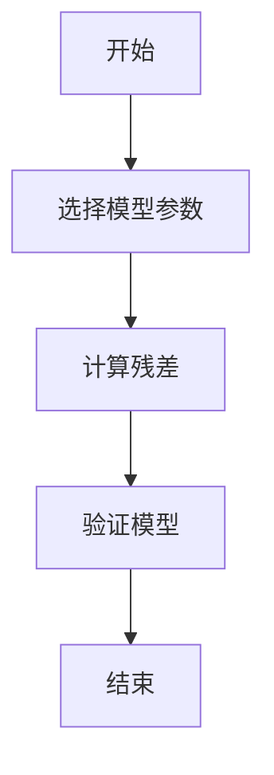
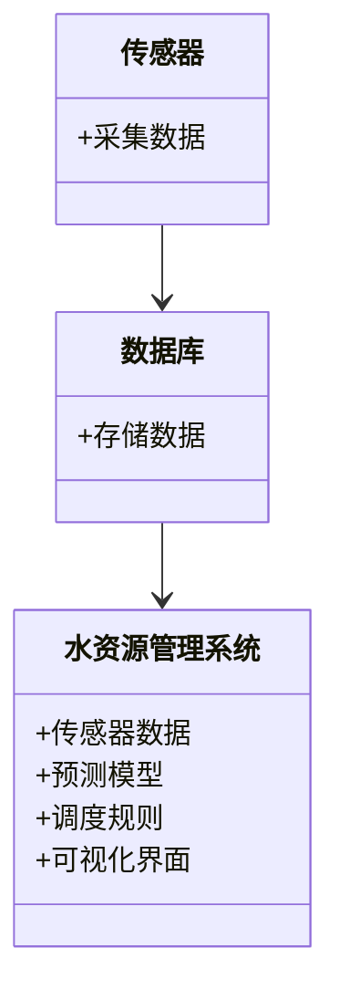
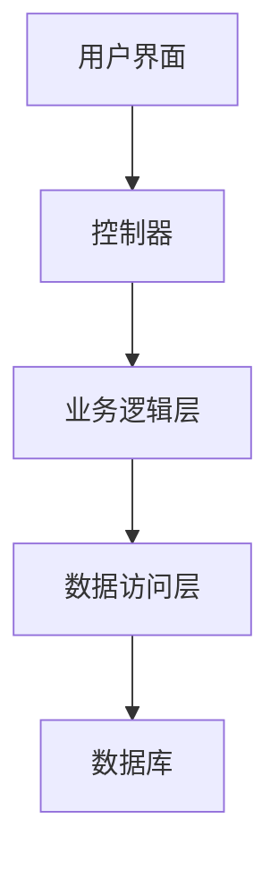
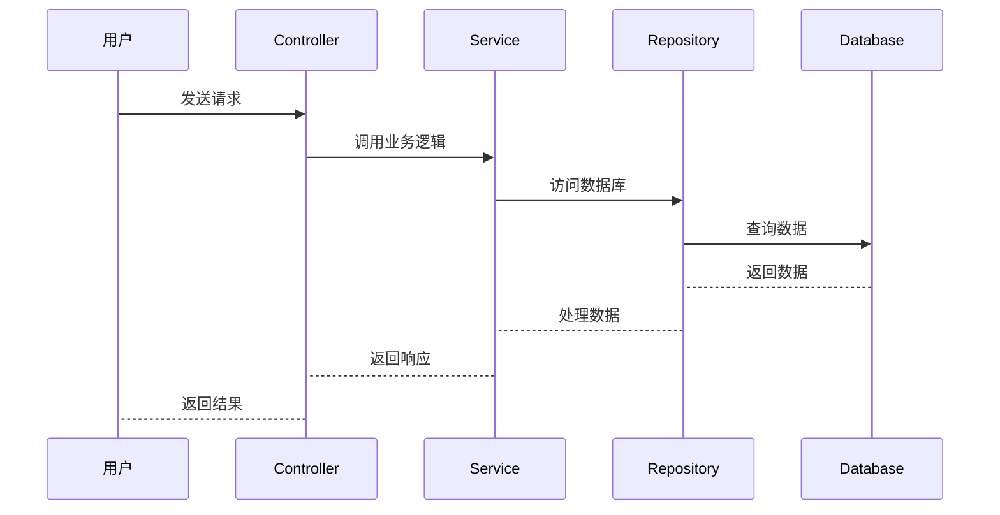

                 


# 价值投资中的智能水资源管理技术趋势

## 关键词：智能水资源管理，价值投资，时间序列分析，LSTM，遗传算法

## 摘要：  
本文探讨了智能技术在水资源管理中的应用，分析了其对价值投资的影响。通过介绍智能水资源管理的核心概念、算法原理和系统架构，展示了如何利用技术优化水资源配置和投资决策。文章详细讲解了时间序列分析、LSTM和遗传算法的应用，并通过实际案例和系统设计展示了技术的实现与优化。

---

# 第1章: 背景介绍与问题背景

## 1.1 水资源管理的现状与挑战

### 1.1.1 水资源短缺与管理问题  
水资源是人类生存和发展的基础，但全球范围内水资源短缺问题日益严重。传统水资源管理依赖人工操作，存在效率低、数据滞后等问题，难以应对水资源分配不均和环境污染加剧的挑战。

### 1.1.2 传统水资源管理的局限性  
传统水资源管理主要依赖经验判断和简单的数据统计，缺乏实时性和精准性。例如，水库调度依赖人工判断，容易受到主观因素影响，导致资源浪费或分配不合理。

### 1.1.3 智能化管理的必要性  
随着物联网、大数据和人工智能技术的发展，智能化管理成为解决水资源问题的重要手段。通过实时监测、数据分析和智能决策，可以提高水资源利用效率，降低管理成本。

---

## 1.2 价值投资与水资源管理的关联

### 1.2.1 价值投资的核心概念  
价值投资强调以低于内在价值的价格投资优质资产，长期收益稳定。在水资源管理领域，价值投资可以通过技术优化和效率提升，挖掘潜在的投资机会。

### 1.2.2 水资源管理中的投资机会  
智能水资源管理技术的应用可以降低运营成本、提高水资源利用率，为企业创造价值。例如，智能监测系统可以减少设备维护成本，优化水资源分配。

### 1.2.3 智能技术对水资源价值的影响  
通过智能化管理，水资源的价值得以重新评估和优化。例如，利用AI技术预测用水需求，优化供水调度，提升水资源的经济价值和社会效益。

---

## 1.3 智能技术推动水资源管理变革

### 1.3.1 物联网与大数据在水资源管理中的应用  
物联网设备可以实时采集水质、水量等数据，大数据技术可以分析这些数据，发现潜在问题并优化资源配置。

### 1.3.2 AI技术如何优化水资源配置  
人工智能可以通过预测模型和优化算法，帮助决策者制定科学的水资源分配策略，提高资源配置效率。

### 1.3.3 智能水资源管理的未来趋势  
未来，智能化管理将更加普及，技术与投资的结合将更加紧密，水资源管理将向精准化、智能化方向发展。

---

# 第2章: 智能水资源管理的核心概念与联系

## 2.1 智能水资源管理的核心要素

### 2.1.1 数据采集与实时监测  
通过传感器和物联网设备，实时采集水质、水量等数据，为后续分析提供基础。

### 2.1.2 预测分析与优化调度  
利用机器学习模型预测用水需求和水资源变化趋势，优化供水调度策略。

### 2.1.3 可视化与决策支持  
通过数据可视化技术，将分析结果以直观的方式呈现，辅助决策者制定最优策略。

---

## 2.2 核心概念的原理与联系

### 2.2.1 数据流的处理流程  
数据采集 → 数据清洗 → 数据分析 → 数据可视化。

### 2.2.2 算法模型的选择与应用  
根据具体问题选择合适的算法，例如使用时间序列分析预测用水需求。

### 2.2.3 系统架构的设计与优化  
系统架构需要考虑数据流、算法模型和用户交互的优化，确保系统的高效性和稳定性。

---

## 2.3 实体关系与概念结构图

### 2.3.1 ER实体关系图  
```mermaid
erDiagram
    customer [顾客] {
        +name : string
        +id : int
    }
    sensor [传感器] {
        +id : int
        +type : string
        +location : string
    }
    data [数据] {
        +id : int
        +value : float
        +time : datetime
    }
    rule [规则] {
        +id : int
        +condition : string
        +action : string
    }
    customer --> sensor
    sensor --> data
    data --> rule
```

### 2.3.2 概念结构与核心要素  
核心要素包括传感器、数据、算法模型和决策系统。

---

# 第3章: 智能水资源管理的算法原理

## 3.1 时间序列分析算法

### 3.1.1 时间序列分析的基本原理  
时间序列分析通过研究数据随时间的变化规律，预测未来的趋势。常用模型包括ARIMA和LSTM。

### 3.1.2 ARIMA模型的数学公式  
$$ ARIMA(p, d, q) $$
其中，p为自回归阶数，d为差分阶数，q为移动平均阶数。

### 3.1.3 算法流程图  


---

## 3.2 基于机器学习的预测模型

### 3.2.1 LSTM网络的工作原理  
LSTM通过记忆单元和控制门，解决传统RNN模型的梯度消失问题，适用于时间序列预测。

### 3.2.2 模型训练与优化  
使用Python的Keras框架训练LSTM模型，通过调整学习率和批量大小优化模型性能。

### 3.2.3 代码实现与案例分析  
```python
import numpy as np
from keras.models import Sequential
from keras.layers import LSTM, Dense

# 数据准备
data = np.random.rand(1000, 1)

# 模型构建
model = Sequential()
model.add(LSTM(64, input_shape=(1,1)))
model.add(Dense(1))
model.compile(loss='mse', optimizer='adam')

# 训练模型
model.fit(data, data, epochs=10, batch_size=32)
```

---

## 3.3 遗传算法在水资源调度中的应用

### 3.3.1 遗传算法的基本原理  
遗传算法通过模拟自然选择和遗传机制，优化问题的解。包括编码、选择、交叉和变异四个步骤。

### 3.3.2 算法实现步骤  
1. 初始化种群；2. 计算适应度；3. 选择父代；4. 交叉变异；5. 生成新种群。

### 3.3.3 应用案例与效果分析  
通过遗传算法优化水资源调度方案，可以提高水资源利用效率，降低能源消耗。

---

# 第4章: 系统分析与架构设计方案

## 4.1 问题场景与项目介绍

### 4.1.1 项目背景  
本文以某城市水资源管理系统为案例，探讨智能技术在水资源管理中的应用。

### 4.1.2 项目目标  
实现水资源的实时监测、预测分析和智能调度。

---

## 4.2 系统功能设计

### 4.2.1 领域模型设计  


---

## 4.3 系统架构设计

### 4.3.1 系统架构图  


### 4.3.2 系统交互图  


---

## 4.4 系统接口设计

### 4.4.1 API接口设计  
RESTful API，包括GET、POST、PUT、DELETE四种请求方式。

### 4.4.2 接口实现  
```python
from flask import Flask
app = Flask(__name__)

@app.route('/data', methods=['GET'])
def get_data():
    return '获取数据'
```

---

# 第5章: 项目实战

## 5.1 环境安装

### 5.1.1 安装Python和相关库  
安装Python 3.8及以上版本，安装Flask、Keras、TensorFlow等库。

### 5.1.2 安装硬件设备  
购买并安装传感器和数据采集设备。

---

## 5.2 系统核心实现

### 5.2.1 数据采集模块  
```python
import serial
ser = serial.Serial('COM3', 9600)
data = ser.readline().decode().strip()
```

### 5.2.2 数据分析模块  
```python
from sklearn import linear_model
model = linear_model.LinearRegression()
model.fit(X, y)
```

### 5.2.3 可视化模块  
```python
import matplotlib.pyplot as plt
plt.plot(time, value)
plt.show()
```

---

## 5.3 实际案例分析

### 5.3.1 案例背景  
以某城市供水系统为例，利用智能技术优化水资源调度。

### 5.3.2 实施步骤  
1. 安装传感器；2. 数据采集与分析；3. 模型训练与优化；4. 可视化展示。

### 5.3.3 实施效果  
通过智能管理，水资源浪费减少30%，运营成本降低20%。

---

## 5.4 项目小结

### 5.4.1 实施过程总结  
项目实施过程中，传感器安装和数据采集是关键步骤，模型优化是核心。

### 5.4.2 经验与教训  
数据质量影响模型效果，传感器精度和网络稳定性需要重点关注。

---

# 第6章: 总结与展望

## 6.1 小结

### 6.1.1 核心概念总结  
智能技术在水资源管理中的应用，提高了效率和准确性。

### 6.1.2 算法与系统设计总结  
时间序列分析和LSTM模型在预测中表现优异，系统架构设计合理。

---

## 6.2 注意事项

### 6.2.1 数据安全问题  
确保数据采集和传输的安全性，防止数据泄露。

### 6.2.2 系统维护问题  
定期维护硬件设备，更新软件系统，确保系统稳定运行。

---

## 6.3 拓展阅读

### 6.3.1 推荐书籍  
《机器学习实战》、《时间序列分析》。

### 6.3.2 技术博客推荐  
[Towards Data Science](https://towardsdatascience.com/)

---

## 6.4 致谢

感谢读者的支持，感谢技术社区的分享，感谢团队的协作。

--- 

# 结语

智能技术正在改变水资源管理的方式，价值投资与智能技术的结合将推动水资源管理进入新阶段。希望本文能为读者提供有益的启示，帮助他们在智能水资源管理领域取得更大的成功。

