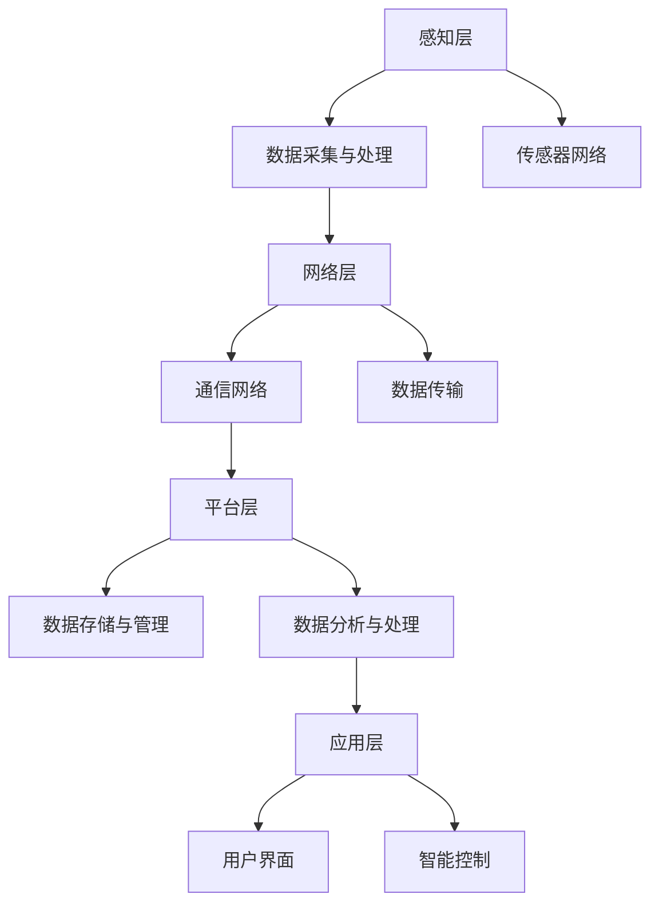

                 

# 价值投资中的智能电网技术发展趋势

---

## 关键词  
智能电网、价值投资、技术趋势、能源转型、投资策略、技术创新、市场分析

---

## 摘要  
随着全球能源结构的转型和智能技术的快速发展，智能电网作为现代电力系统的核心技术，正在成为价值投资者关注的焦点。本文通过分析智能电网的技术特点、发展趋势以及其对投资决策的影响，探讨如何在智能电网领域找到具有长期价值的投资机会。文章从智能电网的定义、关键技术、市场分析、投资策略、技术评估等多个维度展开，结合实际案例，为投资者提供深入的技术与市场洞察，帮助其在智能电网领域做出更明智的投资决策。

---

## 第1章: 智能电网技术概述

### 1.1 智能电网的定义与特点  
#### 1.1.1 智能电网的定义  
智能电网（Smart Grid）是通过先进的信息通信技术和自动化设备，将电力系统中的发电、输电、配电、用电等环节进行智能化管理，以实现电力系统的高效、可靠、安全和经济运行的新型电力系统。  

#### 1.1.2 智能电网的核心特点  
- **智能化**：利用人工智能、大数据等技术实现电力系统各环节的智能监控与管理。  
- **互动性**：用户与电网之间能够实现双向信息交互，支持分布式能源的接入与管理。  
- **高效性**：通过优化电力分配和需求响应，降低能源浪费，提高能源利用效率。  
- **可靠性**：通过智能监测和自愈功能，减少停电事件，提升电网运行的稳定性。  

#### 1.1.3 智能电网与传统电网的区别  
| 特性       | 传统电网         | 智能电网         |  
|------------|------------------|------------------|  
| 运行方式   | 单向、集中化     | 双向、分布式化   |  
| 监控能力   | 人工监控为主     | 自动化监控为主   |  
| 能源利用   | 低效、依赖化石能源| 高效、可再生能源占比高|  
| 用户参与度 | 被动消费         | 主动参与与互动   |  

---

### 1.2 智能电网的重要性和发展趋势  
#### 1.2.1 智能电网在能源转型中的作用  
智能电网是实现能源结构转型的重要基础设施，支持可再生能源的接入与调配，促进清洁能源的广泛应用。  

#### 1.2.2 智能电网技术的发展趋势  
1. **数字化与智能化**：进一步推动人工智能、大数据等技术在电网中的应用。  
2. **分布式能源系统**：支持分布式发电（如光伏发电、风力发电）的接入与管理。  
3. **用户互动**：通过智能电表和需求响应技术，鼓励用户参与能源管理。  
4. ** cybersecurity**：随着智能电网的联网化，网络安全成为重要挑战。  

#### 1.2.3 智能电网对社会经济的影响  
- 提高电力供应的可靠性和安全性，减少停电损失。  
- 降低能源消耗，支持可持续发展目标。  
- 推动能源产业链的优化与升级，创造新的经济增长点。  

---

### 1.3 价值投资的基本原理  
#### 1.3.1 价值投资的定义与核心理念  
价值投资是一种投资策略，通过分析企业的基本面（如财务状况、市场地位、成长潜力）来寻找被市场低估的投资标的。其核心理念是“买入低于内在价值的资产”。  

#### 1.3.2 价值投资与智能电网技术的结合  
智能电网技术的快速发展为价值投资者提供了新的投资机会，尤其是在以下领域：  
1. **智能设备制造商**：如智能电表、传感器等硬件厂商。  
2. **软件与服务提供商**：如电网管理软件、数据分析服务等。  
3. **分布式能源系统**：支持可再生能源发电的企业。  

#### 1.3.3 价值投资在智能电网领域的应用前景  
智能电网技术的普及和市场需求的增加，将为相关企业带来持续的增长潜力。投资者需要关注企业的技术创新能力、市场竞争力以及财务健康状况，以识别具有长期投资价值的企业。

---

## 第2章: 智能电网技术的核心要素  

### 2.1 智能电网的构成与功能  
#### 2.1.1 智能电网的构成部分  
智能电网主要由发电、输电、配电、用电和通信五个部分构成。  

#### 2.1.2 智能电网的主要功能  
- **数据采集与监控**：实时采集电网运行数据，实现对电网的全面监控。  
- **自动控制**：通过自动化系统实现电网的智能调节与优化。  
- **用户互动**：与用户进行信息交互，支持需求响应和分布式能源管理。  
- **网络安全**：保护电网系统免受网络攻击。  

#### 2.1.3 智能电网的技术架构  
智能电网的技术架构可以分为感知层、网络层、平台层和应用层，如下图所示：  

---

### 2.2 智能电网的关键技术  
#### 2.2.1 物联网技术在智能电网中的应用  
物联网技术通过传感器和通信设备，实现电网设备的实时监控与数据传输，为智能电网的运行提供数据支持。  

#### 2.2.2 大数据分析在智能电网中的应用  
大数据分析技术可以帮助电网企业从海量数据中提取有价值的信息，优化电网运行和用户管理。  

#### 2.2.3 人工智能在智能电网中的应用  
人工智能技术可以用于电网故障诊断、负荷预测、需求响应等领域，提升电网的智能化水平。  

---

### 2.3 智能电网的经济效益与社会效益  
#### 2.3.1 智能电网的经济效益分析  
- **降低运营成本**：通过自动化和智能化管理，减少人工成本和维护费用。  
- **提高能源利用效率**：通过优化电力分配，降低能源浪费。  
- **支持可再生能源发展**：智能电网为分布式能源的接入提供了技术基础。  

#### 2.3.2 智能电网的社会效益分析  
- **减少环境污染**：支持可再生能源的应用，降低化石能源的使用，减少碳排放。  
- **提高供电可靠性**：通过智能监测和自愈功能，减少停电事件。  
- **促进能源公平**：通过用户互动功能，鼓励用户参与能源管理，实现能源使用的公平性。  

---

## 第3章: 智能电网技术对价值投资的影响  

### 3.1 智能电网技术如何影响投资决策  
#### 3.1.1 技术进步对投资价值的影响  
智能电网技术的成熟将提升相关企业的市场竞争力，进而影响其投资价值。  

#### 3.1.2 智能电网技术的市场潜力  
随着全球能源转型的推进，智能电网技术的市场需求将持续增长，为企业带来新的增长机会。  

#### 3.1.3 技术风险与投资决策  
投资者需要关注智能电网技术的成熟度、市场接受度以及技术替代风险，以规避投资风险。  

---

### 3.2 智能电网技术的市场分析  
#### 3.2.1 智能电网市场的现状与未来趋势  
智能电网市场目前处于快速发展阶段，未来几年将保持较高的年复合增长率。  

#### 3.2.2 智能电网市场的竞争格局  
目前，智能电网市场的竞争主要集中在设备制造和软件服务领域，领先企业包括ABB、西门子、通用电气等。  

#### 3.2.3 智能电网市场的投资机会  
1. **分布式能源系统**：随着可再生能源的普及，分布式能源管理系统的市场需求将快速增长。  
2. **智能电表与用户互动**：智能电表的普及和用户互动功能的完善将为相关企业带来新的增长点。  
3. **网络安全**：随着智能电网的联网化，网络安全防护技术的需求将不断增加。  

---

### 3.3 价值投资中的技术评估与选择  
#### 3.3.1 技术评估的基本方法  
投资者可以通过以下方法对智能电网技术进行评估：  
1. **技术成熟度分析**：评估技术的商业化应用情况。  
2. **市场潜力分析**：评估技术的市场需求和增长空间。  
3. **竞争优势分析**：评估企业在技术领域的竞争优势。  

#### 3.3.2 如何选择具有投资价值的智能电网技术  
- **关注技术领先企业**：选择在智能电网技术领域具有领先地位的企业。  
- **关注技术创新企业**：选择在技术创新方面具有优势的企业。  
- **关注市场需求强烈的技术**：选择市场需求明确且增长潜力大的技术。  

#### 3.3.3 技术评估中的关键指标  
| 指标类别     | 关键指标                 |  
|--------------|--------------------------|  
| 技术成熟度   | 商业化应用程度、技术壁垒 |  
| 市场潜力     | 市场规模、市场需求增长率 |  
| 竞争优势     | 市场占有率、技术领先性   |  

---

## 第4章: 智能电网技术发展的驱动因素  

### 4.1 政策支持与行业规范  
#### 4.1.1 国家政策对智能电网发展的推动  
各国政府通过政策支持和资金投入，推动智能电网技术的发展和应用。  

#### 4.1.2 行业标准对智能电网技术的影响  
智能电网技术的发展需要统一的行业标准，以确保不同设备和系统之间的兼容性。  

#### 4.1.3 政策风险与投资策略  
投资者需要关注政策变化对智能电网技术的影响，合理调整投资策略。  

---

### 4.2 技术创新与研发投入  
#### 4.2.1 技术创新对智能电网发展的推动  
技术创新是智能电网技术发展的核心动力，尤其是在人工智能、物联网等领域。  

#### 4.2.2 研发投入对智能电网技术的影响  
企业的研发投入水平直接影响其技术竞争力和市场地位。  

#### 4.2.3 技术创新与投资机会的关系  
技术创新往往伴随着投资机会，投资者需要关注技术创新带来的市场潜力。  

---

### 4.3 市场需求与用户行为  
#### 4.3.1 市场需求对智能电网技术的影响  
市场需求的增长将推动智能电网技术的进一步发展和应用。  

#### 4.3.2 用户行为对智能电网市场的影响  
用户对智能电网技术的接受度和参与度将影响市场的推广和应用。  

#### 4.3.3 市场需求与投资策略的关系  
投资者需要根据市场需求的变化，调整投资策略和目标选择。  

---

## 第5章: 智能电网技术与投资策略的结合  

### 5.1 技术驱动的投资策略  
#### 5.1.1 技术领先企业的投资价值  
技术领先企业往往具有较强的市场竞争力和较高的投资价值。  

#### 5.1.2 技术创新周期与投资时机  
投资者需要关注技术创新周期，选择合适的时机进行投资。  

#### 5.1.3 技术壁垒与竞争优势  
技术壁垒高的企业具有较强的竞争优势，投资价值也相对较高。  

---

### 5.2 市场驱动的投资策略  
#### 5.2.1 市场需求与投资机会  
投资者需要关注市场需求的变化，选择具有增长潜力的智能电网技术。  

#### 5.2.2 市场竞争与投资风险  
市场竞争的加剧可能会影响企业的盈利能力，投资者需要关注相关风险。  

#### 5.2.3 市场趋势与投资策略  
投资者需要根据市场趋势，调整投资策略和目标选择。  

---

## 第6章: 智能电网技术评估与投资案例分析  

### 6.1 技术评估与选择  
#### 6.1.1 技术评估的关键指标  
- **技术成熟度**：技术是否已经商业化。  
- **市场潜力**：技术的市场需求和增长空间。  
- **竞争优势**：企业在技术领域的竞争优势。  

#### 6.1.2 技术选择的策略  
- **聚焦核心技术创新**：选择在核心技术领域具有优势的企业。  
- **关注市场需求强烈的技术**：选择市场需求明确且增长潜力大的技术。  
- **分散投资风险**：通过多元化投资降低技术风险。  

---

### 6.2 投资案例分析  
#### 6.2.1 案例一：智能电表制造商  
某智能电表制造商通过技术创新和市场推广，成功占据了较大的市场份额，投资价值显著。  

#### 6.2.2 案例二：分布式能源管理系统  
某分布式能源管理系统通过技术优势和市场需求，实现了快速增长，具有较高的投资价值。  

#### 6.2.3 案例三：网络安全防护企业  
随着智能电网的联网化，网络安全防护技术的需求不断增加，相关企业具有较大的投资潜力。  

---

## 第7章: 智能电网技术发展的未来趋势与投资展望  

### 7.1 智能电网技术的未来发展趋势  
1. **全面数字化与智能化**：进一步推动人工智能、大数据等技术在电网中的应用。  
2. **分布式能源系统普及**：随着可再生能源的广泛应用，分布式能源系统将成为智能电网的重要组成部分。  
3. **用户互动与能源共享**：通过智能电网技术，用户将更加积极参与能源管理，实现能源的共享与优化。  
4. **网络安全技术升级**：随着智能电网的联网化，网络安全技术将不断升级，以应对日益复杂的网络攻击。  

---

### 7.2 投资展望  
1. **技术创新型企业**：关注在智能电网核心技术领域具有创新能力的企业。  
2. **分布式能源系统**：随着可再生能源的普及，分布式能源管理系统具有较大的投资潜力。  
3. **网络安全技术**：随着智能电网的联网化，网络安全技术的需求将不断增加，相关企业具有较大的投资潜力。  
4. **国际化市场**：关注智能电网技术在国际市场的推广和应用，寻找具有全球竞争力的企业。  

---

## 第8章: 风险管理与投资策略调整  

### 8.1 智能电网投资中的风险因素  
1. **技术风险**：智能电网技术的成熟度和技术替代风险。  
2. **市场风险**：市场需求的变化和市场竞争的加剧。  
3. **政策风险**：政策变化对智能电网技术的影响。  
4. **网络安全风险**：智能电网的网络安全威胁。  

---

### 8.2 投资策略调整建议  
1. **分散投资风险**：通过多元化投资降低技术风险和市场风险。  
2. **关注政策变化**：及时调整投资策略以应对政策变化。  
3. **加强技术研究**：深入了解智能电网技术的核心原理和市场趋势。  
4. **关注企业基本面**：选择财务健康、管理团队优秀的智能电网企业。  

---

## 第9章: 结论与展望  

### 9.1 结论  
智能电网技术作为现代电力系统的核心技术，正在为价值投资者提供新的投资机会。投资者需要关注技术发展、市场需求和政策变化，选择具有长期投资价值的企业。  

### 9.2 未来展望  
随着智能电网技术的不断发展和能源结构的转型，智能电网投资领域将迎来更多的机遇和挑战。投资者需要保持对技术发展的敏感性，灵活调整投资策略，以实现长期稳定的收益。  

---

## 参考文献  
（此处列出相关的书籍、论文、研究报告等参考资料）

---

## 附录  
（此处可以列出相关技术指标、数据表格、代码示例等补充材料）

