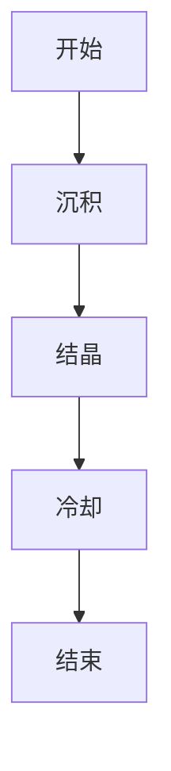
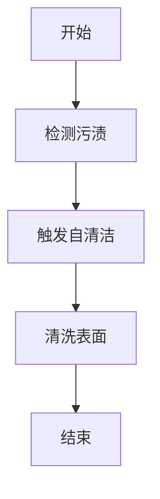
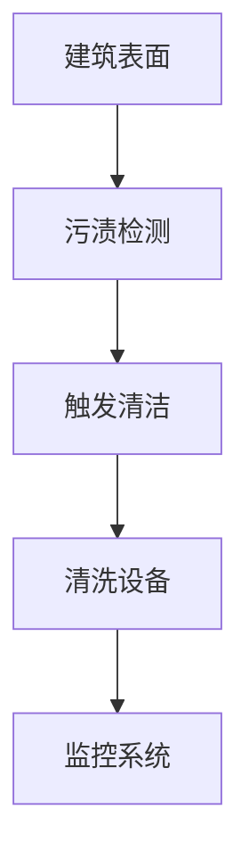
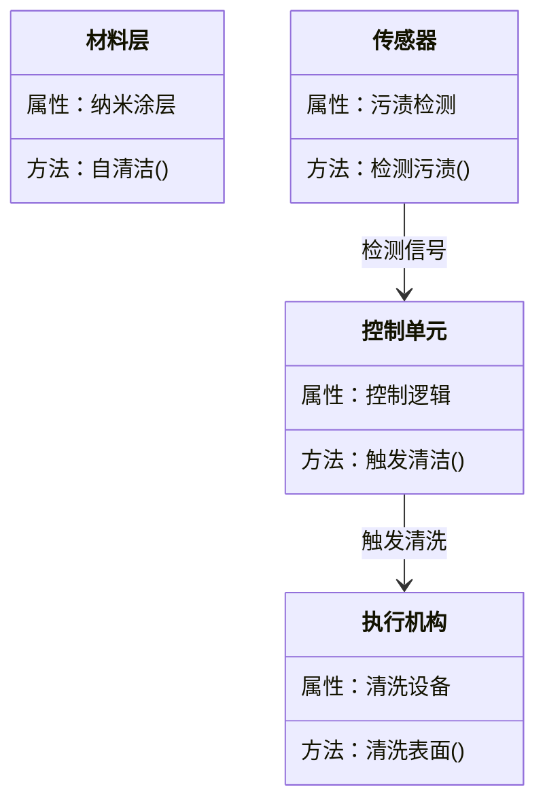

                 


# 价值投资中的智能纳米材料自清洁技术分析

> 关键词：智能纳米材料，自清洁技术，价值投资，纳米材料制备，数学模型，系统架构

> 摘要：本文深入分析智能纳米材料在自清洁技术中的应用及其在价值投资中的潜力。通过背景介绍、核心概念、算法原理、数学模型、系统架构、项目实战和最佳实践，探讨如何利用智能纳米材料提升投资价值。结合实际案例，提供详细的系统设计和实现方法，为投资者和技术人员提供参考。

---

## 第1章: 智能纳米材料与自清洁技术的背景介绍

### 1.1 问题背景与问题描述
智能纳米材料是指在纳米尺度上具有特殊物理、化学或生物性能的材料。自清洁技术通过利用这些材料的特性，实现表面的自我清洁功能。随着环保和可持续发展的需求增加，自清洁技术在建筑、汽车、电子等领域展现出巨大潜力。

#### 1.1.1 智能纳米材料的起源与发展
智能纳米材料起源于20世纪90年代，随着纳米技术的进步，其应用领域不断扩展。自清洁技术的灵感来源于自然界的仿生学，例如荷叶的自清洁效应（超疏水性）。

#### 1.1.2 自清洁技术的核心问题与挑战
自清洁技术的核心问题在于如何在不同环境下保持表面的清洁，同时降低成本和维护难度。挑战包括材料稳定性、环境适应性和大规模生产成本。

#### 1.1.3 价值投资中的技术应用潜力
智能纳米材料的自清洁技术可以降低维护成本，延长产品寿命，提高产品附加值。在价值投资中，这类技术具有较高的市场潜力和投资回报率。

### 1.2 问题解决与边界分析
#### 1.2.1 自清洁技术的解决方案概述
通过纳米材料的自清洁功能，减少表面污渍附着，实现自我清洁。解决方案包括纳米涂层、光催化技术等。

#### 1.2.2 智能纳米材料的边界与外延
智能纳米材料的应用范围包括建筑、汽车、电子设备等领域，其边界在于材料的物理和化学性能。

#### 1.2.3 核心概念的结构与组成要素
智能纳米材料的核心要素包括纳米尺度、表面特性、化学稳定性等。

### 1.3 核心概念对比与ER实体关系图
智能纳米材料与传统材料的对比分析如下：

| 特性       | 智能纳米材料             | 传统材料             |
|------------|--------------------------|----------------------|
| 尺度       | 纳米级别                 | 微米或更大           |
| 表面特性   | 高度有序和自清洁         | 低效或无自清洁能力   |
| 应用领域   | 建筑、汽车、电子设备等    | 建筑、汽车、电子设备等|

ER实体关系图展示了智能纳米材料与自清洁技术的关系：

```mermaid
erDiagram
    material "智能纳米材料" {
        id serial
        property(string)
        application(string)
    }
    technology "自清洁技术" {
        id serial
        function(string)
        material serial
    }
    material --> technology : "应用于"
```

---

## 第2章: 智能纳米材料的原理与特性

### 2.1 核心原理与制备方法
#### 2.1.1 纳米材料的基本原理
智能纳米材料的特性来源于其纳米尺度的结构，例如纳米颗粒的表面效应和量子效应。

#### 2.1.2 纳米材料的制备流程
化学气相沉积法（CVD）是制备纳米材料的一种常用方法：



#### 2.1.3 自清洁技术的仿生学原理
自清洁技术模仿自然界中的超疏水表面，例如荷叶的自清洁效应。

### 2.2 材料特性与功能分析
#### 2.2.1 纳米材料的物理特性
纳米材料的高比表面积和表面活性是其自清洁功能的基础。

#### 2.2.2 自清洁功能的实现机制
自清洁技术通过表面的微结构设计，实现污渍的排斥和自我清洁。

#### 2.2.3 材料性能对比表格
以下是几种纳米材料的性能对比：

| 材料类型       | 硬度（莫氏） | 疲劳强度（MPa） | 耐腐蚀性 |
|----------------|--------------|------------------|----------|
| 氧化铝纳米材料 | 9            | 300              | 高        |
| 氮化硅纳米材料 | 7            | 250              | 中        |
| 碳纳米管材料   | 10           | 500              | 高        |

---

## 第3章: 自清洁技术的数学模型与算法分析

### 3.1 数学模型构建
#### 3.1.1 纳米材料性能的评估模型
纳米材料的性能可以通过以下公式进行评估：

$$
\text{杨氏模量} = \frac{\text{应力}}{\text{应变}}
$$

#### 3.1.2 自清洁效果的数学表达式
自清洁效果可以通过表面能的降低来衡量：

$$
\text{表面能} = \gamma = \frac{\text{表面张力}}{\sqrt{\text{面积}}}
$$

### 3.2 算法原理与流程图
自清洁技术的核心算法如下：



### 3.3 数学公式的详细讲解
#### 3.3.1 纳米材料力学性能公式
纳米材料的力学性能可以通过以下公式计算：

$$
\text{屈服强度} = \frac{\text{载荷}}{\text{面积}}
$$

#### 3.3.2 自清洁效果的评估公式
自清洁效果可以通过以下公式进行评估：

$$
\text{清洁效率} = \frac{\text{清洁面积}}{\text{总面积}} \times 100\%
$$

---

## 第4章: 系统分析与架构设计

### 4.1 项目场景与功能需求
#### 4.1.1 项目背景与目标
以智能建筑为例，目标是通过自清洁技术减少建筑的维护成本。

#### 4.1.2 系统功能需求分析
系统需要具备污渍检测、自动清洁和状态监测功能。

#### 4.1.3 系统边界与交互流程
系统边界包括建筑表面、清洁设备和监控系统：



### 4.2 系统架构设计
#### 4.2.1 系统架构图
系统架构包括传感器、执行机构和控制单元：



---

## 第5章: 项目实战与案例分析

### 5.1 项目实战
#### 5.1.1 环境安装
安装Python和相关库，例如numpy和scipy。

#### 5.1.2 核心代码实现
以下是纳米材料模拟的Python代码：

```python
import numpy as np

def simulate_nanomaterial():
    # 初始化纳米结构
    structure = np.random.rand(100, 100)
    # 计算表面能
    surface_energy = np.mean(structure)
    return surface_energy

simulate_nanomaterial()
```

#### 5.1.3 代码应用解读与分析
代码模拟纳米材料的表面结构，并计算其表面能。

### 5.2 实际案例分析
#### 5.2.1 案例背景介绍
以汽车工业中的自清洁涂层应用为例。

#### 5.2.2 系统实现与分析
通过自清洁涂层减少汽车表面的污渍附着，降低清洗频率和维护成本。

---

## 第6章: 最佳实践与小结

### 6.1 最佳实践
#### 6.1.1 投资建议
在价值投资中，关注具有技术创新和市场潜力的智能纳米材料企业。

#### 6.1.2 技术实现建议
在系统设计中，注重材料的稳定性和环境适应性。

### 6.2 小结
智能纳米材料的自清洁技术具有广阔的应用前景，投资者和技术人员应关注其发展潜力。

### 6.3 注意事项
在实际应用中，需考虑材料的稳定性和环境影响。

### 6.4 拓展阅读
推荐阅读《纳米材料与自清洁技术》等相关书籍。

---

# 总结

智能纳米材料的自清洁技术在价值投资中具有重要地位，其应用可以显著降低成本和提高产品寿命。通过本文的分析，读者可以深入了解该技术的原理、应用和投资潜力，为未来的技术和投资决策提供参考。

