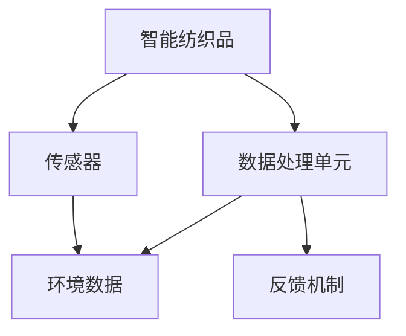
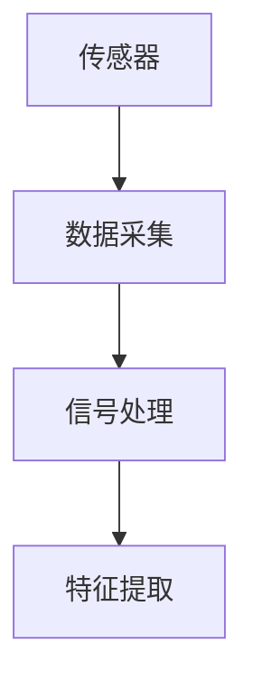
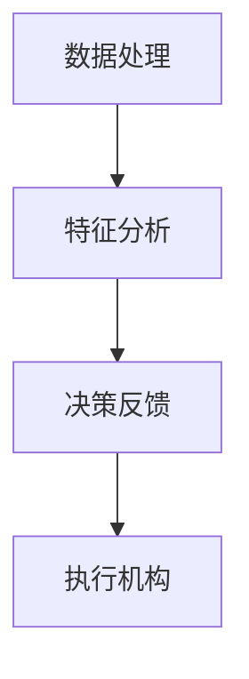
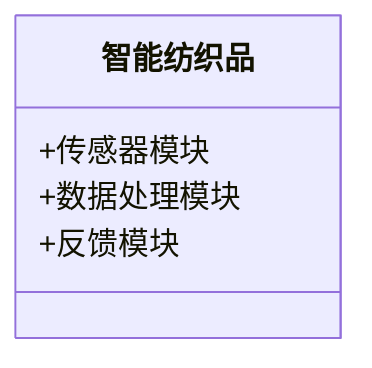
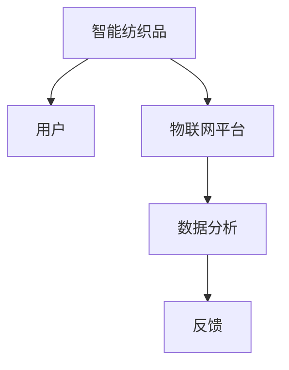

                 

# 价值投资中的智能纺织品技术发展趋势

> 关键词：智能纺织品，价值投资，技术趋势，投资策略，市场分析

> 摘要：本文深入探讨智能纺织品技术的发展趋势及其在价值投资中的应用潜力。通过分析智能纺织品的核心技术、市场现状、投资策略和未来趋势，本文为投资者提供了基于技术驱动的投资决策参考。

---

# 第1章: 智能纺织品技术与价值投资概述

## 1.1 智能纺织品的定义与核心概念
智能纺织品是一种集成多种智能技术的新型纺织产品，能够通过传感器、数据处理和反馈机制与用户交互。其核心在于将传统纺织材料与电子、传感器和物联网技术结合，实现功能性、舒适性和智能化的统一。

## 1.2 价值投资的基本原理
价值投资强调以低于内在价值的价格购买优质资产，关注企业的基本面、竞争优势和长期发展潜力。在智能纺织品领域，投资者需要识别技术领先、市场竞争力强、财务稳健的企业。

## 1.3 智能纺织品行业的市场现状
全球智能纺织品市场快速增长，主要驱动力来自技术进步和消费者需求变化。市场竞争格局初步形成，但技术创新和规模化生产仍是关键。

---

# 第2章: 智能纺织品技术的背景与问题分析

## 2.1 智能纺织品技术的发展背景
随着科技的进步，纺织品的功能性需求增加，推动了智能纺织品的发展。消费者对健康监测、舒适性和个性化体验的需求上升，为智能纺织品提供了市场空间。

## 2.2 智能纺织品技术的核心问题
技术实现难度大、成本高、市场接受度低是主要挑战。此外，技术与商业化之间的平衡也是关键问题。

## 2.3 智能纺织品技术的边界与外延
智能纺织品的功能和应用场景有明确的边界，但其外延广泛，可与其他领域如物联网、医疗健康深度融合。

---

# 第3章: 智能纺织品技术的核心概念与联系

## 3.1 核心概念原理
智能纺织品由传感器、数据处理单元和反馈机制组成，能够实时监测和响应环境变化。

## 3.2 核心概念属性特征对比
通过对比不同智能纺织品技术，分析其性能、成本和市场定位的差异。

## 3.3 ER实体关系图

---

# 第4章: 智能纺织品技术的核心算法原理

## 4.1 传感器数据采集算法

## 4.2 数据处理与反馈算法

---

# 第5章: 智能纺织品技术的系统分析与架构设计

## 5.1 系统功能设计

## 5.2 系统架构设计

---

# 第6章: 智能纺织品技术的价值投资策略

## 6.1抽丝剥茧分析技术驱动的市场价值
分析技术进步对企业价值的影响，识别技术领先企业的投资机会。

## 6.2 投资策略与风险管理
制定基于技术评估和市场分析的投资策略，同时考虑行业风险和市场波动。

---

# 第7章: 智能纺织品技术的案例分析

## 7.1 成功案例分析
通过具体案例展示智能纺织品技术的应用和投资价值。

## 7.2 投资策略的实践应用
总结案例中的投资策略，为读者提供参考。

---

# 第8章: 智能纺织品技术的未来趋势

## 8.1 新材料与新技术的融合
探讨新材料和新技术如何进一步推动智能纺织品的发展。

## 8.2 市场扩展与应用深化
预测智能纺织品在新市场和新领域的应用潜力。

---

# 第9章: 价值投资中的智能纺织品技术总结

## 9.1抽丝剥茧总结
总结智能纺织品技术的发展趋势和投资价值。

## 9.2 投资策略小结
重申投资策略，强调技术驱动的重要性。

---

# 第10章: 智能纺织品技术投资的注意事项与拓展阅读

## 10.1 投资注意事项
提醒投资者注意技术风险、市场波动和政策变化。

## 10.2 拓展阅读建议
推荐相关书籍和资源，供读者深入学习。

---

# 第11章: 附录

## 11.1 附录1：智能纺织品相关技术参数表
| 技术 | 参数 | 描述 |
|------|------|------|
| 传感器 | 灵敏度 | 检测精度 |
| 数据处理 | 响应时间 | 数据处理速度 |

## 11.2 附录2：市场数据参考
提供市场容量、增长率等关键数据。

---

通过以上结构，文章系统地分析了智能纺织品技术及其投资价值，帮助投资者在技术驱动的市场中把握机会。

