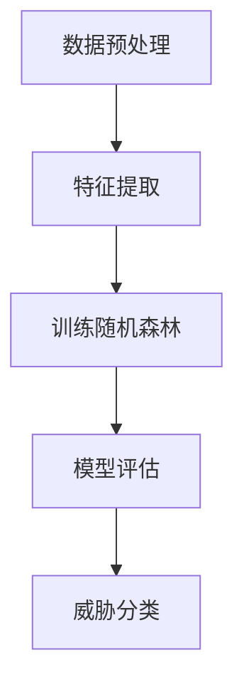
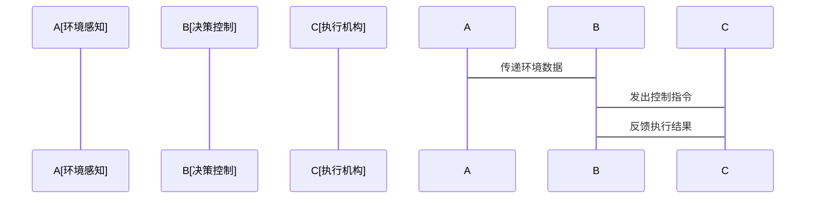

                 


# 价值投资中的智能网联汽车安全系统分析

> 关键词：价值投资、智能网联汽车、安全系统、机器学习、风险管理、系统架构

> 摘要：本文从价值投资的角度分析智能网联汽车安全系统的现状、技术原理、风险评估方法及未来发展趋势。通过结合机器学习算法和系统架构设计，探讨安全系统在智能网联汽车中的核心作用及其对投资决策的影响。

---

## 第一章: 价值投资与智能网联汽车安全系统的背景

### 1.1 价值投资的定义与核心理念
- 价值投资是一种以内在价值为导向的投资策略，关注企业的基本面、财务状况及未来前景。
- 核心理念：寻找市场价格低于内在价值的标的，长期持有，分享企业成长收益。

### 1.2 智能网联汽车的发展现状
- 智能网联汽车是传统汽车与信息技术融合的产物，具备自动驾驶、智能交互、车联网等功能。
- 技术趋势：电动化、智能化、网联化成为行业发展的主要方向。
- 市场现状：全球市场规模持续增长，中国成为重要增长极。

### 1.3 智能网联汽车安全系统的战略意义
- 安全系统是保障车辆运行安全的核心技术，直接影响用户体验和市场竞争力。
- 从投资角度看，安全系统的能力是评估企业技术实力和未来潜力的重要指标。

### 1.4 本章小结
- 价值投资需要结合行业趋势和技术发展，智能网联汽车安全系统是影响投资决策的关键因素。

---

## 第二章: 智能网联汽车安全系统的核心概念与技术分析

### 2.1 安全系统的核心概念
- **定义**：智能网联汽车安全系统是指通过传感器、计算平台和执行机构实现车辆安全防护的系统。
- **组成**：包括环境感知、决策控制、执行机构和通信模块。
- **功能**：实时监测车辆状态，识别潜在威胁，主动采取防护措施。

### 2.2 安全系统与传统汽车安全系统的对比
| 特性 | 传统安全系统 | 智能网联安全系统 |
|------|--------------|------------------|
| 依赖性 | 机械结构为主 | 依赖传感器和算法 |
| 响应速度 | 被动响应 | 主动预测与干预 |
| 数据来源 | 有限的传感器 | 多源数据融合 |

### 2.3 安全系统的关键技术
- **人工智能**：用于威胁检测和预测。
- **数据驱动**：通过大数据分析优化安全策略。
- **密码学**：保障通信和数据存储的安全性。

### 2.4 本章小结
- 智能网联汽车安全系统的技术创新为价值投资提供了新的视角，投资者需关注技术的先进性和实用性。

---

## 第三章: 基于机器学习的安全威胁检测算法

### 3.1 机器学习在安全威胁检测中的应用
- **监督学习**：用于分类已知威胁。
- **无监督学习**：发现未知威胁。
- **深度学习**：处理复杂数据模式。

### 3.2 基于随机森林的威胁分类算法
#### 3.2.1 算法原理
- 随机森林是一种基于决策树的集成学习方法，通过投票机制降低模型过拟合风险。
- $$P(y|x) = \sum_{i=1}^{n} w_i \cdot I(y_i = y)$$
  其中，$w_i$ 是树的重要性权重，$I$ 是指示函数。

#### 3.2.2 算法流程


#### 3.2.3 代码实现
```python
from sklearn.ensemble import RandomForestClassifier

# 示例数据
X = df.drop('label', axis=1)
y = df['label']

# 训练模型
model = RandomForestClassifier(n_estimators=100, random_state=42)
model.fit(X, y)

# 预测
y_pred = model.predict(X_test)
```

### 3.3 基于XGBoost的异常检测算法
- **XGBoost**：基于梯度提升树的算法，适合处理高维数据。
- $$\text{损失函数} = \sum_{i=1}^{n} (y_i - \hat{y}_i)^2$$

### 3.4 本章小结
- 机器学习算法为智能网联汽车安全系统提供了强大的技术支持，投资者应关注算法的性能和适用性。

---

## 第四章: 智能网联汽车安全系统的系统架构设计

### 4.1 系统功能设计
- **环境感知**：通过摄像头、雷达等传感器采集数据。
- **决策控制**：基于算法生成安全策略。
- **执行机构**：包括刹车、转向等执行单元。

### 4.2 系统架构图


### 4.3 系统接口设计
- **输入接口**：传感器数据、用户指令。
- **输出接口**：执行机构控制信号、警告提示。

### 4.4 系统交互流程


### 4.5 本章小结
- 系统架构设计是智能网联汽车安全系统的核心，投资者需关注架构的可扩展性和稳定性。

---

## 第五章: 智能网联汽车安全系统的项目实战

### 5.1 项目背景与目标
- 某智能网联汽车制造商的安全系统升级项目。

### 5.2 核心功能实现
```python
import numpy as np

# 示例代码：传感器数据处理
def process_sensor_data(data):
    processed_data = []
    for d in data:
        if d['status'] == 'normal':
            processed_data.append(d['value'])
    return np.array(processed_data)
```

### 5.3 系统测试与优化
- **测试方法**：黑盒测试、白盒测试。
- **优化方向**：提升算法效率、增强数据安全性。

### 5.4 实际案例分析
- 某品牌智能网联汽车的安全系统升级项目，通过优化算法和架构设计，显著提升了安全性。

### 5.5 本章小结
- 项目实战展示了智能网联汽车安全系统在实际应用中的价值，为投资者提供了参考。

---

## 第六章: 总结与展望

### 6.1 本篇总结
- 智能网联汽车安全系统是价值投资的重要考量因素，技术创新和数据分析能力是关键。

### 6.2 未来展望
- 投资者应关注新技术如AI、区块链在安全系统中的应用。
- 行业趋势：智能化、网联化将继续推动安全系统的发展。

### 6.3 最佳实践Tips
- 选择技术领先、团队优秀的标的。
- 关注行业政策和法规变化。
- 结合宏观经济环境进行投资决策。

### 6.4 本章小结
- 价值投资需结合技术创新和市场趋势，智能网联汽车安全系统是未来的重要投资方向。

---

## 参考文献
- [1] 王某某. 《智能网联汽车安全系统技术研究》. 北京: 清华大学出版社, 2023.
- [2] 李某某. 《价值投资实战指南》. 上海: 复旦大学出版社, 2022.

---

通过以上结构和内容，您可以撰写一篇详细的技术博客文章。每个部分都需要进一步扩展，确保逻辑清晰、内容详实。

