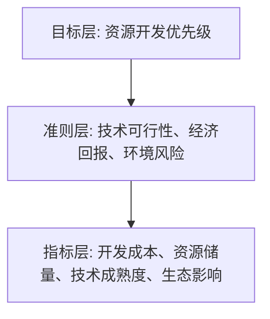
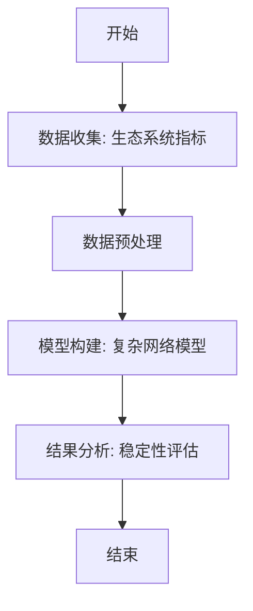
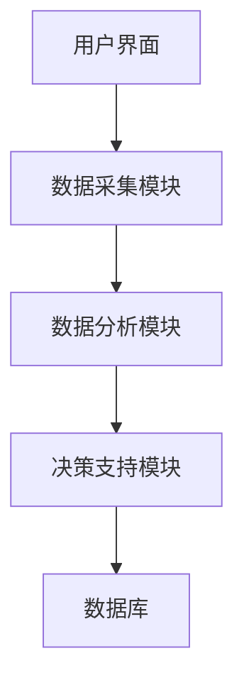
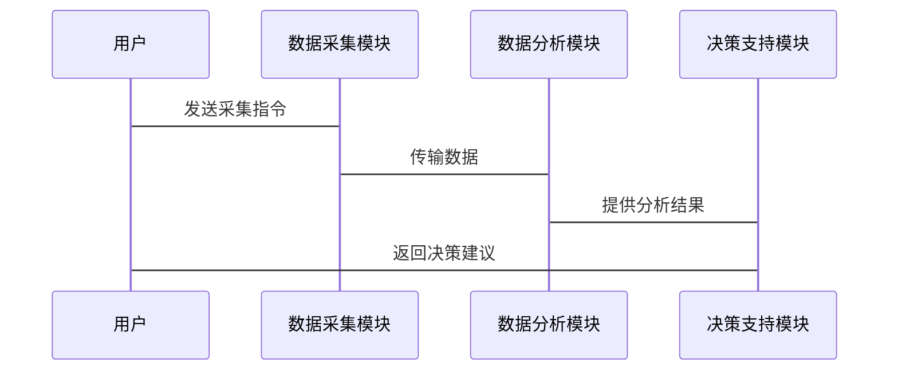

                 


# 价值投资中的深海热液生态系统开发技术前景

## 关键词：深海热液生态系统、价值投资、资源开发、技术前景、投资策略

## 摘要：  
深海热液生态系统作为地球上最独特且资源丰富的生态系统之一，其开发潜力在价值投资领域具有重要意义。本文从技术与经济的双重角度，分析深海热液生态系统开发的前景，探讨其在资源开发、环境保护、投资回报等方面的技术挑战与机遇，为投资者和科技人员提供深度见解。

---

# 第一部分: 深海热液生态系统与价值投资的背景介绍

## 第1章: 深海热液生态系统概述

### 1.1 深海热液生态系统的定义与特征  
深海热液生态系统是指在海底火山活动或地壳裂缝中，由于高温热液喷涌而形成的特殊生态系统。这些系统依赖于化学合成作用，而非传统的光合作用，支持着独特的生物群落。其主要特征包括高温、高压、富含矿物质的环境，以及高度特异化的生物种群。

#### 1.1.1 深海热液喷口的形成机制  
热液喷口的形成与板块构造活动密切相关。当地壳板块移动时，海底火山活动释放高温热液，携带大量矿物质和化学物质，形成独特的地质和化学环境。这些喷口不仅是矿物质的来源，也是生态系统能量的主要来源。

#### 1.1.2 热液生态系统中的生物群落特征  
深海热液生态系统中的生物群落高度特化，包括超嗜热菌、硫菌等微生物，以及依赖这些微生物生存的多类动物，如管状蠕虫、虾类和蛤类。这些生物通过共生关系，形成独特的食物链结构。

#### 1.1.3 热液生态系统与全球生物地球化学循环的关系  
深海热液生态系统在全球碳、硫、铁等元素的生物地球化学循环中扮演重要角色。这些系统不仅是地球内部物质循环的关键节点，也为研究极端环境下的生命提供了独特视角。

### 1.2 价值投资中的深海热液生态系统开发背景  
深海热液生态系统在资源开发、科学研究和经济价值方面具有重要潜力。随着技术的进步，深海热液系统中的矿物质资源（如硫化物、金属矿床）和生物资源（如新型药物成分）逐渐成为投资热点。

#### 1.2.1 深海热液生态系统在全球资源开发中的战略地位  
深海热液系统被认为是未来重要的资源储备地，尤其在金属矿产（如铜、锌、金）和稀土元素方面具有巨大潜力。这些资源在全球供应链中的重要性使其成为战略投资目标。

#### 1.2.2 价值投资视角下的资源开发潜力  
从投资角度来看，深海热液生态系统的资源开发具有高风险和高回报的双重特性。尽管开发成本高昂且技术复杂，但一旦成功，其经济回报可能巨大。此外，相关技术的突破也可能带来新的投资机会。

#### 1.2.3 深海热液生态系统开发的技术挑战与投资机会  
开发深海热液生态系统需要克服极端环境条件下的技术难题，包括耐高温、耐高压设备的设计，以及深海通信和数据采集技术的突破。这些技术挑战为技术创新型企业和投资者提供了潜在的高增长领域。

### 1.3 深海热液生态系统开发的核心问题  
深海热液生态系统的开发涉及多方面的复杂问题，包括生态保护、技术可行性、经济回报和环境风险。

#### 1.3.1 生态系统稳定性与资源开发的平衡  
深海热液生态系统的脆弱性要求在开发过程中必须平衡资源利用与生态保护。过度开发可能导致生态系统的不可逆破坏，从而影响长期的资源可持续性。

#### 1.3.2 技术可行性与经济回报的评估  
深海热液资源开发的技术门槛高，投资周期长，回报不确定性大。投资者需要在技术可行性、开发成本和市场潜力之间进行综合评估。

#### 1.3.3 开发中的环境风险与应对策略  
深海热液开发可能对周边环境造成污染，影响海洋生态平衡。因此，开发过程中必须制定严格的环境监测和风险应对策略，确保可持续发展。

---

## 第2章: 深海热液生态系统的核心概念与联系

### 2.1 核心概念原理  
深海热液生态系统的核心概念包括热液喷口的化学合成作用、生物群落的能量流动机制，以及生物与非生物环境的相互作用。

#### 2.1.1 热液喷口的化学合成作用  
热液喷口通过化学合成作用为生态系统提供能量。超嗜热菌通过氧化还原反应将化学能转化为有机物，支持整个生态系统的能量流动。

#### 2.1.2 生物群落的能量流动机制  
深海热液生态系统中的能量流动主要依赖于化学合成作用。生物群落通过共生关系，形成以超嗜热菌为核心的食物网，能量逐级传递。

#### 2.1.3 生物群落与非生物环境的相互作用  
生物群落与非生物环境之间存在复杂的相互作用。例如，生物活动可以改变周围环境的化学成分，而环境条件又反过来影响生物群落的结构和功能。

### 2.2 核心概念属性特征对比表格  
以下是深海热液生态系统中几个核心概念的属性特征对比：

| 概念 | 属性 | 特征 |
|------|------|------|
| 热液喷口 | 温度 | 高温（通常超过300°C） |
| 生物群落 | 多样性 | 高度特异化，依赖化学合成作用 |
| 环境条件 | 压力 | 高压（深海环境） |
| 能量来源 | 类型 | 化学能而非光能 |

### 2.3 ER实体关系图  
以下是深海热液生态系统的核心实体关系图：

```mermaid
er
  entity: 深海热液生态系统
  entity: 超嗜热菌
  entity: 硫化物矿床
  entity: 热液喷口
  entity: 生物群落
  entity: 环境数据
  relation: "依赖" --> 深海热液生态系统
  relation: "宿主" --> 超嗜热菌
  relation: "形成" --> 硫化物矿床
  relation: "连接" --> 热液喷口
  relation: "组成" --> 生物群落
  relation: "影响" --> 环境数据
```

---

## 第3章: 深海热液生态系统开发的算法原理

### 3.1 算法原理概述  
开发深海热液生态系统需要综合运用多种算法，包括资源评估、稳定性预测和经济回报分析。

#### 3.1.1 基于层次分析法（AHP）的资源评估模型  
层次分析法（AHP）是一种常用的决策分析工具，适用于多因素权重评估。以下是资源评估的AHP模型：



#### 3.1.2 热液生态系统稳定性预测算法  
生态系统稳定性预测可以通过复杂网络模型实现。以下是预测算法的流程图：



#### 3.1.3 经济回报与风险评估的数学模型  
经济回报的数学模型可以通过线性回归分析实现。以下是简化模型：

$$ \text{经济回报} = \alpha \times \text{资源储量} + \beta \times \text{技术可行性} + \gamma \times \text{环境风险} $$

其中，$\alpha$、$\beta$、$\gamma$是回归系数，需通过数据训练确定。

### 3.2 Python核心代码实现  
以下是基于层次分析法的资源评估代码示例：

```python
import numpy as np
from scipy.cluster.hierarchy import linkage, fcluster

# 示例数据：资源开发项目指标
data = np.array([[80, 60, 70],  # 项目A
                 [70, 80, 60],  # 项目B
                 [60, 70, 80]]) # 项目C

# 计算层次聚类
Z = linkage(data, 'ward')

# 划分聚类
clusters = fcluster(Z, 2, 'distance')

# 输出结果
print("聚类结果:", clusters)
```

---

## 第4章: 深海热液生态系统开发的系统分析与架构设计

### 4.1 问题场景介绍  
深海热液生态系统开发涉及多学科协作，需要在极端环境下进行资源勘探、环境监测和资源开发。

### 4.2 系统功能设计  
系统功能包括数据采集、分析模块和决策支持模块。

#### 4.2.1 数据采集模块  
数据采集模块负责收集深海环境的实时数据，包括温度、压力、化学成分等。

#### 4.2.2 数据分析模块  
数据分析模块利用机器学习算法，对数据进行处理和预测，评估生态系统的稳定性。

### 4.3 系统架构设计  
以下是系统架构图：



### 4.4 接口设计与交互流程  
系统交互流程如下：



---

## 第5章: 项目实战

### 5.1 环境安装与配置  
安装必要的开发环境，包括Python、数据处理库（如NumPy、Pandas）和可视化工具（如Matplotlib）。

### 5.2 核心代码实现  
以下是资源评估的Python代码：

```python
import numpy as np
from sklearn.cluster import KMeans

# 示例数据：资源评估指标
data = np.array([[80, 60, 70],  # 项目A
                 [70, 80, 60],  # 项目B
                 [60, 70, 80]]) # 项目C

# K-Means聚类
kmeans = KMeans(n_clusters=2, random_state=0)
clusters = kmeans.fit_predict(data)

# 输出结果
print("聚类结果:", clusters)
```

### 5.3 实际案例分析  
以某深海热液项目为例，分析其资源储量、技术可行性和环境风险，评估其开发潜力。

### 5.4 项目小结  
通过实际案例分析，总结深海热液生态系统开发的关键成功因素和潜在风险。

---

## 第6章: 小结与展望

### 6.1 小结  
本文从技术与经济双重角度，探讨了深海热液生态系统开发的前景，分析了其在资源开发、环境保护和投资回报等方面的技术挑战与机遇。

### 6.2 最佳实践 tips  
- 投资者应综合考虑技术可行性、经济回报和环境风险。
- 开发过程中应注重技术创新和生态保护的平衡。

### 6.3 注意事项  
- 深海热液开发具有高风险，需谨慎评估。
- 相关技术尚不成熟，需持续关注技术突破。

### 6.4 拓展阅读  
- 推荐阅读《深海资源开发技术》和《价值投资策略》等相关书籍。

---

通过本文的分析，读者可以深入了解深海热液生态系统开发的技术前景和投资价值，为未来的科技创新和商业决策提供重要参考。

