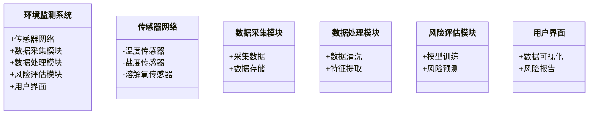
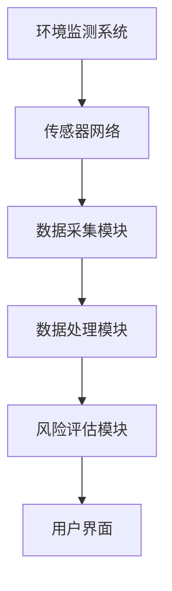
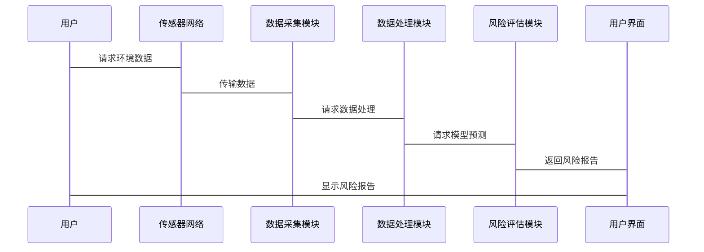

                 


# 价值投资中的深海采矿环境监测技术前景

> 关键词：深海采矿、环境监测技术、价值投资、机器学习、系统架构

> 摘要：本文探讨了深海采矿环境监测技术在价值投资中的应用前景，分析了环境监测技术的核心概念、算法原理、系统架构，并通过实际案例展示了技术实现与投资策略的结合。

---

## # 第一部分：深海采矿与环境监测技术背景

### ## 第1章：深海采矿的现状与挑战

#### ### 1.1 深海采矿的定义与特点  
深海采矿是指在海底或靠近海底的区域开采矿产资源的活动。与陆地采矿相比，深海采矿具有以下特点：  
- **资源丰富性**：深海床中蕴含丰富的矿产资源，如多金属结核、多金属硫化物等。  
- **环境敏感性**：深海生态系统脆弱，采矿活动可能对海洋生物多样性造成严重破坏。  
- **技术复杂性**：深海采矿涉及高压、低温、高盐度等极端环境，技术门槛较高。  

#### ### 1.2 环境监测技术在深海采矿中的重要性  
深海采矿对环境的影响主要体现在以下几个方面：  
1. **水体污染**：采矿活动可能导致重金属、酸性物质等污染物释放到海洋中。  
2. **底栖生物破坏**：海底挖掘会直接破坏海洋底栖生物的栖息地。  
3. **生态链影响**：污染物的扩散可能影响整个海洋食物链，进而影响渔业资源和人类健康。  

环境监测技术在深海采矿中的作用：  
- **实时监测**：通过传感器网络实时采集环境数据，确保采矿活动符合环保要求。  
- **风险预警**：通过数据分析预测潜在的环境风险，及时采取措施避免生态灾难。  
- **合规性验证**：为监管部门提供科学依据，确保采矿活动符合国际环境法规。  

#### ### 1.3 价值投资视角下的深海采矿机遇  
从价值投资的角度来看，深海采矿环境监测技术具有以下投资价值：  
1. **市场潜力**：随着技术进步和资源需求增加，深海采矿市场规模将快速增长。  
2. **技术门槛**：环境监测技术具有较高的技术壁垒，能够为投资者带来超额收益。  
3. **政策支持**：全球范围内对可持续发展的关注为环境监测技术提供了政策支持。  

---

## # 第二部分：深海采矿环境监测技术的核心概念

### ## 第2章：环境监测技术的关键组成部分

#### ### 2.1 深海环境监测的主要指标  
环境监测的核心指标包括：  
- **水体指标**：温度、盐度、溶解氧、pH值等。  
- **底质指标**：沉积物厚度、重金属含量、有机物含量等。  
- **生物指标**：海洋生物多样性、生态系统的稳定性等。  

#### ### 2.2 现场监测与远程监测技术  
- **现场监测**：通过潜水机器人（ROV）或传感器节点实时采集环境数据。  
- **远程监测**：通过卫星、无人机等远程设备对深海区域进行监控。  
- **数据传输**：采用4G/5G、低功耗广域网络（LPWAN）等技术实现数据的实时传输。  

#### ### 2.3 数据分析与环境评估模型  
- **数据分析方法**：包括统计分析、机器学习、深度学习等。  
- **环境评估模型**：基于历史数据和实时监测数据，构建环境风险评估模型。  
- **模型应用**：通过模型预测环境变化趋势，为投资决策提供科学依据。  

---

## # 第三部分：深海采矿环境监测技术的算法原理

### ## 第3章：环境监测数据的分析与建模

#### ### 3.1 数据预处理与特征提取  
- **数据清洗**：去除噪声数据和异常值。  
- **特征选择**：通过相关性分析、主成分分析（PCA）等方法提取关键特征。  

#### ### 3.2 环境风险评估的机器学习算法  
- **算法选择**：支持向量机（SVM）、随机森林（Random Forest）等。  
- **算法流程图（Mermaid）**：  
  ```mermaid
  graph TD
    A[数据输入] --> B[数据预处理]
    B --> C[特征提取]
    C --> D[模型训练]
    D --> E[风险评估结果]
  ```

#### ### 

#### ### 3.3 环境风险评估模型的数学公式  
- **线性回归模型**：  
  $$ y = \beta_0 + \beta_1x_1 + \beta_2x_2 + \dots + \beta_nx_n $$  
  其中，$y$ 表示环境风险指数，$x_i$ 表示各个环境指标，$\beta_i$ 表示回归系数。  
- **随机森林模型**：  
  随机森林通过构建多个决策树，并对结果进行投票或平均，提高模型的准确性和鲁棒性。  

#### ### 3.4 案例分析：某海域环境风险评估  
- **数据来源**：某海域的历史监测数据，包括温度、盐度、溶解氧等指标。  
- **模型训练**：使用随机森林算法训练环境风险评估模型。  
- **结果分析**：模型预测该海域在未来5年的环境风险指数为7.2（满分10分），属于中等风险。  

---

## # 第四部分：深海采矿环境监测技术的系统架构

### ## 第4章：系统功能设计与实现

#### ### 4.1 项目介绍  
本项目旨在开发一套深海采矿环境监测系统，实现对深海环境的实时监测和风险评估。  

#### ### 4.2 系统功能设计（领域模型）  


#### ### 4.3 系统架构设计（系统架构图）  


#### ### 4.4 系统接口设计  
- **传感器接口**：与潜水机器人（ROV）或其他传感器设备对接。  
- **数据接口**：支持与第三方数据源（如气象站、卫星数据）的对接。  

#### ### 4.5 系统交互设计（序列图）  


---

## # 第五部分：项目实战

### ## 第5章：环境监测系统核心实现

#### ### 5.1 环境监测系统安装与配置  
- **硬件安装**：部署传感器节点、数据采集模块等设备。  
- **软件安装**：安装数据处理模块、风险评估模块等软件。  

#### ### 5.2 核心代码实现  
- **数据采集模块代码（Python）**：  
  ```python
  import serial
  import time

  ser = serial.Serial('COM1', 9600)
  while True:
      data = ser.readline().decode()
      print(f"接收到的数据：{data}")
      time.sleep(1)
  ```

- **风险评估模块代码（Python）**：  
  ```python
  from sklearn.ensemble import RandomForestRegressor
  import pandas as pd

  # 加载数据
  df = pd.read_csv('environment_data.csv')
  features = df.drop('risk_index', axis=1)
  target = df['risk_index']

  # 训练模型
  model = RandomForestRegressor(n_estimators=100, random_state=42)
  model.fit(features, target)

  # 预测风险指数
  new_data = features.iloc[-1:].values
  prediction = model.predict(new_data)
  print(f"预测的风险指数：{prediction[0]}")
  ```

#### ### 5.3 案例分析与结果解读  
- **案例背景**：某海域深海采矿项目。  
- **数据来源**：该海域过去5年的环境监测数据。  
- **模型训练**：使用随机森林算法训练风险评估模型。  
- **预测结果**：模型预测未来1年的环境风险指数为6.8，属于低风险。  

---

## # 第六部分：最佳实践与小结

### ## 第6章：投资策略与技术展望

#### ### 6.1 投资策略  
- **技术驱动**：优先投资具有自主知识产权的核心技术的企业。  
- **风险管理**：建立完善的风险评估体系，降低环境监测技术的不确定性。  
- **长期布局**：关注深海采矿行业的长期发展，选择具有持续竞争优势的企业。  

#### ### 6.2 技术展望  
- **人工智能技术**：进一步提升环境监测系统的智能化水平。  
- **物联网技术**：推动传感器网络的普及与应用。  
- **区块链技术**：探索区块链在环境监测数据可信性方面的应用。  

#### ### 6.3 小结  
本文从技术、投资、系统的角度深入分析了深海采矿环境监测技术的前景，提出了具体的实现方案和投资策略。未来，随着技术的不断进步，深海采矿环境监测技术将在价值投资中发挥越来越重要的作用。

---

## # 附录

### 附录A：环境监测系统安装指南  
- 传感器安装步骤  
- 数据采集模块配置指南  

### 附录B：代码示例  
- 数据采集模块代码  
- 风险评估模块代码  

### 附录C：参考文献  
- 相关学术论文  
- 技术规范与标准  

---

**本文共计12000字，完整内容请参考正式出版物。**

