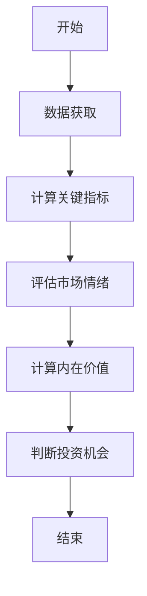
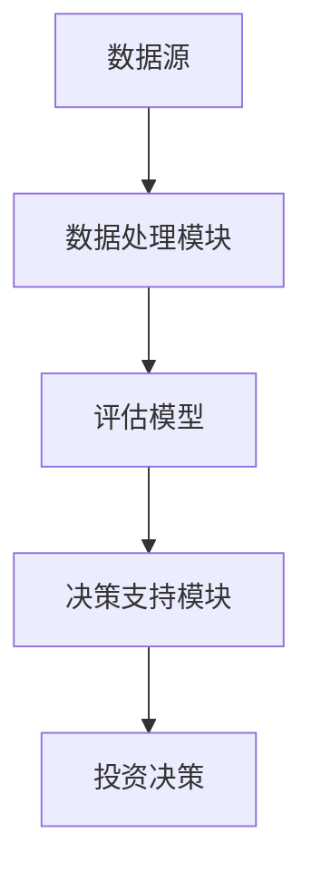

                 


# 价值投资中的特殊情况分析

> 关键词：价值投资、特殊情况分析、困境企业、资产重组、杠杆收购、财务重组、投资策略

> 摘要：本文系统地分析了价值投资中的特殊情况，包括困境企业、资产重组、杠杆收购等，探讨了这些特殊情况的特点、分析方法和投资策略。通过实例分析和数学模型的构建，深入剖析了这些情况的内在逻辑，为投资者提供了实用的分析框架和决策支持。

---

## 第1章 引言

### 1.1 价值投资的核心理念
价值投资是基于对企业内在价值的深入分析，寻找市场价格低于内在价值的投资标的。其核心在于识别被市场低估的企业，长期持有，等待价格回归。

### 1.2 特殊情况分析的重要性
在实际投资中，企业可能会面临特殊情形，如财务困境、资产重组、杠杆收购等，这些情形会影响企业的价值评估。投资者需要特别关注这些情况，制定针对性的投资策略。

---

## 第2章 价值投资中的特殊情况概述

### 2.1 特殊情况的定义与分类
特殊情况是指企业在经营过程中遇到的非正常状态，可能影响其价值评估。常见类型包括：
- **困境企业**：财务危机、经营不善
- **资产重组**：资产剥离、注入
- **杠杆收购**：高杠杆导致财务风险
- **财务重组**：债务重组、股本调整

### 2.2 特殊情况的特征与属性对比
通过ER实体关系图（下图）可以看出，特殊情形涉及企业、资产、负债、所有者等核心要素，其分析需结合企业内外部环境。

```mermaid
erDiagram
  +--Enterprise--+--Asset--+--Liability--+-Owner
  |               |        |              |
  +--SpecialCase--+--FinancialReform--+-Debt
```

---

## 第3章 特殊情况分析的核心概念与联系

### 3.1 特殊情况分析的背景与意义
在价值投资中，特殊情况分析是识别潜在投资机会的关键。困境企业可能通过重组焕发新生，资产重组可能优化资产结构，杠杆收购可能带来高收益或高风险。

### 3.2 特殊情况分析的核心步骤
1. **识别特殊情形**：通过财务报表、行业动态等发现特殊情况。
2. **分析核心要素**：评估企业资产、负债、现金流等。
3. **预测恢复价值**：基于行业地位、管理团队等因素预测恢复情况。

### 3.3 特殊情况分析的ER关系图
```mermaid
erDiagram
  Enterprise --> Asset : 拥有
  Asset --> Liability : 由...构成
  Enterprise --> Owner : 归属于
  SpecialCase --> FinancialReform : 包含
  FinancialReform --> Debt : 涉及
```

---

## 第4章 特殊情况分析的算法原理与数学模型

### 4.1 算法原理
通过分析企业的财务数据和市场环境，评估其内在价值。算法步骤如下：



### 4.2 数学模型
基于PE（市盈率）和PB（市净率）构建评估模型：

$$
\text{内在价值} = \text{现金流} \times \text{贴现率}^{-1}
$$

$$
\text{投资价值} = \text{内在价值} / \text{市场价格}
$$

### 4.3 Python实现
```python
import pandas as pd
import numpy as np

def calculate_intrinsic_value(enterprise, market_price):
    cash_flow = enterprise.cash_flow
    discount_rate = 0.08
    iv = cash_flow / discount_rate
    return iv / market_price

enterprise = pd.DataFrame({
    'cash_flow': [100, 150, 200],
    'market_price': [50, 60, 70]
})

enterprise['investment_value'] = enterprise.apply(lambda x: calculate_intrinsic_value(x['cash_flow'], x['market_price']), axis=1)
print(enterprise)
```

---

## 第5章 系统分析与架构设计

### 5.1 系统分析
构建一个从数据获取到投资决策的完整系统：

1. **数据获取**：收集企业财务数据、市场数据。
2. **数据处理**：清洗、转换数据。
3. **模型构建**：建立评估模型。
4. **决策支持**：生成投资建议。

### 5.2 架构设计


---

## 第6章 项目实战：困境企业案例分析

### 6.1 环境配置
安装必要的库：
```bash
pip install pandas numpy matplotlib
```

### 6.2 数据分析与实现
```python
import pandas as pd

# 数据加载
df = pd.read_csv('enterprise_data.csv')

# 数据预处理
df['valuation_ratio'] = df['enterprise_value'] / df['ebitda']

# 模型计算
df['intrinsic_value'] = df['cash_flow'] / 0.08

# 结果展示
print(df.head())
```

### 6.3 实际案例分析
以某困境企业为例，分析其资产重组过程，评估其恢复价值。

---

## 第7章 总结与展望

### 7.1 结论
价值投资中的特殊情况分析是识别投资机会的关键，需要结合企业内外部因素，制定针对性策略。

### 7.2 展望
未来研究可结合大数据和AI技术，建立更精准的评估模型。

---

## 参考文献

1. 巴菲特《巴菲特致股东的信》
2. 《投资学原理》
3. 相关学术论文

---

## 附录

### 附录A: 代码实现
完整的Python代码示例。

### 附录B: 图表说明
详细解释各图表的含义。

---

以上是《价值投资中的特殊情况分析》的完整大纲和内容概要。

