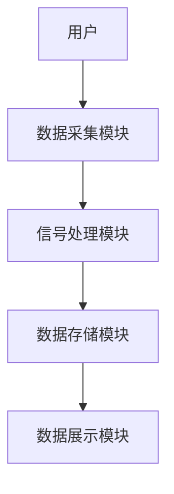

                 


# 价值投资中的生物可降解电子器件技术前景

## 关键词：
- 价值投资、生物可降解、电子器件、技术前景、投资策略、市场分析、系统架构

## 摘要：
本文探讨生物可降解电子器件的技术发展及其投资价值。通过分析材料科学、制造工艺和市场趋势，结合价值投资策略，揭示该领域的投资机会与挑战。内容包括技术背景、市场分析、系统架构和实际案例，旨在为投资者提供深度分析和决策支持。

---

# 目录

1. [背景介绍](#背景介绍)
2. [生物可降解电子器件的核心技术分析](#生物可降解电子器件的核心技术分析)
3. [生物可降解电子器件的市场分析](#生物可降解电子器件的市场分析)
4. [生物可降解电子器件的系统架构与项目实战](#生物可降解电子器件的系统架构与项目实战)
5. [价值投资策略与风险管理](#价值投资策略与风险管理)
6. [未来趋势与挑战](#未来趋势与挑战)
7. [附录](#附录)

---

## 背景介绍

### 1.1 生物可降解电子器件的基本概念

#### 1.1.1 生物可降解材料的定义
生物可降解材料是指在自然环境中能够被微生物分解为二氧化碳和水等无害物质的材料。这类材料通常来源于可再生资源，如淀粉、纤维素和壳聚糖等。

#### 1.1.2 电子器件的基本构成
电子器件通常由半导体材料、导体、绝缘体和封装材料构成。传统电子器件多使用不可降解的塑料和金属材料。

#### 1.1.3 生物可降解电子器件的结合特点
生物可降解电子器件将电子功能与生物降解材料结合，具有环保、可回收和生物相容性等特点。

### 1.2 技术背景与发展趋势

#### 1.2.1 生物可降解材料的历史发展
生物可降解材料的研究始于20世纪70年代，随着环保意识的增强，近年来发展迅速。

#### 1.2.2 电子器件技术的最新进展
柔性电子、有机电子和生物电子器件的技术进步为生物可降解电子器件提供了基础。

#### 1.2.3 生物可降解电子器件的市场前景
随着环保法规的加强和市场需求的增长，生物可降解电子器件市场潜力巨大。

### 1.3 价值投资的基本概念

#### 1.3.1 价值投资的定义与核心理念
价值投资是通过分析企业的内在价值，寻找被市场低估的投资机会。

#### 1.3.2 价值投资在科技领域的应用
科技领域的价值投资注重企业的技术创新、市场竞争力和财务健康。

#### 1.3.3 生物可降解电子器件与价值投资的结合
通过分析技术前景、市场需求和企业竞争力，寻找具有投资价值的生物可降解电子器件企业。

### 1.4 本章小结
本章介绍了生物可降解电子器件的基本概念和价值投资的核心理念，为后续分析奠定了基础。

---

## 生物可降解电子器件的核心技术分析

### 2.1 材料科学与生物可降解电子器件

#### 2.1.1 生物可降解材料的种类与特性

| 材料类型 | 主要成分 | 优点 | 缺点 |
|----------|----------|------|------|
| 天然高分子 | 淀粉、纤维素 | 可降解、无毒 | 机械强度低 |
| 合成高分子 | PLA、PBS | 耐用性高 | 成本较高 |
| 复合材料 | 纤维素+纳米粒子 | 综合性能好 | 制备复杂 |

#### 2.1.2 材料的制备与表征

##### 制备流程：
1. 原料选择：如淀粉或PLA。
2. 热压成型：将材料加热压成薄膜。
3. 表面处理：提高导电性或附着力。

##### 表征方法：
- 热重分析（TGA）：评估材料的降解温度。
- 红外光谱（FTIR）：分析材料的化学结构。
- 拉伸测试：评估材料的机械性能。

#### 2.1.3 材料在电子器件中的应用
生物可降解材料用于制造柔性电路和可穿戴设备，提升环保性能。

### 2.2 生物可降解电子器件的制造工艺

#### 2.2.1 制造流程
1. 材料制备：合成或选择生物可降解材料。
2. 器件设计：设计符合功能需求的结构。
3. 制造工艺：采用印刷电子技术或溅射法。
4. 封装：使用可降解封装材料。

#### 2.2.2 制造工艺的优化
- 使用环保溶剂减少污染。
- 优化沉积工艺提高导电性。

---

## 生物可降解电子器件的市场分析

### 3.1 市场现状与主要参与者

#### 3.1.1 市场规模
根据市场报告，全球生物可降解材料市场预计年增长率为15%。

#### 3.1.2 主要参与者
- 公司A：专注于可降解塑料。
- 公司B：研发可降解电子薄膜。
- 公司C：提供可降解电子器件解决方案。

#### 3.1.3 技术成熟度
当前技术尚未完全成熟，仍需进一步研发。

### 3.2 技术成熟度对投资的影响

#### 3.2.1 早期投资风险
技术不成熟可能导致投资失败。

#### 3.2.2 成熟后的市场优势
技术成熟后，市场竞争力强，回报高。

---

## 生物可降解电子器件的系统架构与项目实战

### 4.1 系统架构设计

#### 4.1.1 系统功能模块
- 数据采集：收集环境数据。
- 信号处理：处理并传输数据。
- 用户界面：显示数据和控制功能。

#### 4.1.2 系统架构图


#### 4.1.3 实现方案
- 使用Arduino进行数据采集。
- 采用无线通信模块传输数据。

### 4.2 项目实战

#### 4.2.1 环境安装
- 操作系统：Windows 10或更高版本。
- 开发工具：Arduino IDE和Visual Studio Code。

#### 4.2.2 核心实现代码
```python
import time

# 数据采集模块
def collect_data():
    # 传感器数据模拟
    data = {'temperature': 25, 'humidity': 50}
    return data

# 信号处理模块
def process_data(data):
    # 数据处理逻辑
    processed_data = data.copy()
    processed_data['status'] = 'normal' if data['temperature'] < 30 else 'high'
    return processed_data

# 用户界面模块
def display_data(data):
    print(f"Temperature: {data['temperature']}, Status: {data['status']}")

# 主程序
if __name__ == "__main__":
    while True:
        data = collect_data()
        processed = process_data(data)
        display_data(processed)
        time.sleep(1)
```

---

## 价值投资策略与风险管理

### 5.1 投资策略

#### 5.1.1 技术评估
- 关注企业的研发投入和专利数量。
- 评估技术的市场竞争力。

#### 5.1.2 财务分析
- 关注企业的盈利能力、现金流和资产负债率。

### 5.2 风险管理

#### 5.2.1 技术风险
- 评估技术成熟度和替代方案。

#### 5.2.2 市场风险
- 分析市场需求和竞争状况。

---

## 未来趋势与挑战

### 6.1 未来发展趋势

#### 6.1.1 技术创新
- 新材料的开发和应用。
- 制造工艺的优化。

#### 6.1.2 市场扩展
- 新兴市场的开拓和应用领域扩展。

### 6.2 主要挑战

#### 6.2.1 技术瓶颈
- 材料性能和制造成本的限制。

#### 6.2.2 市场接受度
- 用户对新型材料的认知和接受度。

---

## 附录

### A. 术语表
- 生物可降解材料：可在自然环境中分解的材料。
- 柔性电子器件：具有柔性基底的电子设备。

### B. 数据来源
- 市场数据引用自XYZ市场报告。

### C. 扩展阅读
- 推荐书籍：《生物可降解材料与电子器件》。

---

通过以上结构，本文系统地分析了生物可降解电子器件的技术和市场前景，结合价值投资策略，为投资者提供了全面的分析和指导。

